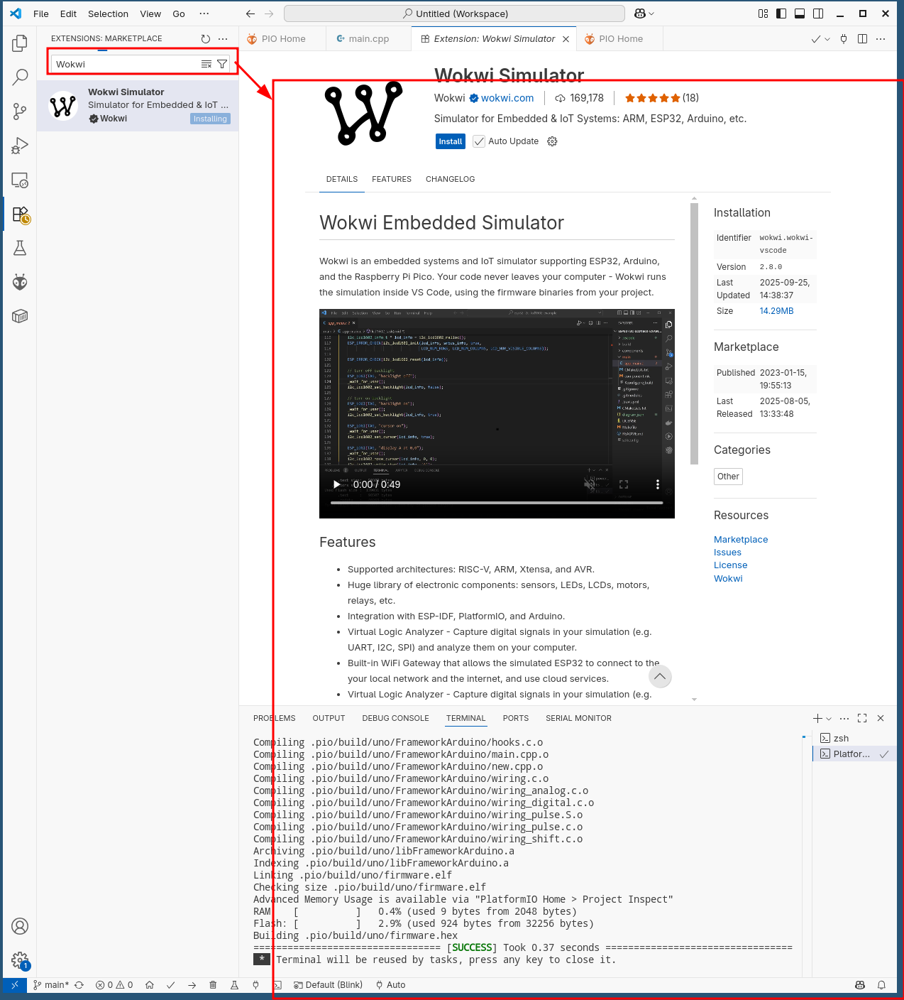
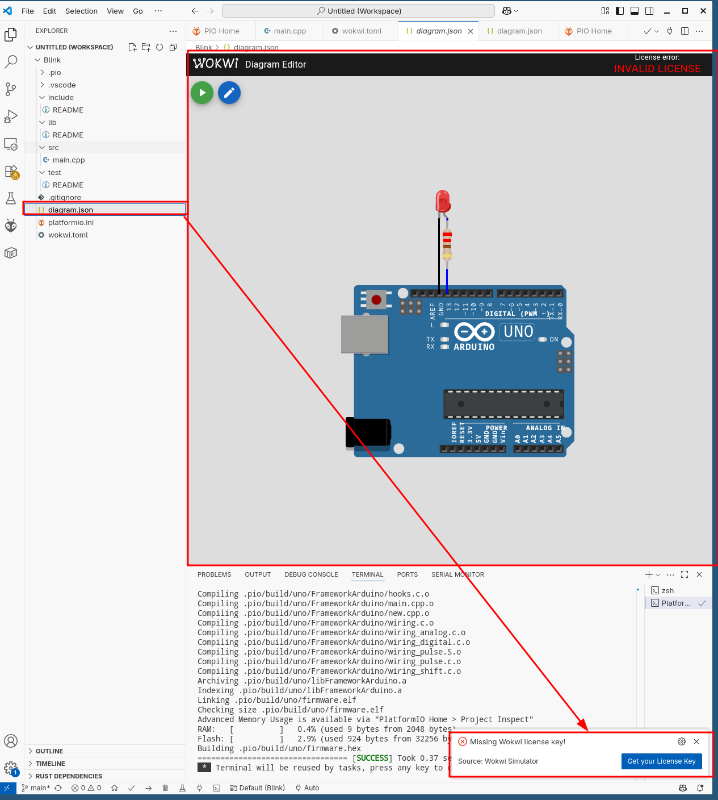

# Средства разработки
### Arduino IDE

Программа, написанная в среде Arduino, называется скетч. Скетч пишется в текстовом редакторе, имеющем инструменты вырезки/вставки, поиска/замены текста. Во время сохранения и экспорта проекта в области сообщений появляются пояснения, также могут отображаться возникшие ошибки. Окно вывода текста(консоль) показывает сообщения Arduino, включающие полные отчеты об ошибках и другую информацию. Кнопки панели инструментов позволяют проверить и записать программу, создать, открыть и сохранить скетч, открыть мониторинг последовательной шины:

#### Блокнот (Sketchbook)

Средой Arduino используется принцип блокнота: стандартное место для хранения программ (скетчей). Скетчи из блокнота открываются через меню File > Sketchbook или кнопкой Open на панели инструментов. При первом запуске программы Arduino автоматически создается директория для блокнота. Расположение блокнота меняется через диалоговое окно Preferences.

#### Закладки, Файлы и Компиляция

Позволяют работать с несколькими файлами скетчей (каждый открывается в отдельной закладке). Файлы кода могут быть стандартными Arduino (без расширения), файлами С (расширение *.с), файлами С++ (*.срр) или головными файлами (.h).

#### Загрузка скетча в Arduino

Перед загрузкой скетча требуется задать необходимые параметры в меню  **Tools > Board** и  **Tools > Serial Port**. Платформы описываются далее по тексту. В ОС Mac последовательный порт может обозначаться как dev/tty.usbserial-1B1 (для платы USB) или /dev/tty.USA19QW1b1P1.1 (для платы последовательной шины, подключенной через адаптер Keyspan USB-to-Serial). В ОС Windows порты могут обозначаться как COM1 или COM2 (для платы последовательной шины) или COM4, COM5, COM7 и выше (для платы USB). Определение порта USB производится в поле Последовательной шины USB Диспетчера устройств Windows. В ОС Linux порты могут обозначаться как /dev/ttyUSB0, /dev/ttyUSB1.

После выбора порта и платформы необходимо нажать кнопку загрузки на панели инструментов или выбрать пункт меню File > Upload to I/O Board. Современные платформы Arduino перезагружаются автоматически перед загрузкой. На старых платформах необходимо нажать кнопку перезагрузки. На большинстве плат во время процесса будут мигать светодиоды RX и TX. Среда разработки Arduino выведет сообщение об окончании загрузки или об ошибках.

При загрузке скетча используется Загрузчик (Bootloader) Arduino, небольшая программа, загружаемая в микроконтроллер на плате. Она позволяет загружать программный код без использования дополнительных аппаратных средств. Загрузчик (Bootloader) активен в течении нескольких секунд при перезагрузке платформы и при загрузке любого из скетчей в микроконтроллер. Работа Загрузчика (Bootloader) распознается по миганию светодиода (13 пин) (напр.: при перезагрузке платы).

#### Библиотеки

Библиотеки добавляют дополнительную функциональность скетчам, например, при работе с аппаратной частью или при обработке данных. Для использования библиотеки необходимо выбрать меню  **Sketch > Import Library**. Одна или несколько директив  **#include**  будут размещены в начале кода скетча с последующей компиляцией библиотек и вместе со скетчем. Загрузка библиотек требует дополнительного места в памяти Arduino. Неиспользуемые библиотеки можно удалить из скетча убрав директиву  **#include**.

На Arduino.cc имеется  [список библиотек](http://out.arduino.ru/?redirect=http%3A%2F%2Farduino.cc%2Fen%2FReference%2FLibraries&baseU=https%3A%2F%2Farduino.ru%2FArduino_environment "список библиотек для Ардуино"). Некоторые библиотеки включены в среду разработки Arduino. Другие могут быть загружены с различных ресурсов. Для установки скачанных библиотек необходимо создать директорию «libraries» в папке блокнота и затем распаковать архив. Например, для установки библиотеки DateTime ее файлы должны находится в подпапке  **/libraries/DateTime**  папки блокнота.

Смотрите  [данную инструкцию](http://out.arduino.ru/?redirect=http%3A%2F%2Farduino.cc%2Fen%2FHacking%2FLibraryTutorial&baseU=https%3A%2F%2Farduino.ru%2FArduino_environment "написание библиотек")  для написания собственной библиотеки.

#### Аппаратные средства других разработчиков

Поддерживаемые аппаратные средства других производителей добавляются в соответствующую подпапку папки блокнота. Устанавливаемые платформы могут включать собственные характеристики (в меню платформы), корневые библиотеки, загрузчик(Bootloader) и характеристики программатора. Для установки требуется распаковать архив в созданную папку. (Запрещено использовать наименование папки "arduino", т.к. могут быть перезаписаны встроенные данные платформы Arduino.) Для деинсталляции данных удаляется соответствующая директория.

Подробная информация по созданию сборок описаний аппаратных средств других производителей находится на  [страницах сайта Google Code](http://out.arduino.ru/?redirect=https%3A%2F%2Fcode.google.com%2Fp%2Farduino%2Fwiki%2FPlatforms&baseU=https%3A%2F%2Farduino.ru%2FArduino_environment "создание сборок аппартных средств").

#### Мониторинг последовательной шины (Serial Monitor)

Отображает данные посылаемые в платформу Arduino (плата USB или плата последовательной шины). Для отправки данных необходимо ввести текст и нажать кнопку Send или Enter. Затем выбирается скорость передачи из выпадающего списка, соответствующая значению  **Serial.begin**  в скетче. На ОС Mac или Linux платформа Arduino будет перезагружена (скетч начнется сначала) при подключении мониторинга последовательной шины.

Имеется возможность обмена информацией с платформой через программы Processing, Flash, MaxMSP и т.д. (см. подробности на странице описаний интерфейсов).

#### Настройки
Некоторые настройки изменяются в окне  **Preferences**  (меню Arduino в ОС Mac или File в ОС Windows и Linux). Остальные настройки находятся в файле, месторасположение которого указано в окне Preferences.

### ThinkerCAD
[ThinkerCAD](https://www.tinkercad.com/) – это онлайн-среда моделирования, позволяющая создавать и тестировать различные электрические схемы без необходимости использования физических компонентов. Это мощный инструмент, который дает возможность разработчикам и электронным инженерам собирать, тестировать и отлаживать схемы, используя виртуальные компоненты и программное обеспечение Arduino.

Один из наиболее популярных применений ThinkerCAD - моделирование работы Arduino. С его помощью можно создавать виртуальные прототипы устройств, создавать алгоритмы и проверять их работоспособность до начала физической реализации проекта. Это позволяет сэкономить время и ресурсы, а также производить быструю отладку и исправление ошибок.
С использованием ThinkerCAD вы можете создавать различные электрические схемы, начиная от базовых, таких как соединение резисторов и светодиодов, до более сложных, включающих микроконтроллеры, датчики и другие электронные компоненты. Программа предлагает широкий спектр оригинальных компонентов, которые можно просто перетащить и разместить на виртуальной плате для создания схемы. В основном окне можно производить сборку схемы из существующих в библиотеке компонентов.
ThinkerCAD также предоставляет возможность программировать микроконтроллеры, такие как Arduino, используя встроенный визуальный инструмент для кодирования. С помощью этого инструмента вы можете создавать скрипты и алгоритмы для контроля и взаимодействия с подключенными компонентами вашей схемы. Визуальное программирование гарантирует простоту использования и позволяет вам сразу же видеть результаты своей работы.


### Wokwi
[Wokwi](https://wokwi.com/) – это онлайн-симулятор для плат Arduino, Raspberry Pi Pico и ESP32 или даже вашей собственной платы микроконтроллера, предназначенный для изучения программирования без реального оборудования. Wokwi предлагает удобный и интуитивно понятный интерфейс, который позволяет быстро создавать и собирать схемы, а также программировать различные контроллеры, включая Arduino и другие популярные микроконтроллеры.
#### Возможности Wokwi

-   Над микроконтроллерными проектами можно работать прямо из браузера, аппаратные компоненты не нужны.
-   Wokwi имитирует основные платы для прототипирования: Arduino, ESP32 DevKit, Raspberry Pi Pico и другие.
-   Смоделированный проект можно подключить к интернету через MQTT, HTTP, NTP и другиепротоколы.
-   Через встроенный визуальный логический анализатор можно захватить цифровые сигналы в моделировании (например, UART, I2C, SPI) и проанализировать их на своём компьютере.
-   Для прошаренных пользователей есть функция расширенной отладки через GDB и возможность моделирования SD-карты. Код можно сразу запустить в исполнение или внести правки.
-   В сервисе есть огромная база готовых стартовых проектов, где можно посмотреть всё — вплоть до кода с комментариями и описаниями разработчиков.

[](https://blog.themarfa.name/content/images/2022/09/image-45.png)

Одной из главных особенностей Wokwi является возможность моделирования и программирования Arduino. С его помощью вы можете создавать виртуальные прототипы устройств, разрабатывать и отлаживать программы и алгоритмы, а также тестировать и проверять работоспособность проектов до их физической реализации. Это не только экономит время и ресурсы, но и позволяет быстро исправлять ошибки и оптимизировать свои проекты. Слева - текстовый редактор, где можно работать с файлами программы(и не только), а справа - непосредственно поле симулятора. Сейчас там только базовая плата. Для того что бы добавить какой-либо элемент необходимо нажать на кнопку "+" и откроется выпадающий список элементов. Wokwi предлагает широкий спектр компонентов, которые можно использовать для создания электронных схем. С его помощью вы можете соединять различные элементы, такие как резисторы, светодиоды, конденсаторы, микроконтроллеры и другие, для создания электрических цепей. Интерфейс Wokwi интуитивно понятен и позволяет легко перемещать и подключать компоненты, а также настраивать их свойства.
И действительно, нам прислали представленный ниже скриншот вместе с размытым видео, показывающим, как светодиодный дисплей обновляется по мере запуска программы в веб-браузере.


Учитывая низкую стоимость плат ESP32 и необходимость в использовании внешних модулей или макетных плат для создания проектов, эмуляторы для данного типа плат не являются необходимостью. 

Следовательно, это может объяснить популярность  [Wokwi](https://wokwi.com/), которая представляет собой отличную платформу для обучения, поддерживающую несколько плат Arduino (Uno, Mega, Nano), Raspberry Pi Pico и универсальную плату ESP32, программированные как на Arduino, так и на MicroPython.


Также возможно добавление  [пользовательских плат](https://github.com/wokwi/wokwi-boards), чтобы не ограничиваться официально поддерживаемыми платами. Пользователи могут начинать свои проекты с нуля, выбирая только плату, добавляя компоненты и создавая код самостоятельно, либо использовать существующие проекты, например, проект датчика температуры и влажности ESP32 + DHT22.


Доступно графическое представление Arduino, и для запуска моделирования необходимо нажать зеленую кнопку. Результаты температуры и влажности отображаются в виртуальной последовательной консоли.

Также можно добавлять дополнительные компоненты, такие как светодиоды, потенциометры, кнопки, датчики, VCC, GND и другие. Диаграмма также доступна в исходном коде в формате JSON.


Wokwi предоставляет бесплатные возможности использования, но также доступна  [платная программа Wokwi Club](https://docs.wokwi.com/getting-started/wokwi-club), предлагающая членам возможности, такие как добавление библиотек Arduino, загрузка пользовательских двоичных файлов, подключение к Wi-Fi ESP32 и сохранение проектов в приватном режиме. Участники также могут принимать участие в голосовании за новые функции Wokwi.


# VScode + PlatformIO + Wokwi = ❤️

Это руководство поможет вам быстро настроить мощную среду для программирования микроконтроллеров с возможностью симуляции схем.

#### Шаг 1: Установите редактор VScode
**Visual Studio Code (VScode)** — это бесплатный и очень популярный редактор кода с поддержкой тысяч плагинов.

1.  Скачайте установщик с [официального сайта](https://code.visualstudio.com/).
2.  Установите его, следуя инструкциям мастера установки.

#### Шаг 2: Установите плагин PlatformIO в VScode
**PlatformIO** — это расширение для VScode, которое превращает его в мощную среду для разработки под микроконтроллеры (Arduino, ESP32 и др.).

1.  Откройте VScode.
2.  Перейдите во вкладку расширений (Extentions, иконка с кубиками на боковой панели).
3.  В поиске введите `PlatformIO IDE`.
4.  Нажмите **Install** для установки.


> Установка может занять несколько минут, так как PlatformIO загружает необходимые инструменты.

#### Шаг 3: Установите плагин Wokwi для симуляции
**Wokwi** позволяет запускать и отлаживать ваши проекты Arduino в симуляторе прямо в VScode.

1.  Во вкладке расширений введите `Wokwi`.
2.  Найдите расширение **Wokwi Simulator for VS Code** и установите его.



#### Шаг 4: Создайте новый проект
После установки на боковой панели появится значок PlatformIO.

1.  Нажмите на значок **PlatformIO**.
2.  В открывшейся панели выберите **PIO Home** → **Open**.
3.  Нажмите кнопку **+ Create New Project**.


4.  Задайте имя вашему проекту.
5.  Выберите плату (Board), например, `Arduino Uno`.
6.  Выберите фреймворк `Arduino`.
7.  Нажмите **Finish**.


#### Шаг 5: Настройте симуляцию Wokwi

**A. Создайте файл `diagram.json`**
В корне проекта создайте файл `diagram.json` — в нём описывается схема для симуляции.

```json
{
  "version": 1,
  "author": "Your Name",
  "editor": "wokwi",
  "parts": [
    { "id": "uno", "type": "wokwi-arduino-uno", "top": 120, "left": 20 },
    { "id": "r1", "type": "wokwi-resistor", "top": 67, "left": 115, "rotate": 90, "attrs": {"value": "220"} },
    { "id": "led", "type": "wokwi-led", "left": 120, "top": 0, "attrs": { "color": "red" }}
  ],
  "connections": [
    ["uno:GND.1", "led:C", "black", []],
    ["r1:1", "led:A", "blue", []],
    ["uno:13", "r1:2", "blue", []]
  ]
}
```

**B. Создайте файл `wokwi.toml`**
В корне проекта создайте файл `wokwi.toml` — он указывает симулятору, где брать прошивку.

```toml
[wokwi]
version=1
firmware='.pio/build/uno/firmware.hex'
elf='.pio/build/uno/firmware.elf'
```

#### Шаг 6: Получите лицензию Wokwi

Для работы симулятора требуется аккаунт (компиляция происходит локально, а симуляция — онлайн).

1.  Перейдите на [сайт Wokwi](https://wokwi.com/).
2.  Зарегистрируйтесь (можно через GitHub, Google и др.).
3.  Новым пользователям доступен **бесплатный 30-дневный пробный период** премиум-функций, включая интеграцию с VScode.





#### Шаг 7: Структура проекта и начало работы
PlatformIO создаст папку проекта со следующей структурой:


Ваши основные файлы:
*   **`platformio.ini`** — главный конфигурационный файл проекта.
*   **`src/`** — папка для ваших исходных кодов.
*   **`diagram.json`** — схема для симуляции.
*   **`wokwi.toml`** — конфиг для симулятора.

Исходный код для мигания светодиодом уже будет ждать вас в `src/main.cpp`.

#### Как работать:
1.  **Скомпилируйте проект**: нажмите значок **✓** (Build) внизу экрана.
2.  **Запустите симуляцию**: нажмите **F1** и выберите `Wokwi: Start Simulator`.

Теперь вы можете работать и тестировать код прямо в симуляторе!
А то откуда брать прошивку для симулятора в файле `wokwi.toml`

```toml
[wokwi]
version=1
firmware='.pio/build/uno/firmware.hex'
elf='.pio/build/uno/firmware.elf'
```

И потом нам нужно получить лицензию для нашего симулятора, так как у нас все равно запуск симулятора будет проходить онлайн, но вся компиляция оффлайн. Нужно перейти по ссылке и зарегестрироваться на бесплатный период 30 дневый период.


---