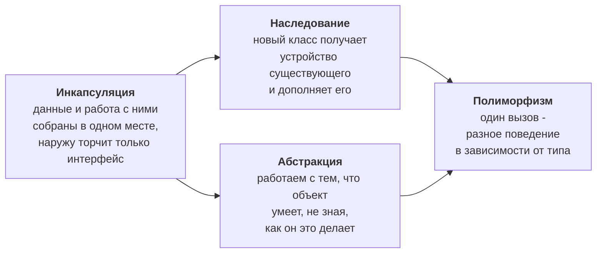

# Объектно-ориентированное программирование на C++

Справочник по ООП: от устройства класса до шаблонов и интерфейсов. Материал самостоятельный и не привязан к микроконтроллерам - им можно пользоваться и вне этого курса.

Основное применение в курсе - [занятие 11](../../Practice/11-cpp-oop/note.md), где разбирается оформление драйверов устройств классами и разработка собственной библиотеки. Прежде чем брать отсюда приём, сверьтесь с разделом ["Что применимо на Arduino UNO"](#что-применимо-на-arduino-uno) ниже: примеры написаны для настольного C++ и часть из них на плате с 2 КБ памяти неприменима.

---

## Содержание

| Раздел | О чём |
| --- | --- |
| [1. Классы и объекты](01-classes.md) | Класс как пользовательский тип, `public` / `protected` / `private`, конструкторы, деструкторы, жизненный цикл объекта |
| [2. Наследование и композиция](02-inheritance.md) | Наследование, расширение и изменение поведения, композиция как альтернатива наследованию |
| [3. Отношения между классами и полиморфизм](03-relations.md) | Глубокое и поверхностное копирование, композиция, агрегация, ассоциация, зависимость, полиморфизм |
| [4. Перегрузка функций и операторов](04-overloading.md) | Разрешение перегрузки, области видимости, классические реализации операторов присваивания, вывода, сравнения |
| [5. Шаблоны](05-templates.md) | Шаблонные функции, вывод параметров, перегрузка шаблонов, шаблонные структуры и классы |
| [6. Множественное наследование и абстракции](06-advanced-inheritance.md) | Типы наследования, проблема ромба, виртуальное наследование, абстрактные классы |
| [7. Интерфейсные классы](07-interfaces.md) | Интерфейсы, управление временем жизни объектов, семантика копирования |

В конце каждого раздела - упражнения.

---

## Четыре понятия, вокруг которых всё строится

Порядок разделов повторяет этот путь: сначала класс как способ собрать данные и код вместе, затем связи между классами, затем полиморфное поведение и, наконец, интерфейсы - абстракция в чистом виде.

---

## Что применимо на Arduino UNO

Примеры в справочнике написаны для настольного C++: они используют `std::cout`, `std::string` и динамическое выделение памяти. На ATmega328P с 2 КБ SRAM это либо не работает, либо приводит к отказам, которые невозможно воспроизвести. Ниже - разметка по применимости.

### Применимо без оговорок

| Возможность | Почему безопасно |
| --- | --- |
| Классы, `public` / `private` / `protected` | Обходятся бесплатно: это правила для компилятора, в машинном коде их нет |
| Конструкторы и деструкторы | Обычные функции; для глобальных объектов вызываются до `setup()` |
| Методы, `const`-методы | Стоят столько же, сколько обычные функции |
| Композиция и агрегация | Объект внутри объекта - просто размещение полей подряд |
| Перегрузка функций и операторов | Разрешается на этапе компиляции, во время работы ничего не стоит |
| Шаблоны | Тоже разрешаются при компиляции; см. оговорку про Flash ниже |
| Ссылки вместо указателей | Не требуют памяти сверх указателя, исключают проверку на `nullptr` |

### Применимо с оговоркой

| Возможность | Что нужно знать |
| --- | --- |
| Наследование | Одиночное - нормально. Множественное усложняет раскладку объекта и на восьмибитной плате почти никогда не оправдано |
| Виртуальные функции | Первый виртуальный метод добавляет к **каждому** объекту указатель на таблицу (2 байта) и таблицу во Flash. Оправданы, когда драйверов несколько и они действительно взаимозаменяемы |
| Абстрактные классы и интерфейсы | Работают, но это виртуальные функции со всеми их издержками. Часто дешевле шаблон |
| Шаблоны | Каждая инстанциация - отдельная копия кода во Flash. Шаблон, применённый к пяти типам, даёт пятикратный код |
| Оператор присваивания и конструктор копирования | Нужны, если класс владеет ресурсом. Чаще правильнее **запретить** копирование: `Driver(const Driver&) = delete;` |

### Не применяется в этом курсе

| Возможность | Причина |
| --- | --- |
| `new`, `delete`, `malloc` | Куча растёт навстречу стеку; при столкновении программа тихо портит данные без сообщения об ошибке - см. [занятие 17](../../Practice/17-memory/note.md) |
| `std::string` | Динамическая память плюс фрагментация кучи. Вместо неё - `char[]` фиксированного размера |
| `std::vector`, контейнеры STL | То же самое: динамическое выделение памяти |
| `std::cout`, `<iostream>` | Не существует на AVR; вывод идёт через `Serial` |
| Исключения (`try`, `throw`) | Отключены в avr-gcc: требуют раскрутки стека и заметного объёма Flash |
| RTTI (`dynamic_cast`, `typeid`) | Отключены по той же причине |
| Умные указатели | Опираются на динамическую память |

> **Как читать примеры.** Там, где в справочнике встречается `std::cout << x`, на Arduino пишут `Serial.print(x)`. Там, где `std::string name`, - `char name[16]`. Там, где `new Widget()`, - объект с временем жизни на весь запуск программы, объявленный статически. Смысл разбираемых конструкций от этого не меняется, меняются только средства.

---

## Что даёт ООП на микроконтроллере

Соблазн ответить "ничего, лишний расход памяти" - и для мигания светодиодом это верно. Смысл появляется, когда программа перестаёт помещаться в голову целиком.

| Задача | Процедурный подход | Объектный подход |
| --- | --- | --- |
| Два одинаковых датчика | Дублирование функций или массивы состояний с индексом | Два объекта одного класса |
| Замена дисплея 1602 на TFT | Правки по всей программе | Другой класс с тем же интерфейсом |
| Драйвер для чужого проекта | Файл с глобальными переменными, конфликтующими с чужими | Библиотека с явной точкой входа |
| Проверка модуля отдельно | Затруднена: состояние размазано | Объект создаётся, проверяется и уничтожается |

Разница видна на втором датчике. Модуль на статических переменных умеет обслуживать ровно один экземпляр; чтобы добавить второй, придётся переписать модуль. Класс решает это бесплатно - именно с этого начинается [занятие 11](../../Practice/11-cpp-oop/note.md).

---

## Куда смотреть дальше

- [Занятие 11: C++ и ООП в курсе](../../Practice/11-cpp-oop/note.md) - применение к драйверам устройств и разработка библиотеки
- [Приложение: C++ для микроконтроллеров](../cpp.md) - что из языка применимо на AVR и какой ценой
- [Приложение: язык C](../c.md) - базовый справочник
- [Занятие 17: память микроконтроллера](../../Practice/17-memory/note.md) - почему динамическое выделение памяти опасно
- [cppreference.com](https://en.cppreference.com/w/) - исчерпывающий справочник по языку
