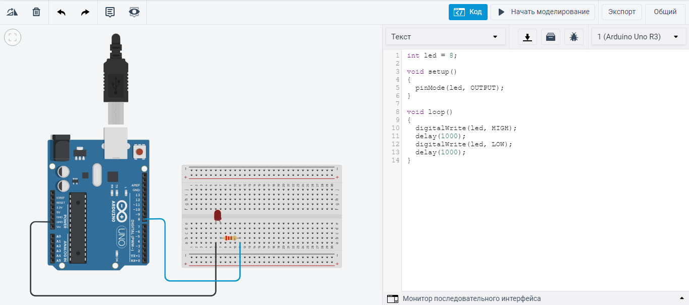
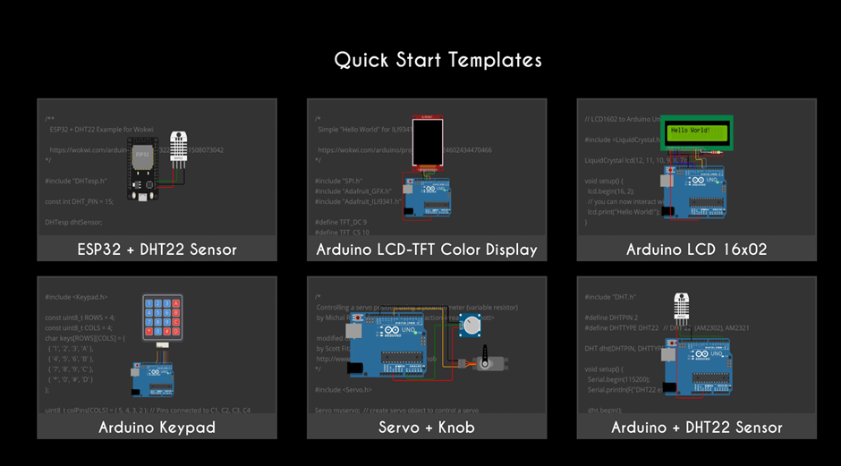

# Приложение. Среды разработки и симуляторы

Основная среда курса - Arduino IDE, её установка описана в [занятии 2](../Practice/02-tooling/note.md). Здесь собрано то, что выходит за рамки первого занятия: устройство Arduino IDE, онлайн-симуляторы и профессиональная связка VS Code + PlatformIO + Wokwi.

---

## 1. Arduino IDE подробнее

### Блокнот (Sketchbook)

Среда использует принцип блокнота: у скетчей есть стандартная папка хранения. Скетчи открываются через **File -> Sketchbook**. При первом запуске папка создаётся автоматически; её расположение меняется в **Preferences**.

Важное следствие: скетч должен лежать в папке, **имя которой совпадает с именем файла**. Если открыть `blink.ino` из произвольной папки, IDE предложит создать для него отдельную папку.

### Вкладки и файлы проекта

Проект может состоять из нескольких файлов, каждый открывается в своей вкладке:

- файлы без расширения или с расширением `.ino` - скетчи Arduino (склеиваются препроцессором в один файл в алфавитном порядке, первым идёт файл с именем папки);
- `.c`, `.cpp` - обычные исходники, компилируются отдельно;
- `.h` - заголовочные файлы.

Разделение крупной программы на модули (`display.h`/`display.cpp`, `sensors.h`/`sensors.cpp`) заметно упрощает работу над лабораторными.

### Библиотеки

Библиотеки добавляют поддержку устройств и протоколов. Установить их можно тремя способами:

1. **Менеджер библиотек** (`Tools -> Manage Libraries`) - основной путь.
2. **Из ZIP-архива** (`Sketch -> Include Library -> Add .ZIP Library`) - если библиотеки нет в реестре.
3. **Вручную** - распаковать в папку `libraries` внутри блокнота.

Неиспользуемые `#include` увеличивают время компиляции, но в итоговую прошивку не попадает код, который не вызывается: компоновщик отбрасывает неиспользуемые функции. А вот **глобальные объекты** библиотеки (например, `LiquidCrystal_I2C lcd(...)`) занимают SRAM всегда, даже если вы к ним не обращаетесь.

### Поддержка сторонних плат

Платы других производителей (ESP32, STM32, RP2040) добавляются через **Boards Manager** после указания URL в **Preferences -> Additional boards manager URLs**. В нашем курсе это не потребуется, но механизм полезно знать: именно так одна и та же среда работает с совершенно разными архитектурами.

### Монитор и плоттер последовательного порта

- **Serial Monitor** - текстовый обмен с платой. Скорость должна совпадать со значением в `Serial.begin()`.
- **Serial Plotter** - строит график по числам, которые плата присылает в порт. Несколько значений в одной строке, разделённых пробелом или запятой, дают несколько графиков. Это самый быстрый способ увидеть шум датчика и оценить работу фильтра:

```cpp
Serial.print(raw);
Serial.print(' ');
Serial.println(filtered);
```

> На macOS и Linux открытие монитора порта вызывает сброс платы - программа стартует заново. Это нормальное поведение, связанное с тем, как загрузчик использует линию DTR.

---

## 2. Онлайн-симуляторы

С этого семестра занятия проходят на реальном оборудовании, но симулятор остаётся **запасным путём**: если вы пропустили занятие, доделываете задачу дома или хотите проверить идею до сборки схемы.

### Tinkercad Circuits

[Tinkercad](https://www.tinkercad.com/) - онлайн-среда моделирования электрических схем с симуляцией Arduino. Библиотека компонентов ограничена, зато есть визуальный редактор кода (блоки) и, что важнее, **виртуальные мультиметр и осциллограф** - с их помощью удобно показывать, что такое ШИМ или делитель напряжения.



### Wokwi

[Wokwi](https://wokwi.com/) - симулятор Arduino, ESP32, Raspberry Pi Pico и других платформ. По сравнению с Tinkercad:

- гораздо больше компонентов ([полный список](https://docs.wokwi.com/getting-started/supported-hardware)) - дисплеи, датчики, матрицы, драйверы;
- есть **логический анализатор**, позволяющий увидеть реальные посылки UART, I2C и SPI;
- схема хранится в текстовом файле `diagram.json`, который можно править руками и класть в репозиторий;
- проект открывается по ссылке - удобно для сдачи работ и для разбора чужих ошибок.



Бесплатной версии достаточно для всех задач курса. Платная подписка Wokwi Club нужна для приватных проектов, произвольных библиотек и интеграции с VS Code.

---

## 3. VS Code + PlatformIO

Основной инструмент курса начиная с занятия 6. Установка, структура проекта, файл `platformio.ini`,
управление зависимостями, разделение программы на модули и настройка симуляции Wokwi подробно
разобраны в [занятии 6](../Practice/06-platformio/note.md) - здесь эта информация не дублируется.

Кратко, зачем он нужен:

- раздельная компиляция и нормальные заголовочные файлы вместо склеиваемых вкладок;
- версии библиотек фиксируются в файле проекта, а не в системе;
- предупреждения компилятора (`-Wall -Wextra`), которые Arduino IDE скрывает;
- несколько окружений сборки в одном проекте (например, отладочное и рабочее);
- проект переносится через git и собирается одной командой;
- встроенный механизм модульных тестов.

> Заготовка проекта с настроенной симуляцией: [github.com/savaleriy/arduino-wokwi-vscode](https://github.com/savaleriy/arduino-wokwi-vscode)

## 4. Что выбрать

| Задача | Инструмент |
| --- | --- |
| Занятие в аудитории, реальная схема | Arduino IDE |
| Быстро проверить идею без железа | Wokwi в браузере |
| Показать форму сигнала, измерить напряжение | Tinkercad |
| Посмотреть реальные посылки I2C, SPI, UART | Логический анализатор Wokwi |
| Лабораторная работа на несколько файлов | VS Code + PlatformIO |
| Сборка без Arduino-фреймворка | avr-gcc + make, см. [занятие 18](../Practice/18-low-level/note.md) |

---

## 5. Дополнительные источники

- [Справочник языка Arduino](https://docs.arduino.cc/language-reference/)
- [Русскоязычный справочник arduino.ru](http://arduino.ru/)
- [Документация PlatformIO](https://docs.platformio.org/)
- [Документация Wokwi](https://docs.wokwi.com/)
- [Флаги сборки PlatformIO](https://github.com/platformio/platformio-docs/blob/develop/projectconf/sections/env/options/build/build_flags.rst)
- [Исходный код ядра ArduinoCore-avr](https://github.com/arduino/ArduinoCore-avr)
