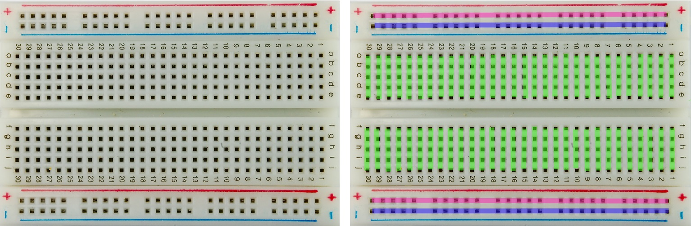
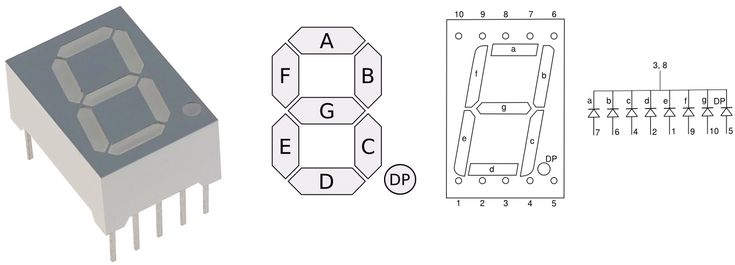

# Аппаратное обеспечение курса

Весь курс построен вокруг платы **Arduino UNO R3** (микроконтроллер ATmega328P) и учебного набора компонентов, который выдаётся на занятиях. Эта заметка - справочник: что есть в наборе, как оно устроено, куда подключается и на что обратить внимание.

> Занятие, на котором компонент разбирается впервые, указано в колонке "Занятие". Полный список занятий - в [корневом README](../README.md).

---

## 1. Плата Arduino UNO R3



Основная плата курса. В наборе одна плата на студента, но на кафедре есть **несколько дополнительных плат UNO R3** - они нужны для занятия 16 (обмен данными между двумя микроконтроллерами) и для лабораторной работы N4.

### Характеристики

| Параметр | Значение |
| --- | --- |
| Микроконтроллер | ATmega328P (AVR, 8 бит, гарвардская архитектура) |
| Тактовая частота | 16 МГц (внешний кварцевый резонатор) |
| Рабочее напряжение логики | 5 В |
| Входное напряжение (рекомендуемое) | 7-12 В |
| Входное напряжение (предельное) | 6-20 В |
| Flash | 32 КБ, из них 0,5 КБ занимает загрузчик |
| SRAM | 2 КБ |
| EEPROM | 1 КБ |
| Цифровые входы/выходы | 14 (D0-D13) |
| Из них с аппаратным ШИМ | 6 - D3, D5, D6, D9, D10, D11 (помечены `~`) |
| Аналоговые входы | 6 (A0-A5), АЦП 10 бит |
| Ток через один вывод | до 40 мА (абсолютный максимум), рабочее значение - **не более 20 мА** |
| Суммарный ток по всем выводам | не более 200 мА |
| Ток вывода 3.3 В | до 50 мА |

### Специальные функции выводов

| Вывод(ы) | Назначение |
| --- | --- |
| D0 (RX), D1 (TX) | Аппаратный UART. **Заняты при работе с Serial Monitor и при прошивке** - не используйте их для своих устройств |
| D2, D3 | Внешние прерывания INT0 и INT1 |
| D3, D5, D6, D9, D10, D11 | Выходы ШИМ (`analogWrite`) |
| D10 (SS), D11 (MOSI), D12 (MISO), D13 (SCK) | Аппаратный SPI |
| D13 | Встроенный светодиод `LED_BUILTIN` |
| A4 (SDA), A5 (SCL) | Аппаратный I2C (TWI) |
| AREF | Опорное напряжение АЦП (`analogReference`) |
| RESET | Сброс микроконтроллера низким уровнем |

Любой из выводов A0-A5 можно использовать как обычный цифровой (номера 14-19).

### Микросхема USB-UART

Оригинальные платы UNO используют ATmega16U2. **Платы из нашего набора используют CH340** - для них нужен отдельный драйвер, см. [занятие 2](../Practice/02-tooling/note.md).

### Питание

- **USB** - 5 В, до 500 мА. Достаточно для платы и небольшого количества светодиодов и датчиков.
- **Разъём питания 2,1 мм** (центральный контакт - плюс) через встроенный стабилизатор. В набор входит **кабель питания от "кроны" 9 В** с таким разъёмом.
- **VIN** - вход внешнего питания в обход разъёма.

> **Важно.** Стабилизатор на плате линейный: при 12 В на входе он рассеивает разницу в тепло и заметно греется. Сервопривод, шаговый двигатель и подсветка дисплея питаются от **отдельного источника 5 В**, а не от платы; общий GND при этом обязателен.

### Ссылки

- [Даташит ATmega328P](https://docs.arduino.cc/resources/datasheets/ATmega328P-datasheet.pdf) - главный документ курса
- [Официальная страница Arduino UNO R3](https://docs.arduino.cc/hardware/uno-rev3)
- [Справочник языка Arduino](https://docs.arduino.cc/language-reference/)
- [Исходный код ядра ArduinoCore-avr](https://github.com/arduino/ArduinoCore-avr)
- [Драйвер CH340 (WCH)](https://www.wch-ic.com/downloads/CH341SER_EXE.html)

---

## 2. Состав наборов

Оборудование курса состоит из двух частей: **базового набора** (плата, макетка, дискретные компоненты, дисплеи, приводы) и **набора модулей KY** - готовых плат с датчиками, у которых уже распаяны обвязка и разъёмы.

### 2.1. Базовый набор

| Компонент | Кол-во | Интерфейс / подключение | Занятие |
| --- | --- | --- | --- |
| Плата Arduino UNO R3 | 1 | USB | 1 |
| Макетная плата 830 точек | 1 | - | 1 |
| Перемычки "папа-папа" | 16 | - | 1 |
| Перемычки "папа-мама" | 10 | - | 1 |
| USB-кабель | 1 | - | 1 |
| Кабель питания от "кроны" 9 В | 1 | разъём 2,1 мм | 1 |
| Светодиод 5 мм красный | 5 | цифровой выход + резистор 220 Ом | 3 |
| Светодиод 5 мм зелёный | 5 | цифровой выход + резистор 220 Ом | 3 |
| Светодиод 5 мм жёлтый | 5 | цифровой выход + резистор 220 Ом | 3 |
| Кнопка тактовая | 4 | цифровой вход | 3 |
| Кнопочная матрица 4x4 | 1 | 8 цифровых выводов | 3 |
| Потенциометр 10 кОм | 1 | аналоговый вход | 5 |
| Фоторезистор GL5516 | 3 | делитель напряжения -> аналоговый вход | 5 |
| Датчик температуры LM35 | 1 | аналоговый вход | 5 |
| Датчик температуры и влажности DHT-11 | 1 | однопроводный протокол, цифровой вывод | 5 |
| Датчик уровня воды | 1 | аналоговый вход | 5 |
| Джойстик двухосевой KY-023 | 1 | 2 аналоговых входа + 1 цифровой | 5 |
| Датчик наклона и вибрации SW-520D | 1 | цифровой вход | 8 |
| Одноразрядный семисегментный индикатор | 1 | 7-8 цифровых выводов | 10 |
| Четырёхразрядный семисегментный индикатор | 1 | 12 выводов, динамическая индикация | 10 |
| Светодиодная матрица 8x8 (1088BS) | 1 | 16 выводов, динамическая индикация | 10 |
| Сдвиговый регистр SN74HC595N | 1 | 3 цифровых вывода | 10 |
| LCD-дисплей 1602A | 1 | параллельный HD44780 или I2C-адаптер | 12 |
| Модуль часов реального времени DS1302 | 1 | 3-проводный (RST, CLK, DAT) | 12 |
| TFT-дисплей ILI9341 | 1 | SPI, логика **3,3 В** | 13 |
| Модуль RFID RC522 + карта + брелок | 1 | SPI, питание **3,3 В** | 13 |
| Зуммер | 2 | цифровой выход / ШИМ | 14 |
| ИК-приёмник (VS1838B / CHQ1838) | 1 | цифровой вход | 14 |
| ИК-пульт | 1 | - | 14 |
| Микрофонный модуль | 1 | аналоговый + цифровой выход | 14 |
| Сервопривод SG90 | 1 | ШИМ | 15 |
| Шаговый двигатель | 1 | 4 цифровых вывода через драйвер | 15 |
| Одноканальный релейный модуль 5 В | 1 | цифровой выход | 15 |
| Резистор 220 Ом | 10 | - | 3 |
| Резистор 1 кОм | 10 | - | 10 |
| Резистор 10 кОм | 10 | - | 3, 5 |

### 2.2. Набор модулей KY

Модули этой серии выполнены по единому принципу: датчик или излучатель, необходимая обвязка (резисторы, компаратор LM393, подстроечник порога) и штыревой разъём на 3 или 4 контакта. Это снимает вопрос "как подключить" и позволяет сосредоточиться на обработке сигнала.

**Общая цоколёвка.** Обозначения на модулях серии KY не унифицированы, поэтому **перед подключением всегда смотрите на маркировку конкретной платы**:

| Обозначение | Что это |
| --- | --- |
| `+`, `VCC`, `V` | Питание (обычно 5 В) |
| `-`, `GND`, `G` | Земля |
| `S`, `SIG` | Сигнальный вывод: аналоговый или цифровой - зависит от модуля |
| `A0`, `AO` | Аналоговый выход - непрерывное значение |
| `D0`, `DO` | Цифровой выход компаратора: порог задаётся подстроечным резистором на плате |

> **Осторожно.** У части трёхвыводных модулей KY средний вывод - это **питание**, а не сигнал; у другой части наоборот. Перепутанное питание выводит модуль из строя. Сверяйтесь с надписями на плате.

#### Датчики: аналоговые и пороговые

| Модуль | Что измеряет | Выходы | Занятие |
| --- | --- | --- | --- |
| **FC-28** почвенный гигрометр | Влажность почвы (проводимость грунта) | A0 + D0 | 5 |
| **KY-018** фоторезистор | Освещённость | аналоговый | 5 |
| **KY-013** датчик температуры | Температура, NTC-термистор без обвязки | аналоговый | 5 |
| **KY-028** датчик температуры | Температура, термистор с компаратором | A0 + D0 | 5 |
| **KY-001** датчик температуры (DS18B20) | Температура, цифровой 1-Wire | цифровой | 5 |
| **KY-015** температура и влажность | DHT-11 на плате с подтяжкой | цифровой | 5 |
| **KY-026** датчик пламени | ИК-излучение в диапазоне 760-1100 нм | A0 + D0 | 5 |
| **KY-037**, **KY-038** датчики звука | Уровень звука (электретный микрофон + LM393) | A0 + D0 | 14 |
| **KY-039** датчик пульса | Просвечивание пальца ИК-светодиодом | аналоговый | 5 |
| **KY-024**, **KY-035** датчики Холла (линейные) | Величина и полярность магнитного поля | A0 + D0 | 5 |

#### Датчики: дискретные события

| Модуль | Событие | Выход | Занятие |
| --- | --- | --- | --- |
| **KY-004** тактовая кнопка | Нажатие | цифровой | 3 |
| **KY-036** датчик касания | Касание металлической площадки | A0 + D0 | 3 |
| **KY-020** датчик наклона | Изменение положения (шариковый) | цифровой | 8 |
| **KY-002** датчик вибрации | Удар, вибрация (пружинный) | цифровой | 8 |
| **KY-031** датчик удара | Резкий удар по корпусу | цифровой | 8 |
| **KY-021**, **KY-025** герконовые датчики | Приближение магнита | цифровой | 8 |
| **KY-033** ИК-датчик линии | Светлая или тёмная поверхность под датчиком | цифровой | 8 |
| **KY-032** ИК-дальномер препятствия | Наличие препятствия в пределах 2-40 см | цифровой | 8 |
| **SR-393** датчик скорости вращения | Прерывание оптического луча (щелевой) | цифровой | 9 |

#### Датчики: измерительные модули с протоколом

| Модуль | Что даёт | Интерфейс | Занятие |
| --- | --- | --- | --- |
| **HC-SR04** ультразвуковой дальномер | Расстояние 2-400 см | 2 вывода: TRIG, ECHO | 9 |
| **GY-521 (MPU-6050)** | 3 оси ускорения, 3 оси угловой скорости, температура | I2C | 12 |
| **KY-022** ИК-приёмник | Демодулированный код пульта | цифровой | 14 |

#### Излучатели и индикация

| Модуль | Назначение | Подключение | Занятие |
| --- | --- | --- | --- |
| **KY-009** RGB-светодиод (SMD) | Три цвета в одном корпусе, **без резисторов на плате** | 3 выхода ШИМ + резисторы | 4 |
| **KY-016** RGB-светодиод (5 мм) | То же, с резисторами на плате | 3 выхода ШИМ | 4 |
| **KY-011** двухцветный светодиод 5 мм | Красный и зелёный, общий катод | 2 выхода | 3 |
| **KY-029** двухцветный светодиод 3 мм | То же, меньший корпус | 2 выхода | 3 |
| **KY-034** семицветный светодиод | Автоматически меняет цвет, программно управляется только включением | 1 выход | 3 |
| **KY-008** лазерный модуль | Красный лазер 650 нм, 5 мВт | 1 выход | 8 |
| **KY-005** ИК-светодиод | Передатчик ИК-команд | 1 выход (ШИМ 38 кГц) | 14 |
| **KY-012** активный зуммер | Один фиксированный тон | 1 выход | 14 |
| **KY-006** пассивный зуммер | Произвольная частота, `tone()` | 1 выход | 14 |

#### Модули с интерфейсами и питанием

| Модуль | Назначение | Интерфейс | Занятие |
| --- | --- | --- | --- |
| **Модуль чтения SD-карт** | Журналирование данных на карту памяти | SPI, логика **3,3 В** | 13 |
| **DS1302 с батареей** | Часы реального времени | 3-проводный | 12 |
| **Релейный модуль 5 В** | Коммутация низковольтной нагрузки | цифровой выход | 15 |
| **Игровой контроллер PS2** | Два аналоговых стика и кнопки | 2 аналоговых + цифровые | 5 |
| **KY-040** энкодер | Инкрементальный датчик угла поворота с кнопкой | 2 цифровых (прерывания) + кнопка | 8 |
| **Модуль питания макетной платы** | Питание шин макетки 5 В / 3,3 В от внешнего источника | - | 1 |
| **MP1584EN** понижающий преобразователь | Импульсный DC-DC, регулируемое выходное напряжение | - | 17 |

> **Дубликаты.** В наборах встречаются модули-близнецы: два датчика звука (KY-037 и KY-038), два датчика Холла, два герконовых, три температурных. Это не ошибка комплектации - разница в чувствительности и наличии компаратора. Сравнение таких пар вынесено в задачи занятия 5.

---

## 3. Пассивные компоненты и макетная плата

### Макетная плата (breadboard)


Плата на 830 точек с шагом отверстий **2,54 мм** - тем же, что у выводных микросхем и штыревых разъёмов.

- **Центральная область**: отверстия соединены **рядами по 5 штук поперёк** платы; посередине проходит канавка, разделяющая левую и правую половины (в неё вставляются DIP-микросхемы, например 74HC595).
- **Шины питания по краям** (обычно две пары, помечены `+` и `-`): соединены **вдоль** платы. Две пары позволяют развести на плате два напряжения, например 5 В и 3,3 В.

Типичные ошибки: элемент вставлен "вдоль" ряда (оба вывода в одну и ту же пятёрку - короткое замыкание), микросхема установлена не поперёк канавки, шины питания левой и правой половин не соединены между собой перемычкой.

### Резисторы

| Номинал | Маркировка (4 полосы) | Где применяется |
| --- | --- | --- |
| 220 Ом | красный-красный-коричневый-золотой | Токоограничивающий резистор светодиода |
| 1 кОм | коричневый-чёрный-красный-золотой | Сегменты семисегментного индикатора |
| 10 кОм | коричневый-чёрный-оранжевый-золотой | Подтяжка кнопок, второе плечо делителя фоторезистора |

**Расчёт резистора для светодиода.** Красный светодиод имеет прямое падение около 2 В, зелёный и жёлтый - около 2,1 В. При питании 5 В и желаемом токе 10 мА:

$$R = \frac{U_{\text{пит}} - U_{\text{св}}}{I} = \frac{5 - 2}{0{,}01} = 300 \text{ Ом}$$

Берём ближайший номинал из набора - 220 Ом, ток при этом составит около 13,6 мА.

Резистор на 220 Ом безопасен для всех светодиодов набора и для выводов ATmega328P.

---

## 4. Средства индикации

### Светодиоды и RGB-модуль

Обычный светодиод: **длинная ножка - анод (+)**, короткая - катод (-); со стороны катода корпус срезан площадкой.

Модуль RGB-светодиода из набора (KY-016) содержит три кристалла в одном корпусе с **общим катодом** и встроенными резисторами; выводы R, G, B подключаются к трём ШИМ-выходам, `-` - к GND. Встречаются и модули с общим анодом - тогда логика инвертируется (0 = максимальная яркость). Определить тип можно, подав напряжение через резистор на один из цветных выводов.

### Семисегментные индикаторы



Сегменты обозначаются буквами A-G, точка - DP.

- **Одноразрядный** индикатор - 8 светодиодов с общим катодом или общим анодом. При включении всех сегментов ток достигает 7 x 20 мА ~ 140 мА, поэтому **резистор ставится на каждый сегмент**, а не на общий вывод.
- **Четырёхразрядный** индикатор - 12 выводов: 8 сегментных (общие для всех разрядов) и 4 разрядных. Одновременно светится только один разряд; иллюзия цельного числа создаётся **динамической индикацией** - быстрым перебором разрядов с частотой выше 50 Гц.

Определить тип (общий катод / общий анод) можно мультиметром в режиме прозвонки диодов.

### Светодиодная матрица 8x8 (1088BS)

64 светодиода, 16 выводов: 8 строк и 8 столбцов. Отдельный светодиод зажигается подачей активного уровня на его строку и "земли" на его столбец. Изображение выводится построчно методом динамической индикации.

Так как свободных выводов на UNO не хватает, в курсе матрица подключается через **сдвиговый регистр 74HC595** (столбцы) и восемь цифровых выводов (строки). Токоограничивающие резисторы ставятся со стороны столбцов - тогда каждый резистор в любой момент времени задаёт ток ровно одного светодиода.

### Сдвиговый регистр SN74HC595N

Последовательно-параллельный регистр: принимает данные по одному проводу и выставляет их на 8 параллельных выходов, освобождая выводы микроконтроллера.

| Вывод | Название | Назначение |
| --- | --- | --- |
| 14 | SER (DATA) | Последовательный вход данных |
| 11 | SRCLK (CLOCK) | Тактовый вход: по фронту содержимое регистра сдвигается на бит |
| 12 | RCLK (LATCH) | "Защёлка": переносит содержимое регистра на выходы |
| 13 | OE (инверсный) | Разрешение выходов, активный уровень - низкий. Обычно к GND |
| 10 | SRCLR (инверсный) | Сброс регистра, активный уровень - низкий. Обычно к 5 В |
| 9 | QH' | Выход для каскадирования следующего регистра |
| 15, 1-7 | QA-QH | Восемь параллельных выходов |

- [Даташит SN74HC595](https://www.ti.com/lit/ds/symlink/sn74hc595.pdf)

### LCD-дисплей 1602A

Символьный дисплей 16 столбцов x 2 строки на контроллере **HD44780**.

**Параллельное подключение** (библиотека `LiquidCrystal`) занимает 6 выводов в 4-битном режиме: RS, E, DB4-DB7. Плюс потенциометр на вывод VO для регулировки контрастности и резистор 220 Ом в цепи подсветки.

**Подключение по I2C** через адаптер на PCF8574 занимает всего два вывода - A4 (SDA) и A5 (SCL). Типичный адрес - `0x27`, реже `0x3F`; определяется сканером шины (см. занятие 10).

- [Даташит HD44780](https://www.sparkfun.com/datasheets/LCD/HD44780.pdf)

### TFT-дисплей ILI9341

Цветной графический дисплей 240x320 точек, 65 536 цветов, интерфейс **SPI**. На модулях часто дополнительно установлены резистивный тачскрин (XPT2046) и слот microSD - оба висят на той же шине SPI со своими линиями выбора.

| Вывод модуля | Куда подключать на UNO |
| --- | --- |
| VCC | 5 В (если на модуле есть стабилизатор) или 3,3 В |
| GND | GND |
| CS | D10 |
| RESET | D8 |
| DC / RS | D9 |
| MOSI / SDI | D11 |
| SCK | D13 |
| LED | 3,3 В (через резистор, если не указано иное) |
| MISO / SDO | D12 (нужен только для чтения из дисплея) |

> **Логические уровни.** Контроллер ILI9341 питается от 3,3 В и **не толерантен к 5 В**. Если на модуле нет преобразователя уровней (микросхемы вроде 74HC4050 рядом с разъёмом), включайте в разрыв каждой линии от Arduino к дисплею делитель: 2,2 кОм последовательно и 3,3 кОм на землю. Из набора для этого подойдут пары резисторов 1 кОм / 2 кОм (два по 1 кОм последовательно).

> **Память.** Полноэкранный буфер кадра занял бы 240 x 320 x 2 = 153 600 байт - в 75 раз больше всей SRAM платы. Поэтому на UNO рисуют **прямо в дисплей**, без буфера, а перерисовывают только изменившиеся области.

Библиотеки: `Adafruit_GFX` + `Adafruit_ILI9341`, либо более быстрая `TFT_eSPI`.

- [Даташит ILI9341](https://cdn-shop.adafruit.com/datasheets/ILI9341.pdf)
- [Adafruit ILI9341 library](https://github.com/adafruit/Adafruit_ILI9341)
- [Adafruit GFX library](https://github.com/adafruit/Adafruit-GFX-Library)

---

## 5. Устройства ввода

### Тактовая кнопка

Кнопка имеет **четыре вывода**: пара с одной стороны корпуса замкнута между собой постоянно, пара с другой стороны - тоже. Нажатие соединяет обе пары. Для подключения берут **два вывода по диагонали**.

Кнопка не даёт определённого уровня сама по себе: без подтягивающего или стягивающего резистора вход "висит в воздухе" и читается случайным образом. Варианты:

- внешний резистор 10 кОм на GND (стягивающий) - кнопка замыкает вход на 5 В, нажатие даёт `HIGH`;
- внешний резистор 10 кОм на 5 В (подтягивающий) - кнопка замыкает вход на GND, нажатие даёт `LOW`;
- **внутренняя подтяжка** микроконтроллера: `pinMode(pin, INPUT_PULLUP)` - резистор 20-50 кОм внутри ATmega328P, нажатие даёт `LOW`. Экономит детали, применяется в большинстве примеров курса.

Отдельная проблема - **дребезг контактов**: при замыкании механические контакты несколько миллисекунд "звенят", и микроконтроллер видит серию нажатий вместо одного. Методы подавления разбираются на занятии 3.

### Кнопочная матрица 4x4

16 кнопок, организованных в 4 строки и 4 столбца, - 8 выводов вместо 16. Опрос: на строки по очереди подаётся активный уровень, столбцы читаются как входы с подтяжкой. Библиотека `Keypad` делает это автоматически.

### Джойстик KY-023

Два потенциометра (оси X и Y) и тактовая кнопка под ручкой.

| Вывод | Подключение |
| --- | --- |
| GND | GND |
| +5V | 5 В |
| VRx | аналоговый вход (например, A1) |
| VRy | аналоговый вход (например, A0) |
| SW | цифровой вход с `INPUT_PULLUP` (нажатие -> `LOW`) |

В покое оси дают примерно середину диапазона (около 512), но точное значение у каждого экземпляра своё - его нужно измерять при калибровке и вводить "мёртвую зону" вокруг центра.

### Потенциометр 10 кОм

Переменный резистор, включённый делителем: крайние выводы на 5 В и GND, средний - на аналоговый вход. Даёт напряжение 0-5 В, то есть отсчёты АЦП 0-1023.

---

### Энкодер KY-040

Инкрементальный датчик угла: при вращении вала два выхода (CLK и DT) выдают импульсы, **сдвинутые по фазе на четверть периода**. Направление определяется тем, какой из сигналов изменился первым.

| Вывод | Назначение |
| --- | --- |
| GND | GND |
| + | 5 В |
| SW | кнопка под валом, `INPUT_PULLUP`, нажатие -> `LOW` |
| DT | выход B |
| CLK | выход A |

Последовательность состояний пары (CLK, DT) при вращении по часовой стрелке: `00 -> 01 -> 11 -> 10`, против часовой - в обратном порядке.

```tikz Фазовый сдвиг сигналов энкодера задаёт направление вращения
\begin{tikzpicture}[x=1cm,y=1cm]
  \node[stagelab, anchor=west] at (0,1.75) {вращение вперёд};
  \node[note, anchor=east] at (-0.15,0.45) {CLK};
  \wave[draw=sig]{0}{0}{0.5}{0.9}{0,0,1,1,0,0,1,1,0,0,1,1,0}
  \node[note, anchor=east] at (-0.15,-1.05) {DT};
  \wave[draw=clk]{0}{-1.5}{0.5}{0.9}{0,1,1,0,0,1,1,0,0,1,1,0,0}
  \draw[warn, semithick, densely dashed] (1,-1.7) -- (1,1.2);
  \node[note, text=warn, anchor=south west] at (1.05,1.15) {CLK изменился первым};

  \begin{scope}[xshift=8.4cm]
    \node[stagelab, anchor=west] at (0,1.75) {вращение назад};
    \node[note, anchor=east] at (-0.15,0.45) {CLK};
    \wave[draw=sig]{0}{0}{0.5}{0.9}{0,1,1,0,0,1,1,0,0,1,1,0,0}
    \node[note, anchor=east] at (-0.15,-1.05) {DT};
    \wave[draw=clk]{0}{-1.5}{0.5}{0.9}{0,0,1,1,0,0,1,1,0,0,1,1,0}
    \draw[warn, semithick, densely dashed] (0.5,-1.7) -- (0.5,1.2);
    \node[note, text=warn, anchor=south west] at (0.55,1.15) {DT изменился первым};
  \end{scope}
\end{tikzpicture}
```

Энкодер **сильно дребезжит**: механические контакты дают ложные переходы, из-за которых счётчик "прыгает". Способы борьбы:

1. Конденсаторы 100 нФ от CLK и DT на землю (аппаратный фильтр) - самый надёжный вариант.
2. Обработка по таблице переходов: недопустимые переходы игнорируются.
3. Учёт только полных четвертей периода, а не каждого фронта.

Оба выхода стоит завести на выводы прерываний D2 и D3 - тогда ни один щелчок не теряется даже при быстром вращении (занятие 8).

### Игровой контроллер PS2

Модуль в форме джойстика от игровой приставки: два аналоговых стика (по два потенциометра) и кнопки. Подключается так же, как KY-023: оси - на аналоговые входы, кнопки - на цифровые с подтяжкой. Требует больше выводов, поэтому применяется, когда нужны две оси управления одновременно.
## 6. Датчики

### Фоторезистор GL5516

Сопротивление падает при увеличении освещённости (от сотен кОм в темноте до единиц кОм на свету). Сам по себе фоторезистор ничего не измеряет - он включается **делителем напряжения** последовательно с резистором 10 кОм; средняя точка идёт на аналоговый вход.

Абсолютных единиц освещённости фоторезистор не даёт: показания зависят от экземпляра, напряжения питания и второго резистора. Поэтому в задачах его **калибруют** - запоминают минимум и максимум для конкретных условий.

### Датчик температуры LM35

Аналоговый датчик, выдающий напряжение, линейно зависящее от температуры: **10 мВ на 1 degC**, 0 В при 0 degC. Три вывода: Vs (5 В), Vout (аналоговый вход), GND.

При опорном напряжении 5 В и 10-битном АЦП один отсчёт = 5/1024 ~ 4,88 мВ ~ 0,49 degC - разрешение довольно грубое. Улучшить его можно, переключив опорное напряжение АЦП на внутренние 1,1 В (`analogReference(INTERNAL)`): тогда один отсчёт ~ 1,07 мВ ~ 0,1 degC, а диапазон измерения ограничится 110 degC.

- [Даташит LM35](https://www.ti.com/lit/ds/symlink/lm35.pdf)

### Датчик температуры и влажности DHT-11

Цифровой датчик с собственным однопроводным протоколом (это **не** 1-Wire от Dallas). Один вывод данных, питание 5 В.

| Параметр | Значение |
| --- | --- |
| Диапазон температуры | 0...50 degC, точность +/-2 degC |
| Диапазон влажности | 20...90 %, точность +/-5 % |
| Разрешение | 1 degC / 1 % |
| Минимальный период опроса | **1 секунда** (на практике опрашивают раз в 2 с) |

Библиотека: `DHT sensor library` от Adafruit (требует также `Adafruit Unified Sensor`).

### Датчик уровня воды

Плата с гребёнкой открытых дорожек: вода замыкает дорожки, сопротивление между ними падает, аналоговый выход даёт напряжение, растущее с уровнем погружения. Три вывода: `+` (5 В), `-` (GND), `S` (аналоговый вход).

> Постоянно поданное питание вызывает электролиз и разрушает дорожки. Правильный приём - питать датчик с цифрового вывода: включить, подождать несколько миллисекунд, измерить, выключить.

### Датчик наклона и вибрации SW-520D

Внутри цилиндрического корпуса - шарик, замыкающий пару контактов в одном положении и размыкающий в другом. По сути это кнопка, которую нажимает сила тяжести: подключается как обычный цифровой вход с подтяжкой. Даёт заметный дребезг, поэтому требует программной фильтрации.

### Микрофонный модуль

Электретный микрофон с усилителем и компаратором LM393. Обычно четыре вывода:

| Вывод | Назначение |
| --- | --- |
| VCC | 5 В |
| GND | GND |
| AO | аналоговый выход - мгновенное значение сигнала |
| DO | цифровой выход компаратора: `0`/`1` по порогу, порог задаётся подстроечным резистором на модуле |

Аналоговый выход колеблется вокруг середины питания. Чтобы измерить громкость, берут **размах сигнала за окно** (максимум минус минимум за 50 мс), а не одиночный отсчёт.

### ИК-приёмник VS1838B и пульт

Приёмник содержит фотодиод, усилитель и демодулятор несущей 38 кГц; на выходе - уже готовый цифровой сигнал с длинными и короткими импульсами. Три вывода: VCC (3,3-5 В), GND, OUT (цифровой вход).

Пульт передаёт код кнопки по одному из протоколов (чаще всего NEC). Разбор протокола берёт на себя библиотека `IRremote`; коды кнопок конкретного пульта нужно один раз считать и записать.

---

### Почвенный гигрометр FC-28

Два электрода, погружаемых в грунт, и плата компаратора. Влажная почва проводит ток лучше сухой, поэтому сопротивление между электродами падает с ростом влажности.

| Вывод | Назначение |
| --- | --- |
| VCC | 5 В (**см. примечание про электролиз**) |
| GND | GND |
| A0 | аналоговый выход: чем влажнее, тем **меньше** напряжение |
| D0 | цифровой выход компаратора, порог задаётся подстроечником |

Датчик не даёт абсолютных процентов влажности - показания зависят от типа грунта, его засолённости и глубины погружения. Поэтому его **калибруют по двум точкам**: сухой воздух и стакан воды. Эти два отсчёта запоминают и линейно пересчитывают в проценты.

> **Электролиз.** При постоянно поданном напряжении электроды разрушаются за недели: идёт электролиз, металл переходит в грунт. Правильное решение - питать модуль с цифрового вывода: подать питание, подождать 10-50 мс на установление показаний, измерить, снять питание. В системе, которая измеряет раз в 10 минут, датчик под напряжением находится доли процента времени и служит годами. Этот приём обязателен в лабораторной работе 3.

### Датчик пламени KY-026

Фотодиод, чувствительный к инфракрасному излучению в диапазоне 760-1100 нм - там, где излучает открытый огонь. Реагирует на пламя на расстоянии до 80 см в конусе около 60 градусов.

Ложные срабатывания дают солнечный свет, лампы накаливания и нагретые предметы, поэтому в реальных системах датчик пламени всегда дополняют вторым признаком (дым, температура) - об этом стоит написать в отчёте, если вы берёте вариант с пожарной сигнализацией.

### Датчики Холла KY-024, KY-035 и герконы KY-021, KY-025

Все четыре реагируют на магнит, но по-разному:

| Модуль | Принцип | Что даёт |
| --- | --- | --- |
| KY-021, KY-025 | Геркон: контакты замыкаются в магнитном поле | Только факт наличия магнита; механический, дребезжит |
| KY-024, KY-035 | Датчик Холла: напряжение зависит от поля | Аналоговый выход - **величина и полярность** поля; плюс порог на D0 |

Датчик Холла позволяет отличить северный полюс от южного: в покое выход даёт половину питания, поле одного знака поднимает напряжение, другого - опускает. Геркон этого не умеет.

Типичное применение обоих - бесконтактный концевой выключатель и датчик оборотов (магнит на валу).

### Оптические датчики KY-033, KY-032 и SR-393

| Модуль | Схема | Применение |
| --- | --- | --- |
| **KY-033** датчик линии | ИК-светодиод и фототранзистор рядом, смотрят вниз | Светлая поверхность отражает - `0`, тёмная - `1`. Следование по линии |
| **KY-032** датчик препятствия | То же, но смотрят вперёд, с регулировкой дальности 2-40 см | Обнаружение препятствия без измерения расстояния |
| **SR-393** щелевой датчик | Излучатель и приёмник по разные стороны щели | Импульс на каждое прерывание луча: тахометр, датчик оборотов |

SR-393 - готовый **датчик частоты вращения**: закрепите на валу диск с прорезями, и каждый оборот даст столько импульсов, сколько в диске прорезей. Считать их удобно аппаратным счётчиком Timer1 в режиме внешнего тактирования (занятие 9).

### Ультразвуковой дальномер HC-SR04

Излучает пачку ультразвука на 40 кГц и измеряет время до прихода отражения.

| Вывод | Назначение |
| --- | --- |
| VCC | 5 В |
| TRIG | цифровой выход: импульс 10 мкс запускает измерение |
| ECHO | цифровой вход: длительность импульса равна времени полёта |
| GND | GND |

Расстояние вычисляется из скорости звука (примерно 340 м/с, то есть 29 мкс на сантиметр в одну сторону):

$$L = \frac{t \cdot v}{2} = \frac{t}{58}$$

где $t$ - длительность импульса ECHO в микросекундах, $L$ - расстояние в сантиметрах.

| Параметр | Значение |
| --- | --- |
| Диапазон | 2-400 см |
| Точность | около 3 мм |
| Угол обзора | около 15 градусов |
| Минимальный интервал между измерениями | 60 мс |

> **Блокировка.** Функция `pulseIn()` **блокирующая**: если отражения нет, она ждёт до истечения тайм-аута (по умолчанию одна секунда). В неблокирующей программе либо задайте тайм-аут явно (`pulseIn(ECHO, HIGH, 30000UL)`), либо измеряйте фронты по прерыванию - этот вариант разбирается на занятии 8.

Мягкие, пористые и наклонённые поверхности отражают ультразвук плохо: измерения "проваливаются". Поэтому показания дальномера обязательно фильтруют - медианный фильтр по трём измерениям убирает почти все выбросы.

### Датчик пульса KY-039

ИК-светодиод и фототранзистор, между которыми помещается палец. С каждым сокращением сердца наполнение капилляров меняется, и прозрачность ткани колеблется - сигнал на выходе представляет собой небольшую переменную составляющую на фоне большой постоянной.

Именно поэтому "в лоб" датчик не работает: полезный сигнал составляет единицы процентов от полного размаха. Нужна обработка - отсечение постоянной составляющей, сглаживание и детектирование пиков с гистерезисом. Это делает модуль хорошей задачей на цифровую фильтрацию (занятие 5), но плохим измерительным прибором: **медицинских выводов по нему делать нельзя**.
## 7. Модули с последовательными интерфейсами

### Модуль часов реального времени DS1302

Хранит дату и время при выключенном питании за счёт батарейки на плате. Обменивается данными по **трёхпроводному синхронному интерфейсу** (собственный протокол Dallas, не SPI и не I2C).

| Вывод модуля | Подключение (пример) |
| --- | --- |
| VCC | 5 В |
| GND | GND |
| RST (CE) | D10 |
| DAT (I/O) | D11 |
| CLK (SCLK) | D13 |

Библиотека: `Ds1302` (Rafa Couto). Внутри есть 31 байт энергонезависимой RAM.

> Точность хода DS1302 хуже, чем у DS3231: уход может составлять минуты в месяц, потому что термокомпенсации нет. Для учебных задач это приемлемо; если нужна точность - берут DS3231 (I2C).

- [Даташит DS1302](https://www.analog.com/media/en/technical-documentation/data-sheets/DS1302.pdf)

### Модуль RFID RC522

Считыватель бесконтактных карт стандарта ISO 14443A на частоте **13,56 МГц**. В комплекте - карта и брелок (обычно MIFARE Classic 1K). Интерфейс - **SPI**, питание - **строго 3,3 В**.

| Вывод модуля | Подключение на UNO |
| --- | --- |
| 3.3V | **3,3 В** (подача 5 В выводит модуль из строя) |
| GND | GND |
| RST | D7 |
| SDA (SS) | D10 |
| MOSI | D11 |
| MISO | D12 |
| SCK | D13 |

Библиотека: `MFRC522`.

> UID карты **не является секретом**: он передаётся в открытом виде и легко копируется. Система доступа, построенная только на сравнении UID, - учебный пример, а не защищённое решение. Об этом стоит помнить при выполнении заданий занятия 13.

---

### Модуль GY-521 (MPU-6050)

Шестиосевой инерциальный датчик: трёхосевой акселерометр, трёхосевой гироскоп и термодатчик в одном корпусе. Интерфейс - **I2C**, адрес `0x68` (или `0x69`, если вывод AD0 подтянут к питанию).

| Вывод модуля | Подключение на UNO |
| --- | --- |
| VCC | 5 В (на плате GY-521 стоит стабилизатор 3,3 В) |
| GND | GND |
| SCL | A5 |
| SDA | A4 |
| INT | любой вывод прерывания (D2/D3), необязателен |
| AD0 | выбор адреса: не подключён - `0x68`, на 5 В - `0x69` |

| Параметр | Значение |
| --- | --- |
| Диапазоны акселерометра | +/-2, +/-4, +/-8, +/-16 g |
| Диапазоны гироскопа | +/-250, +/-500, +/-1000, +/-2000 градусов/с |
| Разрядность АЦП | 16 бит на канал |
| Частота выдачи | до 1 кГц |

**Что даёт каждый датчик.** Акселерометр измеряет ускорение, включая постоянное ускорение свободного падения, - поэтому по нему можно вычислить углы крена и тангажа, но он "шумит" при любом движении. Гироскоп измеряет угловую скорость - он точен на коротких интервалах, но его интеграл **уходит** (дрейф накапливается). Практический вывод: угол считают по обоим датчикам сразу, комплементарным фильтром:

$$\theta_n = \alpha \cdot (\theta_{n-1} + \omega \cdot \Delta t) + (1 - \alpha) \cdot \theta_{acc}$$

где $\alpha$ обычно берут около 0,98. Гироскоп задаёт быструю составляющую, акселерометр медленно подтягивает результат к истинному значению.

Библиотеки: `Adafruit MPU6050` (требует `Adafruit Unified Sensor`) или `MPU6050` от Electronic Cats.

- [Даташит MPU-6050](https://invensense.tdk.com/wp-content/uploads/2015/02/MPU-6000-Datasheet1.pdf)

### Модуль чтения SD-карт

Слот для карты microSD со стабилизатором 3,3 В и преобразователем уровней. Интерфейс - **SPI**.

| Вывод модуля | Подключение на UNO |
| --- | --- |
| VCC | 5 В (на модуле есть стабилизатор) |
| GND | GND |
| CS | D4 (любой свободный) |
| MOSI | D11 |
| MISO | D12 |
| SCK | D13 |

Библиотека `SD` входит в состав Arduino IDE и PlatformIO.

> **Память.** Библиотека `SD` требует около **0,5 КБ SRAM** под буфер сектора - это четверть всей памяти UNO. Вместе с дисплеем и графиками её может не хватить. Если программа стала вести себя случайным образом после добавления работы с картой - в первую очередь проверьте свободную SRAM (занятие 17).

> **Время записи.** Вызов `file.flush()` физически записывает сектор на карту и занимает от единиц до сотен миллисекунд, причём разброс огромен. В неблокирующей системе запись на карту нельзя делать в основном цикле "между делом": её выносят в отдельное состояние автомата (или задачу FreeRTOS с низким приоритетом) и не вызывают `flush()` на каждую запись.

Карта форматируется в FAT16 или FAT32. Имена файлов - в формате 8.3 (`DATA.CSV`), длинные имена библиотека не поддерживает.
## 8. Исполнительные устройства

### Зуммеры

В набор входят два зуммера, и это, как правило, **разные** компоненты:

- **Пассивный (пьезоизлучатель)** - не имеет собственного генератора. Звучит только при подаче переменного сигнала; частота задаётся программой, поэтому им можно играть мелодии функцией `tone()`.
- **Активный** - со встроенным генератором. При подаче постоянного напряжения издаёт один фиксированный тон; частотой управлять нельзя.

Отличить можно на слух (подать 5 В через резистор: активный запищит, пассивный щёлкнет) или по виду снизу - у активного плата обычно залита компаундом.

Функция `tone()` на UNO использует **Timer2**, поэтому одновременно с ней нельзя пользоваться ШИМ на выводах D3 и D11.

### Сервопривод SG90

Мини-сервопривод с редуктором, поворот вала 0-180 градусов. Три провода: **оранжевый - сигнал**, красный - питание 5 В, коричневый - GND.

Управляется не "обычным" ШИМ, а импульсами: период 20 мс (50 Гц), длительность импульса 0,5-2,5 мс задаёт угол. Библиотека `Servo` формирует эти импульсы на **любом** цифровом выводе, используя **Timer1** - из-за чего пропадает ШИМ на выводах D9 и D10.

> **Питание.** В движении SG90 потребляет до 700 мА в пике. От вывода 5 В платы это вызывает просадку напряжения и перезагрузку микроконтроллера. Для устойчивой работы питайте сервопривод от отдельного источника 5 В, соединив "земли", и поставьте конденсатор 100-470 мкФ по питанию.

### Шаговый двигатель

В наборах этого типа обычно идёт униполярный **28BYJ-48** на 5 В с платой драйвера **ULN2003** (проверьте, есть ли она в вашем комплекте - без драйвера двигатель к Arduino подключать нельзя).

| Параметр | Значение |
| --- | --- |
| Шаг двигателя | 5,625 градусов (64 шага на оборот ротора) |
| Передаточное число редуктора | 1:64 |
| Шагов на оборот выходного вала | 2048 (полный шаг) или 4096 (полушаг) |
| Питание | 5 В, ток до 240 мА |

Плата ULN2003 подключается четырьмя цифровыми выводами (IN1-IN4) и питанием 5 В. Библиотека: `Stepper` (входит в состав Arduino IDE).

> Библиотека `Stepper` **блокирующая**: вызов `step()` не вернёт управление, пока двигатель не отработает все шаги. Для отзывчивых программ нужен неблокирующий подход (занятие 6) или `AccelStepper`.

### Одноканальное реле 5 В

Электромеханический ключ с гальванической развязкой (оптопара) для коммутации нагрузки, с которой микроконтроллер сам работать не может.

- **Управляющая сторона**: VCC (5 В), GND, IN (цифровой выход). У большинства модулей вход **инверсный**: `LOW` включает реле.
- **Силовая сторона**: клеммник с контактами COM (общий), NO (нормально разомкнутый), NC (нормально замкнутый).

> **Безопасность.** В рамках курса реле коммутирует только низковольтную нагрузку (светодиодную ленту, лампочку от батарейки, звонок). **Сеть 220 В на занятиях не подключается ни при каких условиях.**

Обмотка реле - индуктивная нагрузка; на модулях защитный диод уже установлен. Если вы собираете ключ на транзисторе самостоятельно, обратный диод параллельно обмотке обязателен.

---

## 9. Питание системы

Пока схема состоит из светодиодов и датчиков, питания от USB хватает. Как только появляются приводы, дисплей с подсветкой или автономная работа, питание становится отдельной инженерной задачей.

### Откуда брать энергию

| Источник | Напряжение | Ток | Когда применять |
| --- | --- | --- | --- |
| USB компьютера | 5 В | до 500 мА | Отладка, схемы без приводов |
| Разъём 2,1 мм через стабилизатор платы | 7-12 В | до 500 мА, с сильным нагревом | Автономная работа без приводов |
| Вывод 5 В платы | 5 В | остаток от источника | Датчики, логика |
| Вывод 3,3 В платы | 3,3 В | **до 50 мА** | RC522, ILI9341 |
| Модуль питания макетной платы | 5 В или 3,3 В (перемычка) | до 700 мА | Питание шин макетки отдельно от платы |
| Преобразователь MP1584EN | регулируется 0,8-20 В | до 3 А | Приводы, автономное питание от аккумулятора |

### Линейный стабилизатор против импульсного

Стабилизатор на плате Arduino - **линейный**: лишнее напряжение он рассеивает в тепло. При питании 12 В и токе 200 мА на нём падает 7 В, то есть 1,4 Вт уходит в нагрев - корпус становится горячим, а КПД составляет около 40 %.

**MP1584EN** - импульсный понижающий преобразователь: он не рассеивает разницу, а преобразует её, и его КПД достигает 90 %. Для питания от аккумулятора это принципиально: при линейном стабилизаторе больше половины ёмкости батареи уходит в тепло.

$$P_{\text{рассеиваемая}} = (U_{\text{вх}} - U_{\text{вых}}) \cdot I$$

> **Перед первым подключением MP1584EN** подайте на его вход питание, **не подключая нагрузку**, и подстроечным резистором выставьте на выходе ровно 5 В по мультиметру. Модули приходят с завода настроенными на произвольное напряжение, и подача 12 В на плату Arduino её уничтожит.

### Правила разводки питания

1. **Земля всегда общая.** Если привод питается от отдельного источника, его GND обязательно соединяется с GND платы - иначе сигнал управления не имеет опорной точки.
2. **Конденсатор по питанию.** Электролит 100-470 мкФ рядом с приводом гасит просадки при пуске. Без него плата перезагружается в момент старта сервопривода.
3. **Не питайте приводы с вывода 5 В платы.** Ток пускового режима SG90 достигает 700 мА - это больше, чем способен отдать любой источник платы.
4. **Проверяйте напряжение под нагрузкой**, а не на холостом ходу. Просадка проявляется только когда потребитель включён.

### Потребление компонентов

Ориентировочные значения, полезные для расчёта автономной работы:

| Потребитель | Ток |
| --- | --- |
| Arduino UNO, активный режим | 45-50 мА |
| Arduino UNO, `SLEEP_MODE_PWR_DOWN` | около 30 мкА (плата целиком - 15-25 мА из-за светодиода питания и стабилизатора) |
| ATmega328P без обвязки платы, режим сна | менее 1 мкА |
| Светодиод с резистором 220 Ом | 10-15 мА |
| Подсветка LCD 1602 | 20-40 мА |
| TFT ILI9341 с подсветкой | 60-100 мА |
| DHT-11 в момент измерения | 1-2 мА |
| HC-SR04 в момент измерения | 15 мА |
| RC522 в режиме ожидания карты | 10-25 мА |
| SG90 в движении | до 700 мА (пик) |
| Реле во включённом состоянии | 70-80 мА |

> **Главный вывод для лабораторной работы 3.** Микроконтроллер, спящий 99 % времени, не спасёт положения, если рядом постоянно горит светодиод питания на 10 мА. Экономия энергии - это работа со **всей** схемой, а не только с режимами сна ядра. Способы измерения и снижения потребления разобраны на [занятии 17](../Practice/17-memory/note.md).

### Как измерить потребление

Мультиметр в режиме измерения тока включается **в разрыв** плюсового провода питания. Обратите внимание:

- предел измерения выбирается до подключения, а не после;
- в режиме амперметра щупы мультиметра нельзя подключать параллельно источнику - это короткое замыкание;
- средний ток импульсной нагрузки мультиметр показывает неверно: усреднение он делает по-своему, а пиковые броски пропускает.

Для оценки автономной работы удобнее замерить не ток, а **время разряда известной ёмкости**, либо посчитать баланс: ток сна, ток активного режима и доли времени в каждом.

$$I_{\text{ср}} = I_{\text{сон}} \cdot (1 - k) + I_{\text{актив}} \cdot k, \qquad T = \frac{C_{\text{акб}}}{I_{\text{ср}}}$$

где $k$ - доля времени в активном режиме, $C$ - ёмкость аккумулятора в мА*ч.
---

## 10. Что использует какие ресурсы микроконтроллера

Таблица, к которой стоит возвращаться, когда "необъяснимо" перестаёт работать ШИМ или сбиваются задержки.

| Ресурс | Кто занимает | Последствия |
| --- | --- | --- |
| Timer0 | `millis()`, `micros()`, `delay()`, ШИМ на D5 и D6 | Перенастройка Timer0 ломает **все** функции времени |
| Timer1 | библиотека `Servo`, ШИМ на D9 и D10 | При работе с сервоприводом ШИМ на D9/D10 недоступен |
| Timer2 | функция `tone()`, ШИМ на D3 и D11 | Во время звука ШИМ на D3/D11 недоступен |
| D0, D1 | аппаратный UART, `Serial`, прошивка | Подключённое к ним устройство мешает загрузке скетча |
| D10-D13 | аппаратный SPI (RC522, ILI9341, SD-карта, 74HC595 при аппаратном режиме) | Несколько устройств SPI требуют разных линий SS |
| A4, A5 | аппаратный I2C (LCD-адаптер, MPU-6050) | Как аналоговые входы одновременно недоступны |
| D2, D3 | внешние прерывания INT0/INT1 (энкодер, кнопка, HC-SR04 по фронтам) | Энкодер занимает **оба** вывода прерываний |
| SRAM (2 КБ) | строки, буферы, стек, кучa | Переполнение вызывает "зависания" без сообщений об ошибке |
| SRAM: 0,5 КБ | буфер сектора библиотеки `SD` | Четверть всей памяти. С дисплеем и графиками может не хватить |
| Вывод 3,3 В (50 мА) | RC522, ILI9341, SD-карта | Три устройства 3,3 В одновременно превышают предел стабилизатора |

---

## 11. Правила безопасной работы

1. **Собирайте и меняйте схему только при отключённом питании.** Отсоедините USB, соберите, проверьте, подключите.
2. **Проверяйте питание модуля до подключения.** RC522 и ILI9341 работают от 3,3 В; 5 В их повреждают.
3. **Не соединяйте выход микроконтроллера напрямую с 5 В или GND.** Короткое замыкание вывода в режиме `OUTPUT` выводит из строя порт, а иногда и весь микроконтроллер.
4. **Резистор на каждом светодиоде.** Без него светодиод и вывод порта работают в предельном режиме.
5. **Соблюдайте полярность** электролитических конденсаторов и светодиодов.
6. **Двигатели и сервоприводы - от внешнего питания**, с общим GND.
7. **Сеть 220 В не коммутируется.** Реле - только низковольтная нагрузка.
8. **Держите общий предел тока.** Суммарно с платы можно снять не более 200 мА; восемь одновременно горящих светодиодов по 20 мА - это уже 160 мА.
9. **Лазерный модуль KY-008 не направляется в глаза** - ни свои, ни чужие, ни через отражение от блестящих поверхностей. Мощность 5 мВт достаточна для повреждения сетчатки быстрее, чем сработает моргательный рефлекс. При отладке направляйте луч в лист бумаги и не оставляйте модуль включённым без присмотра.
10. **Выходное напряжение MP1584EN выставляется до подключения нагрузки.** Модуль приходит настроенным произвольно; поданные на плату 12 В её уничтожают.
11. **Мультиметр в режиме амперметра включается только в разрыв цепи.** Подключение щупов амперметра параллельно источнику - короткое замыкание.

---

## 12. Если компонент не работает

Порядок действий, который экономит время на занятии:

1. **Проверьте питание и землю** - измерьте мультиметром напряжение прямо на выводах модуля, а не на плате Arduino.
2. **Проверьте, тот ли вывод** указан в коде и физически подключён. Номер на плате и номер в скетче расходятся чаще всего.
3. **Загрузите минимальный пример**, который делает только одно (мигание, вывод одного значения в Serial). Не отлаживайте сложную программу.
4. **Выведите промежуточные значения в Serial Monitor**: сырой отсчёт АЦП, состояние вывода, код ошибки библиотеки.
5. **Для устройств на шине** - запустите сканер (I2C-сканер, чтение UID) и убедитесь, что устройство вообще отвечает.
6. **Проверьте контакты макетной платы**: переставьте элемент в другой ряд, замените перемычку. Плохой контакт - самая частая аппаратная причина.
7. **Проверьте свободную память**, если программа ведёт себя случайным образом (см. занятие 2).
