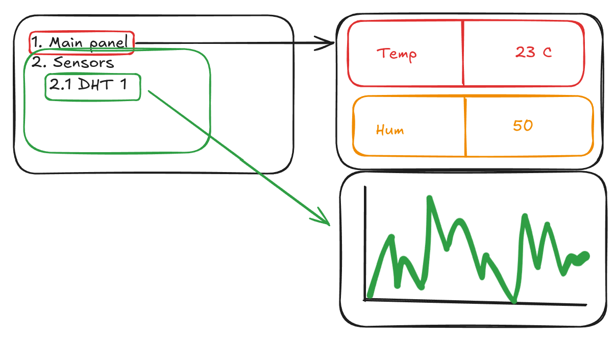

# Лабораторная работа 3. Автоматизированная система сбора данных

**Модуль 2.** Продвинутая Arduino: PlatformIO, библиотеки, C++.

**Тема:** датчики, шины I2C и SPI, дисплей и меню, обработка и хранение данных, классы и собственные библиотеки, энергосбережение.

> Общие правила - допуск, выбор варианта, оформление отчёта, защита, критерии - в [README лабораторных работ](../README.md). Здесь только то, что относится к этой работе.

---

## 1. Допуск

К работе допускается студент, сдавший **все практические задачи занятий 10-18** и защитивший [лабораторную работу 2](../lab2-sensor-library/lab.md).

Вариант выбирается самостоятельно после получения допуска.

---

## 2. Цель работы

Разработать программно-аппаратный комплекс для автоматического мониторинга параметров среды: сбор данных с датчиков, отображение, визуализация динамики, управление исполнительными устройствами и **автономная работа от батареи**.



---

## 3. Способ реализации

Допустимы пути **B (объектный C++)** и **C (смешанный)**. Путь A - чисто процедурный - для этой работы **не подходит**: одно из требований работы состоит в оформлении драйверов классами.

Драйвер устройства, написанный в [лабораторной работе 2](../lab2-sensor-library/lab.md), можно и нужно использовать здесь как готовую зависимость - это и есть проверка того, что библиотека получилась переиспользуемой.

Полная реализация на C++ - основной ожидаемый вариант.

---

## 4. Оборудование

**Обязательный минимум:**

- Arduino UNO;
- дисплей: **1602 через I2C-адаптер** или **TFT ILI9341**;
- устройство ввода: три кнопки (ВВЕРХ, ВНИЗ, ВЫБОР), либо джойстик KY-023, либо энкодер KY-040 с кнопкой;
- **не менее трёх** датчиков разных типов, обязательно включая:
  - датчик температуры и влажности воздуха (DHT-11 или KY-015),
  - почвенный гигрометр FC-28,
  - датчик освещённости (фоторезистор или KY-018);
- исполнительное устройство: реле или сервопривод;
- RGB-светодиод (KY-016 / KY-009) или четыре светодиода разных цветов.

Остальное определяется вариантом.

---

## 5. Базовое задание

### 5.1. Двухуровневое меню

**Уровень 1 (главный экран)** - список пунктов:

1. **Панель состояния** - текущие значения всех измеряемых величин:

```
Возд: 23.4 C  45%
Почва: 62%
Свет:  310 лк
```

2. **Данные датчиков** - переход на уровень 2.
3. **Настройки** - пороги срабатывания и параметры системы.
4. **Журнал** - просмотр сохранённых записей.

**Уровень 2 (список датчиков)** - при выборе датчика открывается экран с **графиком** зависимости величины от времени.

**Управление:** ВВЕРХ / ВНИЗ - перемещение, ВЫБОР - вход. Обязателен **возврат** на предыдущий уровень.

### 5.2. Сбор и обработка данных

1. Каждый датчик опрашивается **со своим периодом**; DHT-11 - не чаще раза в 2 секунды.
2. Показания **фильтруются**; выбранный фильтр обоснован в отчёте. Сырые и отфильтрованные данные сравниваются на графике.
3. Почвенный гигрометр **калибруется по двум точкам** (сухой воздух и вода), коэффициенты хранятся в EEPROM.
4. Ошибки чтения обрабатываются: показывается последнее корректное значение и признак ошибки. Отказ одного датчика не останавливает систему.
5. Ведётся **журнал** измерений: кольцевой буфер в EEPROM с контрольной суммой, не менее 30 записей, просмотр через меню.

### 5.3. Автоматическое управление

1. Светодиоды меняют цвет и яркость в зависимости от показаний; алгоритм с точными порогами описан в отчёте.
2. Исполнительное устройство включается по порогу с **гистерезисом**. В отчёте покажите, как гистерезис устранил дребезг срабатывания.
3. Пороги настраиваются через меню и сохраняются в **EEPROM** с контрольной суммой.

### 5.4. Энергосбережение

Система должна быть пригодна к автономной работе.

1. Между измерениями микроконтроллер уходит в **`SLEEP_MODE_PWR_DOWN`**; пробуждение - по сторожевому таймеру.
2. Пробуждение по нажатию кнопки работает **немедленно**: при взаимодействии с меню система переходит в активный режим и остаётся в нём, пока пользователь работает.
3. Почвенный гигрометр **питается с цифрового вывода** и включается только на время измерения - иначе электроды разрушаются электролизом.
4. Подсветка дисплея гаснет через заданное время бездействия.
5. Неиспользуемая периферия отключена (`PRR`), свободные выводы переведены в определённое состояние.

### 5.5. Требования к реализации

Помимо [общих требований](../README.md#4-общие-технические-требования):

1. Структура меню описана **данными** (массивом или таблицей), а не вложенными `if`.
2. Меню реализовано **конечным автоматом**.
3. Драйверы устройств и модули оформлены **классами**.
4. Датчики скрыты за **общим интерфейсом** (базовый класс или структура с указателями на функции), чтобы добавление нового датчика не требовало правки логики меню и журнала.
5. Программа разделена на модули: меню, опрос датчиков, отображение, управление, журнал, энергосбережение.

---

## 6. Варианты

Вариант выбирается студентом самостоятельно.

### Вариант 1. "Мультисенсор"

**Добавить:** 3 фоторезистора, LM35, KY-028.

**Требования:** освещённость измеряется тремя датчиками - выводятся среднее, минимум и максимум. Температура измеряется тремя способами (DHT-11, LM35, термистор), все значения выводятся, расхождение вычисляется и отображается. В отчёте - анализ причин расхождения и вывод о том, какому датчику доверять.

### Вариант 2. "Регистратор на SD-карте"

**Добавить:** модуль SD-карт, DS1302.

**Требования:** все измерения пишутся на карту в формате CSV с реальной временной меткой. Файл называется по дате. Карта может быть извлечена и вставлена во время работы - система это обнаруживает и не зависает. В отчёте - график, построенный по выгруженному CSV в электронной таблице, и **измерение времени записи** одной записи (минимум, максимум, среднее по 50 записям).

### Вариант 3. "Метеостанция с часами"

**Добавить:** DS1302, датчик давления или второй температурный.

**Требования:** реальные временные метки на всех графиках, часы и дата на панели состояния, меню установки времени. Журнал ведётся по суткам: минимум, максимум и среднее за день сохраняются отдельно. Реализован расчёт **тренда** (растёт / падает / стабильно) по последним измерениям.

### Вариант 4. "Автоматический полив"

**Добавить:** реле (насос), датчик уровня воды, сервопривод (кран).

**Требования:** при падении влажности почвы ниже порога включается полив. Датчик уровня блокирует полив при пустом резервуаре и выдаёт тревогу. Длительность и минимальный интервал между поливами настраиваются. Ведётся журнал поливов с временем и длительностью. **Обязательна защита от залива:** ограничение суммарного времени полива за сутки.

### Вариант 5. "Пожарная сигнализация"

**Добавить:** датчик пламени KY-026, датчик звука KY-037, зуммер, реле.

**Требования:** тревога поднимается только при **совпадении двух признаков** (пламя и рост температуры) - в отчёте обоснуйте, почему одного датчика пламени недостаточно, и приведите примеры ложных срабатываний, которые вы воспроизвели. Разные звуковые сигналы для разных типов тревог, отключение звука на 5 минут по кнопке, журнал тревог.

### Вариант 6. "Охранная система"

**Добавить:** герконовый датчик KY-021, датчик вибрации KY-002, датчик Холла KY-024, зуммер.

**Требования:** контроль "открытия двери" (геркон), удара (вибрация) и попытки обмануть геркон посторонним магнитом (аналоговый датчик Холла фиксирует нештатную величину поля). Постановка и снятие с охраны, задержка на выход 30 секунд, журнал событий с временем.

### Вариант 7. "Контроль доступа"

**Добавить:** RFID RC522, реле.

**Требования:** доступ к настройкам только по RFID-карте. Список UID в EEPROM, режим добавления и удаления карт. Все попытки доступа фиксируются в журнале. В отчёте - объяснение, почему проверка UID не является защитой, и описание того, что нужно для настоящей защиты.

### Вариант 8. "Пульт управления"

**Добавить:** ИК-приёмник KY-022, ИК-пульт, ИК-светодиод KY-005.

**Требования:** полное управление с пульта, дублирующее физические кнопки. Режим **обучения**: система запоминает соответствие кнопок командам и хранит его в EEPROM. Дополнительно система умеет **передавать** ИК-команды через KY-005 - например, включать сторонний прибор по порогу.

### Вариант 9. "Наклон и вибрация"

**Добавить:** GY-521 (MPU-6050), зуммер.

**Требования:** контроль положения конструкции: углы крена и тангажа вычисляются **комплементарным фильтром** по акселерометру и гироскопу. Тревога при выходе угла за допуск и при ударе. График угла во времени. В отчёте - сравнение угла, полученного только по акселерометру, только по гироскопу и фильтром, с объяснением поведения каждого.

### Вариант 10. "Тахометр"

**Добавить:** SR-393 или энкодер KY-040, сервопривод или шаговый двигатель.

**Требования:** измерение частоты вращения аппаратным счётчиком, отображение в об/мин, график. Система поддерживает заданную скорость обратной связью. Измерьте **погрешность** измерения на трёх скоростях и определите нижний и верхний пределы измерения вашей схемы.

### Вариант 11. "Графический интерфейс"

**Добавить:** TFT ILI9341 (обязательно вместо 1602).

**Требования:** не менее четырёх экранов, цветные графики нескольких параметров на одном поле, шкалы, пиктограммы, цветовая индикация зон. График строится по кольцевому буферу, перерисовывается только изменившаяся область. **Измерьте** время полной и частичной перерисовки и приведите обе цифры.

### Вариант 12. "Распределённая система"

**Добавить:** вторую плату Arduino UNO.

**Требования:** плата A собирает данные и управляет исполнительными устройствами, плата B - пульт с дисплеем и меню. Обмен по UART кадровым протоколом с контрольной суммой ([занятие 16](../../Practice/16-uart-link/note.md)). Обе платы обнаруживают потерю связи и переходят в безопасное состояние. **Измерьте** время доставки команды и процент потерянных кадров при искусственно внесённых помехах.

---

## 7. Дополнительные задания

1. **Собственная библиотека** для одного из датчиков, оформленная по правилам [занятия 11](../../Practice/11-cpp-oop/task.md) и подключаемая через `lib_deps`.
2. **Сторожевой таймер** с журналированием фактов перезагрузки.
3. **Экспорт журнала** в Serial в формате CSV.
4. **Калибровка всех датчиков** через меню с сохранением коэффициентов.
5. **Прогноз**: простая экстраполяция тренда с оценкой достоверности.
6. **Модульные тесты** для функций фильтрации и пересчёта, запускаемые через `pio test`.

---

## 8. Специальные разделы отчёта

Дополнительно к [общей структуре](../README.md#5-структура-отчёта):

- **Структура меню**: дерево пунктов.
- **Диаграмма состояний** автомата меню.
- **Иерархия классов**: диаграмма с указанием, что вынесено в общий интерфейс датчика и почему.
- **Периоды опроса** каждого датчика с обоснованием.
- **Методика калибровки** почвенного гигрометра: две точки, полученные коэффициенты, проверка.
- **Обоснование фильтра**: какой выбран, почему, сравнение сырых и отфильтрованных данных на одном графике.
- **Формат хранения** в EEPROM: структура записи, размер, вместимость, схема контрольной суммы, расчёт ресурса ячеек.
- **Расход памяти**: Flash, SRAM статическая, свободная SRAM во время работы.
- **Раздел по энергосбережению**: таблица измерений из 5.4, расчёт автономности, вывод о применимости платы UNO.
- **Испытания**: поведение при выходе параметров за пороги, при отказе датчика, при отключении питания в момент записи в EEPROM.

---

## 9. Порядок выполнения

Работа большая, и собрать её целиком за один заход не получится. Порядок, который экономит время:

1. **Один датчик в Serial.** Добейтесь корректных показаний одного датчика без дисплея и меню. Здесь же сделайте калибровку гигрометра - потом будет некогда.
2. **Общий интерфейс датчика.** Оформите второй и третий датчики так, чтобы логика опроса не знала, какой именно датчик перед ней. Сделать это на трёх датчиках проще, чем переделывать на десяти.
3. **Дисплей отдельно.** Выведите одно значение, добейтесь обновления без мерцания.
4. **Меню как автомат.** Сначала один уровень и два пункта. Убедитесь, что структура описана данными, и только потом наращивайте.
5. **EEPROM.** Пороги, затем калибровки, затем журнал. Контрольную сумму закладывайте сразу - дописывать её потом больно.
6. **Управление и гистерезис.**
7. **Энергосбережение - в последнюю очередь.** Сон ломает отладку: `Serial` в спящей системе работает не так, как вы привыкли. Сначала работающая система, потом её усыпление.
8. **И только потом - задание варианта.**

**Измеряйте свободную SRAM с самого начала.** Заведите вывод свободной памяти в диагностический экран на третьем шаге. На UNO с дисплеем, графиками и журналом память кончается внезапно, и обнаружить это лучше сразу, а не после недели работы.

---

## 10. Вопросы к защите

1. Как устроен ваш общий интерфейс датчика? Что нужно сделать, чтобы добавить новый датчик?
2. Почему структура меню описана данными, а не кодом? Что это дало?
3. Какой фильтр вы применили и почему именно его? Какова его задержка?
4. Почему почвенный гигрометр нельзя держать под постоянным питанием?
5. Как вы гарантируете целостность настроек в EEPROM при отключении питания в момент записи?
6. Сколько записей журнала помещается в EEPROM и на сколько времени этого хватит? Когда исчерпается ресурс ячеек?
7. Что произойдёт, если датчик выйдет из строя и перестанет отвечать? Покажите этот сценарий.
8. Из чего складывается потребление вашей системы? Какой приём дал наибольший выигрыш?
9. Почему на плате UNO нельзя добиться потребления в единицы микроампер? Что нужно изменить?
10. Как вы измеряли ток потребления и почему этому измерению можно доверять?

---

## 11. Критерии оценки

| Критерий | Вес |
| --- | --- |
| Базовое задание (меню, сбор данных, управление) | 25 % |
| Раздел энергосбережения: реализация и измерения | 15 % |
| Задание варианта выполнено полностью | 20 % |
| Архитектура: классы, общий интерфейс датчиков, модульность | 20 % |
| Отчёт: измерения, диаграммы, обоснования | 15 % |
| Дополнительные задания | 5 % |

Сверх [общих условий непринятия работы](../README.md#7-критерии-оценки), работа не принимается, если:

- отсутствует обработка ошибок датчиков;
- отсутствуют измерения потребления или расчёт автономности;
- драйверы не оформлены классами;
- почвенный гигрометр питается постоянно.

---

## 12. Полезные ссылки

- [Занятие 5: датчики и фильтрация](../../Practice/05-adc-sensors/note.md)
- [Занятие 11: C++, классы и собственная библиотека](../../Practice/11-cpp-oop/note.md)
- [Занятие 12: I2C, дисплей 1602, RTC](../../Practice/12-i2c-lcd-rtc/note.md)
- [Занятие 13: TFT, RFID и SD-карта](../../Practice/13-spi-tft-rfid/note.md)
- [Занятие 17: память, EEPROM и энергопотребление](../../Practice/17-memory/note.md)
- [Справочник по железу](../../Hardware/README.md)
- [Документация Adafruit GFX](https://learn.adafruit.com/adafruit-gfx-graphics-library)
