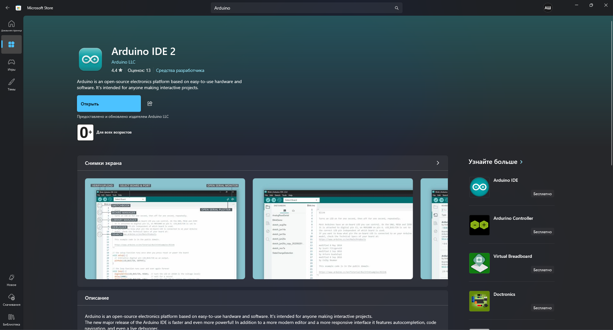
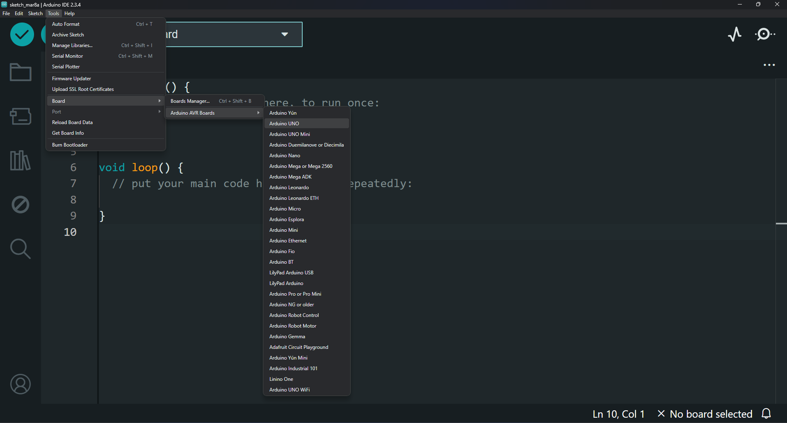
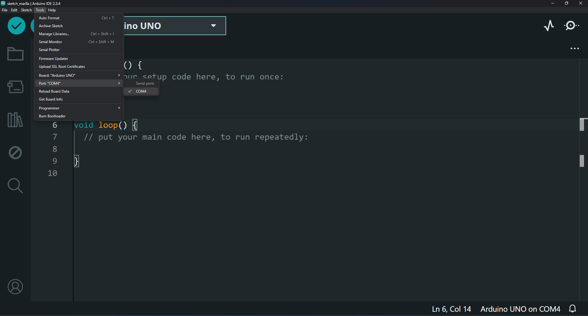
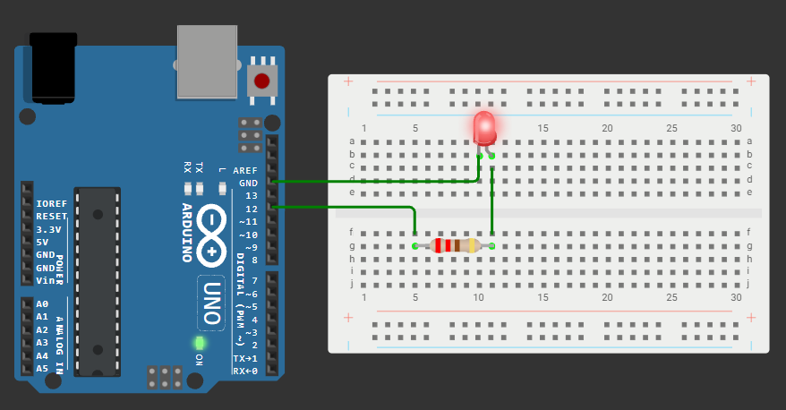
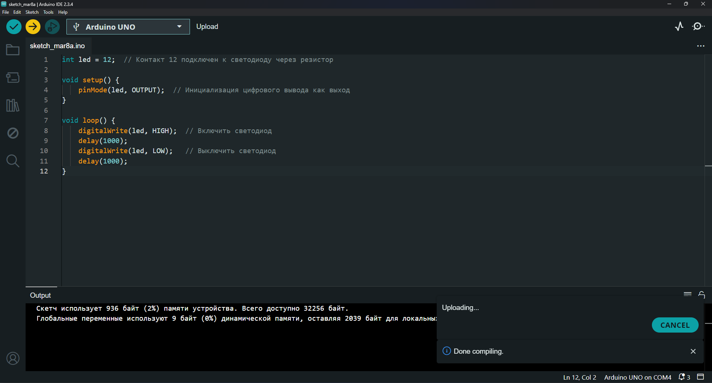
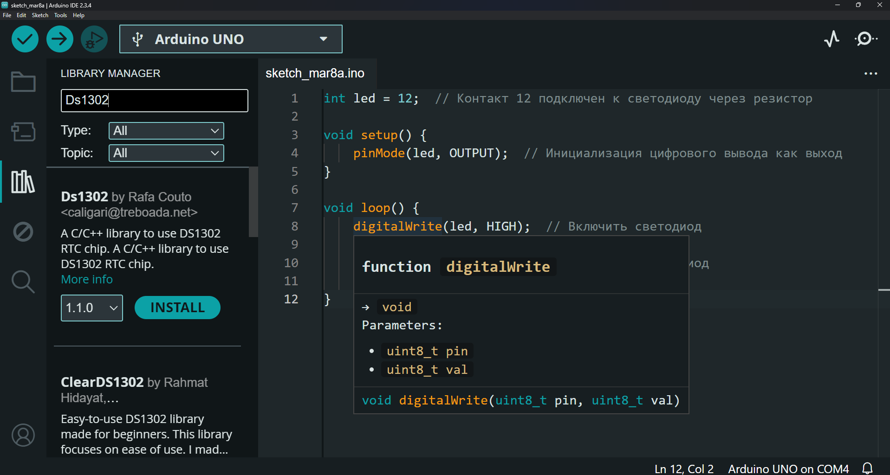
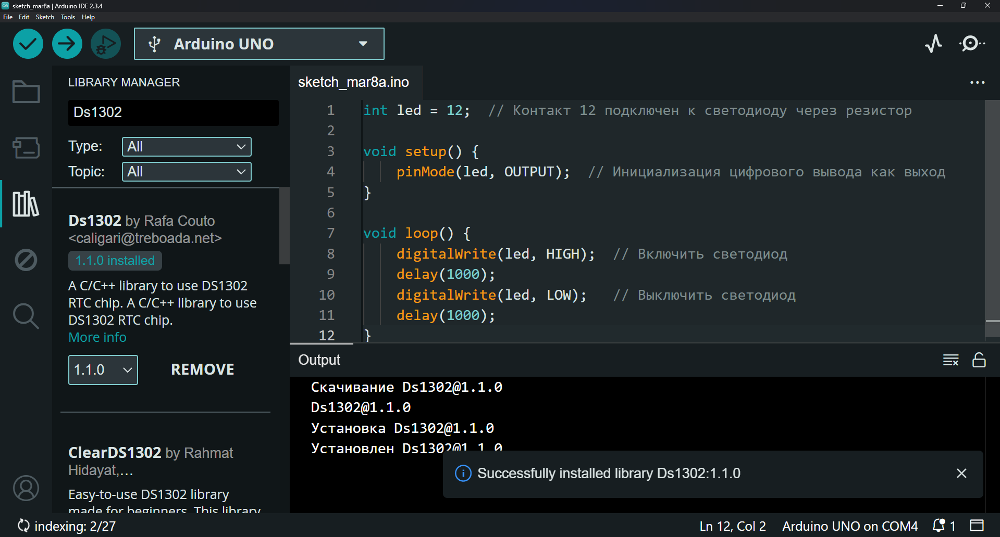
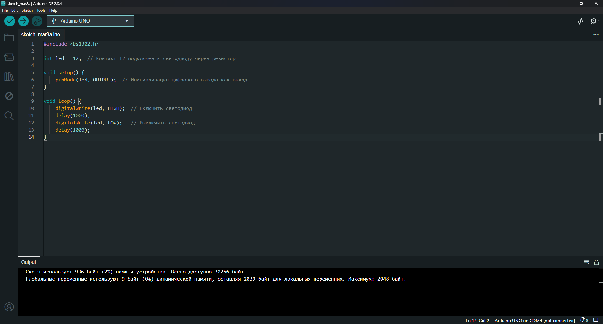

# Занятие 2. Инструменты разработки и первая программа

**Цель занятия:** развернуть рабочее место, провести полный цикл "схема -> код -> компиляция -> прошивка -> результат" и понять, что происходит на каждом его шаге.

**Что понадобится:** Arduino UNO, USB-кабель, макетная плата, светодиод, резистор 220 Ом, перемычки.

> Схему собираем по правилам [занятия 1](../01-safety-electronics/note.md). Перед подключением USB - чек-лист.

---

## 1. Чем разработка для микроконтроллера отличается от обычной

Программа для микроконтроллера:

- выполняется **на отдельном устройстве**, у которого нет ни операционной системы, ни экрана, ни файловой системы;
- попадает туда через **прошивку** - отдельный шаг, которого нет в обычной разработке;
- взаимодействует с миром **только через выводы микросхемы**, поэтому ошибка может быть как в коде, так и в схеме;
- отлаживается **косвенно** - чаще всего выводом текста в последовательный порт.

Отсюда главное правило курса: **сначала проверяем схему, потом код**. Если светодиод не горит, вероятность ошибки в подключении выше, чем в трёх строках `digitalWrite`.

Полный маршрут одной итерации:

```tikz Маршрут одной итерации разработки: правка, сборка, прошивка, наблюдение
\begin{tikzpicture}[x=1cm,y=1cm]

  % ---------- на компьютере ----------
  \node[artifact] (src) at (0,3)    {исходник\\[-1pt]\scriptsize\ttfamily main.cpp};
  \dogear{src}
  \node[tool]     (cc)  at (3.7,3)  {компилятор};
  \node[artifact] (hex) at (7.3,3)  {\ttfamily .hex};
  \dogear{hex}
  \node[tool]     (up)  at (10.7,3) {загрузчик};

  \node[host]     (mon) at (3.7,0)  {Serial Monitor};

  % ---------- на плате ----------
  \node[mcu]      (mcu) at (10.7,0) {ATmega328P\\[-1pt]\scriptsize Flash 32 КБ};
  \pins{mcu}{4}

  % ---------- поток ----------
  \draw[flow] (src) -- (cc);
  \draw[flow] (cc)  -- node[sublab, above=0.5mm] {avr-gcc} (hex);
  \draw[flow] (hex) -- (up);
  \draw[flow] (up)  -- node[sublab, right=1mm] {avrdude}
                       node[lab, left=1mm] {USB} (mcu);
  \draw[flow] (mcu) -- node[lab, above] {UART}
                       node[note, below=1.2mm] {\ttfamily Serial.print()} (mon);
  \draw[back] (mon) -- node[lab, right=1mm, align=left]
                       {смотрим результат\\и правим код} (src);

  % ---------- этапы ----------
  \begin{scope}[on background layer]
    \node[stage, fit=(src)(cc)(hex)(up)(mon)] (s1) {};
    \node[stage, fit=(mcu), inner sep=5mm]    (s2) {};
  \end{scope}
  \node[stagelab, anchor=south west] at ([yshift=1mm] s1.north west) {на компьютере};
  \node[stagelab, anchor=north]      at ([yshift=-1mm] s2.south)      {на плате};

\end{tikzpicture}
```

---

## 2. Установка Arduino IDE

Основная среда первых пяти занятий - **Arduino IDE 2.x**. Скачайте установщик с [официального сайта](https://www.arduino.cc/en/software) или установите из Microsoft Store.



Документация: [docs.arduino.cc/software/ide-v2](https://docs.arduino.cc/software/ide-v2).

> С [занятия 6](../06-platformio/note.md) курс переходит на **PlatformIO** внутри VS Code. Arduino IDE остаётся как быстрый инструмент для одиночных проверок, но лабораторные и все последующие задачи выполняются в PlatformIO.

### Драйвер USB-UART

Микроконтроллер не общается с компьютером по USB напрямую: на плате стоит микросхема-переходник USB - UART, и компьютер видит её как виртуальный COM-порт.

Оригинальные платы UNO используют ATmega16U2, драйвер для которого входит в состав операционной системы. **Платы из нашего набора используют CH340** - для них может понадобиться отдельный драйвер с [сайта производителя WCH](https://www.wch-ic.com/downloads/CH341SER_EXE.html).

Признак отсутствия драйвера: плата подключена, светодиод питания горит, но в списке портов её нет.

- **Windows:** порт вида `COM3`, `COM4`.
- **Linux:** `/dev/ttyUSB0` (CH340) или `/dev/ttyACM0` (ATmega16U2). Если порт есть, но доступ запрещён, добавьте пользователя в группу `dialout` и перезайдите в систему.
- **macOS:** `/dev/cu.usbserial-*` или `/dev/cu.wchusbserial*`.

### Выбор платы и порта

Подключите плату и выберите **Tools -> Board -> Arduino AVR Boards -> Arduino UNO**.



Затем выберите порт: **Tools -> Port**.



Выбранные плата и порт отображаются в правом нижнем углу окна.

---

## 3. Первая схема: мигающий светодиод

### Сборка

1. Резистор 220 Ом одним концом в цифровой вывод **D12**, другим - в анод светодиода.
2. Катод светодиода - на GND.



Расчёт резистора (см. [занятие 1](../01-safety-electronics/note.md)):

$$R = \frac{U_{\text{пит}} - U_{\text{св}}}{I} = \frac{5 - 2}{0.013} \approx 230 \text{ Ом} \Rightarrow 220 \text{ Ом}$$

### Код

```cpp
int led = 12;              // вывод, к которому подключён светодиод

void setup() {
    pinMode(led, OUTPUT);  // настраиваем вывод на выход
}

void loop() {
    digitalWrite(led, HIGH);  // включить
    delay(1000);              // подождать 1 с
    digitalWrite(led, LOW);   // выключить
    delay(1000);              // подождать 1 с
}
```

### Структура скетча

Любая программа Arduino состоит минимум из двух функций:

- **`setup()`** вызывается **один раз** после подачи питания или нажатия RESET. Здесь настраивают режимы выводов, инициализируют порт и библиотеки.
- **`loop()`** вызывается **бесконечно** сразу после `setup()`. Это основная программа.

Функции `main()` в скетче нет - она находится в ядре Arduino:

```cpp
int main(void) {
    init();            // настройка таймеров, АЦП, millis()
    setup();
    for (;;) {
        loop();
        if (serialEventRun) serialEventRun();
    }
    return 0;
}
```

Отсюда важное наблюдение: **`loop()` - это не "фоновый цикл", а просто тело бесконечного цикла**. Пока `loop()` не вернёт управление, ничего другого не произойдёт. Вызов `delay(1000)` на секунду полностью останавливает программу, и нажатия кнопок в это время будут пропущены. Как с этим бороться - тема [занятия 7](../07-timing-multitasking/note.md).

Разбор работы:

- **Инициализация.** `pinMode(led, OUTPUT)` переводит вывод D12 в режим выхода.
- **Включение.** `digitalWrite(led, HIGH)` подаёт на вывод 5 В, через светодиод течёт ток.
- **Задержка.** `delay(1000)` - пауза 1000 мс.
- **Выключение.** `digitalWrite(led, LOW)` подаёт 0 В, ток прекращается.
- **Повтор.** `loop()` начинается заново.

---

## 4. Компиляция и загрузка



- **Verify (галочка)** - компиляция без загрузки, проверка на ошибки.
- **Upload (стрелка)** - компиляция и загрузка на плату.

Ход процесса и сообщения об ошибках выводятся в панели **Output**.

### Загрузчик

При загрузке скетча работает **загрузчик (bootloader)** - небольшая программа, зашитая во Flash на заводе. Она получает управление сразу после сброса, несколько секунд ждёт данные по последовательному порту и, если их нет, передаёт управление вашей программе.

Именно поэтому для прошивки не нужен программатор, и именно поэтому 0,5 КБ из 32 КБ Flash недоступны для вашего кода.

### Типичные ошибки загрузки

| Сообщение | Причина |
| --- | --- |
| Порт отсутствует в списке | Не установлен драйвер CH340 или кабель без линий данных (бывают кабели "только для зарядки") |
| `avrdude: stk500_recv(): programmer is not responding` | Выбран не тот порт или плата; либо к D0/D1 подключено устройство, мешающее обмену |
| `Permission denied: /dev/ttyUSB0` | Linux: пользователь не в группе `dialout` |
| Порт занят | Открыт Serial Monitor в другом окне или запущена другая программа с этим портом |

---

## 5. Монитор последовательного порта

Микроконтроллер не может напечатать сообщение на экран, но может отправить его по UART в компьютер. Это основной инструмент отладки в курсе.

```cpp
void setup() {
    Serial.begin(9600);          // инициализация UART, 9600 бод
    Serial.println("Плата запущена");
}

void loop() {
    Serial.print("Время работы, мс: ");
    Serial.println(millis());
    delay(1000);
}
```

Откройте **Tools -> Serial Monitor** и убедитесь, что скорость в выпадающем списке совпадает со значением в `Serial.begin()`. Несовпадение даёт на экране "мусор" из случайных символов - самая частая причина непонятного вывода.

Помните: `Serial` использует выводы D0 и D1. Подключённое к ним устройство помешает и выводу, и прошивке.

### Serial Plotter

Соседний пункт меню строит график по числам, которые плата присылает в порт. Несколько значений в строке через пробел дают несколько кривых:

```cpp
Serial.print(raw);
Serial.print(' ');
Serial.println(filtered);
```

Это самый быстрый способ увидеть шум датчика и оценить работу фильтра ([занятие 5](../05-adc-sensors/note.md)).

---

## 6. Библиотеки

Библиотека - готовый код для работы с устройством или протоколом. Без библиотеки `DHT` пришлось бы вручную формировать импульсы длительностью в десятки микросекунд и разбирать ответ датчика.

Откройте менеджер библиотек (иконка книг на левой панели), найдите нужную и нажмите **Install**.



После установки у библиотеки появится статус **Installed**.



Подключается библиотека директивой в начале файла:



```cpp
#include <Ds1302.h>
```

Разница между `<>` и `""`: в угловых скобках компилятор ищет файл только в папках библиотек, в кавычках - сначала в папке со скетчем, потом в библиотеках. Свои файлы проекта подключают в кавычках.

### Библиотеки курса

| Библиотека | Для чего | Занятие |
| --- | --- | --- |
| `DHT sensor library` + `Adafruit Unified Sensor` | Датчик DHT-11 | 5 |
| `LiquidCrystal` | Дисплей 1602 в параллельном режиме | 12 |
| `LiquidCrystal I2C` | Дисплей 1602 через I2C-адаптер | 12 |
| `Ds1302` | Часы реального времени | 12 |
| `Adafruit GFX` + `Adafruit ILI9341` | TFT-дисплей | 13 |
| `MFRC522` | RFID-считыватель | 13 |
| `IRremote` | ИК-приёмник и пульт | 14 |
| `Servo`, `Stepper` | Приводы (входят в состав IDE) | 15 |
| `FreeRTOS` (feilipu) | Операционная система реального времени | 19-21 |

---

## 7. Как отлаживать, когда ничего не работает

Порядок, который экономит время на занятии:

1. **Проверьте схему по чек-листу** из [занятия 1](../01-safety-electronics/task.md).
2. **Загрузите минимальный пример** - мигание встроенным светодиодом D13. Если работает, плата и прошивка в порядке, дело в схеме или в вашем коде.
3. **Упрощайте, а не усложняйте.** Уберите из программы всё, кроме одного действия. Добейтесь его работы, потом добавляйте по одному элементу.
4. **Выводите промежуточные значения в Serial**: состояние вывода, сырое значение датчика, номер состояния автомата.
5. **Меняйте одну вещь за раз** и записывайте, что изменилось.

---

## 8. Другие инструменты

Обзор сред и симуляторов - в приложении [tooling.md](../../Appendix/tooling.md):

- **PlatformIO** внутри VS Code - основной инструмент курса начиная с [занятия 6](../06-platformio/note.md);
- **Wokwi** и **Tinkercad** - онлайн-симуляторы. Занятия проходят на реальном железе, но симулятор остаётся **запасным путём**: если вы пропустили занятие или доделываете задачу дома, соберите схему в Wokwi и пришлите ссылку;
- **avr-gcc + make** без фреймворка Arduino - [занятие 18](../18-low-level/note.md).

---

## Контрольные вопросы

1. Почему `loop()` нельзя считать фоновым процессом? Что произойдёт с обработкой кнопки во время `delay(1000)`?
2. Зачем нужен загрузчик и почему из 32 КБ Flash доступно только 31,5 КБ?
3. Что делает микросхема CH340 и почему для неё нужен драйвер?
4. Почему в Serial Monitor появляются нечитаемые символы и как это исправить?
5. Почему нельзя подключить датчик к выводам D0 и D1?
6. В чём разница между `#include <file.h>` и `#include "file.h"`?
7. Светодиод не мигает. Опишите порядок действий по поиску причины.

## Задание

Задачи занятия - в [task.md](task.md).
