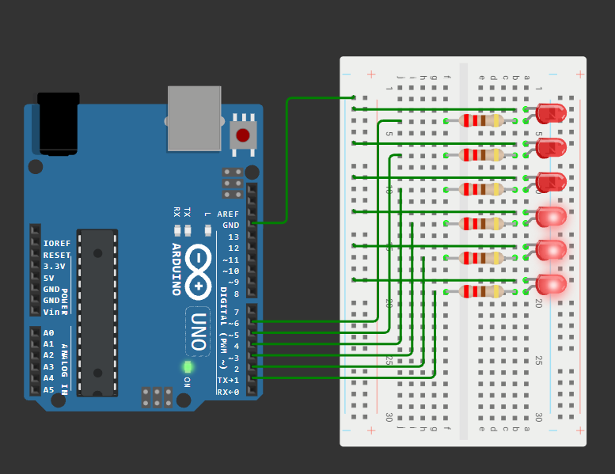
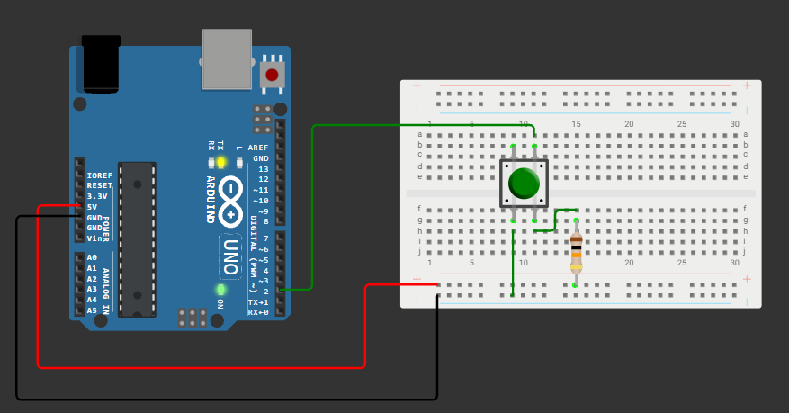
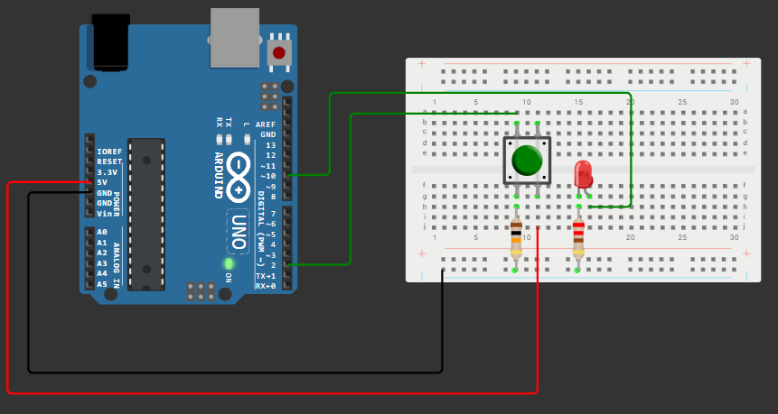
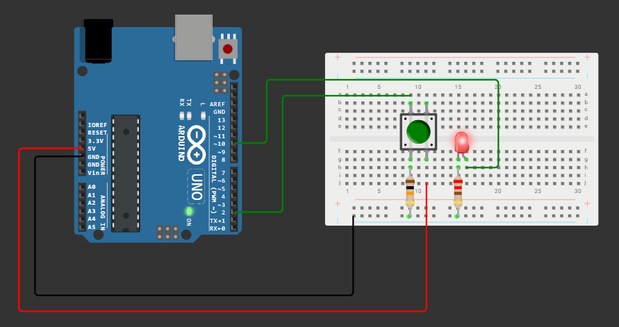

# Занятие 3. Цифровой ввод-вывод

**Цель занятия:** научиться управлять цифровыми выводами и читать их состояние, понять, что происходит внутри микроконтроллера при вызове `pinMode()` и `digitalWrite()`, и разобраться с двумя проблемами любого механического контакта - "висящим" входом и дребезгом.

**Что понадобится:** Arduino UNO, макетная плата, светодиоды, резисторы 220 Ом и 10 кОм, тактовые кнопки, перемычки.

---

## 1. Цифровой сигнал

Цифровой вывод микроконтроллера принимает и выдаёт только два состояния. Но "два состояния" - это идеализация: на самом деле есть диапазоны напряжений.

Для ATmega328P при питании 5 В:

| Уровень | Диапазон напряжения на входе |
| --- | --- |
| Гарантированный `LOW` | от 0 до 1,5 В |
| Неопределённая зона | 1,5-3,0 В |
| Гарантированный `HIGH` | от 3,0 до 5 В |

Если напряжение на входе попадает в неопределённую зону, результат `digitalRead()` непредсказуем. Именно это происходит с кнопкой без подтягивающего резистора.

На выходе всё определённее: `HIGH` - вывод соединён внутренним ключом с шиной 5 В, `LOW` - с шиной GND. Такой выход называется **push-pull** (двухтактный): он умеет и "толкать" ток в нагрузку, и "принимать" его.

> Есть и другой тип выхода - **open-drain** (открытый сток): вывод умеет только притягивать линию к земле, а высокий уровень обеспечивает внешний подтягивающий резистор. Так устроена шина I2C - к этому мы вернёмся на [занятии 12](../12-i2c-lcd-rtc/note.md).

---

## 2. Порты и регистры

Выводы микроконтроллера объединены в **порты** по 8 линий. У ATmega328P их три:

| Порт | Выводы Arduino |
| --- | --- |
| PORTB | D8-D13 (плюс два вывода кварца) |
| PORTC | A0-A5 |
| PORTD | D0-D7 |

Каждым портом управляют три регистра:

| Регистр | Назначение |
| --- | --- |
| `DDRx` (Data Direction Register) | Направление: `0` - вход, `1` - выход |
| `PORTx` (Data Register) | Для выхода - уровень (`0`/`1`). Для входа - включение внутренней подтяжки |
| `PINx` (Port Input Register) | Чтение фактического состояния вывода |

Одна и та же запись в `PORTx` означает разные вещи в зависимости от `DDRx` - это частый источник путаницы, и именно её скрывают функции Arduino.

### Что делает `pinMode()` на самом деле

Функции Arduino - это обёртки над этими тремя регистрами. Вот реальный код из [ядра ArduinoCore-avr](https://github.com/arduino/ArduinoCore-avr/blob/master/cores/arduino/wiring_digital.c):

```c
void pinMode(uint8_t pin, uint8_t mode)
{
    uint8_t bit = digitalPinToBitMask(pin);   // маска бита, например 0b00100000 для D13
    uint8_t port = digitalPinToPort(pin);     // идентификатор порта, для D13 - порт B
    volatile uint8_t *reg, *out;

    if (port == NOT_A_PIN) return;

    reg = portModeRegister(port);             // указатель на DDRx
    out = portOutputRegister(port);           // указатель на PORTx

    if (mode == INPUT) {
        uint8_t oldSREG = SREG;
        cli();
        *reg &= ~bit;                         // DDRx: бит в 0 - вход
        *out &= ~bit;                         // PORTx: бит в 0 - подтяжка выключена
        SREG = oldSREG;
    } else if (mode == INPUT_PULLUP) {
        uint8_t oldSREG = SREG;
        cli();
        *reg &= ~bit;                         // вход
        *out |= bit;                          // подтяжка включена
        SREG = oldSREG;
    } else {
        uint8_t oldSREG = SREG;
        cli();
        *reg |= bit;                          // DDRx: бит в 1 - выход
        SREG = oldSREG;
    }
}
```

Здесь стоит обратить внимание на три вещи.

**Во-первых, номер вывода - не адрес.** `digitalPinToBitMask()` и `digitalPinToPort()` переводят "номер на плате" в пару "порт + бит". Эта таблица соответствия своя для каждой платы Arduino, потому один и тот же скетч работает на UNO и на Mega.

**Во-вторых, установка бита - это не одна операция.** Строка `*reg |= bit` компилируется в последовательность "прочитать регистр -> изменить бит -> записать обратно". Если между чтением и записью произойдёт прерывание, которое изменит тот же регистр, его правка потеряется.

**В-третьих, поэтому здесь есть `cli()`.** Прерывания запрещаются на время правки регистра, а прежнее состояние флагов восстанавливается из `SREG`. Это классический приём защиты **критической секции**; подробно разберём на [занятии 8](../08-interrupts/note.md).

Цена удобства - скорость: `digitalWrite()` выполняет проверки, обращения к таблицам во Flash и отключение ШИМ, из-за чего работает в десятки раз медленнее прямой записи в регистр. Для мигания светодиодом это неважно, для динамической индикации - уже важно ([занятие 10](../10-indication/note.md)).

---

## 3. Цифровой выход: светодиод

### Схема


1. Резистор 220 Ом одним концом - в цифровой вывод, другим - в анод светодиода.
2. Катод светодиода - на GND.

### Программа

```cpp
const int LED = 12;

void setup() {
    pinMode(LED, OUTPUT);
}

void loop() {
    digitalWrite(LED, HIGH);
    delay(1000);
    digitalWrite(LED, LOW);
    delay(1000);
}
```

### Несколько выводов



Шесть светодиодов на выводах D2-D7, каждый через свой резистор 220 Ом, катоды - на общую шину GND.

```cpp
const uint8_t LEDS[] = {2, 3, 4, 5, 6, 7};
const uint8_t LED_COUNT = sizeof(LEDS) / sizeof(LEDS[0]);

void setup() {
    for (uint8_t i = 0; i < LED_COUNT; i++) {
        pinMode(LEDS[i], OUTPUT);
    }
}

void loop() {
    for (uint8_t i = 0; i < LED_COUNT; i++) {      // "бегущий огонь" вперёд
        digitalWrite(LEDS[i], HIGH);
        delay(100);
        digitalWrite(LEDS[i], LOW);
    }
    for (int8_t i = LED_COUNT - 2; i > 0; i--) {   // и обратно
        digitalWrite(LEDS[i], HIGH);
        delay(100);
        digitalWrite(LEDS[i], LOW);
    }
}
```

Приём с массивом выводов и вычислением их количества через `sizeof` - базовый для всего курса: чтобы добавить седьмой светодиод, достаточно дописать номер в массив.

> **Не используйте D0 и D1.** Они заняты последовательным портом: подключённый к ним светодиод сорвёт загрузку скетча.

> **Следите за суммарным током.** Шесть одновременно горящих светодиодов по 13 мА - это 78 мА, в пределах нормы. Но если добавить ещё десяток или подключить их все к одному порту, можно превысить допустимый ток порта (100 мА) и предел платы (200 мА).

---

## 4. Цифровой вход: кнопка

### Проблема "висящего" входа

Кнопка сама по себе не задаёт напряжение - она только соединяет или разъединяет два провода. Если один вывод кнопки посадить на 5 В, а второй завести на вход микроконтроллера, то при **нажатой** кнопке на входе будет чёткие 5 В, а при **отпущенной** вход окажется ни к чему не подключён.

Такой вход называют "висящим" (floating). Он работает как маленькая антенна: наводки от сети, от руки, от соседних проводов заставляют его случайно переключаться между 0 и 1. Программа при этом "видит" нажатия, которых не было.

Решение - резистор, который задаёт входу определённый уровень, когда кнопка разомкнута.

### Стягивающий резистор (pull-down)



Резистор 10 кОм соединяет вход с GND, кнопка соединяет вход с 5 В.

- Кнопка отпущена: через резистор вход притянут к земле -> `LOW`.
- Кнопка нажата: вход соединён с 5 В напрямую -> `HIGH`.

```cpp
const int BUTTON = 2;

void setup() {
    Serial.begin(9600);
    pinMode(BUTTON, INPUT);
}

void loop() {
    Serial.println(digitalRead(BUTTON));  // 0 - отпущена, 1 - нажата
    delay(50);
}
```

### Подтягивающий резистор (pull-up)

Резистор 10 кОм соединяет вход с 5 В, кнопка соединяет вход с GND. Логика инвертируется: отпущена -> `HIGH`, нажата -> `LOW`.

Почему сопротивление именно 10 кОм? Резистор образует делитель с входным сопротивлением вывода. Слишком большой номинал (например, 1 МОм) не справится с наводками; слишком маленький (100 Ом) при нажатой кнопке даст ток 50 мА, который будет впустую греть резистор.

### Внутренняя подтяжка

В ATmega328P на каждом входе есть встроенный подтягивающий резистор 20-50 кОм, который включается программно:

```cpp
pinMode(BUTTON, INPUT_PULLUP);   // резистор внутри микроконтроллера
```

Схема упрощается до предела: один вывод кнопки на вход, второй - на GND. Нажатие даёт `LOW`.

Это основной способ подключения кнопок в курсе. Внешний резистор предпочтителен, когда нужно точно знать номинал, когда линия длинная или зашумлённая, или когда вывод должен сохранять уровень в момент сброса микроконтроллера (после сброса вся подтяжка отключена).

### Устройство тактовой кнопки

У тактовой кнопки **четыре вывода**: пара с одной стороны корпуса замкнута между собой всегда, пара с другой стороны - тоже. Нажатие соединяет обе пары.

Отсюда правило: подключать нужно **два вывода по диагонали**. Если случайно взять два вывода с одной стороны, цепь окажется замкнутой постоянно, и кнопка "не будет работать" независимо от кода.

### Кнопка управляет светодиодом





```cpp
const int LED = 10;
const int BUTTON = 2;

void setup() {
    pinMode(LED, OUTPUT);
    pinMode(BUTTON, INPUT_PULLUP);
}

void loop() {
    bool pressed = (digitalRead(BUTTON) == LOW);   // с подтяжкой нажатие даёт LOW
    digitalWrite(LED, pressed ? HIGH : LOW);
}
```

---

## 5. Дребезг контактов

Кнопка - механическое устройство. При замыкании упругие металлические пластины несколько раз отскакивают друг от друга, прежде чем установить надёжный контакт. На осциллограмме вместо аккуратного прямоугольного фронта видна пачка импульсов длительностью от единиц до десятков миллисекунд.

```tikz Дребезг контактов: вместо одного фронта микроконтроллер видит несколько
\begin{tikzpicture}[x=1cm,y=1cm]
  \node[stagelab, anchor=west] at (0,1.5) {идеальный сигнал};
  \wave[draw=ok]{0}{0}{0.42}{1}{1,1,1,1,0,0,0,0,0,0}
  \node[note, anchor=east] at (-0.15,0.5) {вход};

  \begin{scope}[xshift=6.6cm]
    \node[stagelab, anchor=west] at (0,1.5) {реальный сигнал};
    \wave[draw=warn]{0}{0}{0.42}{1}{1,1,1,1,0,1,0,1,0,0,0,0}
    \node[note, anchor=east] at (-0.15,0.5) {вход};
    \draw[decorate, decoration={brace, amplitude=4pt, mirror},
          draw=warn, semithick] (1.68,-0.35) -- (3.36,-0.35);
    \node[note, text=warn, anchor=north, align=center] at (2.5,-0.65)
      {дребезг:\\единицы-десятки мс};
  \end{scope}
\end{tikzpicture}
```

Человек этого не замечает: лампочка в комнате не успевает среагировать. Но микроконтроллер за 10 мс выполняет около 160 000 инструкций и успевает насчитать десяток "нажатий" вместо одного.

**Важно не путать две разные проблемы:**

- **висящий вход** - при разомкнутой кнопке уровень не определён; лечится подтяжкой;
- **дребезг** - при переключении сигнал колеблется, прежде чем установиться; лечится фильтрацией по времени.

Подтяжка от дребезга не спасает, и наоборот.

### Аппаратное подавление

- **Конденсатор параллельно кнопке** (единицы-десятки нФ) или параллельно подтягивающему резистору: RC-цепочка сглаживает фронт.
- **Триггер Шмитта** - элемент с гистерезисом: переключается вверх и вниз по разным порогам. Триггер Шмитта уже встроен во входы ATmega328P, но его гистерезиса хватает только на небольшие колебания около середины питания, а не на полноразмерный дребезг.

### Программное подавление: проверка через задержку

Самый простой способ - при обнаружении изменения подождать и проверить снова:

```cpp
void loop() {
    if (digitalRead(BUTTON) == LOW) {
        delay(50);                          // переждать дребезг
        if (digitalRead(BUTTON) == LOW) {
            // нажатие подтверждено
        }
    }
}
```

Работает, но никуда не годится в реальной программе: `delay(50)` останавливает всё остальное.

### Программное подавление: фиксация момента изменения

Правильный подход - сравнивать текущее состояние с предыдущим и игнорировать изменения, случившиеся раньше, чем через заданный интервал после предыдущего:

```cpp
const int BUTTON = 2;
const unsigned long DEBOUNCE_MS = 30;

bool lastStable = HIGH;          // подтверждённое состояние
bool lastReading = HIGH;         // последнее прочитанное
unsigned long lastChange = 0;    // когда прочитанное менялось в последний раз

void setup() {
    pinMode(BUTTON, INPUT_PULLUP);
    Serial.begin(9600);
}

void loop() {
    bool reading = digitalRead(BUTTON);

    if (reading != lastReading) {          // сигнал шевельнулся - перезапускаем отсчёт
        lastReading = reading;
        lastChange = millis();
    }

    if (millis() - lastChange > DEBOUNCE_MS && reading != lastStable) {
        lastStable = reading;              // состояние держится дольше DEBOUNCE_MS - считаем его настоящим
        if (lastStable == LOW) {
            Serial.println(F("Нажатие"));
        }
    }
}
```

Такая функция **не блокирует** программу: `loop()` продолжает выполняться, а решение принимается по накопленному времени. Подробно этот стиль программирования разбирается на [занятии 7](../07-timing-multitasking/note.md).

### Программное подавление: сдвиговый регистр состояний

Изящный вариант - хранить историю опросов в битах переменной:

```cpp
const uint8_t READ_PERIOD_MS = 5;

void loop() {
    static uint8_t history = 0xFF;
    static unsigned long ts = 0;

    if (millis() - ts >= READ_PERIOD_MS) {
        ts = millis();
        history <<= 1;                          // сдвигаем, забывая самый старый отсчёт
        history |= digitalRead(BUTTON);         // и дописываем свежий в младший бит
    }

    if (history == 0x00) {
        // восемь опросов подряд кнопка нажата (не менее 40 мс)
    } else if (history == 0xFF) {
        // восемь опросов подряд кнопка отпущена
    }
    // любое другое значение - кнопка в процессе переключения
}
```

Помимо подавления дребезга этот приём даёт готовую основу для распознавания коротких и длинных нажатий: достаточно проверять маски вида `0x0F` или считать, сколько подряд идёт нулей.

### Фронт против уровня

Практически всегда нужна реакция не на "кнопка нажата", а на "кнопка **только что** была нажата" - то есть на фронт сигнала. Без этого светодиод, переключаемый по условию `if (pressed) toggle()`, будет переключаться в каждой итерации `loop()`, то есть тысячи раз за одно нажатие.

```cpp
bool prev = HIGH;

void loop() {
    bool now = debouncedRead();        // любая из функций выше
    if (prev == HIGH && now == LOW) {  // фронт "отпущена -> нажата"
        ledState = !ledState;
        digitalWrite(LED, ledState);
    }
    prev = now;
}
```

---

## 6. Другие цифровые входы набора

### Датчик наклона и вибрации SW-520D

Внутри корпуса - металлический шарик, который под действием силы тяжести замыкает или размыкает пару контактов. Схемотехнически это обычная кнопка: подключается на вход с `INPUT_PULLUP`, второй вывод на GND.

Дребезг у него сильнее, чем у тактовой кнопки, и носит другой характер: при вибрации контакт "звенит" непрерывно. Поэтому вместо подавления дребезга здесь обычно считают **количество срабатываний за окно времени** - много срабатываний за секунду означает вибрацию, одно устойчивое изменение означает наклон.

### Кнопочная матрица 4x4

16 кнопок занимали бы 16 выводов. Матричное включение сокращает их до 8: кнопки стоят на пересечениях 4 строк и 4 столбцов.

Опрос циклический: на одну строку подаётся `LOW`, остальные переводятся в высокоимпедансное состояние, столбцы читаются как входы с подтяжкой. Нулевой уровень на столбце означает нажатую кнопку на пересечении.

```cpp
#include <Keypad.h>

const uint8_t ROWS = 4, COLS = 4;
char keys[ROWS][COLS] = {
    { '1', '2', '3', 'A' },
    { '4', '5', '6', 'B' },
    { '7', '8', '9', 'C' },
    { '*', '0', '#', 'D' }
};
uint8_t rowPins[ROWS] = { 9, 8, 7, 6 };
uint8_t colPins[COLS] = { 5, 4, 3, 2 };

Keypad keypad = Keypad(makeKeymap(keys), rowPins, colPins, ROWS, COLS);

void setup() {
    Serial.begin(9600);
}

void loop() {
    char key = keypad.getKey();       // NO_KEY, если ничего не нажато
    if (key != NO_KEY) {
        Serial.println(key);
    }
}
```

Библиотека `Keypad` сама выполняет опрос и подавление дребезга. Ограничение матричной схемы: при одновременном нажатии трёх кнопок, образующих "уголок", появляется ложное срабатывание четвёртой (эффект призрака, ghosting). Лечится диодами в каждой цепи.

---

## 7. Прямая работа с регистрами

Забегая вперёд, покажем, во что превращается работа с выводами без функций Arduino:

```cpp
void setup() {
    DDRB |= (1 << PB5);        // D13 на выход  (эквивалент pinMode(13, OUTPUT))
}

void loop() {
    PORTB |= (1 << PB5);       // D13 в HIGH    (эквивалент digitalWrite(13, HIGH))
    _delay_ms(500);
    PORTB &= ~(1 << PB5);      // D13 в LOW
    _delay_ms(500);
}
```

Разбор битовых операций:

| Операция | Смысл |
| --- | --- |
| `(1 << n)` | Число, в котором установлен только бит номер `n` |
| `x \|= (1 << n)` | Установить бит `n`, не трогая остальные |
| `x &= ~(1 << n)` | Сбросить бит `n` |
| `x ^= (1 << n)` | Инвертировать бит `n` |
| `if (x & (1 << n))` | Проверить, установлен ли бит `n` |

Это выполняется за один-два такта вместо нескольких десятков и понадобится на [занятии 10](../10-indication/note.md) для динамической индикации и на [занятии 18](../18-low-level/note.md) для программирования без фреймворка.

---

## Контрольные вопросы

1. Чем отличается "висящий вход" от дребезга контактов? Помогает ли подтягивающий резистор от дребезга?
2. Почему при `INPUT_PULLUP` нажатие кнопки даёт `LOW`, а не `HIGH`?
3. Что делает строка `PORTB |= (1 << PB5)` и почему её нельзя считать атомарной операцией?
4. Зачем в реализации `pinMode()` из ядра Arduino вызывается `cli()`?
5. Почему `digitalWrite()` работает медленнее прямой записи в регистр? В каких задачах это становится существенным?
6. Как отличить реакцию на уровень от реакции на фронт? Приведите пример задачи, где нужен именно фронт.
7. Как в схеме сдвигового регистра состояний из конспекта отличить короткое нажатие от длинного?
8. Сколько выводов нужно для 16 кнопок при прямом подключении и сколько - при матричном? Какой ценой достигается экономия?

## Задание

Задачи занятия - в [task.md](task.md).
