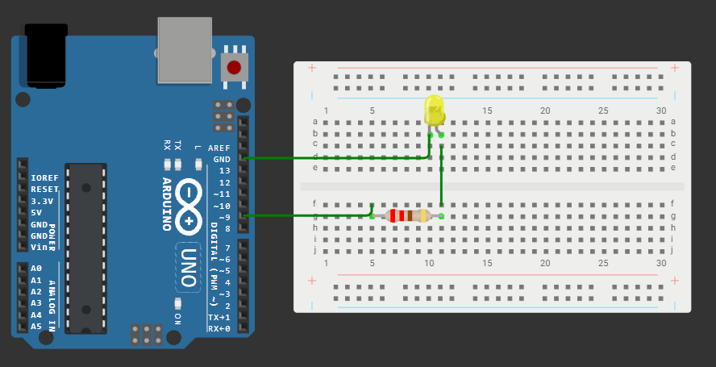

# Занятие 4. Широтно-импульсная модуляция

**Цель занятия:** понять, как микроконтроллер, умеющий выдавать только 0 и 5 В, управляет яркостью, громкостью и мощностью; научиться пользоваться `analogWrite()` и понимать его ограничения.

**Что понадобится:** Arduino UNO, макетная плата, светодиоды, RGB-модуль, резисторы 220 Ом, кнопки.

---

## 1. Задача: аналоговый выход там, где его нет

У ATmega328P **нет цифро-аналогового преобразователя**. Вывод может быть подключён либо к 5 В, либо к земле - промежуточных значений не существует. Тем не менее плавно менять яркость светодиода, скорость двигателя или громкость звука нужно постоянно.

Приём, который это решает, - **широтно-импульсная модуляция** (ШИМ, англ. PWM, Pulse Width Modulation). Вместо промежуточного напряжения вывод очень быстро переключается между 0 и 5 В, а меняется **доля времени**, которую он проводит во включённом состоянии.

Представьте вентилятор, работающий на полной мощности. Если включать его на секунду и на секунду выключать, он будет крутиться примерно вдвое медленнее - за счёт инерции ротора. Если делать это быстро, колебания вообще перестанут быть заметны, и останется только средняя мощность.

Со светодиодом инерции нет - зато есть инерция зрения: при частоте переключения выше ~100 Гц глаз воспринимает не мигание, а изменение яркости.

---

## 2. Параметры ШИМ-сигнала

```tikz Параметры ШИМ-сигнала: период, длительность импульса, среднее напряжение
\begin{tikzpicture}[x=1cm,y=1cm]
  \node[note, anchor=east] at (-0.15,1.7) {5 В};
  \node[note, anchor=east] at (-0.15,0) {0 В};
  \draw[muted!35, densely dotted] (0,1.7) -- (8.2,1.7);
  \draw[muted!35, densely dotted] (0,0) -- (8.2,0);
  \wave[draw=sig]{0}{0}{0.45}{1.7}{0,1,1,0,0,0,1,1,0,0,0,1,1,0,0,0,1,1}
  \draw[muted!55, densely dashed] (0.45,1.7) -- (0.45,3.35);
  \draw[muted!55, densely dashed] (1.35,1.7) -- (1.35,2.35);
  \draw[muted!55, densely dashed] (2.70,1.7) -- (2.70,3.35);
  \dimline{0.45}{1.35}{2.15}{$t_{\text{имп}}$}
  \dimline{0.45}{2.70}{3.05}{период $T$}
  \draw[acc, thick, densely dashed] (0,0.57) -- (7.9,0.57);
  \node[note, text=acc, anchor=west] at (7.95,0.57) {$U_{\text{ср}}$};
  \node[note, anchor=north, align=center] at (4.1,-0.75)
    {коэффициент заполнения $D = t_{\text{имп}}/T$, среднее напряжение $U_{\text{ср}} = U_{\text{пит}} \cdot D$};
\end{tikzpicture}
```

```tikz Коэффициент заполнения: одна частота, разное среднее напряжение
\begin{tikzpicture}[x=0.75cm,y=0.55cm]
  \foreach \row/\duty/\label in {0/1/25\%, 1/2/50\%, 2/3/75\%} {
    \begin{scope}[yshift=\row*-2.6cm]
      \draw[->] (-0.3,0) -- (12.7,0);
      \draw[->] (0,-0.3) -- (0,3.3) node[above,font=\scriptsize] {$U$};
      \node[font=\scriptsize,muted,left] at (-0.4,2.4) {5 В};
      \node[font=\scriptsize,muted,left] at (-0.4,0) {0};
      % четыре периода по 4 деления
      \foreach \p in {0,4,8} {
        \draw[sig,very thick]
          (\p,0) -- (\p,2.4) -- (\p+\duty,2.4) -- (\p+\duty,0) -- (\p+4,0);
      }
      \draw[sig,very thick] (12,0) -- (12,2.4);
      % среднее напряжение
      \draw[acc,thick,dashed] (0,{2.4*\duty/4}) -- (12.4,{2.4*\duty/4})
            node[right,font=\scriptsize,acc] {$U_{ср}$};
      \node[font=\small,anchor=west] at (13.3,1.6) {\label};
      % период и импульс
      \ifnum\row=0
        \draw[<->,muted] (0,-0.75) -- (4,-0.75)
              node[midway,below,font=\scriptsize,muted] {период $T$};
        \draw[<->,ok] (0,2.9) -- (\duty,2.9)
              node[midway,above,font=\scriptsize,ok] {$t_{имп}$};
      \fi
    \end{scope}
  }
\end{tikzpicture}
```

$$D = \frac{t_{имп}}{T} \cdot 100\ \%, \qquad U_{ср} = U_{пит} \cdot D$$

| Параметр | Определение | На Arduino UNO |
| --- | --- | --- |
| **Период** `T` | Длительность одного полного цикла | ~2 мс или ~1 мс, зависит от вывода |
| **Частота** `f = 1/T` | Число циклов в секунду | 490 Гц (D3, D9, D10, D11) или 980 Гц (D5, D6) |
| **Длительность импульса** `t` | Время во включённом состоянии | - |
| **Коэффициент заполнения** (скважность в обиходном смысле) `D = t/T` | Доля включённого состояния, 0...100 % | Задаётся значением 0-255 |
| **Среднее напряжение** `Uср = D * Uпит` | То, что "видит" инерционная нагрузка | 0...5 В |

Строго говоря, **скважность** - это величина, обратная коэффициенту заполнения (`T/t`), но в обиходе и в русскоязычной документации Arduino этим словом часто называют именно коэффициент заполнения. В отчётах используйте однозначное "коэффициент заполнения".

Разные частоты у разных выводов объясняются тем, что за ШИМ отвечают **три разных таймера**, и Timer0 (выводы D5, D6) настроен ядром Arduino иначе, чем Timer1 и Timer2. Подробно - на [занятии 9](../09-timers/note.md).

---

## 3. Функция `analogWrite()`

```cpp
analogWrite(pin, value);   // value: 0...255
```

- `0` - вывод постоянно в `LOW`, среднее напряжение 0 В;
- `255` - вывод постоянно в `HIGH`, среднее напряжение 5 В;
- `128` - примерно половина времени включён, среднее около 2,5 В.

**ШИМ доступен только на шести выводах**, помеченных на плате тильдой `~`: **D3, D5, D6, D9, D10, D11**. Вызов `analogWrite()` на любом другом выводе не создаст ШИМ: при значении менее 128 вывод просто установится в `LOW`, при 128 и выше - в `HIGH`.

Разрешение - 8 бит, то есть 256 градаций. Этого достаточно для светодиода, но заметно мало для точного управления мощностью; на 16-битном Timer1 можно получить и больше ([занятие 9](../09-timers/note.md)).

Важная особенность: после вызова `analogWrite()` **сигнал формируется аппаратно** - таймер продолжает выдавать импульсы сам, без участия процессора, пока вы не вызовете `analogWrite()` с другим значением или `digitalWrite()`/`digitalRead()` на том же выводе. Программа при этом свободна для других дел.

### Что `analogWrite()` не умеет

- **Не даёт настоящего аналогового напряжения.** Мультиметр покажет усреднённое значение, но осциллограф - прямоугольные импульсы. Для устройств, которым нужно именно постоянное напряжение, ставят RC-фильтр (например, 10 кОм + 10 мкФ) или внешний ЦАП.
- **Не меняет частоту.** Частота задана настройкой таймера; `analogWrite()` управляет только заполнением.
- **Не работает с обычным сервоприводом.** Сервоприводу нужны импульсы 0,5-2,5 мс с периодом 20 мс (50 Гц) - это другая задача, для неё есть библиотека `Servo` ([занятие 15](../15-actuators/note.md)).

---

## 4. Диммирование светодиода

### Схема



Светодиод через резистор 220 Ом подключён к выводу **D9** (один из ШИМ-выводов), катод - на GND.

### Программа

```cpp
const int LED = 9;
int brightness = 0;
int fadeAmount = 5;

void setup() {
    pinMode(LED, OUTPUT);
}

void loop() {
    analogWrite(LED, brightness);

    brightness += fadeAmount;
    if (brightness <= 0 || brightness >= 255) {
        fadeAmount = -fadeAmount;      // дошли до края - меняем направление
    }

    delay(30);
}
```

### Почему яркость меняется неравномерно

Запустив эту программу, вы заметите: в начале диапазона яркость меняется резко, а ближе к максимуму почти незаметно. Причина в том, что **человеческое восприятие яркости логарифмическое** (закон Вебера - Фехнера): чтобы яркость казалась вдвое больше, физической мощности нужно в несколько раз больше.

Линейное изменение заполнения даёт нелинейное ощущение. Исправляется применением кривой коррекции:

```cpp
// приближение гамма-кривой: воспринимаемая яркость меняется равномерно
uint8_t gammaCorrect(uint8_t value) {
    return (uint16_t)value * value / 255;
}

analogWrite(LED, gammaCorrect(brightness));
```

Для точной коррекции таблицу из 256 значений заранее рассчитывают и кладут во Flash через `PROGMEM`.

---

## 5. RGB-светодиод

Модуль KY-023 из набора содержит три кристалла - красный, зелёный и синий - в общем корпусе. Смешивая их яркости, можно получить любой цвет.

Подключение: выводы R, G, B - на три **ШИМ-вывода** (например, D9, D10, D11), общий вывод - на GND (модуль с общим катодом) или на 5 В (с общим анодом).

```cpp
const int RED = 9, GREEN = 10, BLUE = 11;

void setColor(uint8_t r, uint8_t g, uint8_t b) {
    analogWrite(RED, r);
    analogWrite(GREEN, g);
    analogWrite(BLUE, b);
}

void setup() {
    pinMode(RED, OUTPUT);
    pinMode(GREEN, OUTPUT);
    pinMode(BLUE, OUTPUT);
}

void loop() {
    setColor(255, 0, 0);    delay(500);   // красный
    setColor(0, 255, 0);    delay(500);   // зелёный
    setColor(0, 0, 255);    delay(500);   // синий
    setColor(255, 255, 0);  delay(500);   // жёлтый
    setColor(255, 0, 255);  delay(500);   // пурпурный
    setColor(255, 255, 255);delay(500);   // белый
}
```

Если модуль **с общим анодом**, логика инвертируется: `0` даёт максимальную яркость. Универсальное решение - константа и одна строка:

```cpp
const bool COMMON_ANODE = true;

void setColor(uint8_t r, uint8_t g, uint8_t b) {
    if (COMMON_ANODE) { r = 255 - r; g = 255 - g; b = 255 - b; }
    analogWrite(RED, r);
    analogWrite(GREEN, g);
    analogWrite(BLUE, b);
}
```

### Плавный переход между цветами

Чтобы цвет менялся непрерывно, каналы изменяют не по очереди, а согласованно:

```cpp
// переход от красного к жёлтому: красный держим, зелёный наращиваем
for (int v = 0; v <= 255; v++) {
    setColor(255, v, 0);
    delay(7);
}
// от жёлтого к зелёному: зелёный держим, красный убираем
for (int v = 255; v >= 0; v--) {
    setColor(v, 255, 0);
    delay(7);
}
```

Обход всего круга оттенков удобнее описывать в модели **HSV**, переводя её в RGB перед выводом - это хорошая дополнительная задача.

---

## 6. Управление мощной нагрузкой

Вывод микроконтроллера отдаёт максимум 20 мА в рабочем режиме. Ни двигатель, ни лампа, ни светодиодная лента от него работать не будут. ШИМ-сигнал при этом остаётся тем же - меняется только силовой ключ между микроконтроллером и нагрузкой.

| Способ | Ток | Особенности |
| --- | --- | --- |
| **Биполярный транзистор** | сотни мА | Требует резистор в базу; на переходе теряется ~0,7 В |
| **Полевой транзистор (MOSFET)** | единицы-десятки А | Управляется напряжением, почти без тока; для 5 В нужен logic-level |
| **Электромеханическое реле** | десятки А | Гальваническая развязка, но **не подходит для ШИМ** - механические контакты не переключаются сотни раз в секунду |
| **Твердотельное реле** | единицы-десятки А | Развязка без механики, дорого |
| **Оптопара** | мА | Развязка сигнальных цепей, не силовых |

Для индуктивной нагрузки (двигатель, обмотка реле) обязателен **обратный диод** параллельно нагрузке: при выключении ключа индуктивность создаёт выброс напряжения, способный пробить транзистор.

В нашем наборе силовым элементом является [релейный модуль](../../Hardware/README.md#8-исполнительные-устройства) - на нём есть и оптопара, и защитный диод. Но помните: реле управляет нагрузкой **по принципу "включено/выключено"**, регулировать мощность им нельзя.

---

## 7. ШИМ и таймеры: чем придётся пожертвовать

| Таймер | ШИМ-выводы | Что ещё использует |
| --- | --- | --- |
| Timer0 | D5, D6 | `millis()`, `micros()`, `delay()` |
| Timer1 | D9, D10 | Библиотека `Servo` |
| Timer2 | D3, D11 | Функция `tone()` |

Практические следствия:

- Подключили сервопривод - ШИМ на D9 и D10 перестал работать.
- Играет звук через `tone()` - ШИМ на D3 и D11 недоступен.
- Изменили настройки Timer0, чтобы поменять частоту ШИМ на D5/D6, - сломали `millis()` и `delay()` во всей программе.

Планируя схему, распределяйте ШИМ-выводы заранее: например, RGB-светодиод на D9/D10/D11 конфликтует и с сервоприводом, и со звуком одновременно. Разумнее занять D3, D5, D6.

---

## Контрольные вопросы

1. Почему `analogWrite()` не создаёт настоящее аналоговое напряжение? Что покажет осциллограф на выводе при `analogWrite(pin, 128)`?
2. Какие выводы UNO поддерживают ШИМ и почему у них разная частота?
3. Что произойдёт при вызове `analogWrite(7, 200)`?
4. Почему линейное изменение значения `analogWrite` воспринимается глазом нелинейно и как это исправить?
5. Как определить, RGB-модуль с общим катодом или с общим анодом, не глядя в документацию?
6. Почему электромеханическое реле нельзя использовать для ШИМ-регулирования?
7. Зачем нужен обратный диод при коммутации двигателя?
8. Вы подключили сервопривод и обнаружили, что светодиод на D10 перестал плавно гаснуть. В чём причина?

## Задание

Задачи занятия - в [task.md](task.md).
