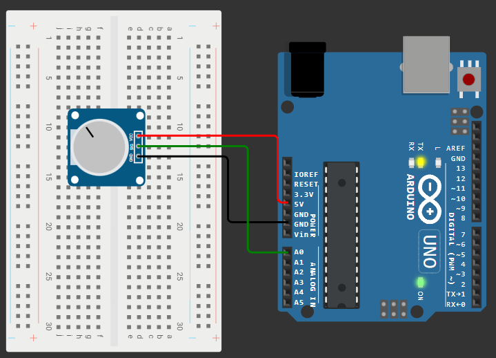
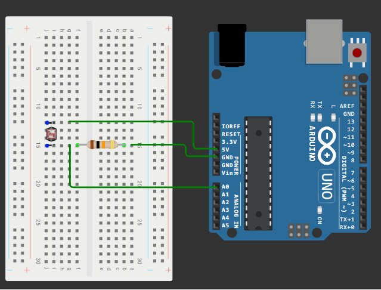
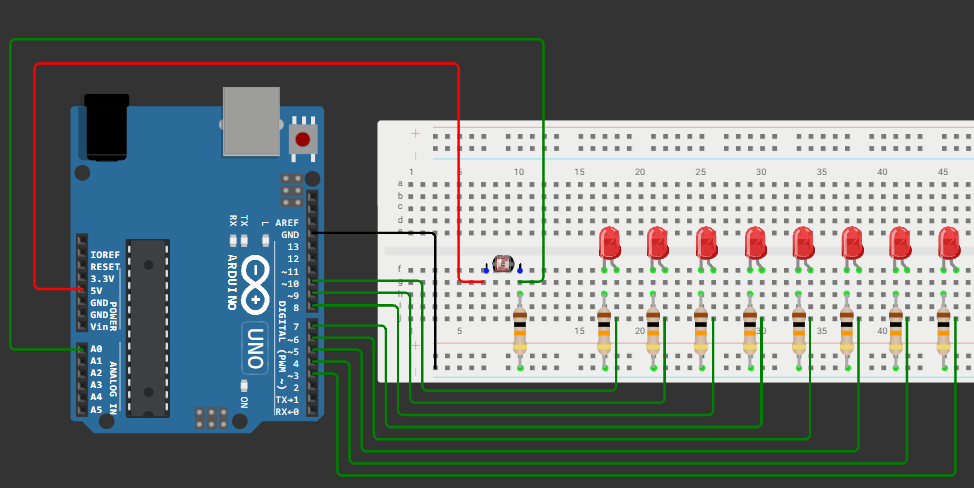
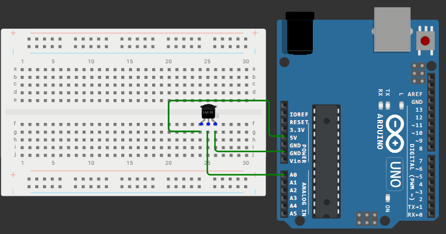
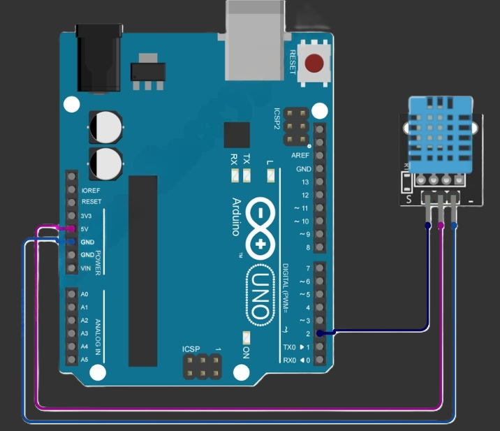
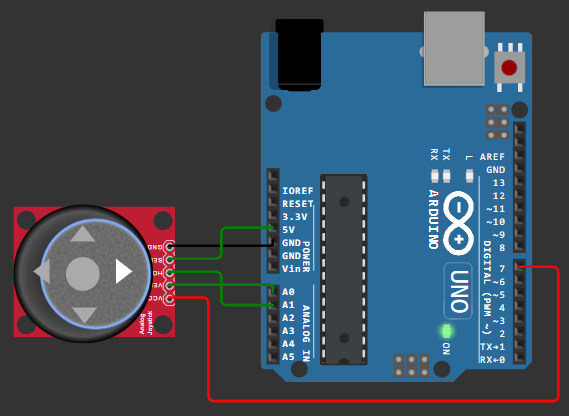

# Занятие 5. АЦП и аналоговые датчики

**Цель занятия:** разобраться, как микроконтроллер измеряет напряжение, научиться подключать резистивные и цифровые датчики, оценивать погрешность измерений и фильтровать шум.

**Что понадобится:** Arduino UNO, макетная плата, потенциометр, фоторезисторы, резисторы 10 кОм, LM35, DHT-11, джойстик KY-023, датчик уровня воды, светодиоды.

---

## 1. Аналого-цифровое преобразование

**АЦП** (аналого-цифровой преобразователь, ADC) превращает непрерывное напряжение в целое число. В ATmega328P используется АЦП **последовательного приближения** (SAR): он за несколько тактов "угадывает" значение методом половинного деления, сравнивая входное напряжение с выходом внутреннего ЦАП.

### Ключевые параметры

| Параметр | Значение для ATmega328P |
| --- | --- |
| Разрядность | 10 бит -> 1024 уровня квантования (0...1023) |
| Опорное напряжение (по умолчанию) | Напряжение питания, ~5 В |
| Количество каналов | 6 (A0-A5), через внутренний коммутатор |
| Время одного преобразования | ~104 мкс при настройках Arduino |
| Максимальная частота выборки | ~9600 измерений в секунду |
| Входное сопротивление источника | рекомендуется не более 10 кОм |

**Шаг квантования** - минимальная различимая разница напряжений:

$$\Delta U = \frac{U_{ref}}{2^N} = \frac{5}{1024} \approx 4{,}88 \text{ мВ}$$

Обратное преобразование отсчёта в напряжение:

```cpp
float voltage = analogRead(A0) * (5.0 / 1023.0);
```

> Делить на 1023 или на 1024 - предмет давнего спора. Значение 1023 соответствует напряжению, чуть меньшему опорного; строго говоря, АЦП выдаёт код `round(1024 * Uin / Uref)`, ограниченный сверху значением 1023. Для учебных задач разница в 0,1 % несущественна.

```tikz Квантование аналогового сигнала: 10-битный АЦП, опорное напряжение 5 В
\begin{tikzpicture}[x=1.9cm,y=1.05cm]
  % сетка уровней квантования
  \foreach \y in {0,1,2,3,4} {
    \draw[muted!40,very thin] (0,\y) -- (6.3,\y);
    \node[muted,font=\scriptsize,left] at (-0.05,\y) {\y};
  }
  \draw[->] (0,0) -- (6.5,0) node[below right,font=\small] {$t$};
  \draw[->] (0,-0.2) -- (0,4.7) node[above,font=\small] {код АЦП};

  % исходный непрерывный сигнал
  \draw[sig,thick,domain=0:6,samples=200]
        plot (\x,{2.1+1.75*sin(\x r*0.9)});
  \node[sig,font=\small] at (5.1,4.35) {входной сигнал};

  % ступенчатая аппроксимация: отсчёты с шагом 0.5
  \draw[acc,thick]
    (0,2) -- (0.5,2) -- (0.5,3) -- (1,3) -- (1,4) -- (1.5,4) -- (1.5,4)
    -- (2,4) -- (2,3) -- (2.5,3) -- (2.5,2) -- (3,2) -- (3,1) -- (3.5,1)
    -- (3.5,0) -- (4,0) -- (4,0) -- (4.5,0) -- (4.5,1) -- (5,1)
    -- (5,2) -- (5.5,2) -- (5.5,3) -- (6,3);
  \node[acc,font=\small,align=left] at (1.35,0.55) {результат\\преобразования};

  % моменты выборки
  \foreach \x in {0,0.5,...,6} {
    \draw[muted,dotted] (\x,0) -- (\x,4.6);
  }
  \draw[<->,muted] (0,-0.55) -- (0.5,-0.55)
        node[midway,below,font=\scriptsize,muted] {$T_{s}$};

  % шаг квантования
  \draw[<->,ok,thick] (6.15,2) -- (6.15,3)
        node[midway,right,font=\scriptsize,ok,align=left] {шаг\\4,88 мВ};
\end{tikzpicture}
```

### Каналы и коммутатор

Шесть аналоговых входов обслуживает **один** АЦП с мультиплексором на входе. Измерения идут по очереди, а не одновременно. После переключения канала внутренней ёмкости устройства выборки-хранения нужно время на перезаряд - поэтому при быстром переключении между каналами первое измерение может "помнить" предыдущий канал.

Практический приём: при чтении разных каналов подряд делайте **два измерения**, а используйте только второе:

```cpp
analogRead(A0);              // первое измерение отбрасываем
int value = analogRead(A0);  // второе - рабочее
```

### Опорное напряжение

По умолчанию опорным служит напряжение питания. Это удобно, но означает, что **точность измерений зависит от качества питания**: при работе от USB напряжение может проседать до 4,7 В, и все измерения "поплывут" на 6 %.

```cpp
analogReference(DEFAULT);   // Uref = напряжение питания (~5 В)
analogReference(INTERNAL);  // Uref = внутренний источник 1,1 В
analogReference(EXTERNAL);  // Uref = напряжение на выводе AREF
```

Внутренний источник 1,1 В стабилен, но ограничивает диапазон измерения. Зато шаг квантования становится 1,1/1024 ~ 1,07 мВ - почти впятеро точнее. Для LM35 это принципиально: разрешение по температуре улучшается с 0,49 до 0,1 degC.

> После смены опорного напряжения первые несколько измерений будут неверными - источнику нужно время на установление. Отбросьте два-три отсчёта.

### Функции преобразования диапазонов

```cpp
int brightness = map(analogRead(A0), 0, 1023, 0, 255);
int safe = constrain(brightness, 0, 255);
```

`map()` - линейное преобразование диапазона в диапазон. Важно помнить два её свойства: она работает с **целыми числами** (промежуточные дроби отбрасываются) и **не ограничивает** результат - если входное значение выйдет за указанные границы, выйдет и результат. Поэтому `map()` почти всегда используют в паре с `constrain()`.

---

## 2. Потенциометр - эталонный аналоговый вход



Потенциометр включается **делителем напряжения**: крайние выводы на 5 В и GND, средний - на аналоговый вход. Поворот ручки меняет соотношение плеч делителя и, следовательно, напряжение на среднем выводе от 0 до 5 В.

```cpp
void setup() {
    Serial.begin(9600);
}

void loop() {
    int raw = analogRead(A0);
    Serial.print(F("raw="));
    Serial.print(raw);
    Serial.print(F("  U="));
    Serial.println(raw * 5.0 / 1023.0, 3);
    delay(200);
}
```

Потенциометр удобен как **источник заведомо известного сигнала**: с ним отлаживают фильтры, пороги и преобразования, прежде чем подключать настоящий датчик.

> Аналоговым входам не нужен `pinMode()`. Вызов `pinMode(A0, INPUT)` безвреден, но избыточен - если только вы не используете A0 как цифровой вывод.

---

## 3. Резистивные датчики и делитель напряжения

Фоторезистор, термистор, тензодатчик, датчик уровня воды - все они меняют **сопротивление**, а АЦП измеряет **напряжение**. Мостиком между ними служит делитель:

```tikz Резистивный датчик в плече делителя: изменение сопротивления становится изменением напряжения
\usepackage{circuitikz}
\begin{document}
\begin{circuitikz}[american, scale=0.95, transform shape]
  \draw (0,3.6) node[left]{$+5$ В} to[short,*-] (2.4,3.6);
  \draw (2.4,3.6) to[R, l=\mbox{датчик}] (2.4,2.0);
  \draw (2.4,2.0) to[short,-o] (4.8,2.0) node[right]{A0};
  \draw (2.4,2.0) to[R, l=\mbox{$R$ постоянный}] (2.4,0.4);
  \draw (2.4,0.4) to[short,-*] (0,0.4) node[left]{GND};
\end{circuitikz}
\end{document}
```

Напряжение в средней точке:

$$U_{\text{вых}} = U_{\text{пит}} \cdot \frac{R_2}{R_1 + R_2}$$

Выбор постоянного резистора определяет, в какой части диапазона будет работать датчик. Правило: берите резистор, **близкий по номиналу к сопротивлению датчика в середине интересующего вас диапазона**. Для GL5516 в комнатном освещении это порядка 10 кОм - отсюда и номинал из набора.

### Фоторезистор



```cpp
const int LDR = A0;

void setup() {
    Serial.begin(9600);
}

void loop() {
    Serial.println(analogRead(LDR));
    delay(100);
}
```

Фоторезистор GL5516 не даёт абсолютных единиц освещённости: показания зависят от экземпляра, напряжения питания и номинала второго резистора. Поэтому его **калибруют**.

### Калибровка

```cpp
int minValue = 1023, maxValue = 0;

void calibrate(unsigned long durationMs) {
    unsigned long start = millis();
    while (millis() - start < durationMs) {
        int v = analogRead(LDR);
        if (v < minValue) minValue = v;
        if (v > maxValue) maxValue = v;
    }
}

void setup() {
    Serial.begin(9600);
    Serial.println(F("Калибровка 5 с: закройте и осветите датчик"));
    calibrate(5000);
    Serial.print(F("min=")); Serial.print(minValue);
    Serial.print(F(" max=")); Serial.println(maxValue);
}

void loop() {
    int percent = constrain(map(analogRead(LDR), minValue, maxValue, 0, 100), 0, 100);
    Serial.println(percent);
    delay(200);
}
```

Границы калибровки естественно сохранить в EEPROM ([занятие 17](../17-memory/note.md)), чтобы не повторять процедуру при каждом включении.

### Шкала освещённости на светодиодах



```cpp
const uint8_t LEDS[] = {3, 4, 5, 6, 7, 8, 9, 10};
const uint8_t LED_COUNT = 8;
const int LDR = A0;
const int MIN_LIGHT = 200, MAX_LIGHT = 900;

void setup() {
    for (uint8_t i = 0; i < LED_COUNT; i++) pinMode(LEDS[i], OUTPUT);
}

void loop() {
    int level = constrain(map(analogRead(LDR), MIN_LIGHT, MAX_LIGHT, 0, LED_COUNT), 0, LED_COUNT);
    for (uint8_t i = 0; i < LED_COUNT; i++) {
        digitalWrite(LEDS[i], i < level ? HIGH : LOW);
    }
    delay(100);
}
```

Обратите внимание на условие `i < level`: горят светодиоды с номерами меньше уровня, то есть шкала заполняется снизу.

### Датчик уровня воды

Гребёнка открытых дорожек: чем глубже погружение, тем меньше сопротивление между дорожками, тем выше напряжение на аналоговом выходе. Подключение: `+` на 5 В, `-` на GND, `S` на аналоговый вход.

Постоянно поданное питание вызывает **электролиз** - дорожки разрушаются за считанные дни. Правильный приём - питать датчик с цифрового вывода и включать только на время измерения:

```cpp
const int WATER_POWER = 7;
const int WATER_SIGNAL = A1;

int readWaterLevel() {
    digitalWrite(WATER_POWER, HIGH);
    delay(10);                        // даём датчику установиться
    analogRead(WATER_SIGNAL);         // первое измерение отбрасываем
    int value = analogRead(WATER_SIGNAL);
    digitalWrite(WATER_POWER, LOW);
    return value;
}
```

Заодно это резко снижает среднее потребление - приём, типичный для устройств с батарейным питанием.

---

## 4. Датчик температуры LM35



LM35 - аналоговый датчик с линейной характеристикой: **10 мВ на каждый градус Цельсия**, 0 В при 0 degC. Никакой калибровки и никаких коэффициентов, в отличие от термистора.

```cpp
void setup() {
    Serial.begin(9600);
}

void loop() {
    int raw = analogRead(A0);
    float voltage = raw * 5.0 / 1023.0;
    float celsius = voltage * 100.0;     // 10 мВ на градус -> умножаем на 100
    Serial.println(celsius, 1);
    delay(1000);
}
```

### Оценка погрешности

Это упражнение стоит проделать для любого датчика:

- **Шаг квантования** при $U_{ref}$ = 5 В: 4,88 мВ = **0,49 degC**. То есть последняя цифра после запятой в выводе выше - фикция.
- **Собственная погрешность LM35**: +/-0,5 degC при комнатной температуре.
- **Нестабильность питания**: если вместо 5 В на плате 4,8 В, все показания завышаются на 4 %.

Вывод: печатать "23,47 degC" бессмысленно. Реальная точность - около +/-1 degC.

Улучшить разрешение можно переключением опорного напряжения:

```cpp
void setup() {
    analogReference(INTERNAL);        // Uref = 1,1 В
    Serial.begin(9600);
    for (int i = 0; i < 5; i++) analogRead(A0);   // даём источнику установиться
}

void loop() {
    int raw = analogRead(A0);
    float celsius = raw * 1.1 / 1023.0 * 100.0;   // шаг ~ 0,107 degC
    Serial.println(celsius, 1);
    delay(1000);
}
```

Диапазон измерения при этом ограничивается 110 degC - для комнатных условий более чем достаточно.

---

## 5. Цифровой датчик DHT-11



DHT-11 измеряет температуру и влажность и передаёт **уже готовые цифровые значения** по одному проводу собственным протоколом (это не 1-Wire от Dallas, хотя провод тоже один).

Аналогового сигнала здесь нет вообще: АЦП находится внутри датчика. Микроконтроллеру остаётся правильно сформировать запрос и разобрать 40 бит ответа с точностью до микросекунд - эту работу берёт на себя библиотека.

```cpp
#include <DHT.h>

#define DHTPIN  2
#define DHTTYPE DHT11

DHT dht(DHTPIN, DHTTYPE);

void setup() {
    Serial.begin(9600);
    dht.begin();
}

void loop() {
    float humidity = dht.readHumidity();
    float temperature = dht.readTemperature();

    if (isnan(humidity) || isnan(temperature)) {
        Serial.println(F("Ошибка чтения DHT11"));
        return;                         // выходим из loop, следующая попытка через 2 с
    }

    Serial.print(F("Влажность: "));
    Serial.print(humidity);
    Serial.print(F(" %\tТемпература: "));
    Serial.print(temperature);
    Serial.println(F(" C"));

    delay(2000);
}
```

Что важно знать про DHT-11:

- **опрашивать чаще одного раза в секунду нельзя** (на практике берут 2 с) - датчик просто не успевает измерить;
- разрешение - 1 degC и 1 %, дробная часть в выводе всегда нулевая;
- точность - +/-2 degC и +/-5 %, диапазон 0...50 degC и 20...90 %;
- чтение **блокирующее**: библиотека удерживает процессор около 20 мс, отсчитывая длительности импульсов. Для программ с жёсткими таймингами это существенно.
- проверка `isnan()` обязательна: сбой чтения происходит регулярно, и без проверки в расчёты попадёт мусор.

### Аналоговый или цифровой датчик?

| | Аналоговый (LM35) | Цифровой (DHT-11) |
| --- | --- | --- |
| Что передаёт | Напряжение | Готовое число |
| Помехозащищённость | Низкая: наводки на провод искажают результат | Высокая: есть контрольная сумма |
| Длина провода | Десятки сантиметров | До нескольких метров |
| Занимает | Аналоговый вход | Цифровой вывод |
| Скорость | Микросекунды | Десятки миллисекунд |
| Обработка | Своя формула | Библиотека |

---

## 6. Джойстик KY-023



Джойстик - это два потенциометра (по одному на ось) и тактовая кнопка под ручкой.

```cpp
const int AXIS_X = A1;
const int AXIS_Y = A0;
const int BUTTON = 7;

void setup() {
    pinMode(BUTTON, INPUT_PULLUP);
    Serial.begin(9600);
}

void loop() {
    int x = analogRead(AXIS_X);
    int y = analogRead(AXIS_Y);
    bool pressed = (digitalRead(BUTTON) == LOW);

    Serial.print(F("X=")); Serial.print(x);
    Serial.print(F(" Y=")); Serial.print(y);
    Serial.print(F(" SW=")); Serial.println(pressed);
    delay(200);
}
```

### Мёртвая зона

В отпущенном состоянии джойстик даёт значение около 512, но у каждого экземпляра оно своё - 498, 517, 505. Без обработки программа будет считать, что джойстик всё время слегка отклонён.

```cpp
int centerX = 512;                    // измеряется при старте
const int DEADZONE = 40;

void setup() {
    delay(100);
    analogRead(AXIS_X);
    centerX = analogRead(AXIS_X);     // запоминаем реальный центр
}

int readAxis(int pin, int center) {
    int raw = analogRead(pin);
    int delta = raw - center;
    if (abs(delta) < DEADZONE) return 0;         // в мёртвой зоне - считаем, что ручка в центре
    return constrain(map(delta, -center, 1023 - center, -100, 100), -100, 100);
}
```

Функция возвращает -100...+100, где 0 означает нейтральное положение. С таким интерфейсом джойстик одинаково удобно использовать и для меню, и для управления игрой.

---

## 7. Шум и фильтрация

Подключите потенциометр, не трогайте ручку и выведите значения в Serial Plotter. Показания не будут стоять на месте: они "дышат" на несколько единиц. Источники шума - нестабильность питания, наводки на провода, собственный шум АЦП, плохой контакт на макетной плате.

Для индикатора это неважно, а вот для порогового срабатывания критично: значение, колеблющееся около порога, заставит светодиод мигать.

### Среднее арифметическое

Самый простой фильтр: измерить N раз и усреднить.

```cpp
int readAveraged(int pin, uint8_t samples) {
    long sum = 0;
    for (uint8_t i = 0; i < samples; i++) {
        sum += analogRead(pin);
    }
    return sum / samples;
}
```

Шум уменьшается пропорционально $\sqrt{N}$. Платой становится время: 30 измерений по 104 мкс - это 3 мс блокировки.

> Тип `long` для суммы обязателен: 30 отсчётов по 1023 дают 30 690, что не помещается в `int` (максимум 32 767 - впритык, а при 40 отсчётах уже переполнение с отрицательным результатом).

### Бегущее среднее

Не требует массива и не блокирует программу:

```cpp
float filtered = 0;
const float ALPHA = 0.1;       // 0...1: меньше - сильнее сглаживание, но медленнее реакция

void loop() {
    int raw = analogRead(A0);
    filtered += (raw - filtered) * ALPHA;

    Serial.print(raw);
    Serial.print(' ');
    Serial.println(filtered);   // две кривые в Serial Plotter
    delay(20);
}
```

Это цифровой аналог RC-фильтра нижних частот. Всё состояние фильтра - одна переменная `float`. 

Компромисс всегда один и тот же: **чем сильнее сглаживание, тем больше задержка реакции**. Значение `ALPHA = 0.1` означает, что до нового уровня фильтр дойдёт примерно за 20-30 измерений.

### Медианный фильтр

Усреднение плохо справляется с **выбросами**: один случайный отсчёт 1023 среди значений около 500 заметно сдвинет среднее. Медиана к выбросам нечувствительна.

```cpp
int readMedian3(int pin) {
    int a = analogRead(pin);
    int b = analogRead(pin);
    int c = analogRead(pin);
    // медиана трёх значений без сортировки
    return max(min(a, b), min(max(a, b), c));
}
```

Медиана из трёх значений - дёшево и эффективно против одиночных выбросов; её часто ставят перед бегущим средним.

### Гистерезис

Отдельная проблема - дребезг **порога**. Если значение колеблется около 500, а порог тоже 500, светодиод будет мигать. Решение - два порога вместо одного:

```cpp
const int THRESHOLD_ON = 520;
const int THRESHOLD_OFF = 480;
bool state = false;

void loop() {
    int value = analogRead(A0);
    if (!state && value > THRESHOLD_ON)  state = true;    // включаем при 520
    if (state && value < THRESHOLD_OFF)  state = false;   // выключаем только при 480
    digitalWrite(LED, state);
}
```

Это тот же принцип, что и в триггере Шмитта, только реализованный программно. Гистерезис - обязательный элемент любого порогового срабатывания в реальной системе.

### Какой фильтр выбирать

| Ситуация | Фильтр |
| --- | --- |
| Мелкий равномерный шум | Бегущее среднее |
| Одиночные выбросы | Медиана из 3-5 значений |
| Одиночные выбросы плюс шум | Медиана, затем бегущее среднее |
| Дребезг вокруг порога | Гистерезис |
| Нужна максимальная точность разового измерения | Среднее из 16-32 отсчётов |

---

## 8. Модули KY: готовая обвязка и её цена

Всё, что разобрано выше, - датчики "россыпью": фоторезистор, который сам по себе ничего не измеряет, пока вы не соберёте делитель. Набор модулей KY устроен иначе: обвязка уже распаяна, и остаётся только подключить три-четыре провода.

Это удобно, но за удобство приходится платить пониманием: обвязка скрыта, и если результат странный - разобраться труднее. Поэтому важно понимать, что именно скрыто.

### Два выхода: A0 и D0

Большинство модулей KY с компаратором имеют **два** выхода, и это ключевое различие:

| Выход | Что даёт | Когда использовать |
| --- | --- | --- |
| **A0** (аналоговый) | Непрерывное значение, снятое с делителя | Когда нужна величина: измерить, отфильтровать, построить график |
| **D0** (цифровой) | `0` или `1` в зависимости от порога | Когда нужен факт: сработало или нет |

Порог для D0 задаётся **подстроечным резистором на плате** - механически, отвёрткой. Компаратор (обычно LM393) сравнивает напряжение с датчика с этим порогом.

**Практический вывод.** Выход D0 переносит принятие решения в аппаратуру, где вы не можете ни изменить порог программно, ни увидеть, насколько близко значение к границе, ни ввести гистерезис. Поэтому в задачах этого курса основным считается **выход A0**: порог задаётся в программе, хранится в EEPROM и настраивается через меню. D0 применяется там, где нужен именно быстрый дискретный сигнал - например, для запуска прерывания.

> **Проверьте цоколёвку.** Обозначения на модулях KY не унифицированы. У части трёхвыводных модулей средний вывод - питание, у части - сигнал. Перепутанное питание выводит модуль из строя. Смотрите на надписи, а не на аналогию с соседним модулем.

### Почвенный гигрометр FC-28

Датчик влажности почвы: два электрода измеряют проводимость грунта.

```cpp
const uint8_t SOIL_POWER = 7;   // питание датчика с цифрового вывода
const uint8_t SOIL_PIN   = A0;

uint16_t readSoil() {
    digitalWrite(SOIL_POWER, HIGH);
    delay(10);                        // время установления показаний
    uint16_t raw = analogRead(SOIL_PIN);
    digitalWrite(SOIL_POWER, LOW);
    return raw;
}
```

Здесь `delay(10)` допустим: он выполняется в момент измерения, редко, и в неблокирующей программе заменяется состоянием автомата.

Питание с цифрового вывода - не оптимизация, а **необходимость**. Под постоянным напряжением электроды разрушаются электролизом за недели: металл переходит в грунт. Датчик, включаемый на 10 мс раз в 10 минут, находится под напряжением сотые доли процента времени.

**Калибровка по двум точкам.** Абсолютных процентов датчик не даёт - показания зависят от типа грунта и глубины погружения. Поэтому запоминают два опорных значения:

```cpp
// снимаются один раз и сохраняются в EEPROM
uint16_t dryValue = 620;   // датчик в воздухе
uint16_t wetValue = 260;   // датчик в стакане воды

uint8_t soilPercent(uint16_t raw) {
    raw = constrain(raw, wetValue, dryValue);
    return map(raw, dryValue, wetValue, 0, 100);
}
```

Обратите внимание на порядок аргументов `map()`: у этого датчика **больше влажность - меньше напряжение**, поэтому диапазон "перевёрнут". Ошибка в направлении шкалы - самая частая при работе с FC-28.

### Дубликаты в наборе: зачем их три

В наборах по несколько датчиков одной величины, и это не ошибка комплектации:

| Величина | Модули | В чём разница |
| --- | --- | --- |
| Температура | KY-013, KY-028, KY-015, LM35 | Голый термистор; термистор с компаратором; цифровой DHT-11; аналоговый с линейной характеристикой |
| Звук | KY-037, KY-038 | Разная чувствительность микрофона и коэффициент усиления |
| Магнитное поле | KY-021, KY-025 (герконы), KY-024, KY-035 (Холл) | Факт наличия магнита против измерения величины и полярности поля |
| Свет | KY-018, фоторезистор GL5516 | Готовый модуль против сборки делителя вручную |

Сравнение таких пар - хорошее упражнение: подключите два датчика одной величины и посмотрите, насколько расходятся показания. Расхождение всегда есть, и вопрос "какому верить" решается не интуицией, а знанием характеристик.

### Датчик, требующий обработки: KY-039

Датчик пульса устроен просто - ИК-светодиод просвечивает палец, фототранзистор ловит прошедший свет. Но "в лоб" он не работает: полезный сигнал составляет единицы процентов от полного размаха, остальное - постоянная составляющая.

Порядок обработки:

1. Отсечь постоянную составляющую - вычесть медленное скользящее среднее.
2. Сгладить результат - убрать высокочастотный шум.
3. Найти пики с **гистерезисом**, иначе один удар даст несколько срабатываний.
4. Отбросить интервалы, физиологически невозможные (короче 300 мс).

Это упражнение на всё, что разобрано в разделе 7. Медицинских выводов по такому измерению делать нельзя - и это тоже часть урока: датчик может работать, а измерение при этом ничего не значить.

---

## Контрольные вопросы

1. Чему равен шаг квантования АЦП при опорном напряжении 5 В и 1,1 В? Как это влияет на точность измерения температуры датчиком LM35?
2. Почему нельзя одновременно измерить напряжение на A0 и A1?
3. Зачем при чтении нескольких каналов подряд отбрасывать первое измерение?
4. Как выбрать номинал постоянного резистора в делителе с фоторезистором?
5. Почему датчик уровня воды нельзя держать под постоянным напряжением?
6. В чём принципиальная разница между LM35 и DHT-11 с точки зрения микроконтроллера?
7. Что произойдёт, если `map()` передать значение вне указанного входного диапазона?
8. Программа переключает реле по порогу, и реле щёлкает несколько раз подряд. Назовите две причины и способ устранения каждой.
9. Почему в фильтре "среднее арифметическое" сумму нужно накапливать в `long`, а не в `int`?

## Задание

Задачи занятия - в [task.md](task.md).
