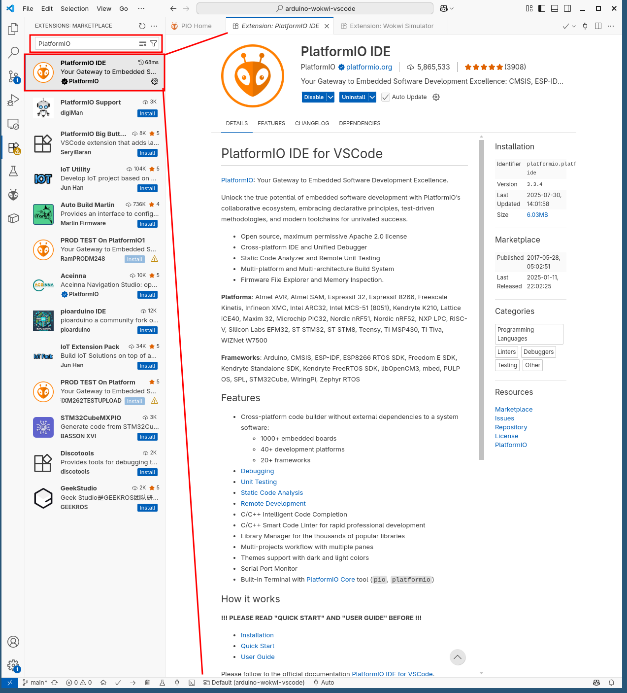
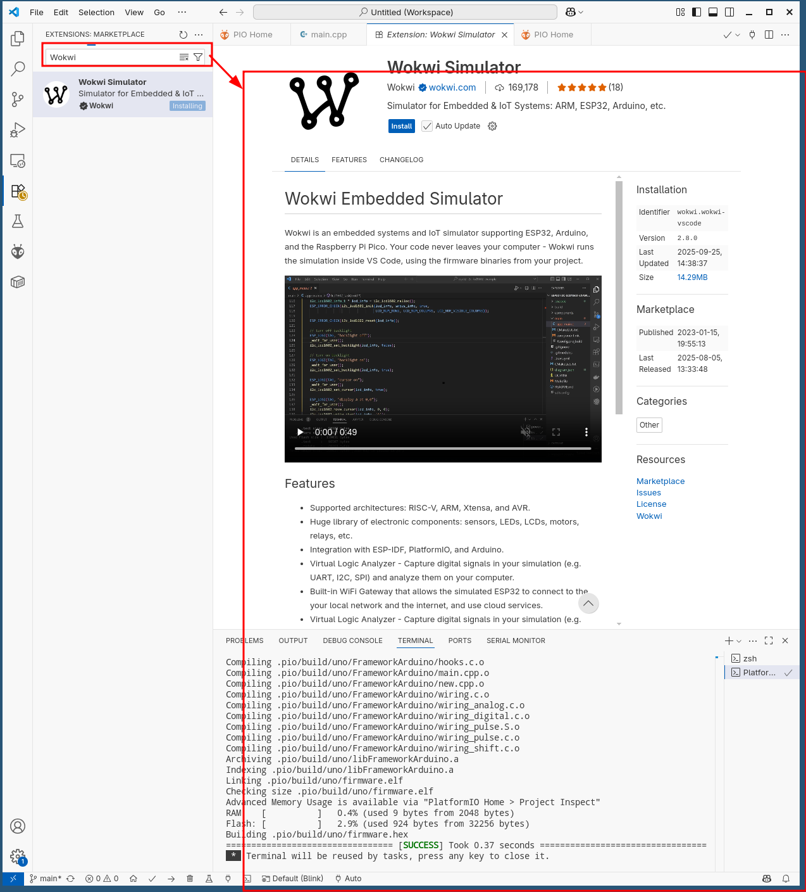
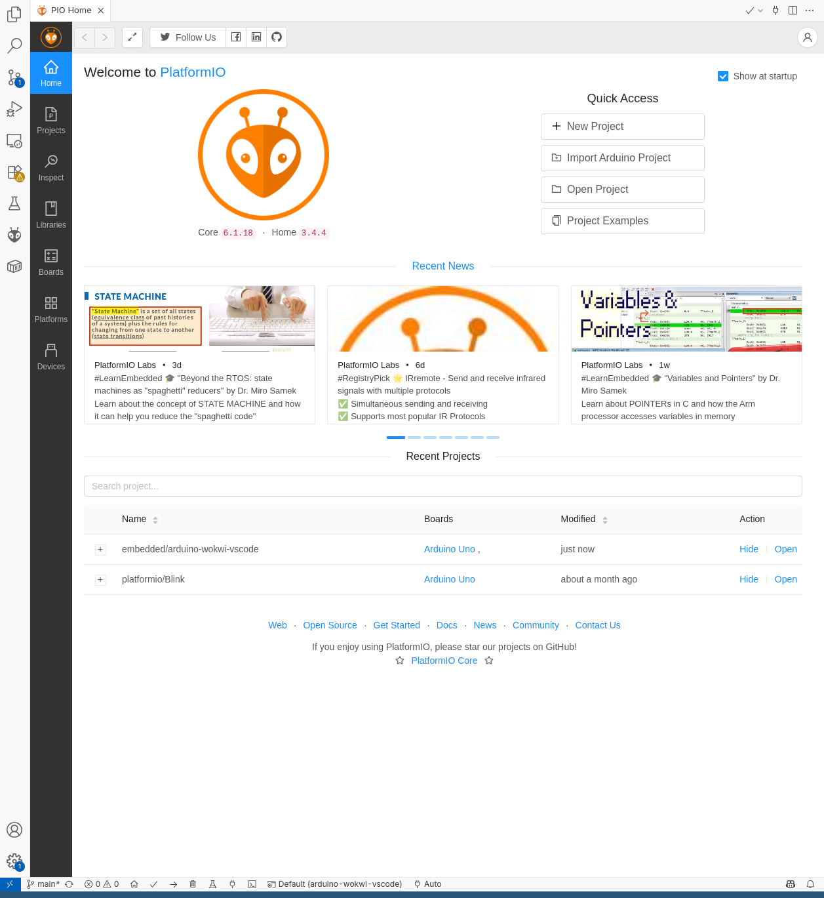
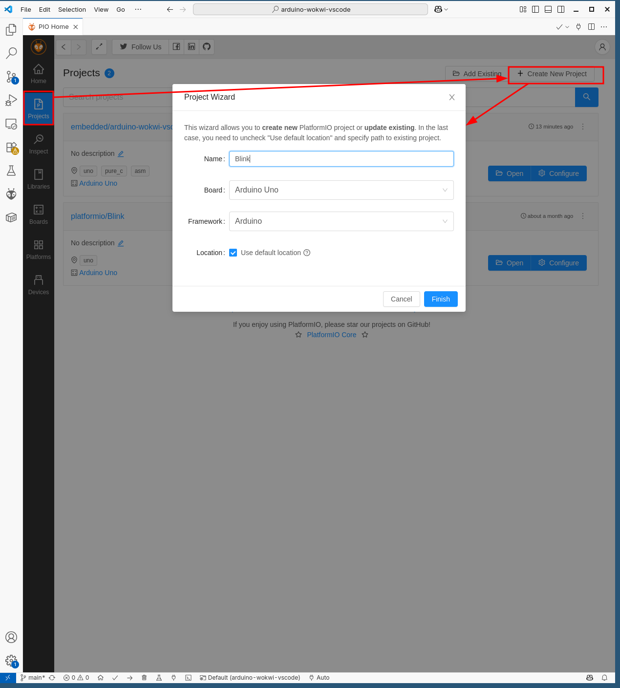
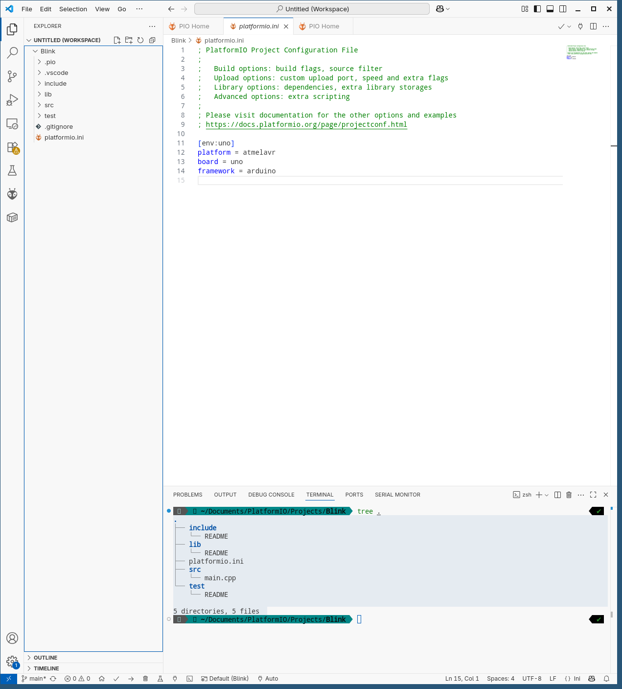
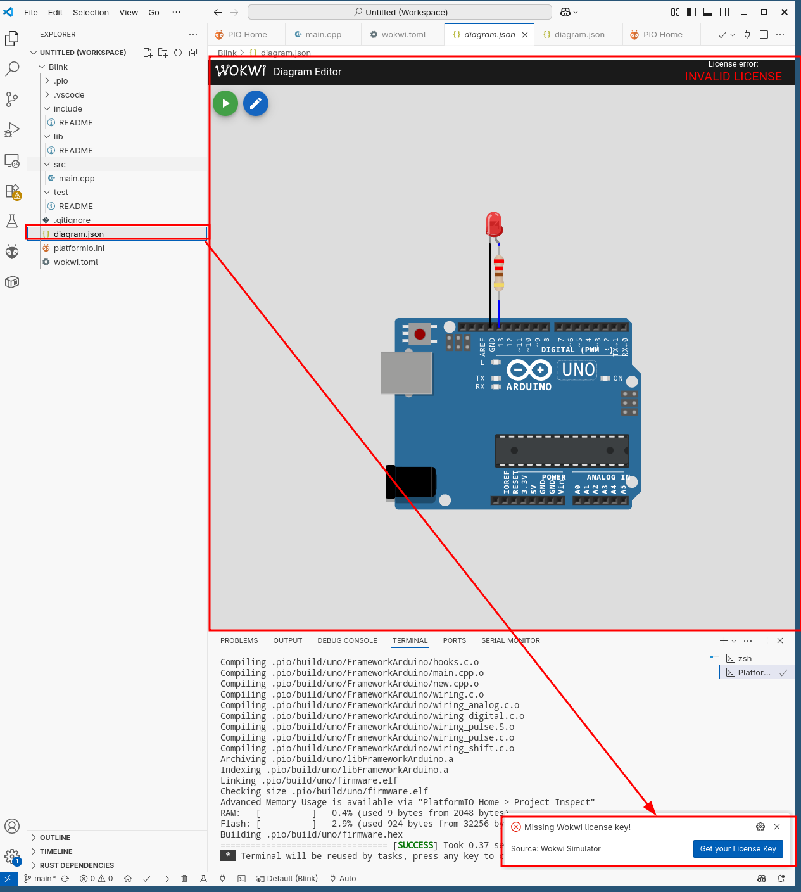

# Занятие 6. PlatformIO: переход на профессиональный инструмент

**Цель занятия:** перейти с Arduino IDE на PlatformIO внутри VS Code, разобраться в структуре проекта, научиться разбивать программу на модули и подключать зависимости с фиксацией версий.

**Что понадобится:** компьютер с VS Code, Arduino UNO, любая схема с предыдущих занятий.

> **С этого занятия все задачи и лабораторные работы выполняются в PlatformIO.** Arduino IDE остаётся как быстрый инструмент для одиночных проверок.

---

## 1. Почему мы уходим из Arduino IDE

Первые пять занятий Arduino IDE справлялась: один файл, две функции, пара библиотек. Дальше начинаются проблемы, которые она не решает.

| Проблема | Arduino IDE | PlatformIO |
| --- | --- | --- |
| Программа из нескольких файлов | Вкладки, склеиваемые препроцессором в непредсказуемом порядке | Обычные `.cpp` и `.h`, раздельная компиляция |
| Версии библиотек | Одна версия на всю систему; обновление ломает старые проекты | Версия фиксируется в файле проекта |
| Перенос проекта на другой компьютер | "Установи вот эти библиотеки вручную" | `git clone`, зависимости ставятся сами |
| Автодополнение и переход к определению | Практически нет | Полноценный анализ кода |
| Несколько плат в одном проекте | Нет | Несколько окружений в одном файле |
| Флаги компиляции | Недоступны | Настраиваются |
| Модульные тесты | Нет | Встроенный механизм |
| Работа с git | Неудобно: путь к скетчбуку жёстко задан | Обычная папка проекта |

Главное для нас - **раздельная компиляция и нормальные заголовочные файлы**. Без них [занятие 11](../11-cpp-oop/note.md) о написании собственной библиотеки и лабораторные работы превращаются в мучение.

---

## 2. Установка

### VS Code

Скачайте с [официального сайта](https://code.visualstudio.com/) и установите.

### Расширение PlatformIO IDE

Откройте вкладку расширений (иконка с кубиками), найдите `PlatformIO IDE`, нажмите **Install**.



Установка занимает несколько минут: PlatformIO скачивает собственный набор инструментов (avr-gcc, avrdude, библиотеки ядра). Он **не зависит** от установленной Arduino IDE и не конфликтует с ней.

### Расширение Wokwi (по желанию)

Позволяет запускать симуляцию прямо из VS Code. Найдите **Wokwi Simulator** и установите.



---

## 3. Первый проект

Нажмите значок PlatformIO на боковой панели, откройте **PIO Home -> Open** и нажмите **+ New Project**.



Задайте имя проекта, выберите плату `Arduino Uno` и фреймворк `Arduino`.



### Структура проекта



```
my-project/
  platformio.ini      - конфигурация проекта
  src/
    main.cpp          - основной исходник
  include/            - общие заголовочные файлы проекта
  lib/                - собственные библиотеки проекта
  test/               - модульные тесты
  .gitignore          - создаётся автоматически
```

| Папка | Что туда класть |
| --- | --- |
| `src/` | Код конкретно этой программы |
| `include/` | Заголовки, используемые несколькими файлами из `src/` |
| `lib/` | Переиспользуемые модули: драйвер дисплея, класс кнопки, свой алгоритм фильтрации |
| `test/` | Тесты, запускаемые командой `pio test` |

Разница между `include/` и `lib/` принципиальна: **всё, что вы захотите взять в следующий проект, должно лежать в `lib/`**. PlatformIO компилирует каждую папку внутри `lib/` как отдельную библиотеку и автоматически добавляет её в пути поиска заголовков.

---

## 4. Файл platformio.ini

Сердце проекта. Минимальный вариант:

```ini
[env:uno]
platform = atmelavr
board = uno
framework = arduino
```

Рабочий вариант для курса:

```ini
[env:uno]
platform = atmelavr
board = uno
framework = arduino

monitor_speed = 9600
monitor_filters = time, colorize

build_flags =
    -Wall
    -Wextra

lib_deps =
    adafruit/DHT sensor library@^1.4.6
    adafruit/Adafruit Unified Sensor@^1.1.14
    marcoschwartz/LiquidCrystal_I2C@^1.1.4
```

Разбор параметров:

| Параметр | Назначение |
| --- | --- |
| `platform` | Семейство микроконтроллеров. Для AVR - `atmelavr` |
| `board` | Конкретная плата. Отсюда берутся частота, объём памяти, распиновка |
| `framework` | Программный слой. `arduino` даёт привычные `pinMode`, `digitalWrite` |
| `monitor_speed` | Скорость встроенного монитора порта |
| `monitor_filters` | Фильтры вывода: `time` добавляет метку времени к каждой строке |
| `build_flags` | Флаги компилятора. `-Wall -Wextra` включают предупреждения |
| `lib_deps` | Зависимости с указанием версии |

### Предупреждения компилятора

Флаги `-Wall -Wextra` включают предупреждения, которые Arduino IDE скрывает. Это одно из главных практических приобретений от перехода:

```cpp
int value;
if (value = analogRead(A0)) { }   // warning: suggest parentheses around assignment
                                  // здесь = вместо ==, классическая ошибка

uint8_t x = 300;                  // warning: overflow in conversion

void f(int a, int b) { return a; } // warning: unused parameter 'b'
```

Все три ошибки Arduino IDE пропустит молча.

### Фиксация версий

Запись `@^1.4.6` означает "версия 1.4.6 или новее, но младше 2.0.0". Это защищает от ситуации, когда через полгода мажорное обновление библиотеки ломает ваш проект.

Возможные формы:

```ini
lib_deps =
    adafruit/DHT sensor library@1.4.6        ; строго эта версия
    adafruit/DHT sensor library@^1.4.6       ; совместимые обновления
    https://github.com/user/lib.git          ; прямо из репозитория
    https://github.com/user/lib.git#v2.0     ; конкретный тег
```

Библиотеки скачиваются в папку `.pio/` внутри проекта и **не мешают** другим проектам.

### Несколько окружений

```ini
[env]
framework = arduino
monitor_speed = 9600

[env:uno]
platform = atmelavr
board = uno

[env:uno_debug]
platform = atmelavr
board = uno
build_flags = -DDEBUG=1

[env:nano]
platform = atmelavr
board = nanoatmega328new
```

Секция `[env]` задаёт общие настройки. Собрать конкретное окружение: `pio run -e uno_debug`.

Типичное применение - отладочная и рабочая сборки:

```cpp
#ifdef DEBUG
  #define LOG(x)   Serial.println(x)
#else
  #define LOG(x)
#endif
```

В рабочей сборке макрос `LOG` раскрывается в пустоту, и весь отладочный вывод исчезает из прошивки вместе со строками, которые он занимал во Flash.

---

## 5. Отличия .cpp от .ino

Файл `.ino` - **не совсем C++**. Arduino IDE перед компиляцией незаметно делает три вещи:

1. добавляет `#include <Arduino.h>` в начало;
2. сканирует файл и создаёт **прототипы всех функций**;
3. склеивает все вкладки проекта в один файл.

В `main.cpp` этого не происходит, поэтому нужно писать самому:

```cpp
#include <Arduino.h>

void blink(int times);            // прототип обязателен, если функция определена ниже

void setup() {
    pinMode(LED_BUILTIN, OUTPUT);
    blink(3);
}

void loop() { }

void blink(int times) {
    for (int i = 0; i < times; i++) {
        digitalWrite(LED_BUILTIN, HIGH);
        delay(100);
        digitalWrite(LED_BUILTIN, LOW);
        delay(100);
    }
}
```

Забытый `#include <Arduino.h>` даёт вал ошибок вида `'pinMode' was not declared in this scope` - это самая частая ошибка при переносе первого скетча.

> PlatformIO умеет собирать и `.ino`-файлы, но пользоваться этим не стоит: смысл перехода как раз в том, чтобы работать с обычным C++.

---

## 6. Разделение программы на модули

Пока программа помещается в сотню строк, один файл удобен. Дальше его нужно делить.

### Заголовочный файл

`include/blink.h`:

```cpp
#pragma once
#include <Arduino.h>

void blinkInit(uint8_t pin);
void blinkUpdate();
void blinkSetPeriod(unsigned long ms);
```

Директива `#pragma once` защищает от повторного включения одного и того же заголовка. Без неё при подключении из двух файлов компилятор увидит объявления дважды и сообщит об ошибке.

Классический эквивалент, работающий во всех компиляторах:

```cpp
#ifndef BLINK_H
#define BLINK_H
// ...
#endif
```

### Файл реализации

`src/blink.cpp`:

```cpp
#include "blink.h"

static uint8_t ledPin = LED_BUILTIN;      // static: переменная видна только в этом файле
static unsigned long period = 500;
static unsigned long lastToggle = 0;
static bool state = false;

void blinkInit(uint8_t pin) {
    ledPin = pin;
    pinMode(ledPin, OUTPUT);
}

void blinkSetPeriod(unsigned long ms) {
    period = ms;
}

void blinkUpdate() {
    if (millis() - lastToggle < period) return;
    lastToggle += period;
    state = !state;
    digitalWrite(ledPin, state);
}
```

### Использование

`src/main.cpp`:

```cpp
#include <Arduino.h>
#include "blink.h"

void setup() {
    blinkInit(13);
    blinkSetPeriod(250);
}

void loop() {
    blinkUpdate();
}
```

Что мы получили:

- **инкапсуляция**: переменные `ledPin`, `period`, `state` не видны из `main.cpp`, испортить их случайно нельзя;
- **интерфейс**: заголовочный файл показывает, что модуль умеет, без подробностей реализации;
- **переиспользование**: модуль можно скопировать в другой проект;
- **раздельная компиляция**: правка `blink.cpp` не приводит к пересборке всего проекта.

Ключевое слово `static` у переменной на уровне файла означает "видна только в этом файле". Это первый шаг к инкапсуляции; на [занятии 11](../11-cpp-oop/note.md) мы заменим его на классы, что даст возможность иметь **несколько независимых мигалок** вместо одной.

---

## 7. Работа с проектом

Кнопки в нижней панели VS Code и эквивалентные команды:

| Действие | Кнопка | Команда | Горячая клавиша |
| --- | --- | --- | --- |
| Сборка | галочка | `pio run` | `Ctrl+Alt+B` |
| Загрузка | стрелка | `pio run -t upload` | `Ctrl+Alt+U` |
| Монитор порта | вилка | `pio device monitor` | `Ctrl+Alt+S` |
| Очистка | корзина | `pio run -t clean` | |
| Список портов | | `pio device list` | |

### Отчёт о памяти

После сборки PlatformIO печатает:

```
RAM:   [=         ]   9.2% (used 189 bytes from 2048 bytes)
Flash: [==        ]  15.4% (used 4972 bytes from 32256 bytes)
```

Наглядно и всегда на виду - в отличие от Arduino IDE, где эти цифры теряются в потоке сообщений.

Подробный разбор, что именно занимает память:

```
pio run -t size
```

---

## 8. Проект в системе контроля версий

PlatformIO создаёт `.gitignore` со следующим содержимым:

```
.pio
```

Этого достаточно: в репозиторий попадают исходники и `platformio.ini`, а собранные объектные файлы и скачанные библиотеки - нет. Любой, кто склонирует проект, получит рабочую сборку одной командой `pio run`.

Рекомендуемая структура репозитория для лабораторной работы:

```tikz Структура проекта PlatformIO для лабораторной работы
\begin{tikzpicture}[x=1cm,y=0.62cm, every node/.style={anchor=west}]
  \node[artifact, minimum width=34mm] (root) at (0,0) {\ttfamily lab3-greenhouse/};
  \foreach \i/\name/\desc in {
      1/{platformio.ini}/{конфигурация проекта},
      2/{README.md}/{описание, схема, сборка},
      3/{src/main.cpp}/{только связывание модулей},
      4/{lib/Menu/}/{модуль меню},
      5/{lib/SensorHub/}/{модуль опроса датчиков},
      6/{include/config.h}/{выводы и пороги},
      7/{diagram.json}/{схема для Wokwi (по желанию)}} {
    \pgfmathsetmacro{\y}{-\i*1.05}
    \node[note, anchor=west, font=\small\ttfamily, text=muted!20!black]
      at (0.75,\y) {\name};
    \node[note, anchor=west] at (4.3,\y) {\desc};
    \draw[muted!60, semithick] (0.35,-0.32) -- (0.35,\y) -- (0.7,\y);
  }
\end{tikzpicture}
```

Вынести номера выводов и настройки в `include/config.h` - хорошая привычка: при изменении схемы правится один файл.

```cpp
#pragma once

#define PIN_LED_RED     5
#define PIN_LED_GREEN   6
#define PIN_DHT         2
#define PIN_BUTTON_UP   7

#define TEMP_MIN        20.0
#define TEMP_MAX        25.0
```

---

## 9. Симуляция без железа

Если расширение Wokwi установлено, добавьте в корень проекта два файла.

`diagram.json` - описание схемы:

```json
{
  "version": 1,
  "author": "Student",
  "editor": "wokwi",
  "parts": [
    { "id": "uno", "type": "wokwi-arduino-uno", "top": 120, "left": 20 },
    { "id": "r1", "type": "wokwi-resistor", "top": 67, "left": 115, "rotate": 90, "attrs": { "value": "220" } },
    { "id": "led", "type": "wokwi-led", "left": 120, "top": 0, "attrs": { "color": "red" } }
  ],
  "connections": [
    ["uno:GND.1", "led:C", "black", []],
    ["r1:1", "led:A", "blue", []],
    ["uno:13", "r1:2", "blue", []]
  ]
}
```

`wokwi.toml` - где взять прошивку:

```toml
[wokwi]
version = 1
firmware = '.pio/build/uno/firmware.hex'
elf = '.pio/build/uno/firmware.elf'
```

Запуск: `F1` -> `Wokwi: Start Simulator`. Для работы нужен бесплатный аккаунт на [wokwi.com](https://wokwi.com/).



---

## 10. Перенос существующего скетча

Чек-лист миграции:

1. Создайте проект PlatformIO для платы `uno`.
2. Скопируйте содержимое `.ino` в `src/main.cpp`.
3. Добавьте в начало `#include <Arduino.h>`.
4. Добавьте прототипы функций, которые определены ниже места вызова.
5. Перенесите используемые библиотеки в `lib_deps`.
6. Соберите. Разберите **все** предупреждения `-Wall -Wextra`, а не только ошибки.
7. Загрузите и проверьте работу на плате.

Шаг 6 обычно оказывается самым содержательным: в старом коде находятся неиспользуемые переменные, сравнение знакового с беззнаковым и потерянные `break` в `switch`.

---

## Контрольные вопросы

1. Назовите три возможности PlatformIO, которых нет в Arduino IDE, и объясните, зачем каждая нужна в этом курсе.
2. Чем `.ino` отличается от `.cpp`? Какие три вещи Arduino IDE делает за вас незаметно?
3. В чём разница между папками `include/` и `lib/`?
4. Что означает запись `@^1.4.6` в `lib_deps` и от чего она защищает?
5. Зачем нужна директива `#pragma once` и что будет без неё?
6. Что означает `static` у переменной, объявленной на уровне файла?
7. Почему в `.gitignore` попадает папка `.pio`, а `platformio.ini` - нет?
8. Как организовать отладочную и рабочую сборки одного проекта?

## Задание

Задачи занятия - в [task.md](task.md).
