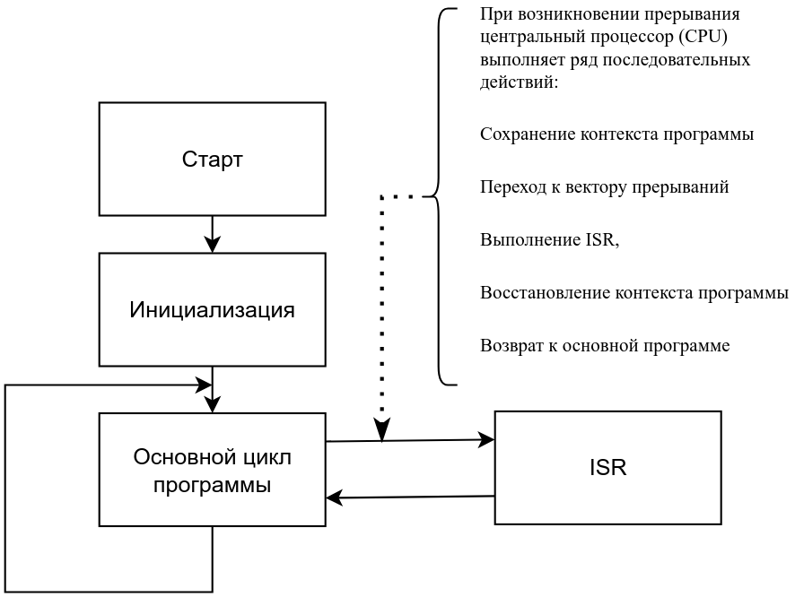
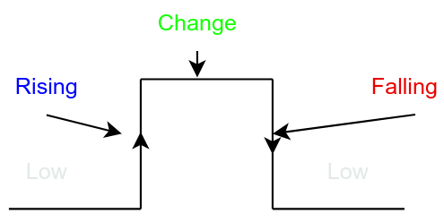

# Занятие 8. Прерывания

**Цель занятия:** понять, как микроконтроллер реагирует на события мгновенно, не тратя процессорное время на опрос; научиться писать корректные обработчики прерываний и понимать, какие ошибки в них приводят к трудноуловимым сбоям.

**Что понадобится:** Arduino UNO, кнопки, светодиоды, датчик SW-520D.

---

## 1. Опрос против прерывания

На [занятии 7](../07-timing-multitasking/note.md) все события обнаруживались **опросом** (polling): программа регулярно спрашивала "а не нажата ли кнопка?". У этого подхода два недостатка:

- **процессорное время тратится впустую** - большинство опросов возвращают "нет";
- **время реакции не гарантировано** - оно равно длительности самой медленной итерации `loop()`.

**Прерывание** переворачивает схему: не программа спрашивает аппаратуру, а аппаратура сообщает программе о событии, немедленно прерывая её выполнение.

### Аналогия

Представьте, что вы читаете книгу - это основная программа. В любой момент может зазвонить телефон. Вы кладёте закладку (запоминаете страницу и строку), отвечаете на звонок, кладёте трубку и возвращаетесь ровно к той же строке.

Телефонный звонок - это прерывание, разговор - обработчик прерывания, закладка - сохранение контекста.

Из аналогии сразу следуют два практических правила:

- **разговор должен быть коротким** - иначе книга так и не будет прочитана;
- **звонков не должно быть слишком много** - иначе вы вообще не вернётесь к чтению.

---

## 2. Что происходит при возникновении прерывания



1. **Сохранение контекста.** Процессор дописывает текущую инструкцию, кладёт в стек адрес возврата, а обработчик сохраняет используемые им регистры и регистр состояния `SREG`.
2. **Переход к вектору прерывания.** В начале Flash расположена **таблица векторов** - список адресов обработчиков. Процессор переходит по адресу, соответствующему источнику прерывания.
3. **Выполнение ISR** (Interrupt Service Routine) - подпрограммы обслуживания прерывания.
4. **Восстановление контекста.** Регистры и `SREG` восстанавливаются из стека.
5. **Возврат** в основную программу ровно в ту точку, где она была прервана.

Всё это занимает время. На AVR только вход в обработчик и выход из него стоят порядка **20-40 тактов** (около 2 мкс на 16 МГц), не считая тела самого обработчика. Кроме того, вложенные вызовы расходуют стек, который на UNO находится в тех же 2 КБ SRAM.

> **Прерывание** - процесс, при котором нормальный ход выполнения программы нарушается по сигналу аппаратуры или самого процессора;

> Текущий поток приостанавливается, управление передаётся обработчику, после чего выполнение возобновляется.

>Прерывания бывают **синхронные** (возникают в результате выполнения инструкции - в терминологии Intel их называют исключениями) и **асинхронные** (инициируются внешними по отношению к потоку событиями).

---

```tikz Что происходит с процессором при возникновении прерывания
\begin{tikzpicture}[x=1.15cm,y=1cm]
  % шкала времени
  \draw[->] (0,0) -- (11.6,0) node[right,font=\small] {$t$};

  % полосы выполнения
  \fill[sig!25,draw=sig] (0,0.35) rectangle (2.6,1.15);
  \node[font=\scriptsize] at (1.3,0.75) {main / loop()};

  \fill[muted!30,draw=muted] (2.6,0.35) rectangle (3.5,1.15);
  \node[font=\scriptsize,rotate=90] at (3.05,0.75) {контекст};

  \fill[acc!25,draw=acc] (3.5,0.35) rectangle (6.5,1.15);
  \node[font=\scriptsize] at (5,0.75) {ISR};

  \fill[muted!30,draw=muted] (6.5,0.35) rectangle (7.4,1.15);
  \node[font=\scriptsize,rotate=90] at (6.95,0.75) {контекст};

  \fill[sig!25,draw=sig] (7.4,0.35) rectangle (11.2,1.15);
  \node[font=\scriptsize] at (9.3,0.75) {main / loop()};

  % событие
  \draw[warn,very thick,->] (2.6,2.5) -- (2.6,1.25);
  \node[warn,font=\scriptsize,align=center,above] at (2.6,2.5) {внешнее\\событие};

  % пояснения снизу
  \draw[<->,muted] (2.6,-0.3) -- (3.5,-0.3)
        node[midway,below,font=\scriptsize,muted,align=center] {сохранение\\регистров};
  \draw[<->,acc] (3.5,-0.3) -- (6.5,-0.3)
        node[midway,below,font=\scriptsize,acc,align=center] {обработчик:\\чем короче, тем лучше};
  \draw[<->,muted] (6.5,-0.3) -- (7.4,-0.3)
        node[midway,below,font=\scriptsize,muted,align=center] {восстановление\\регистров};

  % латентность
  \draw[<->,warn,thick] (2.6,1.55) -- (3.5,1.55)
        node[midway,above,font=\scriptsize,warn] {латентность};
\end{tikzpicture}
```

## 3. Классификация прерываний

### Программные и аппаратные

**Программные** вызываются специальной инструкцией. У ATmega328P такой инструкции **нет**. Обходной приём указан в самой документации: настроить вывод внешнего прерывания как выход и записать в него значение - прерывание сработает.

**Аппаратные** генерирует периферия: таймеры, выводы IRQ, UART, SPI, I2C, АЦП, сторожевой таймер.

### Внутренние и внешние

**Внутренние** - от периферии внутри кристалла (таймер переполнился, АЦП закончил преобразование, UART принял байт).

**Внешние** - от сигналов на выводах микроконтроллера. У ATmega328P два вида:

- **INT0, INT1** - выделенные выводы внешних прерываний (D2 и D3), у каждого свой вектор и настраиваемое условие срабатывания;
- **PCINT0-PCINT23** - прерывания по изменению состояния вывода (pin change), доступны на **всех** выводах, но с существенными ограничениями (см. ниже).

### Векторные и невекторизованные

В **векторной** системе у каждого источника свой адрес обработчика:

```cpp
ISR(TIMER1_OVF_vect) { /* переполнение Timer1 */ }
ISR(INT0_vect)       { /* внешнее прерывание INT0 */ }
```

В **невекторизованной** все источники делят один обработчик, и внутри него приходится вручную проверять флаги:

```cpp
ISR(void) {
    if (INT0IF) { /* ... */ }
    if (TMR1IF) { /* ... */ }
}
```

**ATmega328P использует векторную систему** - по обработчику на каждый источник. Исключение составляют PCINT: все выводы одного порта делят общий вектор, и это как раз пример "невекторизованного" поведения внутри векторной системы.

### Маскируемые и немаскируемые

**Маскируемые** можно разрешить или запретить программно - это подавляющее большинство прерываний. 

**Немаскируемые** отключить нельзя: сброс (RESET), сторожевой таймер в режиме сброса, детектор снижения питания (BOD).

---

## 4. Векторы прерываний ATmega328P

Таблица определяет и адреса обработчиков, и **приоритеты**: чем меньше адрес, тем выше приоритет.

| N | Адрес | Имя вектора | Источник |
| --- | --- | --- | --- |
| 1 | 0x0000 | RESET | Сброс, WDT, включение питания |
| 2 | 0x0002 | `INT0_vect` | Внешнее прерывание 0 (D2) |
| 3 | 0x0004 | `INT1_vect` | Внешнее прерывание 1 (D3) |
| 4 | 0x0006 | `PCINT0_vect` | Изменение вывода порта B (D8-D13) |
| 5 | 0x0008 | `PCINT1_vect` | Изменение вывода порта C (A0-A5) |
| 6 | 0x000A | `PCINT2_vect` | Изменение вывода порта D (D0-D7) |
| 7 | 0x000C | `WDT_vect` | Сторожевой таймер |
| 8-10 | 0x000E-0x0012 | `TIMER2_COMPA/COMPB/OVF_vect` | Timer2 |
| 11-14 | 0x0014-0x001A | `TIMER1_CAPT/COMPA/COMPB/OVF_vect` | Timer1 |
| 15-17 | 0x001C-0x0020 | `TIMER0_COMPA/COMPB/OVF_vect` | Timer0 |
| 18 | 0x0022 | `SPI_STC_vect` | Завершение обмена SPI |
| 19-21 | 0x0024-0x0028 | `USART_RX/UDRE/TX_vect` | UART |
| 22 | 0x002A | `ADC_vect` | Завершение преобразования АЦП |
| 23 | 0x002C | `EE_READY_vect` | EEPROM готова |
| 24 | 0x002E | `ANALOG_COMP_vect` | Аналоговый компаратор |
| 25 | 0x0030 | `TWI_vect` | Интерфейс I2C |
| 26 | 0x0032 | `SPM_READY_vect` | Готовность записи во Flash |

Обратите внимание: `TIMER0_OVF_vect` (обслуживающий `millis()`) имеет **более низкий** приоритет, чем внешние прерывания. Это правильно: реакция на внешнее событие важнее счёта времени.

### Приоритеты и вложенность

Приоритет на AVR работает только в одной ситуации: когда **несколько флагов прерываний подняты одновременно**. Тогда первым обслуживается тот, чей вектор расположен раньше. Прервать уже выполняющийся обработчик более приоритетное прерывание **не может** - при входе в **ISR** глобальные прерывания автоматически запрещаются.

Разрешить **вложенные прерывания** можно, вызвав `sei()` внутри обработчика (или объявив `ISR(vect, ISR_NOBLOCK)`). Делать это крайне не рекомендуется: система становится непредсказуемой, стек может переполниться цепочкой вложенных вызовов, и никакие защитные механизмы вроде WDT из такой ситуации не спасут. Знать о возможности нужно, использовать - почти никогда.

---

## 5. Внешние прерывания в Arduino

### Условия срабатывания



| Режим | Когда срабатывает |
| --- | --- |
| `RISING` | Переход с низкого уровня на высокий |
| `FALLING` | Переход с высокого на низкий |
| `CHANGE` | Любое изменение уровня |
| `LOW` | Всё время, пока на выводе низкий уровень |

Режим `LOW` вызывает прерывание **непрерывно**, пока уровень низкий, программа фактически перестанет выполняться. Он применяется почти исключительно для пробуждения из режима глубокого сна, когда остальные режимы не работают (тактовый генератор остановлен).

### Выводы внешних прерываний

| Плата | Выводы INTx |
| --- | --- |
| Arduino Uno, Nano, Mini | 2, 3 |
| Arduino Mega | 2, 3, 18, 19, 20, 21 |
| Arduino Micro, Leonardo | 0, 1, 2, 3, 7 |
| Arduino Due, Zero | практически все выводы |

**На UNO для внешних прерываний доступны только D2 и D3.** Это жёсткое ограничение, которое нужно учитывать при подключении схемы: если событие требует мгновенной реакции, его источник должен попасть на один из этих двух выводов.

### `attachInterrupt()`

```cpp
attachInterrupt(digitalPinToInterrupt(pin), handler, mode);
```

Функция `digitalPinToInterrupt()` переводит номер вывода в номер прерывания. Использовать её обязательно: номер прерывания не совпадает с номером вывода (D2 -> прерывание 0, D3 -> прерывание 1), и без неё код не переносится на другие платы.

```cpp
const int LED_PIN = 13;
const int BUTTON_PIN = 2;

volatile bool ledState = false;

void onButtonPressed() {         // обработчик: без параметров, ничего не возвращает
    ledState = !ledState;
}

void setup() {
    pinMode(LED_PIN, OUTPUT);
    pinMode(BUTTON_PIN, INPUT_PULLUP);
    attachInterrupt(digitalPinToInterrupt(BUTTON_PIN), onButtonPressed, FALLING);
}

void loop() {
    digitalWrite(LED_PIN, ledState);
}
```

### `detachInterrupt()`

```cpp
detachInterrupt(digitalPinToInterrupt(pin));
```

Отключает прерывание. Полезно, когда источник больше не нужен: лишние прерывания - это лишняя нагрузка на процессор.

### Прерывания по изменению вывода (PCINT)

Если двух выводов не хватает, можно задействовать PCINT - они доступны на всех выводах. Но ограничения существенные:

- один вектор на **весь порт** - придётся вручную выяснять, какой именно вывод изменился;
- срабатывание только по **любому** изменению (аналог `CHANGE`), направление фронта нужно определять чтением состояния;
- в стандартном API Arduino поддержки нет - нужна работа с регистрами `PCICR` и `PCMSK` или библиотека `PinChangeInterrupt`.

---

## 6. Как писать обработчик прерывания

Это самая важная часть занятия. Некорректный обработчик даёт ошибки, которые проявляются раз в час и не воспроизводятся при отладке.

### Правило 1. Обработчик должен быть коротким

Идеальный обработчик делает одно из двух: устанавливает флаг или инкрементирует счётчик. Вся содержательная работа выполняется в `loop()`.

```cpp
volatile bool eventFlag = false;

void isr() {
    eventFlag = true;              // всё, что делает обработчик
}

void loop() {
    if (eventFlag) {
        eventFlag = false;
        handleEvent();             // тяжёлая работа здесь
    }
}
```

### Правило 2. Переменные, общие с обработчиком, объявляются `volatile`

Компилятор оптимизирует код, предполагая, что переменные меняются только в том коде, который он видит. Он вправе положить переменную в регистр и не перечитывать её из памяти.

```cpp
bool flag = false;                 // ОШИБКА: нет volatile

void loop() {
    while (!flag) { }              // компилятор превратит это в бесконечный цикл:
                                   // "flag не меняется в теле цикла, значит проверять незачем"
}
```

Ключевое слово `volatile` запрещает такую оптимизацию: переменная будет перечитываться из памяти при каждом обращении.

```cpp
volatile bool flag = false;        // правильно
```

### Правило 3. Многобайтные переменные читаются атомарно

`volatile` решает проблему кеширования, но не проблему **атомарности**. AVR - 8-разрядный процессор: чтение переменной `unsigned long` (4 байта) состоит из четырёх отдельных операций. Если прерывание произойдёт между ними, программа получит "половинку" старого значения и "половинку" нового.

```cpp
volatile unsigned long counter = 0;

void isr() { counter++; }

void loop() {
    unsigned long safeCopy;

    noInterrupts();              // критическая секция
    safeCopy = counter;
    interrupts();

    Serial.println(safeCopy);
}
```

Более аккуратный вариант, сохраняющий прежнее состояние флага прерываний:

```cpp
#include <util/atomic.h>

unsigned long safeCopy;
ATOMIC_BLOCK(ATOMIC_RESTORESTATE) {
    safeCopy = counter;
}
```

Однобайтные переменные (`bool`, `uint8_t`) читаются одной инструкцией, для них защита не нужна.

### Правило 4. Внутри обработчика не работают функции, зависящие от прерываний

| Функция | Почему нельзя |
| --- | --- |
| `delay()` | Основана на `millis()`, а Timer0 прерывания во время ISR запрещены - зависнет навсегда |
| `millis()`, `micros()` | Вернут значение, но **не будут увеличиваться** внутри обработчика |
| `Serial.print()` | Использует прерывания и буфер; вывод из ISR может заблокировать программу или потерять данные |
| Библиотеки I2C, SPI | Основаны на прерываниях и ожидании |

Что **можно**: `digitalWrite()`, `digitalRead()`, прямая работа с регистрами, `delayMicroseconds()` (она построена на подсчёте тактов), арифметика.

Отладка обработчика делается через флаг и вывод в `loop()`, а не `Serial.print()` внутри ISR.

### Правило 5. Дребезг никуда не делся

Прерывание по `FALLING` от механической кнопки сработает столько раз, сколько раз "звякнет" контакт. Подавлять дребезг нужно и здесь:

```cpp
const unsigned long DEBOUNCE_US = 50000;   // 50 мс в микросекундах
volatile unsigned long lastIsrTime = 0;
volatile uint16_t pressCount = 0;

void isr() {
    unsigned long now = micros();          // micros() внутри ISR читать можно
    if (now - lastIsrTime > DEBOUNCE_US) {
        lastIsrTime = now;
        pressCount++;
    }
}
```

Здесь `micros()` используется корректно: мы её только **читаем**, и её значение внутри обработчика не должно расти.

---

## 7. Критические секции

Ситуация, обратная предыдущей: основная программа изменяет данные, которые может испортить прерывание. Такой участок кода называется **критической секцией**, и на время его выполнения прерывания запрещают:

```cpp
noInterrupts();      // сбросить флаг I в регистре SREG (в AVR-C это cli())
// несколько инструкций, которые должны выполниться целиком
interrupts();        // разрешить обратно (sei())
```

Правила работы с критическими секциями:

- **держать их как можно короче.** Пока прерывания запрещены, микроконтроллер не считает время (`millis()` отстаёт), теряет принимаемые байты UART и пропускает внешние события;
- **никогда не вызывать `delay()` внутри** - он не завершится;
- **не забывать восстанавливать состояние.** Если участок кода может вызываться и при уже запрещённых прерываниях, безусловный `interrupts()` в конце их некорректно разрешит. Правильный шаблон:

```cpp
uint8_t oldSREG = SREG;    // сохранить регистр состояния, включая флаг I
cli();
// критическая секция
SREG = oldSREG;            // восстановить как было
```

Именно этот приём вы видели в исходном коде `pinMode()` на [занятии 3](../03-digital-io/note.md).

---

## 8. Когда применять прерывания

**Подходящие случаи:**

- события, требующие реакции быстрее, чем длится итерация `loop()`;
- редкие события, опрос которых был бы расточительным (нажатие кнопки раз в час);
- подсчёт импульсов, между которыми нельзя терять ни одного;
- пробуждение из режима энергосбережения;
- точные интервалы времени - прерывание по таймеру ([занятие 9](../09-timers/note.md)).

**Неподходящие случаи:**

- медленные события, которые прекрасно обнаруживаются опросом (температура меняется не быстрее раза в секунду);
- задачи, требующие длительной обработки;
- ситуации, где важна предсказуемость времени выполнения основного цикла.

Плата за прерывания - снижение предсказуемости системы. Анализ временных характеристик программы с прерываниями заметно сложнее, а ошибки - тоньше.

---

## 9. Энкодер: две линии прерываний

Инкрементальный энкодер KY-040 - учебный пример, в котором прерывания не роскошь, а единственный работающий подход.

При вращении вала два выхода (CLK и DT) выдают импульсы, сдвинутые по фазе на четверть периода:

```tikz Определение направления вращения по тому, какой сигнал изменился первым
\begin{tikzpicture}[x=1cm,y=1cm]
  \node[stagelab, anchor=west] at (0,1.75) {вращение вперёд};
  \node[note, anchor=east] at (-0.15,0.45) {CLK};
  \wave[draw=sig]{0}{0}{0.5}{0.9}{0,0,1,1,0,0,1,1,0,0,1,1,0}
  \node[note, anchor=east] at (-0.15,-1.05) {DT};
  \wave[draw=clk]{0}{-1.5}{0.5}{0.9}{0,1,1,0,0,1,1,0,0,1,1,0,0}
  \draw[warn, semithick, densely dashed] (1,-1.7) -- (1,1.2);
  \node[note, text=warn, anchor=south west] at (1.05,1.15) {CLK изменился первым};

  \begin{scope}[xshift=8.4cm]
    \node[stagelab, anchor=west] at (0,1.75) {вращение назад};
    \node[note, anchor=east] at (-0.15,0.45) {CLK};
    \wave[draw=sig]{0}{0}{0.5}{0.9}{0,1,1,0,0,1,1,0,0,1,1,0,0}
    \node[note, anchor=east] at (-0.15,-1.05) {DT};
    \wave[draw=clk]{0}{-1.5}{0.5}{0.9}{0,0,1,1,0,0,1,1,0,0,1,1,0}
    \draw[warn, semithick, densely dashed] (0.5,-1.7) -- (0.5,1.2);
    \node[note, text=warn, anchor=south west] at (0.55,1.15) {DT изменился первым};
  \end{scope}
\end{tikzpicture}
```

Направление определяется тем, какой сигнал изменился раньше. Если опрашивать выводы в основном цикле, при быстром вращении часть щелчков теряется, и счётчик "отстаёт" - причём необратимо: пропущенный щелчок не восстановить.

### Обработка по таблице переходов

Наивная реализация "если CLK упал, посмотреть DT" работает плохо: механические контакты дребезжат, давая ложные переходы. Надёжный приём - хранить предыдущее состояние пары и сверяться с таблицей допустимых переходов:

```cpp
const uint8_t PIN_CLK = 2;   // INT0
const uint8_t PIN_DT  = 3;   // INT1

volatile int16_t position   = 0;
volatile uint8_t prevState  = 0;

// Таблица: индекс = (предыдущее состояние << 2) | текущее
// +1 - шаг вперёд, -1 - назад, 0 - недопустимый или пустой переход
const int8_t transitions[16] = {
     0, -1, +1,  0,
    +1,  0,  0, -1,
    -1,  0,  0, +1,
     0, +1, -1,  0
};

void encoderISR() {
    uint8_t state = (digitalRead(PIN_CLK) << 1) | digitalRead(PIN_DT);
    position += transitions[(prevState << 2) | state];
    prevState = state;
}

void setup() {
    pinMode(PIN_CLK, INPUT_PULLUP);
    pinMode(PIN_DT,  INPUT_PULLUP);
    prevState = (digitalRead(PIN_CLK) << 1) | digitalRead(PIN_DT);
    attachInterrupt(digitalPinToInterrupt(PIN_CLK), encoderISR, CHANGE);
    attachInterrupt(digitalPinToInterrupt(PIN_DT),  encoderISR, CHANGE);
}
```

Ключевая идея: нули в таблице соответствуют переходам, которые физически невозможны при вращении. Дребезг порождает именно такие переходы - и они просто игнорируются. Гасить дребезг задержкой здесь **нельзя**: задержка в обработчике съест следующий щелчок.

Обратите внимание, что оба обработчика прерывания - один и тот же: энкодер занимает **оба** вывода INT0 и INT1, и для другого события внешних прерываний уже не остаётся. Если нужен ещё один источник, применяют PCINT.

Чтение `position` в основном цикле выполняется в критической секции - переменная двухбайтовая:

```cpp
noInterrupts();
int16_t pos = position;
interrupts();
```

Один щелчок ручки даёт полный цикл из четырёх переходов, поэтому `position` растёт по четыре на щелчок. Делите на 4 либо учитывайте только один из переходов.

## 10. Измерение длительности импульса без блокировки

Ультразвуковой дальномер HC-SR04 выдаёт результат длительностью импульса на выводе ECHO. Стандартное решение:

```cpp
duration = pulseIn(ECHO_PIN, HIGH);   // блокирует до одной секунды
```

Функция `pulseIn()` **блокирующая**: она ждёт фронта, потом спада, и если отражения нет - висит до истечения тайм-аута. В программе с индикацией и меню это неприемлемо.

Неблокирующий вариант - засечь оба фронта по прерыванию:

```cpp
const uint8_t ECHO_PIN = 2;

volatile uint32_t echoStart = 0;
volatile uint32_t echoWidth = 0;
volatile bool     echoReady = false;

void echoISR() {
    if (digitalRead(ECHO_PIN)) {
        echoStart = micros();          // фронт
    } else {
        echoWidth = micros() - echoStart;   // спад
        echoReady = true;
    }
}
```

Основной цикл запускает измерение импульсом на TRIG, продолжает работу и забирает результат, когда `echoReady` установлен. Если через 30 мс флага нет - отражения не было, и это тоже результат: "вне диапазона".

Приём общий: **измерение времени между событиями - типовая задача для прерываний**. Так же обрабатываются ИК-приёмник, датчик оборотов и любой протокол с времязадающим кодированием.

> `micros()` внутри обработчика работает корректно, потому что использует Timer0, который продолжает считать. Но само значение `micros()` не растёт во время выполнения ISR при запрещённых прерываниях - при длинных обработчиках это даёт систематическую ошибку.

---

## Контрольные вопросы

1. Что происходит с процессором в момент возникновения прерывания? Перечислите шаги по порядку.
2. Почему на UNO внешние прерывания доступны только на выводах D2 и D3? Что делать, если нужны три источника?
3. Зачем переменной, изменяемой в обработчике, нужно `volatile`? Приведите пример ошибки без него.
4. Почему `volatile` недостаточно для переменной типа `unsigned long`?
5. Почему нельзя вызывать `delay()` внутри обработчика, а `delayMicroseconds()` можно?
6. Как работают приоритеты прерываний в ATmega328P и в какой единственной ситуации они проявляются?
7. Что такое критическая секция и почему безусловный вызов `interrupts()` в её конце может быть ошибкой?
8. Кнопка подключена к прерыванию по `FALLING`, а счётчик нажатий растёт скачками по 5-10. В чём причина и как исправить?

## Задание

Задачи занятия - в [task.md](task.md).
