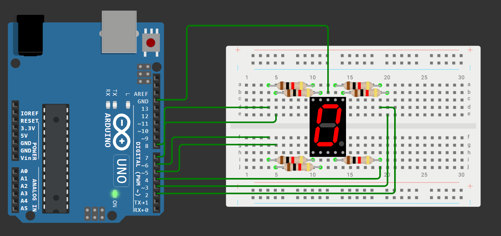

# Занятие 10. Индикация: семисегментные индикаторы, сдвиговые регистры, матрицы

**Цель занятия:** научиться выводить информацию, когда выводов микроконтроллера не хватает; освоить динамическую индикацию и сдвиговый регистр как способ расширения портов.

**Что понадобится:** Arduino UNO, макетная плата, одноразрядный и четырёхразрядный семисегментные индикаторы, светодиодная матрица 8x8, сдвиговый регистр SN74HC595N, резисторы 220 Ом и 1 кОм.

---

## 1. Проблема нехватки выводов

У Arduino UNO 20 линий ввода-вывода, из которых реально свободны около 16. Посчитаем, сколько нужно для типичной задачи:

| Устройство | Выводов при прямом подключении |
| --- | --- |
| Одноразрядный семисегментный индикатор | 8 |
| Четырёхразрядный индикатор | 12 |
| Светодиодная матрица 8x8 | 16 |
| Часы из четырёх индикаторов | 32 |

Уже на втором пункте выводы заканчиваются. Есть два способа решения, и оба используются в этом занятии:

- **динамическая индикация** - показывать элементы по очереди, используя инерцию зрения;
- **сдвиговый регистр** - превратить три вывода микроконтроллера в восемь и более.

---

## 2. Семисегментный индикатор


Индикатор - это восемь светодиодов в одном корпусе: семь сегментов в форме восьмёрки и десятичная точка.

**Обозначение сегментов:** A - верхний горизонтальный, B - верхний правый, C - нижний правый, D - нижний горизонтальный, E - нижний левый, F - верхний левый, G - средний горизонтальный, DP - точка.

### Общий катод и общий анод

| Тип | Общий вывод подключается к | Сегмент включается уровнем |
| --- | --- | --- |
| Общий катод (CC) | GND | `HIGH` на выводе сегмента |
| Общий анод (CA) | 5 В | `LOW` на выводе сегмента |

Определить тип можно мультиметром в режиме прозвонки диодов: если щуп "+" на общем выводе заставляет сегменты светиться - это общий анод.

**Резистор ставится на каждый сегмент, а не на общий вывод.** Причин две: при одном резисторе яркость зависела бы от количества горящих сегментов (цифра "1" ярче цифры "8"), и через общий вывод потёк бы ток до 7 x 20 мА ~ 140 мА, недопустимый для вывода микроконтроллера.

### Схема



Общий катод - на GND, сегменты A-G через резисторы 1 кОм на выводы D2-D8.

### Кодирование цифр

Каждая цифра - это комбинация сегментов, которую удобно записать одним байтом:

| Цифра | Сегменты | Байт (DP G F E D C B A) |
| --- | --- | --- |
| 0 | A B C D E F | `0b00111111` |
| 1 | B C | `0b00000110` |
| 2 | A B D E G | `0b01011011` |
| 3 | A B C D G | `0b01001111` |
| 4 | B C F G | `0b01100110` |
| 5 | A C D F G | `0b01101101` |
| 6 | A C D E F G | `0b01111101` |
| 7 | A B C | `0b00000111` |
| 8 | A B C D E F G | `0b01111111` |
| 9 | A B C D F G | `0b01101111` |

```cpp
const uint8_t SEGMENT_PINS[] = {2, 3, 4, 5, 6, 7, 8};   // A B C D E F G
const uint8_t DIGITS[10] = {
    0b00111111, 0b00000110, 0b01011011, 0b01001111, 0b01100110,
    0b01101101, 0b01111101, 0b00000111, 0b01111111, 0b01101111
};

void showDigit(uint8_t d) {
    uint8_t mask = DIGITS[d];
    for (uint8_t i = 0; i < 7; i++) {
        digitalWrite(SEGMENT_PINS[i], bitRead(mask, i));
    }
}

void setup() {
    for (uint8_t i = 0; i < 7; i++) pinMode(SEGMENT_PINS[i], OUTPUT);
}

void loop() {
    for (uint8_t d = 0; d < 10; d++) {
        showDigit(d);
        delay(500);
    }
}
```

Таблицу из десяти байт стоит положить во Flash через `PROGMEM` - она никогда не меняется, а 10 байт SRAM на UNO не лишние.

---

## 3. Динамическая индикация

Четырёхразрядный индикатор имеет всего 12 выводов вместо 32: восемь сегментных линий **общие** для всех разрядов, и четыре линии выбора разряда.

Отсюда следует, что **одновременно можно показать только один разряд**. Чтобы увидеть четырёхзначное число, разряды перебирают по кругу настолько быстро, что глаз не замечает переключения.

```cpp
const uint8_t DIGIT_PINS[4] = {9, 10, 11, 12};   // выводы выбора разряда
uint8_t buffer[4] = {1, 2, 3, 4};                // что показывать

void refreshDisplay() {
    static uint8_t current = 0;

    // 1. Гасим предыдущий разряд ДО смены сегментов
    for (uint8_t i = 0; i < 4; i++) digitalWrite(DIGIT_PINS[i], HIGH);   // общий анод: HIGH = выключен

    // 2. Выставляем сегменты нового разряда
    showDigit(buffer[current]);

    // 3. Включаем нужный разряд
    digitalWrite(DIGIT_PINS[current], LOW);

    current = (current + 1) % 4;
}
```

Функция `refreshDisplay()` должна вызываться **постоянно**. Есть три способа:

| Способ | Плюсы | Минусы |
| --- | --- | --- |
| Вызов в `loop()` | Просто | Любая задержка в цикле вызывает видимое мерцание |
| Прерывание по таймеру | Стабильная яркость независимо от программы | Занимает таймер, ISR должен быть быстрым |
| Внешний драйвер (MAX7219, TM1637) | Совсем не нагружает процессор | Дополнительная микросхема |

### Частота обновления

Порог слияния мельканий у человека - около 50 Гц. Для четырёх разрядов это означает частоту перебора не менее 4 x 50 = 200 Гц, то есть смена разряда каждые 5 мс. На практике берут запас: 1-2 мс на разряд.

Важная деталь порядка операций: сегменты нужно менять **при выключенных разрядах**. Иначе на короткое время сегменты нового символа окажутся поданными на старый разряд, и появится "призрак" - слабое свечение лишних сегментов.

### Яркость

При динамической индикации каждый разряд светится только четверть времени, поэтому яркость в четыре раза ниже, чем при статическом включении. Компенсируют это меньшим сопротивлением резисторов - импульсный ток светодиода может быть заметно выше среднего допустимого.

---

## 4. Сдвиговый регистр 74HC595

Второй способ решения проблемы - превратить последовательный поток бит в параллельные выходы.

### Выводы

| Вывод | Название | Назначение |
| --- | --- | --- |
| 14 | SER (DATA) | Вход последовательных данных |
| 11 | SRCLK (CLOCK) | Тактовый вход: по фронту данные сдвигаются на один бит |
| 12 | RCLK (LATCH) | Защёлка: переносит содержимое регистра на выходы |
| 13 | OE (инверсный) | Разрешение выходов, активный низкий. Обычно на GND |
| 10 | SRCLR (инверсный) | Сброс регистра, активный низкий. Обычно на 5 В |
| 15, 1-7 | QA-QH | Восемь параллельных выходов |
| 9 | QH' | Выход переполнения для каскадирования |

### Принцип работы

Внутри две ступени: **сдвиговый регистр** и **выходной регистр-защёлка**.

1. По каждому фронту `SRCLK` содержимое сдвигового регистра смещается на один бит, а в освободившийся разряд заходит значение с `SER`.
2. После восьми тактов в регистре лежит нужный байт, но **на выходах он ещё не появился**.
3. Фронт на `RCLK` копирует содержимое сдвигового регистра в защёлку - все восемь выходов меняются **одновременно**.

Наличие защёлки принципиально: без неё во время загрузки байта на выходах мелькали бы промежуточные комбинации.

### Функция `shiftOut()`

```cpp
const int DATA = 8, LATCH = 9, CLOCK = 10;

void writeRegister(uint8_t value) {
    digitalWrite(LATCH, LOW);                       // закрываем защёлку
    shiftOut(DATA, CLOCK, MSBFIRST, value);         // выдвигаем 8 бит
    digitalWrite(LATCH, HIGH);                      // открываем - значение попадает на выходы
}

void setup() {
    pinMode(DATA, OUTPUT);
    pinMode(LATCH, OUTPUT);
    pinMode(CLOCK, OUTPUT);
}

void loop() {
    writeRegister(0b10101010);
    delay(500);
    writeRegister(0b01010101);
    delay(500);
}
```

Параметр `MSBFIRST` означает, что первым выдвигается старший бит; `LSBFIRST` - младший. От этого зависит, в каком порядке биты попадут на выходы QA-QH, - если картинка получилась зеркальной, дело именно в нём.

`shiftOut()` - это **программная реализация SPI**. Она работает на любых выводах, но медленно: восемь вызовов `digitalWrite()` на такт. Аппаратный SPI ([занятие 13](../13-spi-tft-rfid/note.md)) сделал бы то же самое в десятки раз быстрее, но только на фиксированных выводах.

### Полезные функции работы с битами

```cpp
bitSet(value, n);        // установить бит n
bitClear(value, n);      // сбросить бит n
bitWrite(value, n, b);   // записать в бит n значение b
bitRead(value, n);       // прочитать бит n
```

Пример "бегущего огня" через `bitWrite`:

```cpp
void loop() {
    for (uint8_t pos = 0; pos < 8; pos++) {
        uint8_t value = 0;
        bitWrite(value, pos, HIGH);
        writeRegister(value);
        delay(80);
    }
}
```

### Каскадирование

Выход `QH'` одного регистра соединяется со входом `SER` следующего; линии `SRCLK` и `RCLK` у всех регистров общие. Тогда достаточно выдвинуть 16 бит подряд:

```cpp
void writeTwoRegisters(uint8_t high, uint8_t low) {
    digitalWrite(LATCH, LOW);
    shiftOut(DATA, CLOCK, MSBFIRST, high);   // уйдёт в дальний регистр
    shiftOut(DATA, CLOCK, MSBFIRST, low);    // останется в ближнем
    digitalWrite(LATCH, HIGH);
}
```

Тремя выводами Arduino можно управлять сколь угодно длинной цепочкой - 16, 32, 64 выхода. Ценой становится время: каждый дополнительный регистр - ещё восемь тактов.

### ШИМ через сдвиговый регистр

Прямого ШИМ у 74HC595 нет: выход либо включён, либо выключен. Но есть вывод `OE`, который гасит **все** выходы сразу. Подав на него ШИМ-сигнал с любого вывода Arduino, можно управлять общей яркостью:

```cpp
const int OE_PIN = 6;                       // подключён к OE регистра

void setup() {
    pinMode(OE_PIN, OUTPUT);
    writeRegister(0b11110001);
}

void loop() {
    for (int i = 0; i < 256; i++) {
        analogWrite(OE_PIN, 255 - i);       // OE инверсный: меньше значение - ярче
        delay(5);
    }
}
```

Индивидуальная яркость каждого выхода этим способом недостижима - для неё нужна программная многоуровневая развёртка (библиотека `ShiftPWM`) или специализированная микросхема (TLC5940).

---

## 5. Светодиодная матрица 8x8

64 светодиода, 16 выводов: 8 строк и 8 столбцов. Светодиод на пересечении строки `R` и столбца `C` зажигается, когда на `R` подан активный уровень, а `C` притянут к земле.

### Почему нужна развёртка

Попробуем зажечь одновременно две точки - R6C3 и R3C7. Мы подаём активный уровень на строки R6 и R3, землю - на столбцы C3 и C7. Но тогда загорятся и R6C7, и R3C3: электрически схема не различает, какая строка "относится" к какому столбцу.

Этот эффект называется **паразитной засветкой**, и он делает статическое отображение произвольной картинки невозможным.

Решение - **построчная развёртка**: в каждый момент активна ровно одна строка, для неё выставляются нужные столбцы. Строки перебираются с частотой выше порога слияния мельканий.

### Схема на сдвиговом регистре

Из нашего набора матрица подключается так: **столбцы - через сдвиговый регистр 74HC595** (с резисторами на каждом выходе), **строки - на восемь цифровых выводов** Arduino.

Резисторы обязательно ставятся на стороне **столбцов**: в любой момент через каждый резистор течёт ток ровно одного светодиода, поэтому яркость не зависит от количества зажжённых точек в строке.

> При управлении строками напрямую от выводов Arduino ток строки может достигать 8 x 15 мА = 120 мА - это выше допустимого для вывода. В учебной схеме ток снижают увеличением резисторов (яркость упадёт), в правильной - ставят транзисторную сборку ULN2003 между микроконтроллером и строками.

### Программа

```cpp
const uint8_t ROW_PINS[8] = {2, 3, 4, 5, 6, 7, 8, 9};
const int DATA = 10, LATCH = 11, CLOCK = 12;

// Смайлик: каждый бит - один светодиод в строке
const uint8_t IMAGE[8] = {
    0b00111100,
    0b01000010,
    0b10100101,
    0b10000001,
    0b10100101,
    0b10011001,
    0b01000010,
    0b00111100
};

void setup() {
    for (uint8_t i = 0; i < 8; i++) {
        pinMode(ROW_PINS[i], OUTPUT);
        digitalWrite(ROW_PINS[i], LOW);
    }
    pinMode(DATA, OUTPUT);
    pinMode(LATCH, OUTPUT);
    pinMode(CLOCK, OUTPUT);
}

void refreshMatrix() {
    static uint8_t row = 0;

    digitalWrite(ROW_PINS[row], LOW);           // гасим текущую строку

    row = (row + 1) % 8;

    digitalWrite(LATCH, LOW);                   // столбцы: 0 = светодиод горит
    shiftOut(DATA, CLOCK, MSBFIRST, ~IMAGE[row]);
    digitalWrite(LATCH, HIGH);

    digitalWrite(ROW_PINS[row], HIGH);          // зажигаем новую строку
}

void loop() {
    refreshMatrix();
    delayMicroseconds(500);                     // ~250 Гц полной картинки
}
```

Изображение удобно задавать двоичными литералами: строка кода визуально совпадает со строкой на матрице.

### Скорость имеет значение

При развёртке `digitalWrite()` вызывается тысячи раз в секунду, и его медлительность становится заметной - картинка тускнеет и мерцает. Здесь оправдана прямая работа с портами:

```cpp
// вместо digitalWrite(ROW_PINS[row], HIGH), если строки сидят на PORTD
PORTD = (1 << row);
```

Одна инструкция вместо нескольких десятков тактов. Это тот случай из [занятия 3](../03-digital-io/note.md), когда экономия действительно нужна.

---

## 6. Вынести развёртку в прерывание

Развёртка в `loop()` работает, пока цикл быстрый. Стоит добавить чтение датчика или вывод в Serial - картинка задёргается.

Правильное решение - переложить обновление на **прерывание по таймеру** ([занятие 9](../09-timers/note.md)):

```cpp
ISR(TIMER1_COMPA_vect) {
    refreshMatrix();          // вызывается строго по расписанию
}
```

Тогда яркость и стабильность изображения перестают зависеть от того, чем занята основная программа. Обработчик при этом обязан быть коротким - ещё один аргумент в пользу прямой работы с портами.

Именно так устроены специализированные драйверы вроде MAX7219: развёртку выполняет отдельная микросхема, а микроконтроллеру остаётся лишь передавать содержимое кадра.

---

## Контрольные вопросы

1. Почему резистор нужно ставить на каждый сегмент индикатора, а не на общий вывод?
2. Сколько выводов нужно для четырёхразрядного индикатора при статическом и при динамическом подключении?
3. Какая минимальная частота обновления нужна для четырёх разрядов и почему?
4. Почему при динамической индикации сегменты нужно менять при выключенных разрядах?
5. Зачем в 74HC595 нужна защёлка `RCLK`? Что было бы видно без неё?
6. Что делает параметр `MSBFIRST` в `shiftOut()` и как проявится ошибка в его выборе?
7. Почему нельзя одновременно зажечь произвольные две точки светодиодной матрицы?
8. Почему в матрице резисторы ставят со стороны столбцов, а не строк?
9. Почему при динамической индикации оправдана прямая работа с регистрами портов вместо `digitalWrite()`?

## Задание

Задачи занятия - в [task.md](task.md).
