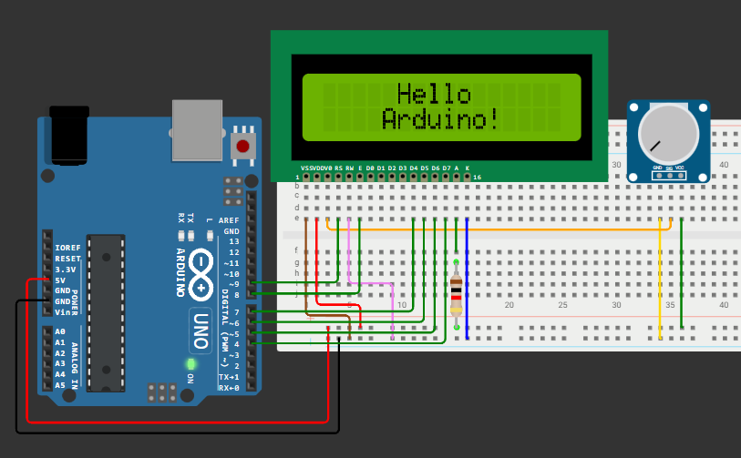

# Занятие 12. Шина I2C, символьный дисплей и часы реального времени

**Цель занятия:** разобраться в устройстве шины I2C, научиться подключать символьный ЖК-дисплей двумя способами и работать с модулем часов реального времени.

**Что понадобится:** Arduino UNO, дисплей 1602A (с I2C-адаптером или без), потенциометр, модуль DS1302, резисторы 220 Ом.

---

## 1. Зачем нужны последовательные шины

На [занятии 10](../10-indication/note.md) мы боролись за выводы: сдвиговый регистр превратил три линии в восемь. Шина решает ту же задачу принципиально иначе - к **одной паре проводов** подключается сразу несколько устройств, каждое со своим адресом.

Arduino UNO поддерживает три аппаратные шины:

| Интерфейс | Линий | Тип | Скорость | Устройств |
| --- | --- | --- | --- | --- |
| **UART** | 2 (RX, TX) | Асинхронный | до 115 200 бод | 2 (точка-точка) |
| **I2C (TWI)** | 2 (SDA, SCL) | Синхронный | 100/400 кГц | до 127 |
| **SPI** | 4 (MOSI, MISO, SCK, SS) | Синхронный | до 8 МГц | много, но каждому нужна своя линия SS |

На этом занятии - I2C, на [следующем](../13-spi-tft-rfid/note.md) - SPI, на [занятии 16](../16-uart-link/note.md) - UART.

---

## 2. Шина I2C

**I2C** (Inter-Integrated Circuit, "межмикросхемное соединение") разработана Philips в начале 1980-х. Из-за лицензионных ограничений её аналоги выпускались под другими названиями: **TWI** (Two-Wire Interface) в документации Atmel - это и есть I2C.

### Линии

| Линия | Назначение | Вывод на UNO |
| --- | --- | --- |
| **SDA** (Serial Data) | Двунаправленная передача данных | A4 |
| **SCL** (Serial Clock) | Тактовый сигнал, всегда формируется ведущим | A5 |

Плюс общая земля - она обязательна, но линией шины не считается.

### Подтягивающие резисторы

Все устройства на шине подключены выходами типа **открытый сток** (open-drain): вывод умеет только притягивать линию к земле, а высокий уровень обеспечивают внешние **подтягивающие резисторы** к питанию (обычно 4,7 кОм).

Это не техническая деталь, а принцип работы шины. Он даёт два свойства:

- **устройства не могут повредить друг друга**: если одно тянет линию вниз, а другое отпускает, короткого замыкания не возникает - просто на линии будет ноль;
- **возможно арбитражное разрешение конфликтов**: ноль всегда "сильнее" единицы, поэтому устройство может обнаружить, что его данные исказил кто-то другой.

На готовых модулях (дисплей с адаптером, датчики) резисторы обычно уже впаяны. Проблема возникает в обратной ситуации: при подключении **пяти-шести** модулей их резисторы включаются параллельно, суммарное сопротивление падает до сотен ом, и шина перестаёт работать. Тогда лишние резисторы выпаивают.

### Ведущий и ведомые

Обмен **всегда инициирует ведущий** (master) - в наших схемах это Arduino. Ведомые (slave) отвечают только на обращение по своему адресу.

Адрес 7-битный, отсюда теоретические 128 устройств; часть адресов зарезервирована, реально доступно 112. Адрес зашит производителем, иногда частично настраивается перемычками на плате модуля.

### Как выглядит посылка

```
  START  адрес(7 бит) R/W  ACK   данные(8 бит)  ACK  ...  STOP
   +-+  +-+-+-+-+-+-+-+ +-+ +-+  +-+-+-+-+-+-+-+-+ +-+   +-+
```

1. **START** - ведущий переводит SDA из высокого в низкий уровень при высоком SCL. Это единственная ситуация, когда SDA меняется при высоком SCL, - поэтому условие однозначно распознаётся.
2. **Адрес и бит направления.** Семь бит адреса, затем бит R/W: 0 - запись, 1 - чтение.
3. **ACK.** Девятым тактом ведущий отпускает SDA, а адресованное устройство притягивает её к нулю - это подтверждение "я здесь". Отсутствие подтверждения (NACK) означает, что устройства с таким адресом на шине нет.
4. **Байты данных**, каждый с подтверждением.
5. **STOP** - SDA переходит из низкого в высокий уровень при высоком SCL.

Тактирует обмен всегда ведущий, поэтому I2C - **синхронный** интерфейс: отдельной договорённости о скорости, как в UART, не требуется.

### Сканер шины

Первое, что нужно сделать при подключении любого I2C-устройства, - убедиться, что оно отвечает. Сканер перебирает все адреса и отмечает те, что дали подтверждение:

```cpp
#include <Wire.h>

void setup() {
    Wire.begin();
    Serial.begin(9600);
    while (!Serial) { }
    Serial.println(F("Сканирование шины I2C..."));
}

void loop() {
    uint8_t found = 0;

    for (uint8_t address = 1; address < 127; address++) {
        Wire.beginTransmission(address);
        uint8_t error = Wire.endTransmission();

        if (error == 0) {
            Serial.print(F("Устройство найдено: 0x"));
            if (address < 16) Serial.print('0');
            Serial.println(address, HEX);
            found++;
        }
    }

    if (found == 0) Serial.println(F("Устройств не найдено"));
    else            { Serial.print(found); Serial.println(F(" устройств")); }

    delay(5000);
}
```

Если сканер ничего не находит - проблема аппаратная: питание, перепутанные SDA и SCL, отсутствие общей земли, нет подтягивающих резисторов. **Отлаживать код бессмысленно, пока сканер не видит устройство.**

### Библиотека Wire

```cpp
Wire.begin();                        // ведущий (без аргумента)
Wire.begin(address);                 // ведомый с указанным адресом

Wire.beginTransmission(address);     // начать передачу устройству
Wire.write(data);                    // положить байт в буфер
uint8_t err = Wire.endTransmission();// отправить всё и получить код ошибки

Wire.requestFrom(address, count);    // запросить count байт
while (Wire.available()) {
    uint8_t b = Wire.read();
}
```

Код возврата `endTransmission()`: `0` - успех, `2` - нет подтверждения на адрес (устройства нет), `3` - нет подтверждения на данные, `4` - прочая ошибка. Проверять его стоит всегда.

Размер буфера библиотеки Wire - **32 байта**. Передача большего объёма молча обрежется, что даёт крайне неочевидные ошибки при работе с дисплеями и памятью.

---

```tikz Транзакция I2C: запись байта в устройство с адресом 0x27
\begin{tikzpicture}[x=0.62cm,y=0.75cm]
  \node[font=\small,left] at (-0.3,2.2) {SCL};
  \node[font=\small,left] at (-0.3,0.4) {SDA};

  % SCL: 9 тактов на посылку, дважды
  \foreach \off in {2,13} {
    \foreach \i in {0,...,8} {
      \draw[clk,thick]
        (\off+\i,2) -- (\off+\i+0.25,2) -- (\off+\i+0.25,2.8)
        -- (\off+\i+0.75,2.8) -- (\off+\i+0.75,2);
    }
    \draw[clk,thick] (\off+9,2) -- (\off+9,2);
  }
  \draw[clk,thick] (-0.2,2.8) -- (1.4,2.8) -- (1.4,2) -- (2,2);
  \draw[clk,thick] (11,2) -- (11.6,2) -- (11.6,2.8) -- (13,2.8) -- (13,2);
  \draw[clk,thick] (22,2) -- (22.6,2) -- (22.6,2.8) -- (23.4,2.8);

  % SDA
  \draw[sig,thick] (-0.2,1.2) -- (1.0,1.2);                    % покой
  \draw[sig,thick] (1.0,1.2) -- (1.0,0.2) -- (2,0.2);          % START
  \draw[sig,thick] (2,0.2) -- (11,0.2);                        % адрес + R/W + ACK
  \draw[sig,thick] (11,0.2) -- (13,0.2);
  \draw[sig,thick] (13,0.2) -- (22,0.2);                       % данные + ACK
  \draw[sig,thick] (22,0.2) -- (22.6,0.2) -- (22.6,1.2) -- (23.4,1.2);  % STOP

  % рамки полей
  \draw[muted,fill=muted!15] (2,-0.1) rectangle (9,0.5);
  \node[font=\scriptsize] at (5.5,0.2) {адрес 7 бит: 0x27};
  \draw[muted,fill=muted!15] (9,-0.1) rectangle (10,0.5);
  \node[font=\scriptsize] at (9.5,0.2) {W};
  \draw[ok,fill=ok!20] (10,-0.1) rectangle (11,0.5);
  \node[font=\scriptsize,ok] at (10.5,0.2) {ACK};
  \draw[muted,fill=muted!15] (13,-0.1) rectangle (21,0.5);
  \node[font=\scriptsize] at (17,0.2) {байт данных, 8 бит};
  \draw[ok,fill=ok!20] (21,-0.1) rectangle (22,0.5);
  \node[font=\scriptsize,ok] at (21.5,0.2) {ACK};

  % START / STOP
  \node[warn,font=\scriptsize,align=center,above] at (1.0,1.3) {START\\SDA вниз\\при SCL=1};
  \node[warn,font=\scriptsize,align=center,above] at (22.9,1.3) {STOP\\SDA вверх\\при SCL=1};
  \draw[warn,thick,->] (1.0,-0.9) -- (1.0,0.05);
  \draw[warn,thick,->] (22.6,-0.9) -- (22.6,0.05);

  \node[font=\scriptsize,muted] at (5.5,-1.15) {ведущий передаёт};
  \node[font=\scriptsize,ok] at (10.5,-1.15) {ведомый отвечает};
\end{tikzpicture}
```

## 3. Символьный дисплей 1602

Дисплей 16 столбцов x 2 строки на контроллере **HD44780** - стандарт де-факто с 1980-х. Он умеет отображать только символы из встроенной таблицы (плюс восемь пользовательских), зато прост и не требует памяти под кадр.

### Вариант 1: параллельное подключение



HD44780 умеет работать в 8-битном и **4-битном** режиме. В 4-битном каждый байт передаётся двумя посылками по полбайта - вдвое медленнее, зато экономит четыре вывода. Практически всегда используют его.

| Вывод дисплея | Назначение | Куда подключать |
| --- | --- | --- |
| VSS | Земля | GND |
| VDD | Питание | 5 В |
| VO | Контрастность | Средний вывод потенциометра |
| RS | Register Select: команда или данные | D9 |
| R/W | Чтение/запись | GND (только запись) |
| E | Enable, строб | D8 |
| DB4-DB7 | Данные | D7, D6, D5, D4 |
| A | Анод подсветки | 5 В через резистор 220 Ом |
| K | Катод подсветки | GND |

```cpp
#include <LiquidCrystal.h>

LiquidCrystal lcd(9, 8, 7, 6, 5, 4);   // RS, E, DB4, DB5, DB6, DB7

void setup() {
    lcd.begin(16, 2);
    lcd.setCursor(0, 0);
    lcd.print("Hello");
    lcd.setCursor(0, 1);
    lcd.print("Arduino!");
}

void loop() { }
```

> **Если на экране видны чёрные прямоугольники или пустота** - почти всегда дело в контрастности. Покрутите потенциометр на выводе VO из одного крайнего положения в другое: где-то посередине появится изображение. Это первое, что нужно проверить, а не код.

Шесть выводов - дорого. Отсюда второй вариант.

### Вариант 2: подключение через I2C-адаптер

Плата-адаптер на микросхеме **PCF8574** (расширитель портов на I2C) припаивается к дисплею и превращает шестнадцать его выводов в четыре: питание, земля, SDA, SCL.

| Вывод адаптера | Куда подключать |
| --- | --- |
| GND | GND |
| VCC | 5 В |
| SDA | A4 |
| SCL | A5 |

```cpp
#include <Wire.h>
#include <LiquidCrystal_I2C.h>

LiquidCrystal_I2C lcd(0x27, 16, 2);    // адрес, столбцов, строк

void setup() {
    lcd.init();
    lcd.backlight();
    lcd.setCursor(0, 0);
    lcd.print("Hello");
    lcd.setCursor(0, 1);
    lcd.print("Arduino!");
}

void loop() { }
```

**Адрес адаптера** - `0x27` или `0x3F` в зависимости от производителя. Точное значение определяется сканером из предыдущего раздела; жёстко прописывать `0x27` "наугад" - источник часа потерянного времени.

### Полезные методы

```cpp
lcd.clear();                    // очистить экран (медленно, ~2 мс)
lcd.home();                     // курсор в начало
lcd.setCursor(col, row);        // позиция: столбец 0-15, строка 0-1
lcd.print(value);               // вывод текста или числа
lcd.cursor(); lcd.noCursor();   // видимый курсор
lcd.blink(); lcd.noBlink();     // мигающий курсор
lcd.backlight();                // подсветка (только для I2C-адаптера)
lcd.createChar(n, bitmap);      // свой символ, n = 0...7
```

### Как не мигать экраном

Типичная ошибка - вызывать `lcd.clear()` перед каждым обновлением:

```cpp
void loop() {
    lcd.clear();                       // ПЛОХО: экран заметно мигает
    lcd.print(temperature);
    delay(500);
}
```

Правильно - перезаписывать только изменившуюся область, дополняя строку пробелами до нужной длины:

```cpp
void showTemperature(float t) {
    static float last = -999;
    if (fabs(t - last) < 0.05) return;   // ничего не изменилось - не трогаем экран
    last = t;

    lcd.setCursor(0, 0);
    lcd.print(F("T = "));
    lcd.print(t, 1);
    lcd.print(F(" C  "));                // пробелы затирают остатки предыдущего значения
}
```

Хвостовые пробелы нужны, потому что при переходе от `25.0` к `9.5` без них на экране осталось бы `9.50`.

### Собственные символы

HD44780 позволяет определить восемь символов размером 5x8 точек:

```cpp
byte degree[8] = {
    0b01100,
    0b10010,
    0b10010,
    0b01100,
    0b00000,
    0b00000,
    0b00000,
    0b00000
};

void setup() {
    lcd.init();
    lcd.createChar(0, degree);      // сохраняем в знакогенератор
    lcd.setCursor(0, 0);
    lcd.print("25");
    lcd.write(byte(0));             // выводим свой символ
    lcd.print("C");
}
```

Так делают знак градуса, стрелки, значок батареи и элементы столбчатых диаграмм.

---

## 4. Часы реального времени DS1302

Микроконтроллер не знает, который час: после каждого включения `millis()` начинается с нуля. Модуль **RTC** (Real-Time Clock) решает эту задачу - он считает время от собственного кварца и питается от батарейки, когда основное питание снято.

### Интерфейс

DS1302 использует **собственный трёхпроводный синхронный протокол** - это ни I2C, ни SPI, хотя внешне похоже на SPI.

| Вывод модуля | Назначение | Куда подключать |
| --- | --- | --- |
| VCC | Питание | 5 В |
| GND | Земля | GND |
| RST (CE) | Разрешение обмена | D10 |
| DAT (I/O) | Двунаправленные данные | D11 |
| CLK (SCLK) | Такт | D13 |

### Программа

```cpp
#include <Ds1302.h>

Ds1302 rtc(10, 13, 11);          // RST, CLK, DAT

const char* WEEKDAYS[] = { "Пн", "Вт", "Ср", "Чт", "Пт", "Сб", "Вс" };

void setup() {
    Serial.begin(9600);
    rtc.init();

    if (rtc.isHalted()) {                    // часы остановлены - значит, время не установлено
        Ds1302::DateTime dt = {
            .year = 26, .month = Ds1302::MONTH_SEP, .day = 1,
            .hour = 9, .minute = 0, .second = 0,
            .dow = Ds1302::DOW_TUE
        };
        rtc.setDateTime(&dt);
        Serial.println(F("Время установлено"));
    }
}

void loop() {
    Ds1302::DateTime now;
    rtc.getDateTime(&now);

    static uint8_t lastSecond = 255;
    if (now.second != lastSecond) {          // выводим только при смене секунды
        lastSecond = now.second;

        Serial.print(F("20")); Serial.print(now.year);
        Serial.print('-');
        if (now.month < 10) Serial.print('0');
        Serial.print(now.month);
        Serial.print('-');
        if (now.day < 10) Serial.print('0');
        Serial.print(now.day);
        Serial.print(' ');
        Serial.print(WEEKDAYS[now.dow - 1]);
        Serial.print(' ');
        if (now.hour < 10) Serial.print('0');
        Serial.print(now.hour);
        Serial.print(':');
        if (now.minute < 10) Serial.print('0');
        Serial.print(now.minute);
        Serial.print(':');
        if (now.second < 10) Serial.print('0');
        Serial.println(now.second);
    }

    delay(200);
}
```

Обратите внимание на два приёма.

**Проверка `isHalted()`.** Устанавливать время при каждом запуске нельзя: тогда часы будут сбрасываться на момент компиляции скетча при каждой перезагрузке. Метод сообщает, идут ли часы; если нет - значит, батарейка села или модуль новый, и время нужно задать.

**Вывод только при смене секунды.** Опрос идёт чаще, но в порт уходит ровно одна строка в секунду. Без этой проверки Serial Monitor захлебнётся дублями.

### Точность

DS1302 не имеет термокомпенсации: его уход составляет несколько минут в месяц и зависит от температуры. Для учебных задач это приемлемо.

Где нужна точность, ставят **DS3231** - у него термокомпенсированный генератор, уход не более 2 минут в год, и работает он по I2C. Если такой модуль появится, схема сократится до двух проводов, а код - до библиотеки `RTClib`.

### BCD-кодирование

Внутри DS1302 время хранится в **двоично-десятичном коде** (BCD): каждая десятичная цифра занимает свою тетраду. Число 25 хранится как `0x25`, то есть `0010 0101`, а не как `0x19`.

Библиотека выполняет преобразование сама, но знать о нём нужно: при чтении регистров напрямую значения покажутся "странными".

```cpp
uint8_t bcdToDec(uint8_t val) { return (val >> 4) * 10 + (val & 0x0F); }
uint8_t decToBcd(uint8_t val) { return ((val / 10) << 4) | (val % 10); }
```

BCD применяется в RTC потому, что упрощает вывод на индикатор: тетрады напрямую соответствуют разрядам.

---

## 5. Собираем вместе: часы на дисплее

```cpp
#include <Wire.h>
#include <LiquidCrystal_I2C.h>
#include <Ds1302.h>

LiquidCrystal_I2C lcd(0x27, 16, 2);
Ds1302 rtc(10, 13, 11);

void printTwoDigits(uint8_t value) {
    if (value < 10) lcd.print('0');
    lcd.print(value);
}

void setup() {
    lcd.init();
    lcd.backlight();
    rtc.init();
}

void loop() {
    static uint8_t lastSecond = 255;

    Ds1302::DateTime now;
    rtc.getDateTime(&now);

    if (now.second == lastSecond) return;    // экран трогаем только раз в секунду
    lastSecond = now.second;

    lcd.setCursor(4, 0);
    printTwoDigits(now.hour);   lcd.print(':');
    printTwoDigits(now.minute); lcd.print(':');
    printTwoDigits(now.second);

    lcd.setCursor(3, 1);
    printTwoDigits(now.day);   lcd.print('.');
    printTwoDigits(now.month); lcd.print(".20");
    lcd.print(now.year);
}
```

Обратите внимание: `lcd.clear()` не вызывается ни разу, а позиции фиксированы - изображение не мигает.

---

## 6. Инерциальный датчик MPU-6050

Модуль GY-521 - первое устройство в курсе, где I2C используется не для удобства, а по необходимости: датчик выдаёт шесть 16-битных величин, и опрашивать его по-другому непрактично.

### Что внутри

| Блок | Что измеряет | Особенность |
| --- | --- | --- |
| Акселерометр | Ускорение по трём осям | Измеряет и ускорение свободного падения - значит, даёт наклон, но шумит при движении |
| Гироскоп | Угловую скорость по трём осям | Точен на коротких интервалах, но его интеграл уходит |
| Термодатчик | Температуру кристалла | Для компенсации, не для измерения среды |

Адрес на шине - `0x68` (или `0x69`, если AD0 подтянут к питанию). Проверьте сканером из раздела 2: если датчик не отвечает, дальше идти бессмысленно.

### Чтение данных

```cpp
#include <Wire.h>

const uint8_t MPU_ADDR = 0x68;

void mpuInit() {
    Wire.begin();
    Wire.beginTransmission(MPU_ADDR);
    Wire.write(0x6B);      // регистр PWR_MGMT_1
    Wire.write(0);         // снять бит сна - датчик стартует спящим
    Wire.endTransmission(true);
}

void mpuRead(int16_t* ax, int16_t* ay, int16_t* az,
             int16_t* gx, int16_t* gy, int16_t* gz) {
    Wire.beginTransmission(MPU_ADDR);
    Wire.write(0x3B);                       // начальный регистр данных
    Wire.endTransmission(false);            // повторный старт, шину не отпускаем
    Wire.requestFrom(MPU_ADDR, (uint8_t)14, (uint8_t)true);

    *ax = Wire.read() << 8 | Wire.read();
    *ay = Wire.read() << 8 | Wire.read();
    *az = Wire.read() << 8 | Wire.read();
    Wire.read(); Wire.read();               // температура, пропускаем
    *gx = Wire.read() << 8 | Wire.read();
    *gy = Wire.read() << 8 | Wire.read();
    *gz = Wire.read() << 8 | Wire.read();
}
```

Здесь видны два приёма, характерных для I2C-датчиков:

1. **Датчик стартует в спящем режиме.** Пока не сброшен бит в `PWR_MGMT_1`, он отвечает на шине, но выдаёт нули. Это типовая причина "датчик работает, но данных нет".
2. **Повторный старт** (`endTransmission(false)`) не отпускает шину между записью адреса регистра и чтением. Если отпустить, другое устройство может вклиниться, и датчик потеряет позицию.

Все 14 байт читаются **одной транзакцией**. Читать по одному регистру нельзя: между чтениями датчик обновит данные, и вы получите ускорение из одного момента времени, а угловую скорость - из другого.

### Пересчёт в физические величины

Сырые значения - это отсчёты АЦП. Масштаб зависит от выбранного диапазона:

| Диапазон акселерометра | Отсчётов на g |
| --- | --- |
| +/-2 g | 16384 |
| +/-4 g | 8192 |
| +/-8 g | 4096 |
| +/-16 g | 2048 |

$$a = \frac{N_{\text{сырое}}}{16384} \cdot 9{,}81 \text{ м/с}^2$$

Угол наклона по акселерометру считается из проекций вектора силы тяжести:

$$\theta = \arctan\!\left(\frac{a_x}{\sqrt{a_y^2 + a_z^2}}\right)$$

### Почему нужны оба датчика

Попробуйте измерить угол только акселерометром - при малейшем движении показания запляшут: датчик не отличает наклон от ускорения. Попробуйте только гироскопом - угол будет плавным, но за минуту уползёт на десятки градусов: интеграл накапливает даже крошечное смещение нуля.

Решение - **комплементарный фильтр**: быстрая составляющая берётся от гироскопа, медленная - от акселерометра.

```cpp
const float ALPHA = 0.98f;

angle = ALPHA * (angle + gyroRate * dt) + (1.0f - ALPHA) * accAngle;
```

При `ALPHA = 0.98` и периоде 10 мс постоянная времени составляет около 0,5 с: быстрее этого доверяем гироскопу, медленнее - акселерометру. Дрейф гироскопа медленно "подтягивается" акселерометром и не накапливается.

$$\tau = \frac{\alpha \cdot \Delta t}{1 - \alpha}$$

Это тот же принцип, что у фильтров занятия 5, но применённый к **двум источникам** одной величины с разными характеристиками ошибки. Приём общий и встречается везде, где есть быстрый неточный и медленный точный датчик.

> **Калибровка обязательна.** У каждого экземпляра свой ноль. В неподвижном состоянии гироскоп показывает не нуль, а смещение в десятки отсчётов - его измеряют при старте (усреднение 500-1000 отсчётов в покое) и вычитают из всех последующих измерений. Без этого дрейф будет заметен уже через секунды.

Библиотеки: `Adafruit MPU6050` или `MPU6050` от Electronic Cats. Начать стоит с ручной работы через `Wire` - так видно, что происходит на шине.

---

## Контрольные вопросы

1. Почему на шине I2C нужны подтягивающие резисторы и что даёт схема с открытым стоком?
2. Что произойдёт при подключении шести модулей, на каждом из которых распаяны резисторы 4,7 кОм?
3. Как ведущий узнаёт, что устройства с запрошенным адресом нет на шине?
4. Что нужно сделать в первую очередь, если I2C-устройство не работает?
5. Сколько выводов занимает дисплей 1602 в параллельном 4-битном режиме и сколько - через I2C-адаптер? За счёт чего достигается экономия?
6. На дисплее видны чёрные прямоугольники и ничего больше. В чём причина?
7. Почему при обновлении показаний не следует вызывать `lcd.clear()` и зачем дописывать пробелы в конце строки?
8. Зачем в программе с DS1302 проверять `isHalted()` перед установкой времени?
9. Что такое BCD-кодирование и почему оно применяется в микросхемах RTC?

## Задание

Задачи занятия - в [task.md](task.md).
