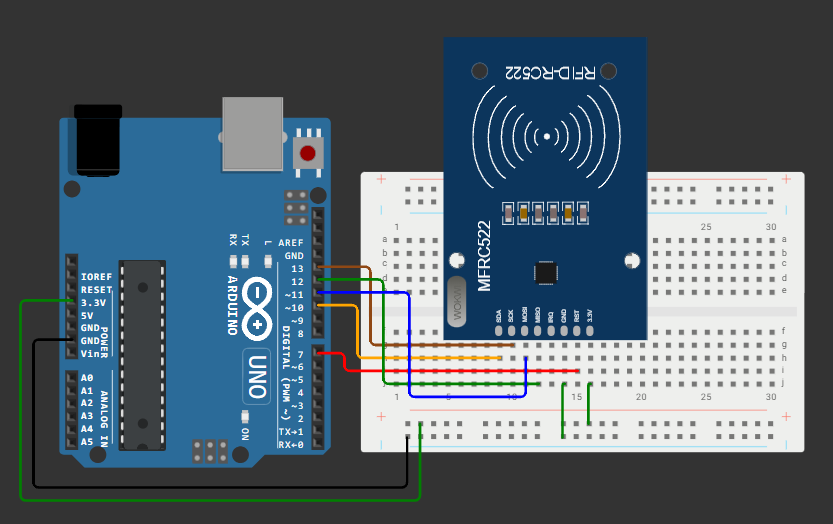
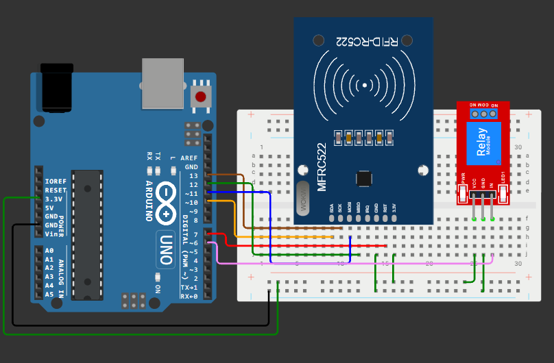

# Занятие 13. Шина SPI: графический дисплей ILI9341 и RFID-считыватель

**Цель занятия:** освоить шину SPI, научиться работать с графическим дисплеем в условиях жёсткого дефицита памяти и подключить несколько устройств к одной шине.

**Что понадобится:** Arduino UNO, TFT-дисплей ILI9341, модуль RFID RC522 с картой и брелоком, релейный модуль, резисторы для делителей, светодиоды.

---

## 1. Шина SPI

**SPI** (**S**erial **P**eripheral **I**nterface) разработана Motorola и, в отличие от I2C, не стандартизована формально - отсюда разночтения в названиях выводов у разных производителей.

### Линии

| Линия | Расшифровка | Направление | Вывод на UNO |
| --- | --- | --- | --- |
| **SCK** | Serial Clock | Ведущий -> ведомые | D13 |
| **MOSI** | Master Out, Slave In | Ведущий -> ведомые | D11 |
| **MISO** | Master In, Slave Out | Ведомый -> ведущий | D12 |
| **SS / CS** | Slave Select / Chip Select | Ведущий -> **конкретный** ведомый | любой, обычно D10 |

Встречаются и другие обозначения: SDI/SDO, DIN/DOUT, а в новой терминологии - COPI/CIPO. Смысл тот же.

### Как выбирается устройство

В I2C устройство адресуется числом внутри посылки. В SPI адресов нет: у **каждого** ведомого своя линия выбора.

```tikz Несколько устройств на одной шине SPI: общие линии данных, отдельные линии выбора
\begin{tikzpicture}[x=1cm,y=1cm]
  \node[mcu, minimum height=42mm, minimum width=26mm] (mcu) at (0,0) {Arduino\\UNO};
  \node[device, minimum width=32mm] (d1) at (9.0,2.6)  {Устройство 1};
  \node[device, minimum width=32mm] (d2) at (9.0,0)    {Устройство 2};
  \node[device, minimum width=32mm] (d3) at (9.0,-2.6) {Устройство 3};

  % магистраль из трёх линий: один общий ствол
  \draw[sig, line width=1.6pt] (1.3,1.6) -- (4.0,1.6) -- (4.0,-2.6);
  \node[lab, text=sig, anchor=south, align=center] at (2.6,1.75) {SCK, MOSI, MISO};
  \foreach \d/\y in {d1/2.6, d2/0, d3/-2.6} {
    \draw[sig, line width=1.6pt] (4.0,\y) -- ([yshift=3.5mm] \d.west);
    \fill[sig] (4.0,\y) circle (2pt);
  }
  \draw[sig, line width=1.6pt] (4.0,1.6) -- (4.0,2.6);

  % отдельные линии выбора
  \foreach \pin/\d/\y/\ry in {D10/d1/2.6/0.7, D9/d2/0/0.0, D8/d3/-2.6/-0.7} {
    \node[lab, text=acc, anchor=west] at (1.4,\ry) {\pin};
    \draw[flow, draw=acc] (2.3,\ry) -- (5.4,\ry) -- (5.4,\y)
          -- ([yshift=-3.5mm] \d.west) node[lab, text=acc, above, pos=0.85] {CS};
  }
  \node[note, anchor=north, align=center] at (5.0,-4.2)
    {SCK, MOSI и MISO идут на все устройства сразу;\\
     активно то, у которого CS переведён в низкий уровень};
\end{tikzpicture}
```

Активный уровень CS - **низкий**. Пока CS высокий, устройство полностью игнорирует шину и переводит свой MISO в высокоимпедансное состояние, не мешая остальным.

Отсюда правило: **в каждый момент времени активен ровно один CS**. Два одновременно опущенных CS - короткое замыкание на линии MISO.

### Полный дуплекс

SPI - единственная из трёх шин, работающая в **полном дуплексе**: за один такт бит уходит по MOSI и одновременно приходит по MISO. Ведущий и ведомый как бы обмениваются содержимым своих сдвиговых регистров.

Следствие, которое поначалу удивляет: чтобы **прочитать** байт, нужно **отправить** байт. Что именно отправлять, если данные не нужны, - неважно, обычно шлют `0x00` или `0xFF`.

```cpp
uint8_t received = SPI.transfer(0x00);   // отправили пустышку, получили данные
```

### Режимы SPI

Устройства могут по-разному трактовать фронты тактового сигнала. Комбинация двух параметров даёт четыре режима:

| Режим | CPOL (уровень покоя SCK) | CPHA (по какому фронту читать) |
| --- | --- | --- |
| MODE0 | 0 | по переднему |
| MODE1 | 0 | по заднему |
| MODE2 | 1 | по переднему |
| MODE3 | 1 | по заднему |

Большинство устройств (в том числе ILI9341 и RC522) используют **MODE0**. При неверном режиме обмен идёт, но данные приходят искажёнными - характерный симптом "устройство отвечает, но чепухой".

### Библиотека SPI

```cpp
#include <SPI.h>

void setup() {
    pinMode(CS_PIN, OUTPUT);
    digitalWrite(CS_PIN, HIGH);           // деактивируем устройство сразу
    SPI.begin();
}

void writeToDevice(uint8_t reg, uint8_t value) {
    SPI.beginTransaction(SPISettings(4000000, MSBFIRST, SPI_MODE0));
    digitalWrite(CS_PIN, LOW);
    SPI.transfer(reg);
    SPI.transfer(value);
    digitalWrite(CS_PIN, HIGH);
    SPI.endTransaction();
}
```

`beginTransaction()`/`endTransaction()` нужны, когда на шине несколько устройств с разными скоростями или режимами: они запоминают и восстанавливают настройки. С одним устройством можно обойтись `SPI.setClockDivider()` в `setup()`, но привычка использовать транзакции полезна.

### SPI против I2C

| | I2C | SPI |
| --- | --- | --- |
| Линий | 2 | 3 + по одной на устройство |
| Скорость на UNO | 100-400 кГц | до 8 МГц |
| Адресация | по адресу в посылке | отдельной линией CS |
| Дуплекс | полудуплекс | полный дуплекс |
| Подтверждение приёма | есть (ACK) | нет |
| Устройств | до 112 | ограничено числом свободных выводов |
| Длина линий | десятки сантиметров | десятки сантиметров |

Практический вывод: **I2C - для медленных датчиков, которых много; SPI - для быстрых устройств, которым нужен поток данных** (дисплеи, карты памяти, радиомодули).

---

## 2. Графический дисплей ILI9341

Цветной TFT-дисплей 240x320 точек, 65 536 цветов (RGB565), интерфейс SPI. Качественный скачок по сравнению с 1602: вместо 32 знакомест - 76 800 пикселей.

### Согласование уровней - обязательно

Контроллер ILI9341 питается от 3,3 В и **не толерантен к 5 В**. Arduino UNO выдаёт 5 В.

Некоторые модули имеют на плате преобразователь уровней (микросхема вроде 74HC4050 рядом с разъёмом) и стабилизатор 3,3 В - такие можно подключать напрямую. Если их нет, **каждую** линию от Arduino к дисплею нужно завести через делитель напряжения:

```
D11 (MOSI) --[ 2,2 кОм ]--+-- MOSI дисплея
                          |
                     [ 3,3 кОм ]
                          |
                         GND
```

Делители нужны на линиях SCK, MOSI, CS, DC, RESET. Линия MISO идёт **от** дисплея и делителя не требует.

> Из резисторов набора подойдёт пара 1 кОм + 2 кОм (два по 1 кОм последовательно): получится 5 В x 2/3 = 3,33 В.

> Работа без согласования уровней часто "как будто работает", но сокращает жизнь модуля и даёт плавающие сбои. Не пропускайте этот шаг.

### Подключение

| Вывод дисплея | Вывод UNO | Примечание |
| --- | --- | --- |
| VCC | 5 В или 3,3 В | По документации модуля |
| GND | GND | |
| CS | D10 | Через делитель |
| RESET | D8 | Через делитель |
| DC (RS) | D9 | Через делитель |
| MOSI (SDI) | D11 | Через делитель |
| SCK | D13 | Через делитель |
| LED | 3,3 В | Подсветка |
| MISO (SDO) | D12 | Напрямую, нужен только для чтения |

Линия **DC** (Data/Command) отличает команды от данных - аналог RS у HD44780.

### Ограничение памяти - главное на этом занятии

Кадровый буфер занял бы

```
240 x 320 x 2 байта = 153 600 байт
```

Это **в 75 раз больше**, чем вся SRAM ATmega328P. Отсюда следуют правила, определяющие всю архитектуру программы:

- **буфера кадра нет** - рисование идёт напрямую в память дисплея;
- **нельзя "перерисовать всё"** каждый кадр: полная заливка экрана занимает около 0,3 с и выглядит как заметное мигание;
- **перерисовывается только изменившаяся область** - и именно она, а не вся строка;
- **изображения** хранятся во Flash через `PROGMEM` и передаются построчно;
- **шрифты** - тоже во Flash.

Это не недостаток учебной платы, а типичная ситуация встраиваемой разработки: на STM32 с 20 КБ ОЗУ буфер тоже не поместится.

### Первая программа

```cpp
#include <SPI.h>
#include <Adafruit_GFX.h>
#include <Adafruit_ILI9341.h>

#define TFT_CS   10
#define TFT_DC    9
#define TFT_RST   8

Adafruit_ILI9341 tft = Adafruit_ILI9341(TFT_CS, TFT_DC, TFT_RST);

void setup() {
    Serial.begin(9600);
    tft.begin();
    tft.setRotation(1);                       // 0-3: поворот на 0/90/180/270 градусов
    tft.fillScreen(ILI9341_BLACK);

    tft.setCursor(10, 10);
    tft.setTextColor(ILI9341_WHITE);
    tft.setTextSize(2);
    tft.println(F("Programmirovanie MK"));

    tft.drawRect(5, 5, tft.width() - 10, tft.height() - 10, ILI9341_CYAN);
    tft.fillCircle(160, 120, 30, ILI9341_RED);
    tft.drawLine(0, 0, tft.width(), tft.height(), ILI9341_GREEN);
}

void loop() { }
```

### Основные методы Adafruit_GFX

```cpp
tft.fillScreen(color);
tft.drawPixel(x, y, color);
tft.drawLine(x0, y0, x1, y1, color);
tft.drawRect(x, y, w, h, color);          tft.fillRect(x, y, w, h, color);
tft.drawCircle(x, y, r, color);           tft.fillCircle(x, y, r, color);
tft.drawTriangle(...);                    tft.fillTriangle(...);
tft.drawRoundRect(x, y, w, h, r, color);

tft.setCursor(x, y);
tft.setTextColor(color);                  // прозрачный фон
tft.setTextColor(color, bgColor);         // с фоном - важно, см. ниже
tft.setTextSize(n);                       // масштаб базового шрифта 6x8
tft.print(...); tft.println(...);
```

Цвет задаётся в формате **RGB565**: 5 бит красного, 6 зелёного, 5 синего в одном 16-битном слове. Есть готовые константы (`ILI9341_RED`, `ILI9341_BLUE` и т. д.) и функция сборки:

```cpp
uint16_t color = tft.color565(255, 128, 0);   // оранжевый
```

### Как обновлять показания без мигания

Наивный подход - стереть прямоугольник и написать заново - даёт заметное моргание:

```cpp
tft.fillRect(10, 50, 100, 20, ILI9341_BLACK);   // ПЛОХО: видно мигание
tft.setCursor(10, 50);
tft.print(temperature);
```

Правильно - **вывести текст с непрозрачным фоном**: библиотека закрашивает знакоместа фоновым цветом прямо в процессе рисования символов, и промежуточного "пустого" состояния не возникает.

```cpp
void showValue(float value) {
    static float last = NAN;
    if (!isnan(last) && fabs(value - last) < 0.05) return;   // не изменилось - не рисуем
    last = value;

    tft.setCursor(10, 50);
    tft.setTextColor(ILI9341_WHITE, ILI9341_BLACK);          // цвет текста и фона
    tft.setTextSize(3);
    tft.print(value, 1);
    tft.print(F(" C   "));                                    // пробелы затирают хвосты
}
```

Два приёма - те же, что на дисплее 1602: рисовать только при изменении и дополнять пробелами. Разница лишь в масштабе последствий.

### График в реальном времени

Классическая задача, где ограничение памяти видно наглядно. Хранить весь график нельзя, но можно хранить массив последних значений по количеству столбцов графика:

```cpp
const uint8_t GRAPH_W = 160;
uint8_t history[GRAPH_W];        // 160 байт - приемлемо
uint8_t head = 0;

void addPoint(uint8_t v) {
    history[head] = v;
    head = (head + 1) % GRAPH_W;
}

void drawGraph(int16_t x0, int16_t y0, uint8_t h) {
    for (uint8_t i = 0; i < GRAPH_W; i++) {
        uint8_t idx = (head + i) % GRAPH_W;
        uint8_t value = map(history[idx], 0, 255, 0, h);
        tft.drawFastVLine(x0 + i, y0, h, ILI9341_BLACK);              // стереть столбец
        tft.drawFastVLine(x0 + i, y0 + h - value, value, ILI9341_GREEN); // нарисовать
    }
}
```

Ещё эффективнее - сдвигать изображение аппаратно и дорисовывать только новый столбец. Это хорошая дополнительная задача.

### Библиотека TFT_eSPI

`Adafruit_GFX` универсальна, но медленна. Библиотека `TFT_eSPI` работает с ILI9341 в несколько раз быстрее за счёт прямой работы с регистрами SPI, поддерживает спрайты и произвольные шрифты. Её настройка сложнее (нужно редактировать `User_Setup.h`), но для задач с анимацией она оправдана.

---

## 3. RFID-считыватель RC522

Модуль читает бесконтактные карты стандарта ISO 14443A на частоте 13,56 МГц. В комплекте карта и брелок - обычно MIFARE Classic 1K.

### Как это работает физически

В карте нет батарейки. Считыватель излучает переменное электромагнитное поле; катушка внутри карты работает как вторичная обмотка трансформатора и питает микросхему. Обмен идёт модуляцией того же поля - карта меняет нагрузку своей катушки, а считыватель это регистрирует.

Отсюда малая дальность (несколько сантиметров) и чувствительность к металлу рядом с картой.

### Подключение

**Питание - строго 3,3 В.** Подача 5 В выводит модуль из строя.

| Вывод модуля | Вывод UNO |
| --- | --- |
| 3.3V | 3,3 В |
| GND | GND |
| RST | D7 |
| SDA (SS) | D10 |
| MOSI | D11 |
| MISO | D12 |
| SCK | D13 |



### Чтение UID

```cpp
#include <SPI.h>
#include <MFRC522.h>

#define RST_PIN 7
#define SS_PIN 10

MFRC522 rfid(SS_PIN, RST_PIN);

void setup() {
    Serial.begin(9600);
    SPI.begin();
    rfid.PCD_Init();
    Serial.println(F("Поднесите карту"));
}

void loop() {
    if (!rfid.PICC_IsNewCardPresent()) return;
    if (!rfid.PICC_ReadCardSerial())   return;

    Serial.print(F("UID:"));
    for (byte i = 0; i < rfid.uid.size; i++) {
        Serial.print(rfid.uid.uidByte[i] < 0x10 ? " 0" : " ");
        Serial.print(rfid.uid.uidByte[i], HEX);
    }
    Serial.println();

    Serial.print(F("Тип: "));
    Serial.println(rfid.PICC_GetTypeName(rfid.PICC_GetType(rfid.uid.sak)));

    rfid.PICC_HaltA();          // завершаем сеанс с картой
    rfid.PCD_StopCrypto1();
}
```

`PICC_HaltA()` обязателен: без него карта останется "активной" и повторное поднесение не будет обнаружено.

### Система контроля доступа



```cpp
#include <SPI.h>
#include <MFRC522.h>

#define RST_PIN   7
#define SS_PIN    10
#define RELAY_PIN 6
#define RELAY_ON  LOW               // у большинства модулей вход инверсный
#define RELAY_OFF HIGH

MFRC522 rfid(SS_PIN, RST_PIN);

const byte AUTHORIZED[][4] = {
    { 0x12, 0x34, 0x56, 0x78 },
    { 0xAB, 0xCD, 0xEF, 0x12 }
};
const uint8_t AUTHORIZED_COUNT = sizeof(AUTHORIZED) / sizeof(AUTHORIZED[0]);

bool isAuthorized(const byte *uid, byte size) {
    if (size != 4) return false;
    for (uint8_t i = 0; i < AUTHORIZED_COUNT; i++) {
        if (memcmp(uid, AUTHORIZED[i], 4) == 0) return true;
    }
    return false;
}

void setup() {
    Serial.begin(9600);
    SPI.begin();
    rfid.PCD_Init();
    pinMode(RELAY_PIN, OUTPUT);
    digitalWrite(RELAY_PIN, RELAY_OFF);
}

void loop() {
    if (!rfid.PICC_IsNewCardPresent()) return;
    if (!rfid.PICC_ReadCardSerial())   return;

    if (isAuthorized(rfid.uid.uidByte, rfid.uid.size)) {
        Serial.println(F("Доступ разрешён"));
        digitalWrite(RELAY_PIN, RELAY_ON);
        delay(2000);
        digitalWrite(RELAY_PIN, RELAY_OFF);
    } else {
        Serial.println(F("Доступ запрещён"));
    }

    rfid.PICC_HaltA();
    rfid.PCD_StopCrypto1();
}
```

Список разрешённых UID заполните значениями, считанными предыдущей программой.

> **О безопасности.** UID передаётся в открытом виде и **не является секретом**: его тривиально скопировать любым доступным дубликатором. Система, проверяющая только UID, защищает не больше, чем табличка "не входить". Настоящие системы используют криптографическую аутентификацию с секторными ключами (у MIFARE Classic она к тому же давно взломана) или карты DESFire. В учебной работе это допустимо, но в отчёте стоит указать ограничение.

### Реле

Релейный модуль коммутирует нагрузку, недоступную микроконтроллеру. Его вход обычно **инверсный**: `LOW` включает реле. Проверьте это на своём модуле и вынесите в константы `RELAY_ON`/`RELAY_OFF`, как в примере.

Между сигнальной и силовой частями модуля стоит оптопара - гальваническая развязка. Она защищает микроконтроллер от помех при коммутации.

**В рамках курса реле коммутирует только низковольтную нагрузку. Сеть 220 В не подключается ни при каких условиях.**

---

## 4. Модуль SD-карт: журналирование данных

EEPROM микроконтроллера вмещает килобайт - десятки записей. Когда нужен журнал на недели работы, данные пишут на SD-карту. Интерфейс - тот же SPI, поэтому модуль встаёт на уже разведённую шину: нужна лишь ещё одна линия CS.

```cpp
#include <SPI.h>
#include <SD.h>

const uint8_t SD_CS = 4;

void setup() {
    Serial.begin(9600);
    if (!SD.begin(SD_CS)) {
        Serial.println(F("SD: карта не найдена"));
        return;                 // работаем без журнала, но работаем
    }
}

void logValue(float t, float h) {
    File f = SD.open("DATA.CSV", FILE_WRITE);
    if (!f) return;             // карту вынули - не падаем
    f.print(millis());
    f.print(',');
    f.print(t, 1);
    f.print(',');
    f.println(h, 1);
    f.close();                  // close() выполняет flush
}
```

### Три вещи, которые ломают программу

**Память.** Библиотека `SD` требует около **0,5 КБ SRAM** под буфер сектора - четверть всей памяти UNO. Вместе с дисплеем, графиками и меню её может не хватить, причём отказ проявится не сообщением об ошибке, а случайными зависаниями. Если программа "поплыла" сразу после добавления работы с картой - первым делом измерьте свободную SRAM ([занятие 17](../17-memory/note.md)).

**Время.** Физическая запись сектора занимает от единиц до **сотен миллисекунд**, причём разброс огромен и непредсказуем: карта может в любой момент заняться внутренним обслуживанием. Это самая долгая операция во всём курсе. Вызов `close()` в основном цикле неблокирующей программы недопустим - на это время встанет и индикация, и опрос датчиков.

Практическое решение: держать файл открытым и вызывать `flush()` редко - например, раз в 10 записей или раз в минуту. Компромисс очевиден: чем реже сброс, тем больше данных теряется при внезапном отключении питания. Выбор обосновывается в отчёте.

**Извлечение карты.** Карту могут вынуть в любой момент. Каждый вызов, возвращающий `File`, проверяется - иначе программа обратится к недействительному объекту.

### Формат имени и данных

Библиотека поддерживает только имена в формате **8.3** (`DATA.CSV`, `LOG0001.TXT`); длинные имена не работают. Карта форматируется в FAT16 или FAT32.

Формат CSV выбран не случайно: файл открывается любой электронной таблицей, и по нему сразу строится график. Это удобнее собственного двоичного формата, пока объём данных невелик.

> **Питание.** Модуль SD-карт - третье устройство на 3,3 В в вашей схеме после ILI9341 и RC522. Суммарное потребление по этой линии может превысить предел стабилизатора платы в 50 мА. В момент записи карта потребляет до 100 мА пиками - при недостаточном питании это проявляется как случайные ошибки записи. Проверьте ток и при необходимости запитайте линию 3,3 В отдельно.

---

## 5. Несколько устройств на одной шине

Заметили конфликт? И дисплей, и RFID-модуль в примерах используют **D10** в качестве CS. Одновременно так не получится.

Правильное подключение:

```cpp
#define TFT_CS   10
#define RFID_SS   9
#define TFT_DC    8
#define TFT_RST   7
#define RFID_RST  6
```

Линии SCK, MOSI, MISO - общие, у каждого устройства своя линия CS. Правила, которые нужно соблюдать:

1. **Все CS инициализируются в `HIGH` в самом начале `setup()`**, до вызова `SPI.begin()`. Иначе неинициализированный вывод может оказаться в низком уровне и устройство "влезет" в чужой обмен.
2. **В каждый момент активен ровно один CS.** Библиотеки делают это сами, но при их совместной работе проверять стоит.
3. **Разные скорости и режимы** - через `SPI.beginTransaction()` с индивидуальными настройками.
4. **Согласование уровней.** Дисплей работает от 3,3 В, RC522 тоже - это удобно, но линия MISO от 3,3-вольтового устройства даёт логическую единицу 3,3 В, что для входа ATmega328P при 5 В достаточно (порог 3,0 В), хотя и без запаса.

Дополнительная сложность: **суммарное потребление** по линии 3,3 В. Стабилизатор на плате UNO отдаёт не более 50 мА, а RC522 в момент чтения карты потребляет до 30 мА. Дисплей с подсветкой - существенно больше, и его подсветку лучше питать отдельно.

---

## Контрольные вопросы

1. Чем адресация в SPI отличается от адресации в I2C?
2. Почему для чтения байта по SPI необходимо отправить байт?
3. Что произойдёт, если два CS одновременно окажутся в низком уровне?
4. Как проявится неверно выбранный режим SPI (например, MODE3 вместо MODE0)?
5. Почему для ILI9341 на Arduino UNO невозможен кадровый буфер и как это влияет на архитектуру программы?
6. Зачем дисплею нужна линия DC и с чем её можно сравнить у дисплея 1602?
7. Почему при обновлении показаний на TFT предпочтительнее `setTextColor(color, bg)`, а не `fillRect` перед выводом?
8. Как физически питается RFID-карта, если в ней нет батарейки?
9. Почему система доступа, проверяющая только UID карты, не является защищённой?
10. Вы подключаете к одной шине SPI дисплей и RFID-модуль. Перечислите всё, что нужно предусмотреть.

## Задание

Задачи занятия - в [task.md](task.md).
