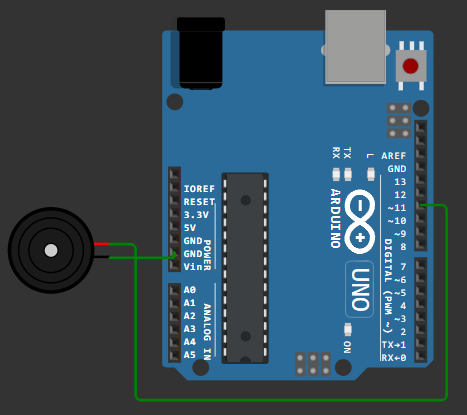
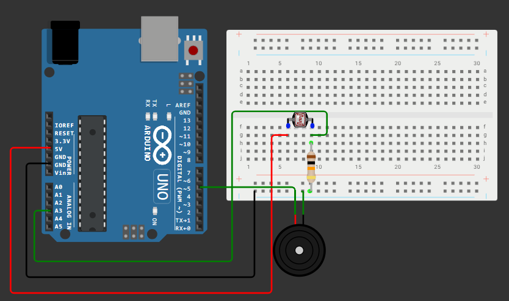
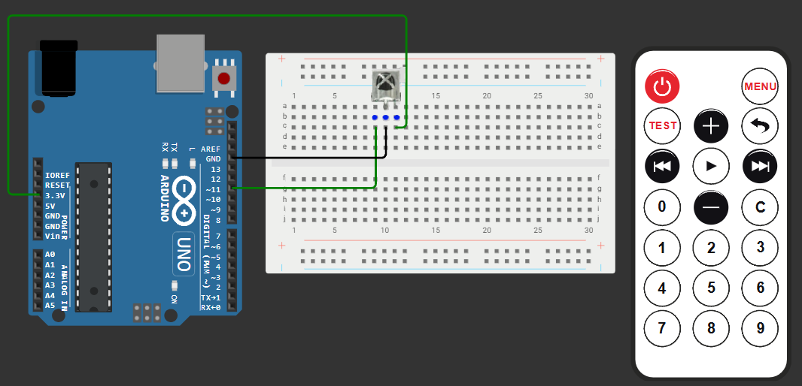

# Занятие 14. Звук, ИК-управление и микрофон

**Цель занятия:** научиться генерировать звук, принимать команды с инфракрасного пульта и измерять уровень звукового сигнала; разобраться, как устроены протоколы дистанционного управления.

**Что понадобится:** Arduino UNO, зуммеры (активный и пассивный), ИК-приёмник, ИК-пульт, микрофонный модуль, фоторезистор, светодиоды.

---

## 1. Как микроконтроллер издаёт звук

Звук - это колебания давления воздуха. Чтобы их создать, нужно заставить мембрану двигаться с частотой, попадающей в слышимый диапазон (примерно от 20 Гц до 20 кГц).

Микроконтроллер умеет только переключать вывод между 0 и 5 В. Если делать это с частотой 440 раз в секунду, получится нота "ля" первой октавы - прямоугольный сигнал звучит резче синусоиды, но высота тона определяется именно частотой.

Связь частоты и периода:

$$f = \frac{1}{T} \qquad T = \frac{1}{f}$$

Для 440 Гц период составляет

$$T = \frac{1}{440} \approx 2273 \text{ мкс}$$

то есть 1136 мкс вывод удерживается в высоком состоянии и столько же - в низком.

### Два вида зуммеров

В наборе их два, и это, как правило, **разные** компоненты.

| | Пассивный (пьезоизлучатель) | Активный |
| --- | --- | --- |
| Внутри | Только пьезопластина | Пластина плюс генератор |
| Что подавать | Переменный сигнал нужной частоты | Постоянное напряжение |
| Управление высотой тона | Есть | Нет, тон фиксирован |
| Мелодии | Можно | Нельзя |
| Функция `tone()` | Работает | Бесполезна |

Как отличить: подайте на зуммер 5 В через резистор 220 Ом. Активный запищит непрерывно, пассивный издаст один щелчок. Снизу у активного плата обычно залита компаундом.

Для музыкальных задач нужен **пассивный**.

---

## 2. Функция tone()

```cpp
tone(pin, frequency);              // звучит, пока не вызовут noTone()
tone(pin, frequency, duration);    // звучит указанное число миллисекунд
noTone(pin);                       // выключить
```



Зуммер подключается между цифровым выводом и GND. Ток небольшой, резистор не обязателен, но резистор 100-220 Ом снижает громкость до терпимой в аудитории и защищает вывод.

### Что важно знать про tone()

**Занимает Timer2.** Пока звучит нота, ШИМ на выводах **D3 и D11** не работает. Если в проекте есть RGB-светодиод на этих выводах, он будет вести себя странно во время звука.

**Не блокирует программу.** Даже вариант с параметром `duration` возвращает управление немедленно: сигнал формирует таймер, а не процессор. Пауза между нотами должна быть сделана отдельно.

**Работает с одним выводом за раз.** Вызов `tone()` для другого вывода прекратит звук на предыдущем. Двухголосную мелодию средствами `tone()` не сыграть.

**Диапазон частот** - примерно от 31 Гц до 65 535 Гц, но реально слышимо и осмысленно от 100 Гц до 5 кГц.

### Мелодия

```cpp
const int BUZZER = 11;

// частоты нот в герцах
#define NOTE_C4  262
#define NOTE_D4  294
#define NOTE_E4  330
#define NOTE_F4  349
#define NOTE_G4  392
#define NOTE_A4  440
#define NOTE_B4  494
#define NOTE_C5  523

const uint16_t melody[] = {
    NOTE_E4, NOTE_E4, NOTE_E4,
    NOTE_E4, NOTE_E4, NOTE_E4,
    NOTE_E4, NOTE_G4, NOTE_C4, NOTE_D4, NOTE_E4
};

// длительность: 4 = четверть, 8 = восьмая
const uint8_t durations[] = {
    8, 8, 4,
    8, 8, 4,
    8, 8, 8, 8, 2
};

const uint8_t NOTE_COUNT = sizeof(melody) / sizeof(melody[0]);

void setup() {
    pinMode(BUZZER, OUTPUT);
}

void loop() {
    for (uint8_t i = 0; i < NOTE_COUNT; i++) {
        uint16_t noteMs = 1000 / durations[i];
        tone(BUZZER, melody[i], noteMs);
        delay(noteMs * 1.30);              // пауза чуть длиннее ноты - ноты разделяются
    }
    noTone(BUZZER);
    delay(2000);
}
```

Множитель 1,30 создаёт короткую тишину между нотами. Без неё одинаковые ноты подряд сольются в один длинный звук.

Формула длительности: если целая нота равна 1000 мс, то нота с "делителем" $d$ длится $1000/d$ мс. Четверть - 250 мс, восьмая - 125 мс.

Массивы нот стоит положить во Flash через `PROGMEM`: мелодия из 100 нот заняла бы 300 байт SRAM из 2048.

### Неблокирующее воспроизведение

Пример выше использует `delay()` и потому непригоден для реальной программы. Правильный вариант - конечный автомат ([занятие 7](../07-timing-multitasking/note.md)):

```cpp
class Melody {
public:
    void play() { _index = 0; _noteStart = 0; _playing = true; }
    void stop() { noTone(_pin); _playing = false; }
    bool isPlaying() const { return _playing; }

    void update() {
        if (!_playing) return;

        unsigned long noteMs = 1000UL / durations[_index];
        if (millis() - _noteStart < noteMs * 1.30) return;

        if (_index >= NOTE_COUNT) { stop(); return; }

        tone(_pin, melody[_index], noteMs);
        _noteStart = millis();
        _index++;
    }

private:
    uint8_t _pin = 11;
    uint8_t _index = 0;
    unsigned long _noteStart = 0;
    bool _playing = false;
};
```

Теперь мелодия играет "в фоне", а программа продолжает опрашивать кнопки и датчики.

### Звук без tone()

Понимать, как это работает без библиотеки, полезно:

```cpp
void beep(uint8_t pin, uint16_t frequency, uint16_t durationMs) {
    unsigned long halfPeriodUs = 1000000UL / frequency / 2;
    unsigned long cycles = (unsigned long)frequency * durationMs / 1000;

    for (unsigned long i = 0; i < cycles; i++) {
        digitalWrite(pin, HIGH);
        delayMicroseconds(halfPeriodUs);
        digitalWrite(pin, LOW);
        delayMicroseconds(halfPeriodUs);
    }
}
```

Здесь видно, откуда берутся формулы: полупериод в микросекундах и количество полных колебаний за время звучания. Недостаток очевиден - процессор занят всё время звучания.

### Терменвокс: звук, управляемый светом



```cpp
const int BUZZER = 5;
const int LDR = A3;

void setup() {
    pinMode(BUZZER, OUTPUT);
    Serial.begin(9600);
}

void loop() {
    int light = analogRead(LDR);
    int frequency = map(light, 0, 1023, 100, 2500);
    tone(BUZZER, frequency);
    delay(20);
}
```

Наглядная демонстрация связки "аналоговый вход - частота". Стоит добавить мёртвую зону: при полной темноте звук лучше выключать через `noTone()`, а не издавать 100 Гц.

---

## 3. Инфракрасное дистанционное управление

### Как это устроено

Пульт содержит инфракрасный светодиод, который мигает с частотой **38 кГц** - это несущая частота. Данные передаются модуляцией: наличие или отсутствие пачки импульсов несущей кодирует биты.

Несущая нужна, чтобы отличить сигнал пульта от постороннего инфракрасного излучения - солнца, ламп, тепла тела. Приёмник настроен на 38 кГц и всё остальное игнорирует.

Приёмник **VS1838B** содержит фотодиод, усилитель, полосовой фильтр и демодулятор. На выходе - уже готовый цифровой сигнал: длинные и короткие импульсы, без несущей.

```tikz Приёмник снимает несущую 38 кГц и отдаёт готовый цифровой сигнал
\begin{tikzpicture}[x=1cm,y=1cm]
  \node[note, anchor=east, align=right] at (-0.2,2.5) {излучение\\пульта};
  \foreach \xs/\len in {0.4/1.4, 2.6/2.2, 5.6/0.8} {
    \draw[clk, semithick, pattern={Lines[angle=90, distance=1.1pt, line width=0.5pt]},
          pattern color=clk] (\xs,2.1) rectangle (\xs+\len,2.9);
  }
  \node[note, text=clk, anchor=west] at (7,2.5) {пачки несущей 38 кГц};

  \node[note, anchor=east, align=right] at (-0.2,0.55) {выход\\приёмника};
  \wave[draw=sig]{0.4}{0}{0.1}{1.1}{1,1,1,1,1,1,1,1,1,1,1,1,1,1,0,0,0,0,0,0,0,0,1,1,1,1,1,1,1,1,1,1,1,1,1,1,1,1,1,1,1,1,0,0,0,0,0,0}
  \node[note, anchor=west] at (7,0.55) {готовый цифровой сигнал};

  \foreach \x in {0.4,1.8,2.6,4.8} { \draw[muted!45, densely dashed] (\x,0) -- (\x,2.1); }
  \node[note, anchor=north, align=center] at (3.6,-0.55)
    {демодулятор снимает несущую:\\остаются только длинные и короткие импульсы};
\end{tikzpicture}
```

### Протокол NEC

Самый распространённый протокол бытовых пультов:

| Элемент | Длительность |
| --- | --- |
| Стартовая посылка | 9 мс несущей + 4,5 мс паузы |
| Логический "0" | 560 мкс несущей + 560 мкс паузы |
| Логическая "1" | 560 мкс несущей + 1690 мкс паузы |
| Пакет | 8 бит адреса, 8 бит инверсного адреса, 8 бит команды, 8 бит инверсной команды |
| Повтор при удержании | 9 мс + 2,25 мс, каждые 110 мс |

Инверсные копии адреса и команды - простейшая проверка целостности: приёмник убеждается, что сумма прямого и инверсного байта равна 255.

Разбирать эти длительности вручную можно (мы умеем измерять импульсы после [занятия 9](../09-timers/note.md)), но на практике используют библиотеку.

### Подключение



У VS1838B три вывода. **Расположение выводов зависит от производителя** - обязательно сверьтесь с маркировкой, глядя на выпуклую сторону корпуса. Типичный порядок слева направо: OUT, GND, VCC.

| Вывод | Куда |
| --- | --- |
| VCC | 3,3 В или 5 В |
| GND | GND |
| OUT | любой цифровой вывод (в примере D11) |

Ошибка в подключении питания наоборот приводит к нагреву и выходу приёмника из строя за несколько секунд.

### Считывание кодов

```cpp
#include <IRremote.hpp>

#define IR_RECEIVE_PIN 11

void setup() {
    Serial.begin(9600);
    IrReceiver.begin(IR_RECEIVE_PIN, ENABLE_LED_FEEDBACK);
    Serial.println(F("Нажимайте кнопки пульта"));
}

void loop() {
    if (IrReceiver.decode()) {
        Serial.print(F("Протокол: "));
        Serial.print(getProtocolString(IrReceiver.decodedIRData.protocol));
        Serial.print(F("  Адрес: 0x"));
        Serial.print(IrReceiver.decodedIRData.address, HEX);
        Serial.print(F("  Команда: 0x"));
        Serial.print(IrReceiver.decodedIRData.command, HEX);

        if (IrReceiver.decodedIRData.flags & IRDATA_FLAGS_IS_REPEAT) {
            Serial.print(F("  (повтор)"));
        }
        Serial.println();

        IrReceiver.resume();          // подготовиться к следующему сигналу
    }
}
```

Первый шаг любой работы с пультом - **записать коды его кнопок**. Они различаются у разных пультов, поэтому в программе их прописывают как константы после реального измерения:

```cpp
constexpr uint8_t BTN_POWER = 0x45;
constexpr uint8_t BTN_UP    = 0x40;
constexpr uint8_t BTN_DOWN  = 0x19;
constexpr uint8_t BTN_OK    = 0x1C;
```

### Обработка повторов

При удержании кнопки пульт шлёт короткие пакеты-повторы каждые 110 мс. Программа должна решить, что с ними делать:

- для кнопки "включить" повторы **игнорируются** - иначе устройство будет включаться и выключаться;
- для кнопки "громче" повторы **обрабатываются** - так и реализуется плавная регулировка удержанием.

```cpp
if (IrReceiver.decode()) {
    bool isRepeat = IrReceiver.decodedIRData.flags & IRDATA_FLAGS_IS_REPEAT;
    uint8_t cmd = IrReceiver.decodedIRData.command;

    if (cmd == BTN_UP && (!isRepeat || allowRepeat)) {
        brightness = min(brightness + 10, 255);
    }
    if (cmd == BTN_POWER && !isRepeat) {
        powerOn = !powerOn;
    }
    IrReceiver.resume();
}
```

### Конфликт с tone()

Библиотека `IRremote` использует **Timer2** для приёма, и функция `tone()` - тоже. Одновременно они не работают: попытка издать звук во время приёма ИК-сигнала приведёт к потере пакетов.

Способы обхода:

- перенастроить `IRremote` на другой таймер (задаётся макросом до `#include`);
- издавать звук только в моменты, когда приём заведомо не идёт;
- формировать звук программно, без `tone()`.

Это хорошая иллюстрация того, почему таблицу занятости таймеров из [занятия 9](../09-timers/note.md) нужно держать в голове при проектировании схемы.

---

## 4. Микрофонный модуль

Модуль содержит электретный микрофон, усилитель и компаратор LM393. Выводов обычно четыре:

| Вывод | Что даёт |
| --- | --- |
| VCC | 5 В |
| GND | GND |
| **AO** | Аналоговый выход - мгновенное значение сигнала |
| **DO** | Цифровой выход компаратора: `0`/`1` по порогу, порог задаётся подстроечным резистором на плате |

### Почему нельзя просто прочитать AO

Звуковой сигнал - **переменный**. Он колеблется вокруг середины питания (около 512 отсчётов АЦП). Одиночное измерение `analogRead()` попадёт в случайную точку колебания и ничего не скажет о громкости: и в тишине, и при громком звуке отдельный отсчёт может оказаться равным 512.

Громкость - это **размах** сигнала, то есть разница между максимумом и минимумом за некоторое окно времени:

```cpp
const int MIC = A0;
const unsigned long WINDOW_MS = 50;

uint16_t measureLoudness() {
    unsigned long start = millis();
    uint16_t maxValue = 0;
    uint16_t minValue = 1023;

    while (millis() - start < WINDOW_MS) {
        uint16_t sample = analogRead(MIC);
        if (sample > maxValue) maxValue = sample;
        if (sample < minValue) minValue = sample;
    }
    return maxValue - minValue;          // размах
}

void setup() {
    Serial.begin(9600);
}

void loop() {
    Serial.println(measureLoudness());
}
```

Окно в 50 мс охватывает несколько периодов даже самых низких слышимых частот и даёт устойчивый результат.

### Цифровой выход

Вывод DO проще: компаратор сравнивает уровень с порогом, заданным подстроечным резистором, и выдаёт `0` или `1`. Годится для задач вроде "хлопок включает свет", но настраивается вручную отвёрткой и не даёт градаций.

Типичная ошибка - ожидать от DO реакции на тихие звуки при выкрученном в крайнее положение подстроечнике. Порог нужно настраивать под конкретное помещение.

### Ограничения модуля

Это **не** измеритель уровня звука. Он не даёт децибелов, не калиброван, чувствителен к питанию и наводкам. Пригоден для относительных задач: "стало громче", "был хлопок", "есть звук".

---

## Контрольные вопросы

1. Чем активный зуммер отличается от пассивного и как отличить их без документации?
2. Рассчитайте период колебаний для ноты "ля" второй октавы (880 Гц) в микросекундах.
3. Почему `tone()` не блокирует программу, хотя звук продолжается?
4. Какой таймер занимает `tone()` и какие выводы ШИМ из-за этого перестают работать?
5. Зачем ИК-пульт модулирует сигнал несущей 38 кГц?
6. Что содержит пакет протокола NEC и зачем в нём инверсные копии байтов?
7. Как отличить удержание кнопки пульта от повторного нажатия?
8. Почему одиночный вызов `analogRead()` не позволяет измерить громкость звука?
9. Библиотека `IRremote` и функция `tone()` конфликтуют. В чём причина и какие есть решения?

## Задание

Задачи занятия - в [task.md](task.md).
