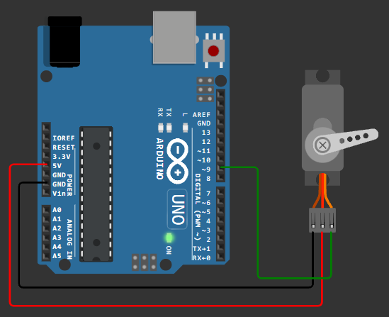
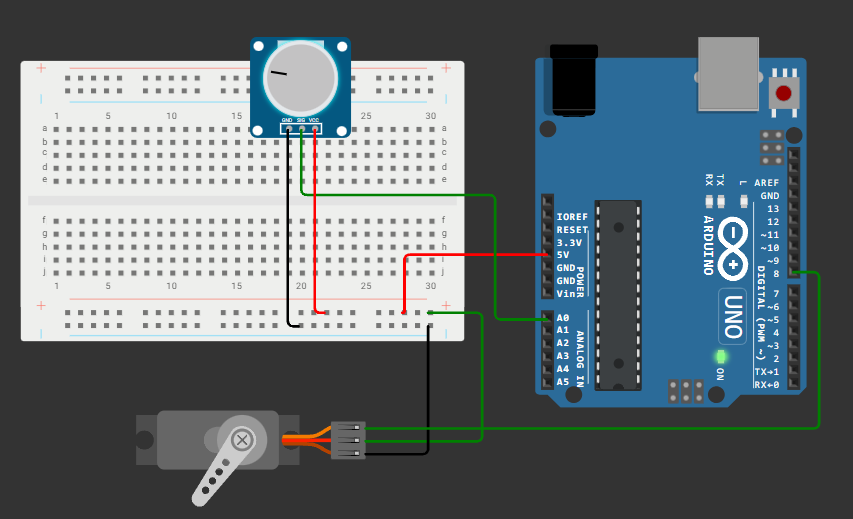

# Занятие 15. Приводы и силовая коммутация

**Цель занятия:** научиться управлять сервоприводом и шаговым двигателем, коммутировать нагрузку через реле и понимать, почему двигатели нельзя питать от платы.

**Что понадобится:** Arduino UNO, сервопривод SG90, шаговый двигатель с драйвером, релейный модуль, потенциометр, кнопки, внешний источник питания 5 В.

---

## 1. Почему приводам нужно отдельное питание

Начнём с самого важного практического вопроса занятия.

Вывод микроконтроллера отдаёт **до 20 мА**. Стабилизатор платы Arduino UNO при питании от USB - около 500 мА суммарно, при питании от разъёма - зависит от источника и сильно греется.

Потребление приводов набора:

| Устройство | Ток покоя | Ток в движении | Пусковой ток |
| --- | --- | --- | --- |
| Сервопривод SG90 | ~10 мА | 100-250 мА | до 700 мА |
| Шаговый 28BYJ-48 | ~200 мА (удержание) | ~240 мА | ~240 мА |
| Реле (обмотка) | 0 | 70-80 мА | 70-80 мА |

Что происходит, если питать сервопривод от вывода 5V платы: в момент старта двигателя ток скачком возрастает, напряжение на шине 5 В проседает ниже порога работы микроконтроллера, срабатывает схема сброса - **плата перезагружается**.

Симптом узнаваемый: "программа работает, но как только серва начинает двигаться, всё начинается заново".

### Правильное подключение

```tikz Правильное подключение сервопривода: питание от внешнего источника, земля общая
\begin{tikzpicture}[x=1cm,y=1cm]
  \node[tool, minimum width=36mm, minimum height=12mm]   (psu) at (0,3.0) {Внешний источник 5 В};
  \node[mcu, minimum width=36mm, minimum height=12mm]    (uno) at (0,0)   {Arduino UNO};
  \node[device, minimum width=34mm, minimum height=20mm] (srv) at (8.4,1.5){Сервопривод\\SG90};

  \draw[flow, draw=warn] ([yshift=3mm] psu.east) -- ++(3.4,0) |- ([yshift=6mm] srv.west);
  \node[lab, text=warn, anchor=south] at (3.4,3.35) {+5 В (красный)};

  \draw[semithick, draw=muted!55!black] ([yshift=-3mm] psu.east) -- ++(2.2,0)
        coordinate (gnd) -- ++(0,-1.05) -- ++(2.6,0) |- (srv.west);
  \node[lab, anchor=south] at (5.6,1.55) {GND (коричневый)};

  \draw[semithick, draw=muted!55!black] (gnd) -- (2.2,0) -- (uno.east);
  \fill[muted!55!black] (gnd) circle (1.6pt);
  \node[lab, anchor=west] at (2.35,1.3) {общая земля};

  \draw[flow, draw=sig] ([yshift=-3mm] uno.east) -- ++(4.6,0) |- ([yshift=-6mm] srv.west);
  \node[lab, text=sig, anchor=south] at (4.2,-0.75) {D9, сигнал (оранжевый)};

  \node[note, anchor=north, align=center] at (4.2,-2.2)
    {питание привода идёт мимо платы: в пике SG90 берёт до 700 мА,\\
     а вывод 5V столько не отдаёт. Земля при этом обязательно общая};
\end{tikzpicture}
```

Три правила:

1. **Плюс внешнего источника не соединяется** с выводом 5V платы.
2. **Земли соединяются обязательно** - иначе сигнал управления не имеет опорной точки, и сервопривод будет дёргаться случайным образом.
3. **Конденсатор 100-470 мкФ** по питанию двигателя рядом с ним сглаживает броски тока.

В качестве внешнего источника подойдёт зарядное устройство USB с отрезанным разъёмом, отдельный блок питания 5 В или батарейный отсек. Кабель питания от "кроны" 9 В из набора для сервопривода **не подходит**: 9 В превышают допустимые для SG90 6 В.

---

## 2. Сервопривод

### Что внутри

Сервопривод - это не просто мотор, а замкнутая система: двигатель постоянного тока, редуктор, потенциометр обратной связи и плата управления. Вы задаёте желаемый угол, а электроника сама доводит вал до него и удерживает.

SG90 из набора: угол поворота 0-180 градусов, момент около 1,5 кг*см, время поворота на 60 градусов - примерно 0,1 с.

### Как передаётся угол

Сервопривод управляется **не обычным ШИМ**. Ему нужны импульсы строго заданной формы:

| Параметр | Значение |
| --- | --- |
| Период | 20 мс (частота 50 Гц) |
| Длительность импульса для 0 градусов | ~0,5 мс |
| Длительность импульса для 90 градусов | ~1,5 мс |
| Длительность импульса для 180 градусов | ~2,5 мс |

```tikz Угол поворота задаётся длительностью импульса при постоянном периоде 20 мс
\begin{tikzpicture}[x=0.4cm,y=1cm]
  \foreach \row/\w/\ang/\ms in {0/1/0/{0,5}, 1/3/90/{1,5}, 2/5/180/{2,5}} {
    \begin{scope}[yshift=-\row*1.7cm]
      \draw[muted!30, densely dotted] (0,0) -- (21,0);
      \draw[sig, very thick] (0,0) -- (2,0) -- (2,0.9) -- (2+\w,0.9)
            -- (2+\w,0) -- (20,0) -- (20,0.9) -- (20+\w,0.9) -- (20+\w,0) -- (21.5,0);
      \node[note, anchor=west, font=\small] at (22.5,0.62) {\ang\ градусов};
      \node[note, anchor=west, text=acc] at (22.5,0.15) {импульс \ms\ мс};
      \ifnum\row=0
        \dimline{2}{20}{1.3}{период 20 мс (50 Гц)}
      \fi
    \end{scope}
  }
  \node[note, anchor=north, align=center] at (12,-4.5)
    {угол задаёт \textbf{длительность импульса}, а не скважность:\\
     период всегда 20 мс};
\end{tikzpicture}
```

Информацию несёт **длительность импульса**, а не коэффициент заполнения. Именно поэтому `analogWrite()` здесь бесполезен: он не умеет задавать длительность в микросекундах при периоде 20 мс.

Пересчёт угла в длительность:

$$t_{\text{имп}} = 500 + \frac{\alpha}{180} \cdot 2000 \quad [\text{мкс}]$$

### Библиотека Servo

```cpp
#include <Servo.h>

Servo myServo;

void setup() {
    myServo.attach(9);              // любой цифровой вывод
}

void loop() {
    for (int angle = 0; angle <= 180; angle++) {
        myServo.write(angle);
        delay(15);                  // время на перемещение
    }
    for (int angle = 180; angle >= 0; angle--) {
        myServo.write(angle);
        delay(15);
    }
}
```



Основные методы:

```cpp
myServo.attach(pin);                      // подключить
myServo.attach(pin, minUs, maxUs);        // с калибровкой крайних положений
myServo.write(angle);                     // угол 0-180
myServo.writeMicroseconds(us);            // напрямую длительность импульса
int a = myServo.read();                   // последний заданный угол
myServo.detach();                         // отключить: импульсы прекращаются
```

### Что важно знать про библиотеку Servo

**Занимает Timer1.** ШИМ на выводах **D9 и D10** перестаёт работать, как только вызван `attach()`, даже если сам сервопривод подключён к другому выводу.

**Работает на любом выводе.** Библиотека формирует импульсы программно по прерыванию таймера, поэтому вывод может быть любым, до 12 сервоприводов на UNO.

**`write()` не блокирует.** Функция только запоминает целевой угол; двигатель едет сам. Программа не знает, доехал ли он - обратной связи нет. Отсюда `delay(15)` в примере: это грубая оценка времени поворота на один градус.

**`detach()` снимает удержание.** Пока импульсы идут, сервопривод активно удерживает позицию и потребляет ток. Если удержание не нужно, `detach()` экономит энергию и убирает характерное подрагивание.

### Калибровка

Крайние положения у конкретного экземпляра часто отличаются от идеальных 0,5 и 2,5 мс. Признаки: на угле 0 привод упирается и гудит, на 180 не доходит до конца.

```cpp
myServo.attach(9, 600, 2400);      // подобранные экспериментально границы
```

Гудение упирающегося сервопривода - это не просто шум: двигатель находится в заторможенном состоянии и потребляет максимальный ток. Долго так работать нельзя.

### Управление потенциометром



```cpp
#include <Servo.h>

Servo servo;
const int POT = A0;

void setup() {
    servo.attach(8);
}

void loop() {
    int raw = analogRead(POT);
    int angle = map(raw, 0, 1023, 0, 180);
    servo.write(angle);
    delay(15);
}
```

Проблема этой программы - шум АЦП. Даже при неподвижной ручке значение колеблется на несколько единиц, и сервопривод непрерывно подёргивается, потребляя ток. Лечится фильтром и зоной нечувствительности:

```cpp
int lastAngle = -1;

void loop() {
    static float filtered = 0;
    filtered += (analogRead(POT) - filtered) * 0.2;      // бегущее среднее

    int angle = map((int)filtered, 0, 1023, 0, 180);
    if (abs(angle - lastAngle) >= 2) {                   // порог в 2 градуса
        servo.write(angle);
        lastAngle = angle;
    }
    delay(15);
}
```

### Плавное движение без delay

```cpp
class SmoothServo {
public:
    SmoothServo(uint8_t pin, uint16_t stepDelayMs = 15)
        : _pin(pin), _stepDelay(stepDelayMs) { }

    void begin() { _servo.attach(_pin); }
    void moveTo(int angle) { _target = constrain(angle, 0, 180); }
    bool isMoving() const { return _current != _target; }

    void update() {
        if (_current == _target) return;
        if (millis() - _lastStep < _stepDelay) return;
        _lastStep = millis();
        _current += (_target > _current) ? 1 : -1;
        _servo.write(_current);
    }

private:
    Servo _servo;
    uint8_t _pin;
    uint16_t _stepDelay;
    int _current = 90;
    int _target = 90;
    unsigned long _lastStep = 0;
};
```

Теперь сервопривод едет в фоне, а программа продолжает работать - тот же принцип, что и во всех неблокирующих модулях курса.

---

## 3. Шаговый двигатель

### Отличие от обычного двигателя

Обычный двигатель постоянного тока крутится, пока подано напряжение. Шаговый поворачивается на **фиксированный угол** при каждом переключении обмоток. Это даёт точное позиционирование без обратной связи.

В наборах этого типа обычно идёт **28BYJ-48** - униполярный двигатель на 5 В с редуктором и платой драйвера **ULN2003**.

| Параметр | Значение |
| --- | --- |
| Шаг двигателя | 5,625 градуса (64 шага на оборот ротора) |
| Передаточное число редуктора | 1:64 |
| Шагов на оборот выходного вала | 2048 (полный шаг) или 4096 (полушаг) |
| Питание | 5 В |
| Ток | до 240 мА |
| Максимальная скорость | около 15 об/мин |

Угол одного шага выходного вала:

$$\alpha = \frac{360}{2048} \approx 0.176 \text{ градуса}$$

### Зачем нужен драйвер ULN2003

Обмотки двигателя потребляют около 60 мА каждая - втрое больше допустимого тока вывода микроконтроллера. ULN2003 - это сборка из семи транзисторных ключей Дарлингтона со встроенными защитными диодами. Микроконтроллер управляет ключами, ключи коммутируют обмотки.

**Подключать шаговый двигатель напрямую к выводам Arduino нельзя.**

| Вывод платы драйвера | Куда |
| --- | --- |
| IN1-IN4 | Четыре цифровых вывода Arduino (например, D8-D11) |
| `+` | Внешние 5 В (или 5V платы, если ток позволяет) |
| `-` | GND, общий с Arduino |

### Последовательность включения обмоток

Полношаговый режим - по две обмотки одновременно, больший момент:

| Шаг | IN1 | IN2 | IN3 | IN4 |
| --- | --- | --- | --- | --- |
| 1 | 1 | 1 | 0 | 0 |
| 2 | 0 | 1 | 1 | 0 |
| 3 | 0 | 0 | 1 | 1 |
| 4 | 1 | 0 | 0 | 1 |

Обратный порядок этих же комбинаций даёт вращение в другую сторону.

Полушаговый режим чередует включение одной и двух обмоток, давая 8 комбинаций, вдвое больше шагов и более плавный ход, но меньший момент.

### Библиотека Stepper

```cpp
#include <Stepper.h>

const int STEPS_PER_REV = 2048;
Stepper stepper(STEPS_PER_REV, 8, 10, 9, 11);   // порядок выводов именно такой

void setup() {
    stepper.setSpeed(10);              // обороты в минуту
    Serial.begin(9600);
}

void loop() {
    stepper.step(STEPS_PER_REV);       // полный оборот вперёд
    delay(1000);
    stepper.step(-STEPS_PER_REV / 2);  // пол-оборота назад
    delay(1000);
}
```

> Обратите внимание на **порядок выводов** в конструкторе: `8, 10, 9, 11`, а не `8, 9, 10, 11`. Это связано с порядком обмоток 28BYJ-48. Если двигатель дрожит на месте вместо вращения - почти наверняка перепутан порядок.

### Главное ограничение библиотеки Stepper

Метод `step()` **блокирующий**: он не вернёт управление, пока не отработает все шаги. Полный оборот на скорости 10 об/мин займёт 6 секунд, в течение которых программа полностью встанет.

Для отзывчивых программ нужен неблокирующий подход - шагать по одному шагу из `loop()`:

```cpp
class NonBlockingStepper {
public:
    void begin() {
        for (uint8_t i = 0; i < 4; i++) pinMode(_pins[i], OUTPUT);
    }

    void moveSteps(long steps) { _remaining = steps; }
    bool isMoving() const { return _remaining != 0; }

    void update() {
        if (_remaining == 0) return;
        if (micros() - _lastStep < _stepIntervalUs) return;
        _lastStep = micros();

        int8_t dir = (_remaining > 0) ? 1 : -1;
        _phase = (_phase + dir + 8) % 8;
        applyPhase(_phase);
        _remaining -= dir;

        if (_remaining == 0) release();     // снять питание с обмоток
    }

private:
    void applyPhase(uint8_t phase);
    void release();

    const uint8_t _pins[4] = {8, 9, 10, 11};
    long _remaining = 0;
    uint8_t _phase = 0;
    unsigned long _lastStep = 0;
    unsigned long _stepIntervalUs = 2000;
};
```

### Удержание и нагрев

После остановки шаговый двигатель продолжает потреблять ток удержания - обмотки остаются под напряжением, двигатель и драйвер греются. Если удержание не нужно, снимайте питание с обмоток:

```cpp
void release() {
    for (uint8_t i = 0; i < 4; i++) digitalWrite(_pins[i], LOW);
}
```

Вал станет свободным, но потребление упадёт почти до нуля.

### Пропуск шагов

Шаговый двигатель работает **без обратной связи**: программа считает, что вал повернулся, но проверить это не может. Если момента не хватило (слишком большая нагрузка, слишком высокая скорость, слишком резкий старт), двигатель **пропустит шаги**, и реальное положение разойдётся с расчётным.

Способы борьбы: не превышать паспортную скорость, начинать движение плавно (разгон), не нагружать вал сверх момента, при необходимости точной привязки использовать концевой выключатель для поиска нулевой позиции при старте.

---

## 4. Реле

### Что это

Электромеханический ключ: небольшой ток через обмотку создаёт магнитное поле, которое притягивает якорь и замыкает силовые контакты. Главное свойство - **полная гальваническая развязка** между управляющей и силовой цепями.

Релейный модуль из набора содержит само реле, транзисторный ключ (обмотка потребляет 70-80 мА, вывод микроконтроллера столько не даст), защитный диод и, как правило, оптопару.

### Подключение

| Сторона | Вывод | Куда |
| --- | --- | --- |
| Управление | VCC | 5 В |
| Управление | GND | GND |
| Управление | IN | Цифровой вывод |
| Силовая | COM | Общий контакт |
| Силовая | NO | Нормально разомкнутый |
| Силовая | NC | Нормально замкнутый |

"Нормально" означает "при обесточенной обмотке". Нагрузка, которая должна быть выключена по умолчанию, подключается к COM и NO.

### Инверсная логика

У большинства модулей вход **активен низким уровнем**: `LOW` включает реле. Проверьте на своём и вынесите в константы:

```cpp
const int RELAY_PIN = 6;
const bool RELAY_ACTIVE_LOW = true;

void relayOn()  { digitalWrite(RELAY_PIN, RELAY_ACTIVE_LOW ? LOW : HIGH); }
void relayOff() { digitalWrite(RELAY_PIN, RELAY_ACTIVE_LOW ? HIGH : LOW); }

void setup() {
    pinMode(RELAY_PIN, OUTPUT);
    relayOff();                       // важно: выключить сразу, до всего остального
}
```

Строка `relayOff()` в `setup()` до всего остального - не формальность. При включении питания вывод находится в состоянии `INPUT` без подтяжки, и реле может кратковременно сработать.

### Чего реле не умеет

- **Регулировать мощность.** Реле - ключ с двумя состояниями. Диммировать лампу им нельзя.
- **Работать быстро.** Время срабатывания 5-15 мс, ресурс - десятки-сотни тысяч переключений. ШИМ на реле выведет его из строя за минуты.
- **Коммутировать бесшумно.** Щелчок слышен всегда.

Для быстрой коммутации и регулировки применяют транзисторы и твердотельные реле.

> **Безопасность.** В рамках курса реле коммутирует только низковольтную нагрузку: светодиодную ленту, лампочку от батарейки, второй источник питания, звонок. **Сеть 220 В не подключается ни при каких условиях.**

---

## 5. Транзистор как ключ

Когда развязка не нужна, а нагрузка постоянного тока - проще и надёжнее транзистор.

```tikz Транзисторный ключ с обратным диодом для индуктивной нагрузки
\usepackage{circuitikz}
\begin{document}
\begin{circuitikz}[american, scale=1.0, transform shape]
  \draw (2.6,6.2) node[above]{$+5$ В или внешнее питание} -- (2.6,5.6);
  \draw (2.6,5.6) to[R, l=\mbox{нагрузка}] (2.6,3.6);
  \draw (2.6,5.6) -- (5.6,5.6) to[D*, l_=\mbox{обратный диод}] (5.6,3.6) -- (2.6,3.6);
  \draw (2.6,3.6) -- (2.6,3.2);
  \node[npn, anchor=C] (Q) at (2.6,3.2) {};
  \draw (Q.B) -- ++(-0.5,0) coordinate (bb);
  \draw (bb) to[R, l=\mbox{1 кОм}] (-1.6,2.6) node[left]{Arduino D5};
  \draw (Q.E) -- (2.6,1.0) node[ground]{};
  \node[note, anchor=west] at (3.05,3.2) {коллектор};
  \node[note, anchor=west] at (3.05,2.0) {эмиттер};
  \node[note, anchor=south] at (2.1,2.75) {база};
  \node[note, anchor=north, align=center] at (2.6,0.3) {земля общая с Arduino};
\end{circuitikz}
\end{document}
```

Ключевые моменты:

- **Резистор в базу** обязателен: без него ток базы ограничен только выводом микроконтроллера, что выведет из строя и транзистор, и вывод. Номинал 1 кОм подходит для токов нагрузки до сотен миллиампер.
- **Нагрузка включается в коллектор**, а не в эмиттер.
- **Обратный диод** параллельно индуктивной нагрузке (двигатель, обмотка реле, электромагнит) обязателен. При выключении ключа индуктивность создаёт выброс напряжения обратной полярности, который пробивает транзистор. Диод замыкает этот выброс на себя.
- **Земли общие.**

Для больших токов применяют полевые транзисторы (MOSFET), у которых почти нет потерь, но нужен logic-level, открывающийся от 5 В.

Транзистор, в отличие от реле, **прекрасно работает с ШИМ** - именно так регулируют яркость светодиодной ленты и скорость двигателя.

---

## 6. Сводная таблица

| Задача | Решение | Управление |
| --- | --- | --- |
| Точный угол 0-180 градусов | Сервопривод | Библиотека `Servo`, Timer1 |
| Точное вращение на N шагов | Шаговый двигатель + ULN2003 | 4 цифровых вывода |
| Включить/выключить нагрузку с развязкой | Реле | 1 цифровой вывод |
| Регулировать мощность постоянного тока | Транзистор | ШИМ |
| Быстро коммутировать без механики | Твердотельное реле, MOSFET | Цифровой вывод или ШИМ |

---

## Контрольные вопросы

1. Почему плата перезагружается при старте сервопривода, если он питается от вывода 5V?
2. Зачем при отдельном питании двигателя обязательно соединять земли?
3. Чем управляющий сигнал сервопривода отличается от обычного ШИМ? Рассчитайте длительность импульса для угла 120 градусов.
4. Какой таймер занимает библиотека `Servo` и какие выводы ШИМ из-за этого недоступны?
5. Что делает `detach()` и когда его стоит вызывать?
6. Сколько шагов делает 28BYJ-48 на один оборот выходного вала и почему это число не равно 64?
7. Зачем нужен драйвер ULN2003 и что произойдёт при прямом подключении двигателя к выводам?
8. Почему метод `Stepper::step()` непригоден для отзывчивой программы?
9. Что такое пропуск шагов, почему он происходит и как программа может об этом узнать?
10. Почему реле нельзя использовать для ШИМ-регулирования яркости?
11. Зачем нужен обратный диод при коммутации двигателя транзистором?

## Задание

Задачи занятия - в [task.md](task.md).
