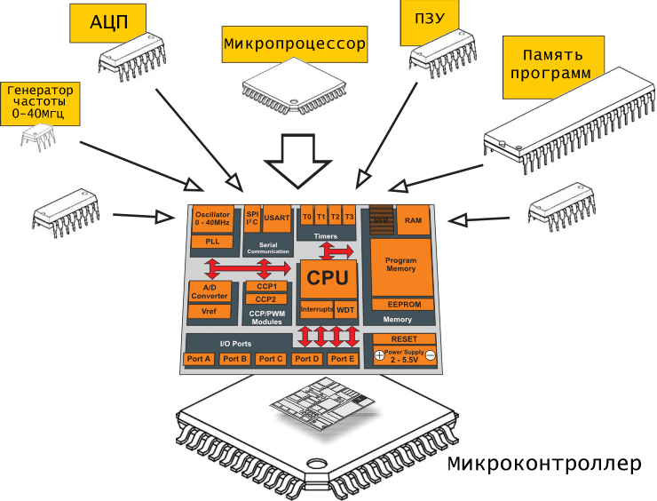
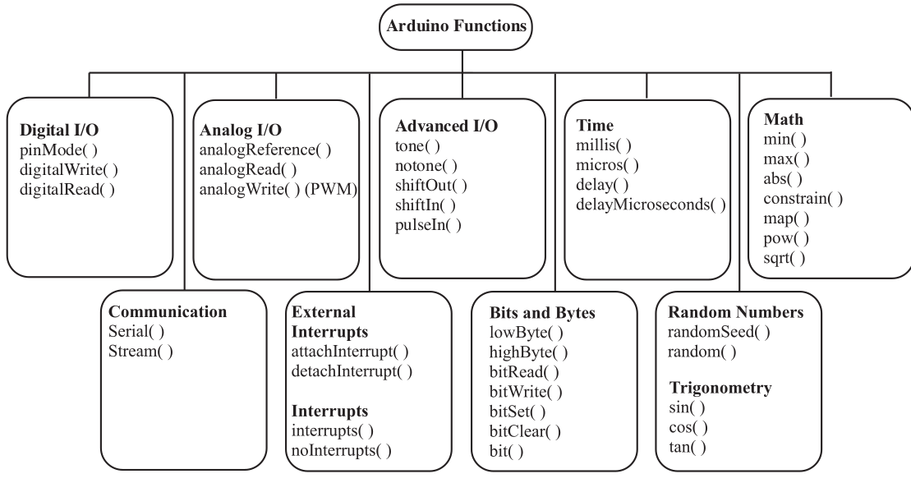
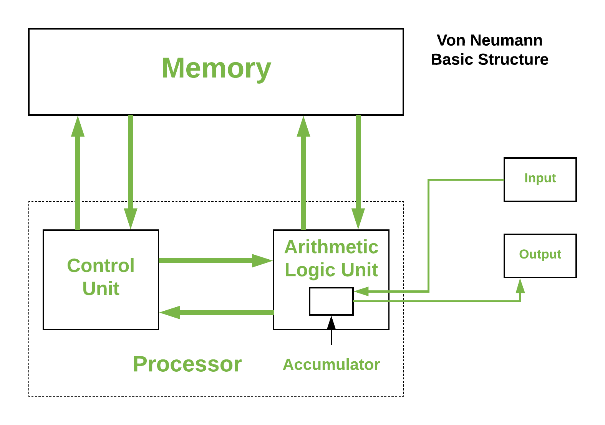
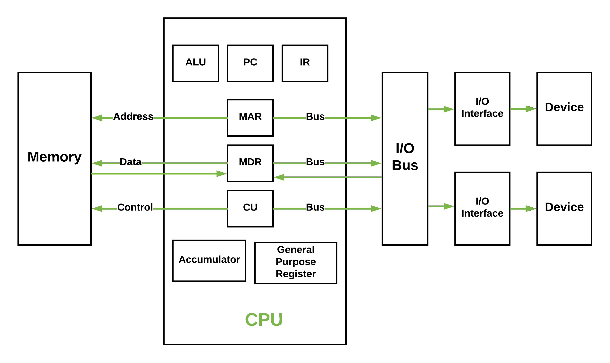
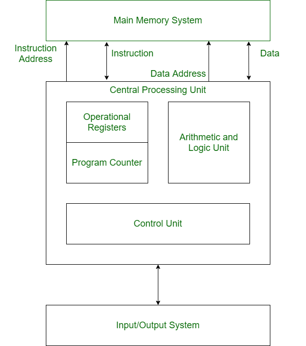
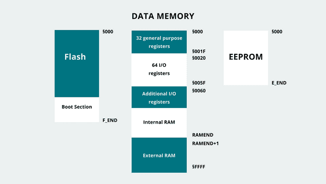
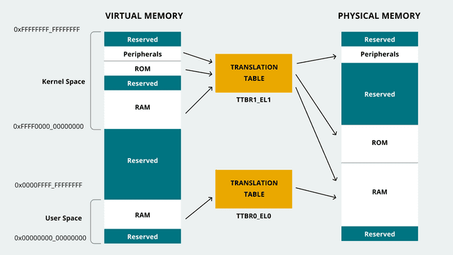
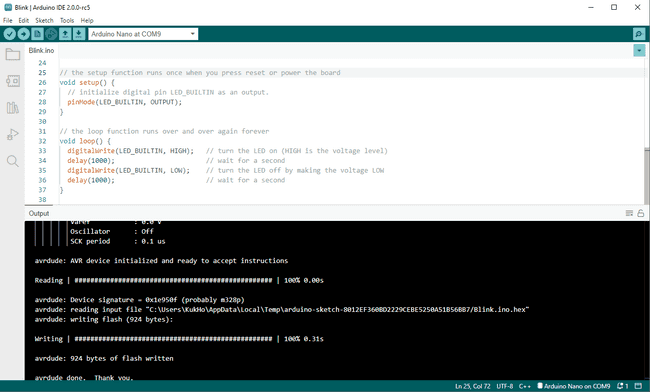
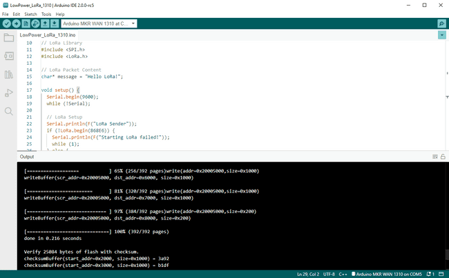
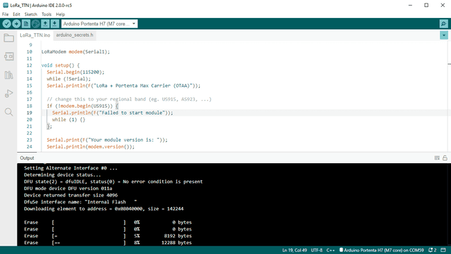

# Занятие 17. Память микроконтроллера и энергопотребление

**Цель занятия:** понять, из каких блоков состоит микроконтроллер, как организована его память и почему на плате с 2 килобайтами ОЗУ приходится считать каждый байт.

**Что понадобится:** Arduino UNO, USB-кабель. Схема на этом занятии не собирается - все эксперименты проводятся с самой платой.

> Тема специально вынесена в конец курса. К этому моменту вы уже написали программы с классами, буферами и библиотеками, и вопрос "куда девалась память" встаёт из практики, а не из теории. Всё, о чём говорилось ранее - `PROGMEM`, макрос `F()`, запрет на `String`, - здесь получает объяснение.

---

## Что такое микроконтроллер

Микроконтроллер - это интегральная схема, объединяющая на одном кристалле процессорное ядро, память и периферийные устройства. В отличие от процессора персонального компьютера, которому нужны внешние микросхемы памяти, контроллеры шин и питания, микроконтроллер представляет собой законченный компьютер в одном корпусе.



Основные блоки ATmega328P, стоящего на Arduino UNO:

| Блок | Назначение |
| --- | --- |
| Ядро AVR (8 бит, RISC) | Выборка и выполнение инструкций, 32 регистра общего назначения |
| АЛУ | Арифметические, логические и битовые операции |
| Flash 32 КБ | Хранение программы |
| SRAM 2 КБ | Переменные, стек, куча |
| EEPROM 1 КБ | Энергонезависимые пользовательские данные |
| Три таймера/счётчика | Отсчёт времени, ШИМ, генерация прерываний |
| АЦП, 10 бит, 6 каналов | Измерение аналоговых напряжений |
| USART, SPI, TWI (I2C) | Последовательный обмен данными |
| Контроллер прерываний | 26 источников прерываний, таблица векторов |
| Порты ввода-вывода B, C, D | Цифровые линии, объединённые в 8-битные порты |
| Система тактирования | Внешний кварц 16 МГц, внутренний RC-генератор, предделители |
| Сторожевой таймер (WDT) | Перезапуск при зависании программы |

### Тактирование

Всё внутри микроконтроллера происходит по тактам. На Arduino UNO источник тактового сигнала - **внешний кварцевый резонатор 16 МГц**, поэтому один такт длится

$$T = \frac{1}{f_{CPU}} = \frac{1}{16 \cdot 10^6} = 62{,}5 \text{ нс}$$

Большинство инструкций AVR выполняются за один такт, поэтому производительность ядра составляет примерно 16 MIPS.

ATmega328P умеет тактироваться и от **внутреннего RC-генератора 8 МГц** - это дешевле (не нужен кварц) и позволяет использовать выводы кварца как обычные линии ввода-вывода, но точность частоты у RC-генератора порядка +/-10 % и она плывёт с температурой. Для UART такой точности не хватает, поэтому на платах Arduino ставят кварц.

Частота влияет не только на скорость выполнения программы: от неё зависят период таймеров, частота ШИМ, скорость АЦП и скорость UART. Изменение тактовой частоты меняет поведение **всей** периферии сразу - это стоит помнить, отвечая на экзаменационные вопросы про энергопотребление и тактирование.

### Что происходит после подачи питания

1. **Сброс (reset).** Все регистры принимают начальные значения, счётчик команд обнуляется.
2. **Стабилизация тактового генератора** - микроконтроллер выжидает заданное число тактов.
3. **Управление получает загрузчик** (bootloader), расположенный в конце Flash. Он несколько секунд слушает UART: если компьютер начал прошивку - принимает и записывает новую программу.
4. **Переход на пользовательскую программу.** Стартовый код, добавленный компилятором, инициализирует стек, копирует секцию `.data` из Flash в SRAM, обнуляет `.bss`.
5. **Вызов `main()`**, внутри которого ядро Arduino вызывает `init()`, `setup()` и бесконечный цикл с `loop()`.



---

## Карта памяти ATmega328P

Прежде чем перейти к общей теории, зафиксируем конкретные цифры платы, с которой мы работаем.

| Память | Объём | Адреса | Энергонезависимая | Ресурс перезаписи |
| --- | --- | --- | --- | --- |
| Flash | 32 КБ (0,5 КБ - загрузчик) | 0x0000-0x7FFF (по словам) | да | ~10 000 циклов |
| SRAM | 2 КБ | 0x0100-0x08FF | нет | не ограничен |
| EEPROM | 1 КБ | 0x000-0x3FF | да | ~100 000 циклов |

Адресное пространство данных ATmega328P устроено так:

```tikz Адресное пространство данных ATmega328P
\begin{tikzpicture}[x=1cm,y=1cm]
  \def\w{7.2}
  \foreach \y/\h/\name/\detail/\col in {
      0/1.0/{32 регистра общего назначения}/{\ttfamily R0-R31}/acc,
      1.0/1.0/{64 регистра ввода-вывода}/{\ttfamily PORTB, DDRB, TCCR0A}/clk,
      2.0/1.0/{160 расширенных регистров}/{\ttfamily TIMSK1, UCSR0A, ADCSRA}/clk,
      3.0/2.6/{SRAM, 2048 байт}/{}/sig} {
    \draw[\col, fill=\col!8, semithick] (0,-\y) rectangle (\w,-\y-\h);
    \pgfmathsetmacro{\my}{-\y-\h/2}
    \node[font=\small, text=\col!80!black] at (\w/2,\my+0.18) {\name};
    \node[note, font=\scriptsize\ttfamily] at (\w/2,\my-0.22) {\detail};
  }
  % адреса
  \foreach \y/\addr in {0/{0x0000}, 1.0/{0x0020}, 2.0/{0x0060}, 3.0/{0x0100},
                        5.6/{0x08FF}} {
    \node[note, font=\scriptsize\ttfamily, anchor=east] at (-0.15,-\y) {\addr};
    \draw[muted!45, semithick] (-0.1,-\y) -- (0,-\y);
  }
  % устройство SRAM
  \draw[ok, semithick, {Stealth[length=2mm]}-] (0.5,-3.4) -- (0.5,-4.1)
        node[note, text=ok, below, align=center] {\ttfamily .data\\\ttfamily .bss\\куча};
  \draw[warn, semithick, {Stealth[length=2mm]}-] (\w-0.5,-5.4) -- (\w-0.5,-4.7)
        node[note, text=warn, above, align=center] {стек\\растёт вниз};
  \node[alert, anchor=west, align=center] at (\w+0.6,-4.3)
        {столкновение\\стека и кучи};
  \draw[flow, draw=warn] (\w+0.55,-4.3) -- (\w-0.3,-4.3);
\end{tikzpicture}
```

Обратите внимание: **регистры периферии находятся в том же адресном пространстве, что и переменные**. Именно поэтому запись в `PORTB` в программе на C выглядит как обычное присваивание переменной - этим мы воспользуемся на [занятии 18](../18-low-level/note.md).

Программа и данные при этом лежат в **разных** пространствах - это гарвардская архитектура, о которой пойдёт речь ниже.

---

## Что такое Память?

Блоки памяти представляют собой неотъемлемый компонент современных встроенных систем, особенно на основе микроконтроллеров. **Эти блоки, являющиеся полупроводниковыми устройствами, предназначены для хранения и извлечения информации или данных**. Центральный процессор (ЦП) микроконтроллера использует и обрабатывает данные, содержащиеся в блоках памяти, для выполнения конкретных задач.

На схеме ниже блоки памяти в микроконтроллерах обычно представлены в виде **массивов**. Эти массивы разделены на **ячейки**, предназначенные для хранения данных, и доступ к которым осуществляется посредством уникального идентификатора, представляющего собой **адрес** или положение относительно массива памяти. Информация в ячейках памяти хранится в двоичной форме (битах), обычно организованных в байтах (8 бит); ее также можно получить позднее с использованием микроконтроллера или других компонентов системы на базе микроконтроллера.

Память в вычислительных системах может быть **энергозависимой** или **энергонезависимой**. Энергозависимая память представляет собой **временную память**, где данные сохраняются во время работы системы, но утрачиваются при выключении. Энергонезависимая память является **постоянной**, и данные в ней сохраняются даже при отключении системы.

## Архитектура памяти

Компьютерная архитектура является обширной областью, но мы сфокусируемся на ключевых аспектах, чтобы понять, как организована память в микроконтроллерах, применяемых в платах Arduino.

### **Архитектура фон Неймана**

Архитектура фон Неймана, также известная как архитектура Принстона, была представлена Джоном фон Нейманом в середине 40-х годов. В этой архитектуре программные данные и инструкции хранятся в одном блоке памяти. Оба процессора имеют доступ через одну коммуникационную шину, как показано ниже. Эта архитектура играет фундаментальную роль, поскольку на ее основе построены практически все цифровые компьютеры.



_Доступ к обоим процессорам через одну коммуникационную шину._

Она также известен как ISA (архитектура набора команд) и включает в себя три основных блока:

1. **Центральный процессор (ЦП):** Центральный процессор представляет собой электрическую цепь, предназначенную для выполнения инструкций компьютерной программы. Он состоит из следующих ключевых компонентов:

    - **Блок управления (БУ):** Отвечает за обработку всех сигналов управления процессором. Блок управления направляет поток ввода-вывода, извлекает код инструкций и контролирует передачу данных в системе.
    - **Арифметико-логический блок (АЛУ):** Часть ЦП, выполняющая все вычислительные операции, которые могут потребоваться для сложения, вычитания, сравнения и выполнения логических операций, операций сдвига битов и арифметических операций.
    - **Разнообразие регистров:** Включает в себя различные регистры, используемые для хранения временных данных и промежуточных результатов.
2. **Блок основной памяти:** Блок основной памяти служит для хранения данных и инструкций, необходимых для выполнения программ. Это ключевой элемент, обеспечивающий доступ ЦП к необходимой информации.

3. **Устройство ввода/вывода:** Устройство ввода/вывода обеспечивает взаимодействие между компьютером и внешними устройствами. Оно обрабатывает ввод и вывод данных, обеспечивая коммуникацию между системой и внешним окружением.




#### **Регистры:**

Регистры представляют собой высокоскоростные области хранения в центральном процессоре (ЦП), из которых извлекаются данные, обрабатываемые процессором. Различаются следующие типы регистров:

1. **Аккумулятор:** Хранит результаты вычислений, выполняемых арифметико-логическим блоком (АЛУ). Служит промежуточным звеном между арифметическими и логическими операциями, предоставляя временное хранение данных.

2. **Счетчик программ (ПК):** Отслеживает местоположение в памяти следующих инструкций, которые требуется обработать. ПК передает следующий адрес в регистр адреса памяти (MAR).

3. **Регистр адреса памяти (MAR):** Хранит адреса ячеек памяти, содержащих инструкции, которые необходимо извлечь или сохранить.

4. **Регистр данных памяти (MDR):** Содержит инструкции, извлеченные из памяти, или данные, которые должны быть переданы в память и сохранены.

5. **Регистр текущих инструкций (CIR):** Содержит последние полученные инструкции, ожидающие кодирования и выполнения.

6. **Регистр буфера инструкций (IBR):** Инструкции, которые не требуется выполнять немедленно, помещаются в регистр буфера инструкций IBR.


#### **Шины:**

Шины представляют собой средства передачи данных между различными компонентами компьютера, соединяя основные внутренние компоненты с процессором и памятью. Различают следующие типы шин:

1. **Шина данных:** Передает данные между блоком памяти, устройствами ввода-вывода и процессором.

2. **Адресная шина:** Передает адреса данных (а не сами данные) между памятью и процессором.

3. **Шина управления:** Передает команды управления от ЦП для координации действий внутри компьютера.


Von Neumann bottleneck: одна и та же _шина памяти_ используется для передачи инструкций и данных.

Типичный шаг исполнения программы:

- fetch - из памяти приносим следующую инструкцию;
- decode - определяем, как она будет исполняться;
- execute - исполнение:
    - производим вычисления и обновляем операнды;
    - обновляем instruction pointer.

```tikz Выборка команды: процессор читает её по адресу из счётчика команд
\begin{tikzpicture}[x=1cm,y=1cm]
  \node[note, anchor=south] at (2.1,3.5) {память программ};
  \foreach \i/\addr/\code/\hl in {
      0/246/{\ldots}/0, 1/247/{\ttfamily add x, 1}/1, 2/248/{\ttfamily jmp 247}/1,
      3/249/{\ldots}/0, 4/250/{\ldots}/0} {
    \pgfmathsetmacro{\y}{2.9-\i*0.75}
    \ifnum\hl=1
      \draw[sig, fill=sig!10, semithick] (0.6,\y-0.32) rectangle (3.6,\y+0.32);
    \else
      \draw[muted!45, fill=muted!5, semithick] (0.6,\y-0.32) rectangle (3.6,\y+0.32);
    \fi
    \node[note, font=\scriptsize\ttfamily, anchor=east] at (0.5,\y) {\addr};
    \node[font=\small] at (2.1,\y) {\code};
  }
  % счётчик команд
  \node[mcu, minimum width=26mm, minimum height=16mm] (pc) at (7.2,1.8)
       {счётчик команд\\[2pt]\Large\ttfamily 247};
  \draw[flow, draw=acc] (pc.west) -- node[lab, above] {выборка} (3.7,2.15);
  \draw[back] (3.7,1.4) -- node[lab, below, align=center]
       {переход\\меняет счётчик} (pc.south west);
  \node[note, anchor=north, align=center] at (4,-0.8)
    {процессор читает команду по адресу из счётчика,\\выполняет её и увеличивает счётчик};
\end{tikzpicture}
```

#### **Устройства ввода/вывода:**

Устройства ввода/вывода обеспечивают взаимодействие между компьютером и внешними устройствами. Они обрабатывают ввод и вывод данных, позволяя взаимодействовать с внешним окружением.

#### **Cлабое место фон Неймана:**

Cлабое место архитектуры фон Неймана характеризуется тем, что инструкции могут выполняться только последовательно, что ограничивает производительность ЦП. Даже с увеличением объема кэш-памяти, оперативной памяти или увеличением скорости компонентов, узкое место фон Неймана может сдерживать общую производительность ЦП. Оптимизация конфигурации ЦП является необходимым условием для повышения производительности.

### **Гарвардская архитектура**

Гарвардская архитектура, получившая название от релейного компьютера Harvard Mark I, была представлена также в середине 40-х годов. Ее особенность заключается в использовании двух отдельных блоков памяти: один для программных инструкций и другой для программных данных. Доступ к этим блокам в гарвардской архитектуре осуществляется ЦП по разным коммуникационным шинам.



#### Шины

 В гарвардской архитектуре существуют отдельные шины для инструкций и данных. Типы шин:

**Шина данных**: она передает данные между основной системой памяти, процессором и устройствами ввода-вывода.
**Шина адреса данных**: передает адрес данных от процессора к основной системе памяти.
**Шина инструкций**: она передает инструкции между основной системой памяти, процессором и устройствами ввода-вывода.
**Шина адреса инструкций**: передает адрес инструкций от процессора к основной системе памяти.
#### Операционные регистры

В нем задействованы разные типы регистров, которые используются для хранения адресов различных типов инструкций. Например, регистр адреса памяти и регистр данных памяти являются операционными регистрами.

1. **Счетчик программ**: содержит местоположение следующей инструкции, которая будет выполнена. Затем счетчик программ передает следующий адрес в регистр адреса памяти.
2. **Арифметико-логический блок**: Арифметико-логический блок является частью ЦП, который выполняет все необходимые вычисления. Он выполняет сложение, вычитание, сравнение, логические операции, операции сдвига битов и различные арифметические операции.
3. **Блок управления**: Блок управления - это часть ЦП, которая управляет всеми сигналами управления процессором. Он управляет устройствами ввода и вывода, а также контролирует перемещение инструкций и данных внутри системы.
4. **Система ввода/вывода**: устройства ввода используются для считывания данных в основную память с помощью инструкций ввода ЦП. Информация с компьютера в виде вывода передается через устройства вывода. Компьютер выдает результаты вычислений с помощью устройств вывода.
#### **Features**:

1. **Отдельные пространства памяти**. В гарвардской архитектуре существуют отдельные пространства памяти для инструкций и данных. Такое разделение гарантирует, что процессор может одновременно получать доступ как к памяти инструкций, так и к памяти данных, что обеспечивает более быстрый и эффективный поиск данных.
2. **Фиксированная длина инструкций**. В гарвардской архитектуре инструкции обычно имеют фиксированную длину, что упрощает процесс выборки инструкций и обеспечивает более быструю обработку инструкций.
3. **Параллельный доступ к инструкциям и данным**. Поскольку Гарвардская архитектура разделяет пространства памяти для инструкций и данных, процессор может получать доступ к обоим пространствам памяти одновременно, что позволяет выполнять параллельную обработку инструкций и данных.
4. **Более эффективное использование памяти**: Гарвардская архитектура позволяет более эффективно использовать память, поскольку память данных и инструкций можно оптимизировать независимо, что может привести к повышению производительности.
5. **Подходит для встроенных систем**: Гарвардская архитектура обычно используется во встроенных системах, поскольку она обеспечивает быстрый и эффективный доступ как к инструкциям, так и к данным, что имеет решающее значение в приложениях реального времени.
6. **Ограниченная гибкость**: отдельные пространства памяти в гарвардской архитектуре ограничивают гибкость процессора при выполнении определенных задач, таких как изменение инструкций во время выполнения. Это связано с тем, что для изменения инструкций требуется доступ к памяти инструкций, которая отделена от памяти данных.

#### Преимущество Гарвардской архитектуры:

Гарвардская архитектура имеет две отдельные шины для инструкций и данных. Следовательно, ЦП может одновременно получать доступ к инструкциям и читать/записывать данные. Это главное преимущество Гарвардской архитектуры.

На практике используется модифицированная Гарвардская архитектура, где у нас есть два отдельных кеша (данных и инструкций). Это распространено и используется в процессорах **X86** и **ARM**.

1. **Быстрый и эффективный доступ к данным**. Поскольку гарвардская архитектура имеет отдельные области памяти для инструкций и данных, она обеспечивает параллельный и одновременный доступ к обоим областям памяти, что приводит к более быстрому и эффективному доступу к данным.
2. **Повышение производительности**. Использование фиксированной длины инструкций, параллельной обработки и оптимизированного использования памяти в гарвардской архитектуре может привести к повышению производительности и более быстрому выполнению инструкций.
3. **Подходит для приложений реального времени**: Гарвардская архитектура обычно используется во встроенных системах и других приложениях реального времени, где скорость и эффективность имеют решающее значение.
4. **Безопасность**. Разделение областей памяти инструкций и данных также может обеспечить определенную степень защиты от определенных типов атак, таких как атаки на переполнение буфера.
#### Недостатки Гарвардской архитектуры:

1. **Сложность**. Использование отдельных пространств памяти для инструкций и данных в гарвардской архитектуре усложняет конструкцию процессора и может увеличить стоимость производства.
2. **Ограниченная гибкость**: Гарвардская архитектура обладает ограниченной гибкостью с точки зрения изменения инструкций во время выполнения, поскольку инструкции и данные хранятся в отдельных областях памяти. Это может затруднить или сделать невозможным реализацию некоторых типов программирования.
3. **Более высокие требования к памяти**: Гарвардская архитектура требует больше памяти, чем архитектура фон Неймана, что может привести к более высоким затратам и энергопотреблению.
4. **Ограничения размера кода**. Фиксированная длина инструкции в Гарвардской архитектуре может ограничивать размер кода.

### Сравнение

**1. Разделение пространства памяти:**

- _Гарвардская архитектура:_ Имеет отдельные пространства памяти для инструкций и данных, что обеспечивает параллельный доступ и повышает эффективность.
- _Архитектура фон Неймана:_ Использует общее пространство памяти для хранения как инструкций, так и данных, что может привести к конфликтам при одновременном доступе.

**2. Шины:**

- _Гарвардская архитектура:_ Имеет отдельные шины для инструкций и данных, что позволяет одновременный доступ к ним.
- _Архитектура фон Неймана:_ Использует общую шину для передачи как инструкций, так и данных, что ограничивает параллельный доступ.

**3. Параллельный доступ:**

- _Гарвардская архитектура:_ Позволяет параллельный доступ к инструкциям и данным, улучшая общую производительность.
- _Архитектура фон Неймана:_ Ограничивает параллельный доступ, поскольку обе категории используют общую шину.

**4. Гибкость:**

- _Гарвардская архитектура:_ Ограничивает гибкость при изменении инструкций во время выполнения из-за разделения пространств памяти.
- _Архитектура фон Неймана:_ Более гибкая в изменении инструкций в процессе выполнения, так как они хранятся в общей памяти.

**5. Эффективность использования памяти:**

- _Гарвардская архитектура:_ Позволяет оптимизировать использование памяти независимо для инструкций и данных, что может улучшить производительность.
- _Архитектура фон Неймана:_ Имеет ограниченные возможности оптимизации, так как инструкции и данные используют общую память.

**6. Применимость:**

- _Гарвардская архитектура:_ Часто используется во встроенных системах и приложениях реального времени, где важны быстродействие и эффективность.
- _Архитектура фон Неймана:_ Широко применяется в общих вычислительных устройствах, но может быть менее эффективной в некоторых встроенных системах.

**7. Безопасность:**

- _Гарвардская архитектура:_ Разделение пространств памяти может предоставить некоторую степень защиты от определенных видов атак.
- _Архитектура фон Неймана:_ Может быть менее защищенной из-за общего пространства памяти для инструкций и данных.

**8. Сложность:**

- _Гарвардская архитектура:_ Обычно более сложна в реализации из-за отдельных шин и пространств памяти.
- _Архитектура фон Неймана:_ Более проста в конструкции из-за общего пространства памяти и шины.

**9. Требования к памяти:**

- _Гарвардская архитектура:_ Обычно требует больше памяти, что может привести к более высоким затратам и энергопотреблению.
- _Архитектура фон Неймана:_ Обычно более экономична по требованиям к памяти.

**10. Использование в современных системах:** - _Гарвардская архитектура:_ Используется в некоторых встроенных системах и процессорах, таких как ARM и AVR. - _Архитектура фон Неймана:_ Применяется в общих вычислительных устройствах, включая большинство персональных компьютеров.

### Современные архитектуры
Современные вычислительные системы используют модели гибридной архитектуры, которые максимизируют производительность, используя лучшее из обоих миров: модели фон Неймана и Гарвардской модели.

Микроконтроллеры обычно используются во встроенных приложениях. Они должны выполнять определенные задачи надежно и эффективно, используя низкие или ограниченные ресурсы; Вот почему в микроконтроллерах в основном используется модель Гарвардской архитектуры: микроконтроллеры имеют небольшую память программ и данных, доступ к которым должен осуществляться одновременно. Однако в микроконтроллерах не всегда используется Гарвардская архитектура; некоторые семейства микроконтроллеров используют модели гибридной архитектуры или архитектуры фон Неймана.


## Типы памяти
Все различные блоки памяти внутри микроконтроллера можно разделить на два основных типа: ОЗУ и ПЗУ. ОЗУ (из оперативной памяти) в системах на базе микроконтроллеров представляет собой энергозависимую память, используемую для хранения временных данных, таких как переменные прошивки системы. ПЗУ (из постоянного запоминающего устройства) в системах на базе микроконтроллера - это энергонезависимая память, используемая для хранения постоянных данных, таких как встроенное ПО системы.

ОЗУ и ПЗУ в системах на базе микроконтроллеров разделены на три основные категории:

- Flash
- RAM
- EEPROM
### FLASH
**Твёрдотельная полупроводниковая энергонезависимая перезаписываемая память (FLASH)** в системах на базе микроконтроллера является частью его ПЗУ. Флэш-память - это место, где хранится встроенное ПО системы, предназначенное для выполнения. Например, вспомните знаменитый скетч Blink.ino: когда мы компилируем этот скетч, мы создаем двоичный файл, который позже сохраняется во флэш-памяти платы Arduino. Затем эскиз выполняется при включении платы.

### RAM
**Запоминающее устройство с произвольным доступом**  (**Random-access memory** (**RAM**) **ОЗУ** в системах на базе микроконтроллера - это место, где хранятся временные данные системы или данные времени выполнения; например, переменные, созданные функциями программы. Оперативная память в микроконтроллерах обычно представляет собой SRAM; это тип оперативной памяти, в которой для хранения одного бита данных используется триггер. Существует также другой тип оперативной памяти, который можно найти в микроконтроллерах: DRAM.

###  **EEPROM**
В системах на базе микроконтроллера **стираемое программируемое постоянное запоминающее устройство или EEPROM (Electrically Erasable Programmable Read-Only Memory)** также является частью его ПЗУ; на самом деле флэш-память - это разновидность EEPROM. Основное различие между флэш-памятью и EEPROM заключается в способе управления ими; EEPROM может управляться на уровне байтов (запись или стирание), тогда как Flash можно управлять на уровне блоков.

## Arduino

Как указывалось ранее, платы Arduino в основном основаны на двух семействах микроконтроллеров: AVR и ARM; важно знать, что распределение памяти различается в обеих архитектурах. В Гарвардской архитектуре AVR память организована так, как показано на рисунке ниже:



В отношении плат Arduino на базе AVR важно отметить, как их SRAM организована в различные разделы:

- `Text`
- `Data`
- `BSS`
- `Stack`
- `Heap`

Раздел `Text` содержит инструкции, загруженные во флэш-память; Раздел `data` содержит переменные, инициализированные в скетче, раздел `BSS` содержит неинициализированные данные, раздел `stack` хранит данные функций и прерываний, а раздел `heap` хранит переменные, созданные во время выполнения.

В гибридных архитектурах ARM реализована так называемая **карта памяти** с различной конфигурацией карты адресов: 32-битной, 36-битной и 40-битной, которая зависит от требований адресного пространства системы на кристалле (SoC) с дополнительным DRAM. . Карта памяти обеспечивает интерфейс с дизайном SoC, сохраняя при этом большую часть управления системой на высоком уровне кодирования. Инструкции доступа к памяти могут использоваться в коде высокого уровня для управления модулями прерываний и встроенными периферийными устройствами. Все это контролируется **блоком управления памятью** (MMU).

Ресурс памяти обрабатывается MMU. Основная роль MMU заключается в том, чтобы позволить процессору независимо выполнять несколько задач в его собственном пространстве виртуальной памяти; Затем MMU использует таблицы трансляции для установления моста между адресами виртуальной и физической памяти. Виртуальный адрес управляется с помощью программного обеспечения с инструкциями памяти, а физический адрес - это система памяти, которая управляется в зависимости от входных данных таблицы трансляции, заданных виртуальным адресом.

Пример того, как организована память в микроконтроллерах на базе ARM виртуально и физически, показан на изображении ниже:



Память микроконтроллера на базе ARM организована в следующие разделы в пределах упомянутого ранее типа адреса:

- Виртуальный адрес:
	1. Код ядра и данные
	2. Код и данные приложения
- Физический адрес:
	1. ROM
	2. RAM
	3. Flash
	4. Перефирия

## Измерения памяти
### Измерение флэш-памяти

Флэш-память на платах Arduino можно измерить с помощью Arduino IDE. Как говорилось ранее, во флэш-памяти хранится код приложения; Arduino IDE сообщает об использовании флэш-памяти через консоль вывода компилятора, чтобы разработчики знали, сколько ресурсов флэш-памяти используется.

Например, на изображении ниже показан вывод компилятора IDE для платы Arduino на базе AVR, Nano:



Журнал вывода консоли компилятора IDE для платы Arduino на базе ARM, MKR WAN 1310, показан на изображении ниже:



Журнал вывода консоли компилятора IDE для другого Arduino на базе ARM, Portenta H7, показан на изображении ниже:



Обратите внимание, что выходные данные компилятора меняются в зависимости от того, основана ли плата на AVR или на ARM.

### Измерение памяти SRAM

Иногда возникают ситуации, когда даже когда код успешно компилируется и загружается в плату IDE, он внезапно зависает. Эти проблемы, вероятно, связаны с перегрузкой ресурсов памяти или недостатком памяти для выделения. Для решения этой проблемы необходимо понять, в каком секторе кода потребность в памяти превышает доступные ресурсы. Следующий пример кода можно использовать для измерения использования SRAM в платах Arduino на базе AVR:

```c++
void display_freeram() {
  Serial.print(F("- SRAM left: "));
  Serial.println(freeRam());
}

int freeRam() {
  extern int __heap_start,*__brkval;
  int v;
  return (int)&v - (__brkval == 0
    ? (int)&__heap_start : (int) __brkval);
}
```

Помните, что в разделе `heap` хранятся переменные, созданные во время выполнения. В коде `__heap_start `и `__brkval` выглядят следующим образом:

- `__heap_start`: начало раздела `heap`.
- `__brkval`: последний указатель адреса памяти, используемый `heap`.

Следующий пример кода можно использовать для измерения использования SRAM в платах Arduino на базе ARM:

```c++
extern "C" char* sbrk(int incr);

void display_freeram(){
  Serial.print(F("- SRAM left: "));
  Serial.println(freeRam());
}

int freeRam() {
  char top;
  return &top - reinterpret_cast<char*>(sbrk(0));
}
```

### Измерение памяти EEPROM

Управление памятью EEPROM можно легко выполнить с помощью встроенных библиотек, уже установленных в Arduino IDE. Библиотеку EEPROM можно использовать для чтения, записи и стирания памяти EEPROM. Следующий код показывает, как байт информации может быть сохранен в памяти EEPROM, а затем прочитан с помощью функций записи и чтения:

```c++
#include <EEPROM.h>

void setup() {
}

void loop {
  // Write data into an specific address of the EEPROM memory
  EEPROM.write(address, value);

  // Read data of an specific address of the EEPROM memory
  EEPROM.read(address);
}
```

Кроме того, можно очистить всю память EEPROM, установив для нее значение 0, как показано в коде ниже:

```c++
#include <EEPROM.h>

void setup() {
}

void loop {
  for (int i = 0 ; i < EEPROM.length() ; i++) {
    // Clear EEPROM memory
    EEPROM.write(i, 0);

}
```


## Оптимизация использования памяти в системах на базе Arduino

Знание того, как код использует ресурсы памяти системы, - это лишь первая рекомендуемая задача в процессе разработки; совершенно другая задача - оптимизация использования памяти. Как следует из термина "разработка", требования могут меняться или корректироваться в зависимости от внешних факторов, таких как снижение мощности устройства из-за недоступности компонентов. Таким образом, архитектура кода может потребовать оптимизации для работы с ограниченными ресурсами памяти.

Процесс оптимизации использования памяти также подразумевает снижение вычислительной сложности, сокращение дополнительного времени, необходимого для обработки задач, при одновременном использовании меньшего количества ресурсов памяти для выполнения тех же задач. Процесс оптимизации использования памяти может помочь общему процессу оптимизации кода, поскольку он будет более эффективно управлять памятью, требуя разработки интеллектуальных алгоритмов.

### Оптимизация Flash памяти

Оптимизация **Flash** памяти является наиболее простым возможным источником оптимизации. **Flash** память - это место, в котором емкость, используемая скомпилированным кодом, можно значительно уменьшить, приняв во внимание некоторые детали.

#### Отсоединить неиспользуемые источники

Отсоединение новых источников включает в себя **неиспользуемые библиотеки** и **остатки кода**. Остатки кода могут состоять из больше не используемых функций и плавающих переменных, которые занимают ненужное место в памяти. Это значительно улучшит размер скомпилированного кода и сделает процесс компиляции более понятным.

#### Модульные задачи

**Модульные задачи** означают функции, которые оборачивают код, который будет использоваться повторно или постоянно, получая разные параметры. Это отличный способ сохранить чистую структуру кода и производительность, одновременно уменьшая объем памяти, необходимый для дополнительных задач, которые, возможно, потребуется реализовать.

Это приводит к компактной структуре кода, которую гораздо легче понять, когда требуется отладка, и которая требует от разработчика учитывать вычислительную сложность при разработке структуры кода или такого конкретного алгоритма.

### Оптимизация памяти SRAM

Память **SRAM**, вероятно, является наиболее важной единицей памяти в системе на базе микроконтроллера; оптимизация использования SRAM необходима для разработки надежных систем на базе микроконтроллеров. Нехватка SRAM обычно является наиболее распространенной проблемой памяти; Оптимизация SRAM может помочь уменьшить проблемы такого типа.

Идеальный способ использования команды "Print Line" - использовать строковую обертку F() вокруг литералов. См. пример ниже:

#### String Wrapper

Инструкции `Serial.print()` или `Serial.println()` используют пространство SRAM, что может быть удобно, но нежелательно. Идеальный способ использования инструкций `Serial.print()` или `Serial.println()` - использование строковой оболочки `F()` вокруг литералов. Например:
```c++
Serial.println(F("Something"));
```

Обертывание строки с помощью оболочки` F()` приведет к перемещению строк только во флэш-память, а не к использованию пространства **SRAM**. Использование оболочки `F()` можно рассматривать как выгрузку таких данных во флэш-память вместо SRAM. Флэш-память гораздо более просторна, чем SRAM, поэтому лучше использовать флэш-память, чем SRAM, которая будет использовать раздел кучи. Это не означает, что объем памяти всегда будет доступен, поскольку объем флэш-памяти ограничен. Не рекомендуется засорять код инструкциями `Serial.print()` или `Serial.println()`, но используйте их там, где они наиболее важны внутри кода.

#### PROGMEM

Не только строки занимают пространство SRAM, но и глобальные переменные также занимают довольно много места в SRAM. Поскольку глобальные и статические переменные передаются в пространство SRAM и помещают раздел `heap` памяти в `stack`. Пространство, занимаемое этими переменными, передаваемыми в пространство SRAM, будет сохранено в их местоположении и не будет меняться, что означает, что создается больше этих переменных, они будут использовать больше места и, следовательно, в системе возникают проблемы и проблемы из-за плохого управления памятью. .

**PROGMEM**, что означает "**Память программ**", может использоваться для хранения переменных данных во флэш-памяти, как и описанная ранее оболочка `F()`, но использование **PROGMEM** имеет один недостаток: скорость чтения данных. Использование ОЗУ обеспечит гораздо более высокую скорость чтения данных, но **PROGMEM**, поскольку он использует флэш-память, будет медленнее, чем ОЗУ, при том же размере данных. Таким образом, при разработке кода важно знать, какие переменные имеют решающее значение, а какие нет или имеют более низкий приоритет.

Использование `PROGMEM` в плате Arduino на базе AVR показано в примере кода ниже:

```c++
#include <avr/pgmspace.h>

// Basic PROGMEM structure
const PROGMEM DataType Variable_Name[] = {var0, var1, var2 ...};

// Storing an unsigned, 16-bit, integer
const PROGMEM uint16_t NumSet[] = {0, 1, 1, 2, 3, 5, 8 ...};

// Storing a char in PROGMEM
const char greetMessage[] PROGMEM = {"Something"};
```

Использование различается на разных уровнях, которые суммируются следующим образом:

- Уровень пространства имен

	- На уровне пространства имен мы указываем на переменные, и не важно, объявлена ли статика или нет. Если она объявлена, это означает, что переменная является явно статической; с другой стороны, это неявное статическое объявление.
-  Функциональный уровень

	- Если он объявлен внутри static, любой тип применимых данных, которыми нужно управлять, будет находиться между вызовами функций.
- Уровень класса
	- На уровне класса статическое объявление будет означать, что любой тип применимых данных, которые обрабатываются, будет совместно использоваться между экземплярами.

#### Нединамическое распределение памяти

Динамическое распределение памяти обычно является подходящим методом, если размер оперативной памяти системы достаточно велик, чтобы его можно было обойти; однако для систем на базе микроконтроллера, таких как встроенные системы, подсчет каждого байта ОЗУ не рекомендуется.

Динамическое распределение памяти приводит к  **фрагментации кучи**. При фрагментации кучи многие области оперативной памяти, затронутые ею, не могут быть повторно использованы повторно, в результате чего остаются мертвые байты, которые можно использовать в качестве преимущества для других задач. Кроме того, когда при динамическом выделении памяти происходит освобождение памяти для освобождения пространства, это не обязательно уменьшает размер кучи. Поэтому, чтобы максимально избежать фрагментации кучи или оперативной памяти, можно следовать следующим правилам:

- **Расставьте приоритеты в использовании стека, а не кучи**:
	- Память `stack` не имеет фрагментации и может быть полностью освобождена при возврате функции. `Heap`, напротив, не может освободить пространство, даже если ей было дано указание сделать это. Сделать это поможет использование локальных переменных и старайтесь не использовать динамическое выделение памяти, состоящее из разных вызовов: `malloc`, `calloc`, `realloc`.
- Сокращенные глобальные и статические данные (если возможно):
	- Пока код выполняется, область памяти, занятая этими данными, не будет освобождена. Данные не будут изменены, поскольку постоянные данные занимают драгоценное пространство.
- Используйте короткие строки/литералы:
	- Хорошо, если строки/литералы будут как можно короче. Один символ занимает один байт ОЗУ, поэтому чем короче, тем лучше используется пространство памяти. Это не означает, что его можно сделать коротким и использовать в нескольких различных областях кода. Используйте его при необходимости и делайте его как можно короче, чтобы освободить место в оперативной памяти для других задач.
	- **Массивы** также рекомендуется иметь минимальный размер. Если требуется изменить размер массива, вы всегда можете повторно установить размер массива в коде. Это может быть утомительный и неэффективный метод жесткого кодирования размеров массива. Однако, если в коде используются массивы небольшого размера и менее трех массивов, может быть достаточно изменить размер вручную, зная требования. Разумный способ сделать это - массив изменяемого размера с ограниченным размером. Задачи будут использовать массив, не выходя за границу размера. Таким образом, он подходит для обширного кода. Однако предел размера массива должен быть проанализирован и сохранен как можно меньшим.
#### Резервная функция

В задачах кода, работающих со строками, размер которых меняется в зависимости от результата операции, лучше всего использовать `Reserve()`. Эта функция поможет **зарезервировать буферное пространство и предварительно выделить его для строковой переменной**, изменив ее размер и избежав фрагментации памяти. Переменная `String`, размер которой изменяется, может возникнуть, например, в результате использования переменной типа `int`, которая будет использоваться как `String`.

Следующий код показывает, как использовать инструкцию `reserve()`:

```c++
// String_Variable is an String type variable
// Alloc_Size is the memory to be pre-allocated in number of Bytes with unsigned int type
String_Variable.reserve(Alloc_Size);
```

#### Контроль размера буфера

Внутренним процессам также требуется пул памяти для целей обработки. Это то, над чем система будет работать в соответствии с размером определенного пула памяти. Этот размер буфера может быть определен пользователем и может быть уменьшен для выделения меньшего размера памяти. Подумайте об определении размера переменной массива, в котором важно не выделять чрезмерный размер, когда он использует только третью часть определенного размера.

Давайте обсудим пример: последовательная связь в Arduino. Последовательная связь - это регулярно используемый сервис в системах на базе Arduino; Последовательная связь в Arduino работает с использованием предустановленной библиотеки Serial (внешние библиотеки также могут эмулировать последовательную связь с помощью программного обеспечения). Между серверными службами последовательная связь определяет необходимый пул памяти как буфер определенного размера. Если высокоскоростная последовательная связь не является частью требований, размер последовательного буфера можно переопределить, чтобы сэкономить некоторое потребление памяти. Это можно легко сделать, изменив следующую строку кода в файле HardwareSerial.h, который можно найти в папке установки Arduino IDE:

```c++
#define SERIAL_TX_BUFFER_SIZE 64
#define SERIAL_RX_BUFFER_SIZE 64
```


#### Корректирующее использование типов данных

Реализация соответствующего типа данных приводит к хорошей общей архитектуре кода. Разработчикам может быть желательно использовать самый простой или наиболее доступный тип данных для обработки данных в коде. Однако важно учитывать объем памяти, который он занимает при использовании определенных типов данных.

Типы данных существуют для упрощения формата потока данных и для обработки без несанкционированного доступа. Под незаконным доступом с точки зрения типов данных подразумевается обработка данных в коде несовместимого формата. Поэтому рекомендуется не злоупотреблять типом данных и использовать только удобные типы для каждого бита данных. Вместо этого тщательно проектируйте и распределяйте память в соответствии с требованиями, что поможет зарезервировать некоторое пространство памяти, если для дальнейших задач потребуется дополнительное пространство.

В следующей таблице показаны основные типы данных значений в Arduino:

|          **Type**           | **Byte Length** |       **Range of Values**       |
|:---------------------------:|:---------------:|:-------------------------------:|
|    ```boolean```    |        1        | Limited to logic true and false |
|     ```char```      |        1        |           -128 to 127           |
| ```unsigned char``` |        1        |            0 to 255             |
|     ```byte```      |        1        |            0 to 255             |
|      ```int```      |        2        |        -32,768 to 32,767        |
| ```unsigned int```  |        2        |           0 to 65,535           |
|     ```word```      |        2        |           0 to 65,535           |
|     ```long```      |        4        | -2,147,483,648 to 2,147,483,647 |
| ```unsigned long``` |        4        |       0 to 4,294,967,295        |
|     ```float```     |        4        | -3.4028235E+38 to 3.4028235E+38 |
|    ```double```     |        4        | -3.4028235E+38 to 3.4028235E+38 |

## Обращения к памяти, секции и стек

Компилятор раскладывает программу по **секциям**, а стартовый код расставляет их по памяти. Пока всё работает, об этом можно не думать. Но именно здесь кроется причина двух самых неприятных отказов на AVR: программа занимает больше SRAM, чем вы ожидали, и программа "сходит с ума" без единого сообщения об ошибке.

На большом компьютере эту тему изучают на примере операционной системы: там есть загрузчик образа, виртуальная память и блок управления памятью, который ловит обращение по чужому адресу и завершает процесс с сообщением `Segmentation fault`. **На ATmega328P нет ничего из этого.** Нет операционной системы, нет виртуальной памяти, нет защиты. Любой адрес доступен на чтение и запись всегда - и ошибка не прерывает программу, а тихо портит соседние данные.

### Секции программы

| Секция | Что в ней | Где лежит | Занимает SRAM |
| --- | --- | --- | --- |
| `.text` | Машинный код, таблица векторов прерываний | Flash | нет |
| `.data` | Переменные с ненулевым начальным значением | **и Flash, и SRAM** | да |
| `.bss` | Переменные с нулевым начальным значением или без инициализации | только SRAM | да |
| `.rodata` | Константы (`const`, строковые литералы) | по умолчанию попадает в `.data` | **да** |
| стек | Адреса возврата, аргументы, локальные переменные | SRAM | да |
| куча | Память от `malloc` и `new` | SRAM | да |

Строка `.rodata` в этой таблице - главная ловушка AVR. На компьютере константы остаются в файле программы и в оперативную память не копируются. На AVR из-за гарвардской архитектуры процессор **не может прочитать данные из Flash обычной инструкцией**: команда `LD` работает только с адресным пространством данных. Поэтому avr-gcc по умолчанию копирует все константы в SRAM при старте.

Отсюда и берётся эффект, разобранный в разделе про оптимизацию:

```cpp
Serial.println("Инициализация системы завершена");  // 32 байта SRAM
Serial.println(F("Инициализация системы завершена")); // 0 байт SRAM
```

Макрос `F()` и атрибут `PROGMEM` заставляют строку остаться во Flash, а чтение выполнять специальной инструкцией `LPM`. Без них десяток отладочных сообщений съедает четверть всей памяти платы.

### Что делает стартовый код

Между сбросом и первой строкой вашей программы выполняется код, который добавил компилятор. Он и расставляет секции по местам:

```
1. SP := RAMEND (0x08FF)      установить вершину стека
2. .data: Flash -> SRAM       скопировать начальные значения
3. .bss  := 0                 обнулить
4. call main
```

Здесь видно, почему секций две. Переменная `uint16_t count = 1000;` требует, чтобы где-то хранилась сама тысяча - её негде взять, кроме Flash, поэтому она попадает в `.data` и занимает **два места сразу**: два байта во Flash и два байта в SRAM. А переменную `uint16_t count;` инициализировать нечем: достаточно обнулить её при старте, и в Flash она не хранится вовсе - это `.bss`.

Практический вывод: если глобальный массив всё равно заполняется в `setup()`, не задавайте ему начальные значения - вы сэкономите столько же байт Flash, сколько в нём элементов.

```tikz Секции программы: что лежит во Flash, что в SRAM и что копируется при старте
\begin{tikzpicture}[x=1cm,y=1cm]
  % ---------- Flash ----------
  \node[note, anchor=south, font=\small\bfseries] at (2.0,6.9) {Flash, 32 КБ};
  \node[note, anchor=south] at (2.0,6.5) {энергонезависима, прошивается};
  \foreach \y/\h/\name/\col in {
      0.0/1.5/{начальные значения\\\ttfamily .data}/clk,
      1.5/3.5/{код программы\\\ttfamily .text}/sig,
      5.0/1.0/{загрузчик}/muted} {
    \draw[\col, fill=\col!10, semithick] (0.4,\y) rectangle (3.6,\y+\h);
    \node[font=\small, text=\col!80!black, align=center] at (2.0,\y+\h/2) {\name};
  }
  \node[note, anchor=east, font=\scriptsize\ttfamily] at (0.3,6.0) {0x7FFF};
  \node[note, anchor=east, align=right] at (0.3,5.5) {загрузчик занимает\\конец Flash};
  \node[note, anchor=east, font=\scriptsize\ttfamily] at (0.3,0.0) {0x0000};

  % ---------- SRAM ----------
  \node[note, anchor=south, font=\small\bfseries] at (9.4,6.9) {SRAM, 2 КБ};
  \node[note, anchor=south] at (9.4,6.5) {при выключении питания теряется};
  \foreach \y/\h/\name/\col in {
      0.0/1.4/{\ttfamily .data}/clk,
      1.4/1.2/{\ttfamily .bss}/ok,
      2.6/1.0/{куча}/muted,
      3.6/1.2/{свободно}/muted,
      4.8/1.2/{стек}/warn} {
    \draw[\col, fill=\col!10, semithick] (7.8,\y) rectangle (11.0,\y+\h);
    \node[font=\small, text=\col!80!black] at (9.4,\y+\h/2) {\name};
  }
  \node[note, anchor=west, font=\scriptsize\ttfamily] at (11.1,6.0) {0x08FF};
  \node[note, anchor=west, font=\scriptsize\ttfamily] at (11.1,0.0) {0x0100};
  \node[note, anchor=west, align=left] at (11.1,0.7) {переменные\\с начальным\\значением};
  \node[note, anchor=west, align=left, text=ok] at (11.1,2.0)
       {в Flash не хранится:\\заполняется нулями\\при старте};

  \draw[warn, semithick, -{Stealth[length=2mm]}] (7.6,4.7) -- (7.6,3.9);
  \node[note, text=warn, anchor=east, align=right] at (7.5,4.3) {стек\\растёт вниз};
  \draw[muted!70!black, semithick, -{Stealth[length=2mm]}] (7.6,2.8) -- (7.6,3.6);
  \node[note, anchor=east, align=right] at (7.5,3.2) {куча\\растёт вверх};

  \draw[flow, draw=clk, line width=1.2pt] (3.7,0.75) -- (7.7,0.7);
  \node[lab, text=clk, align=center] at (5.7,1.15) {копируется\\при старте};

  \node[note, anchor=north, align=center] at (5.7,-0.9)
    {код исполняется прямо из Flash и в SRAM не копируется;\\
     в SRAM попадают только данные};
\end{tikzpicture}
```

Подробнее последовательность запуска разобрана выше, в разделе ["Что происходит после подачи питания"](#что-происходит-после-подачи-питания).

### Как прочитать отчёт компилятора

```
Sketch uses 3766 bytes (11%) of program storage space.
Global variables use 253 bytes (12%) of dynamic memory,
leaving 1795 bytes for local variables.
```

Первая строка - это `.text` плюс начальные значения `.data`, то есть всё, что прошивается во Flash. Вторая - `.data` плюс `.bss`, то есть SRAM, занятая **до** запуска `main()`.

Ключевое слово во второй строке - "Global variables". Компилятор считает только глобальные переменные, потому что только их размер известен заранее. Стек и куча растут во время работы, и сколько они займут, компилятор знать не может. Поэтому "leaving 1795 bytes" - не гарантия, а лишь верхняя граница: из этих 1795 байт нужно уместить и стек, и все локальные переменные, и всё, что вы выделите динамически.

### Стек

Стек - это область SRAM, в которой хранятся адреса возврата, аргументы функций и локальные переменные. На AVR он **растёт вниз**: от старших адресов к младшим. Вершину стека хранит регистр `SP` - точнее, пара `SPH:SPL`, поскольку адрес шестнадцатибитный.

При старте `SP` указывает на `RAMEND` - последний байт SRAM, у ATmega328P это `0x08FF`.

| Событие | Что происходит с SP |
| --- | --- |
| `PUSH r16` | `SP` уменьшается на 1, байт кладётся в память |
| `POP r16` | Байт читается, `SP` увеличивается на 1 |
| `CALL` / `RCALL` | В стек кладётся адрес возврата (2 байта), `SP` уменьшается на 2 |
| `RET` | Адрес возврата снимается, `SP` увеличивается на 2 |
| Прерывание | То же, что `CALL`, плюс всё, что сохраняет обработчик |

Отсюда следуют два практических правила.

**Каждый вложенный вызов стоит минимум два байта.** Глубокая рекурсия на плате с двумя килобайтами памяти недопустима: сотня вложенных вызовов - это только на адреса возврата 200 байт, не считая локальных переменных.

**Прерывание тратит стек той задачи, которую прервало.** Обработчик сохраняет регистры в тот же стек - при подсчёте худшего случая это нужно учитывать. Именно поэтому в FreeRTOS каждой задаче задают собственный размер стека с запасом ([занятие 19](../19-freertos-tasks/note.md)).

Большой локальный массив попадает туда же:

```cpp
void processData() {
    uint8_t buffer[512];   // 512 байт стека, четверть всей SRAM
    // ...
}                          // освобождается при выходе
```

Такая функция может работать месяцами и отказать ровно в тот момент, когда её вызовут из глубины стека вызовов или из прерывания.

### Когда стек встречается с кучей

Куча растёт снизу вверх, стек - сверху вниз. Между ними свободная память, и никто не следит за тем, чтобы они не сошлись.

Что произойдёт при столкновении:

- вызов `malloc()` вернёт `nullptr` - если проверка вообще есть;
- либо стек запишется поверх кучи, либо куча поверх стека;
- испорченный адрес возврата отправит процессор по случайному адресу;
- сработает сторожевой таймер, и плата перезагрузится - или зависнет.

**Сообщения об ошибке не будет.** Нет операционной системы, которая его выдаст, и нет блока управления памятью, который заметит нарушение. Внешне это выглядит так: программа работала, вы добавили одну переменную - и она стала перезагружаться в случайные моменты.

Признаки, по которым узнают именно нехватку памяти:

1. Плата перезагружается или зависает нерегулярно, без связи с конкретным действием.
2. Переменные меняются сами по себе; значение "портится" после вызова несвязанной функции.
3. Отказ появляется после добавления безобидной переменной или отладочной строки.
4. `Serial` печатает мусор вместо текста.

Диагностика одна: **измерить свободную память во время работы**. Способ разобран в разделе ["Сколько SRAM осталось во время работы"](#сколько-sram-осталось-во-время-работы); функция возвращает расстояние между вершиной кучи и текущим `SP`, то есть ровно тот зазор, который сжимается. Если он меньше 200-300 байт - система на грани отказа, даже если сейчас работает.

> Ассемблер AVR - инструкции `PUSH`, `POP`, `LPM`, работа с `SP` напрямую - разбирается на [занятии 18](../18-low-level/note.md). Там же видно, во что превращается вызов функции на уровне машинного кода.

---


## Практика: измеряем память своей платы

### Сколько занимает программа

После компиляции Arduino IDE печатает в панели Output строки вида:

```
Sketch uses 924 bytes (2%) of program storage space. Maximum is 32256 bytes.
Global variables use 9 bytes (0%) of dynamic memory, leaving 2039 bytes for local variables. Maximum is 2048 bytes.
```

Первая строка - занятая **Flash**, вторая - **статически** занятая SRAM: глобальные и статические переменные плюс секция `.data`. Обратите внимание: компилятор **не знает**, сколько памяти займут стек и куча во время работы, поэтому вторая цифра - не гарантия, что памяти хватит.

### Сколько SRAM осталось во время работы

```cpp
int freeRam() {
    extern int __heap_start, *__brkval;
    int v;
    return (int) &v - (__brkval == 0 ? (int) &__heap_start : (int) __brkval);
}

void setup() {
    Serial.begin(9600);
    Serial.print(F("Свободно SRAM: "));
    Serial.println(freeRam());
}
```

Функция считает расстояние между вершиной кучи и текущей вершиной стека - то есть размер "дыры" между ними. Если это число приближается к нулю, стек и куча столкнутся, и программа начнёт вести себя случайным образом: искажаются значения переменных, программа перезапускается или зависает **без единого сообщения об ошибке**. Это самый частый и самый неприятный класс ошибок на UNO.

Вставьте вызов `freeRam()` в разные точки программы и посмотрите, как меняется результат при вызове функций с локальными массивами.

### Хранение строк во Flash

Каждая строковая константа в скетче по умолчанию копируется из Flash в SRAM при старте программы. Три строки по 40 символов - это уже 120 байт из 2048.

```cpp
Serial.println("Инициализация датчика");    // строка занимает SRAM
Serial.println(F("Инициализация датчика")); // строка остаётся во Flash
```

Макрос `F()` оставляет строку во Flash и читает её посимвольно во время вывода. Единственная плата за это - незначительное замедление вывода. **В курсе используйте `F()` для всех текстовых литералов в `Serial.print`.**

Для массивов данных тот же приём выполняется через `PROGMEM` (см. раздел выше).

### Работа с EEPROM

```cpp
#include <EEPROM.h>

struct Settings {
    uint16_t threshold;
    uint8_t  mode;
    uint8_t  checksum;
};

const int ADDR = 0;

void saveSettings(const Settings &s) {
    EEPROM.put(ADDR, s);           // записывает побайтно любую структуру
}

bool loadSettings(Settings &s) {
    EEPROM.get(ADDR, s);
    return s.checksum == (uint8_t)(s.threshold + s.mode);
}
```

Что нужно помнить об EEPROM ATmega328P:

- запись одного байта занимает **около 3,3 мс** - это очень долго по меркам микроконтроллера;
- ресурс - примерно **100 000 циклов перезаписи** на ячейку. Запись раз в секунду исчерпает его за сутки;
- `EEPROM.update()` записывает байт, **только если он изменился**, - используйте её вместо `write()`, это напрямую продлевает жизнь микросхемы;
- у новой микросхемы все ячейки содержат `0xFF`. По этому признаку можно понять, что настройки ещё не сохранялись;
- контрольная сумма нужна, чтобы отличить настоящие данные от мусора: питание может пропасть в момент записи.

### Flash против EEPROM

| Свойство | Flash | EEPROM |
| --- | --- | --- |
| Единица стирания | страница (128 байт) | байт |
| Ресурс | ~10 000 циклов | ~100 000 циклов |
| Запись из программы | только через загрузчик или специальные функции | обычная библиотека |
| Назначение | код программы, константы | настройки, счётчики, калибровки |

Отсюда типичный ответ на экзаменационный вопрос: большой файл (лог, звук, изображение) пишут во Flash или на внешний носитель постранично, а небольшие часто меняющиеся настройки - в EEPROM побайтно.

---

## Энергопотребление и режимы сна

Всё сказанное выше касалось памяти - ресурса, который заканчивается при компиляции. Есть второй ресурс, который заканчивается во время работы: **энергия**. Для устройства, питающегося от сети, он безразличен; для автономного датчика в теплице он определяет, менять батарейку раз в неделю или раз в год.

### Из чего складывается потребление

Ток, потребляемый КМОП-микросхемой, состоит из двух частей:

$$I = I_{\text{дин}} + I_{\text{ст}}, \qquad I_{\text{дин}} \approx C \cdot U \cdot f$$

**Динамическая составляющая** возникает при переключении транзисторов и пропорциональна тактовой частоте и **квадрату** напряжения питания (мощность $P = C U^2 f$). **Статическая** - это токи утечки, они малы и почти не зависят от частоты.

Отсюда три рычага, и только три:

| Рычаг | Эффект | Цена |
| --- | --- | --- |
| Снизить частоту | Пропорционально снижает $I_{\text{дин}}$ | Программа работает медленнее |
| Снизить напряжение | Квадратично снижает потребление | Нужен другой стабилизатор; на 16 МГц ниже 4,5 В работать нельзя |
| **Выключить то, что не нужно** | Убирает потребление целиком | Требует продуманной архитектуры |

Третий рычаг на порядки эффективнее первых двух, и именно он реализуется режимами сна.

```tikz Профиль потребления автономного датчика: почти всё время устройство спит
\begin{tikzpicture}[x=1.05cm,y=0.055cm]
  \draw[->] (-0.2,0) -- (11.6,0) node[below right,font=\small] {$t$};
  \draw[->] (0,-3) -- (0,62) node[above,font=\small] {$I$, мА};

  \foreach \y/\l in {0/0, 25/25, 50/50} {
    \draw[muted!40,very thin] (0,\y) -- (11.3,\y);
    \node[font=\scriptsize,muted,left] at (-0.1,\y) {\l};
  }

  % два цикла: сон - измерение - сон
  \draw[sig,very thick]
    (0,0.5) -- (3.6,0.5)          % сон
    -- (3.6,50) -- (4.3,50)       % активный режим
    -- (4.3,0.5) -- (7.9,0.5)     % сон
    -- (7.9,50) -- (8.6,50)       % активный
    -- (8.6,0.5) -- (11.3,0.5);   % сон

  \draw[<->,muted] (0,-8) -- (3.6,-8)
        node[midway,below,font=\scriptsize,muted,align=center] {сон, 30 мкА\\10 минут};
  \draw[<->,acc] (3.6,57) -- (4.3,57)
        node[midway,above,font=\scriptsize,acc,align=center] {измерение\\50 мА, 200 мс};

  \draw[ok,thick,dashed] (0,1.6) -- (11.3,1.6)
        node[right,font=\scriptsize,ok,align=left] {средний\\ток};

  \node[font=\scriptsize,muted,align=left,anchor=west] at (5.0,32)
        {доля активного времени $k = 0{,}00033$:\\ средний ток определяется током сна};
\end{tikzpicture}
```

$$I_{ср} = I_{сон}(1-k) + I_{актив} \cdot k \approx 30\ \text{мкА} + 16\ \text{мкА} = 46\ \text{мкА}$$

### Режимы сна ATmega328P

Микроконтроллер умеет отключать тактирование отдельных блоков. Чем больше отключено, тем меньше потребление и тем меньше источников, способных его разбудить.

| Режим | Что работает | Ток ядра | Чем разбудить |
| --- | --- | --- | --- |
| `SLEEP_MODE_IDLE` | Всё, кроме ядра CPU | около 15 мА | Любое прерывание, в том числе от таймеров |
| `SLEEP_MODE_ADC` | АЦП, таймеры остановлены частично | около 6,5 мА | Завершение преобразования АЦП |
| `SLEEP_MODE_PWR_SAVE` | Timer2 и его прерывания | около 1,5 мА | Timer2, внешние прерывания, WDT |
| `SLEEP_MODE_STANDBY` | Генератор запущен, остальное стоит | около 1 мА | Внешние прерывания, WDT |
| `SLEEP_MODE_PWR_DOWN` | Почти ничего | **менее 1 мкА** | Внешнее прерывание INT0/INT1, PCINT, WDT, I2C-адрес |

> **Важно.** Это ток **микроконтроллера**, а не платы. Плата Arduino UNO в режиме `PWR_DOWN` потребляет 15-25 мА: их съедают светодиод питания, линейный стабилизатор и микросхема USB-UART. Об этом - в конце раздела.

Значения тока ядра приведены для 16 МГц и 5 В.

### Как уснуть и проснуться

```cpp
#include <avr/sleep.h>
#include <avr/power.h>
#include <avr/interrupt.h>

const uint8_t WAKE_PIN = 2;   // INT0

volatile bool woken = false;

void wakeISR() {
    woken = true;             // больше в обработчике делать нечего
}

void goToSleep() {
    set_sleep_mode(SLEEP_MODE_PWR_DOWN);

    noInterrupts();                                  // критическая секция
    attachInterrupt(digitalPinToInterrupt(WAKE_PIN), wakeISR, FALLING);
    sleep_enable();
    interrupts();                                    // прерывания разрешены СНОВА

    sleep_cpu();                                     // здесь ядро останавливается
    // выполнение продолжится отсюда после пробуждения

    sleep_disable();
    detachInterrupt(digitalPinToInterrupt(WAKE_PIN));
}
```

Разберём тонкое место. Между `sleep_enable()` и `sleep_cpu()` **обязательно** должны быть разрешены прерывания - иначе разбудить микроконтроллер будет нечем и он уснёт навсегда. Но если прерывание придёт **до** `sleep_cpu()`, оно будет обработано, а команда `sleep` выполнится уже после - и устройство уснёт, пропустив событие. Именно поэтому последовательность `noInterrupts() ... sleep_enable() ... interrupts(); sleep_cpu();` записывается в этом порядке: инструкция `sei` в AVR разрешает прерывания только **после следующей** команды, то есть после `sleep`. Это аппаратная гарантия от гонки, а не случайность.

> На выходе из `SLEEP_MODE_PWR_DOWN` тактовому генератору нужно время на запуск - от 4 до 65 мс в зависимости от фьюзов. Просыпаться таким образом сотни раз в секунду бессмысленно: время запуска съест всю экономию.

### Пробуждение по сторожевому таймеру

Внешнее прерывание годится для реакции на событие. Но датчик в теплице должен просыпаться **сам**, раз в несколько минут. `millis()` в режиме сна не идёт - Timer0 остановлен. Единственный источник, работающий в `PWR_DOWN`, - **сторожевой таймер**, тактируемый собственным RC-генератором на 128 кГц.

```cpp
#include <avr/wdt.h>

// Настроить WDT на прерывание (а не сброс) через 8 секунд
void setupWatchdogWake() {
    cli();
    wdt_reset();
    MCUSR &= ~(1 << WDRF);                  // снять флаг сброса от WDT
    WDTCSR |= (1 << WDCE) | (1 << WDE);     // разрешить изменение
    WDTCSR = (1 << WDP3) | (1 << WDP0);     // предделитель: 8 с
    WDTCSR |= (1 << WDIE);                  // ПРЕРЫВАНИЕ, не сброс
    sei();
}

ISR(WDT_vect) {
    // просто просыпаемся; WDIE аппаратно сбрасывается, его надо взводить снова
}
```

| Биты WDP3..WDP0 | Период |
| --- | --- |
| 0000 | 16 мс |
| 0110 | 1 с |
| 0111 | 2 с |
| 1000 | 4 с |
| 1001 | **8 с** (максимум) |

Восемь секунд - предел. Чтобы спать 10 минут, засыпают 75 раз подряд, считая циклы:

```cpp
void sleepSeconds(uint16_t seconds) {
    uint16_t cycles = seconds / 8;
    for (uint16_t i = 0; i < cycles; ++i) {
        setupWatchdogWake();
        set_sleep_mode(SLEEP_MODE_PWR_DOWN);
        sleep_enable();
        sleep_cpu();
        sleep_disable();
    }
}
```

> **Точность.** RC-генератор сторожевого таймера не термостабилизирован: реальный период плавает на +/-10 % и зависит от температуры и напряжения. Для отсчёта интервалов измерений этого достаточно, для часов - нет. Если нужны точные метки времени, их берут с DS1302, а WDT используют только чтобы просыпаться.

### Отключение периферии

Даже в активном режиме часть блоков микроконтроллера потребляет ток впустую. Регистр `PRR` (Power Reduction Register) позволяет обесточить те, что не нужны:

```cpp
#include <avr/power.h>

void setup() {
    ADCSRA &= ~(1 << ADEN);   // АЦП: около 300 мкА, отключать ДО power_adc_disable()
    power_adc_disable();
    power_spi_disable();      // если SPI не используется
    power_twi_disable();      // если I2C не используется
    // power_timer1_disable(); // осторожно: сломает Servo
    // power_usart0_disable(); // осторожно: сломает Serial
}
```

Порядок для АЦП важен: сначала сбрасывается бит `ADEN`, и только потом снимается тактирование. Если сделать наоборот, АЦП останется включённым и продолжит потреблять ток.

Дополнительно стоит **отключить детектор пониженного напряжения** (BOD) на время сна - он сам потребляет около 20 мкА, что в режиме `PWR_DOWN` больше, чем всё остальное ядро. В библиотеке `avr/sleep.h` для этого есть макросы `sleep_bod_disable()`; действуют они ровно три такта, поэтому вызываются непосредственно перед `sleep_cpu()`.

### Ещё один источник расхода: неподключённые выводы

Вывод, настроенный как вход и никуда не подключённый, "плавает" около порога переключения. Входной буфер при этом находится в промежуточном состоянии, и через него течёт **сквозной ток** - до десятков микроампер на вывод. В режиме сна это может превышать потребление самого ядра.

Правило: все неиспользуемые выводы переводятся либо в `INPUT_PULLUP`, либо в `OUTPUT` с определённым уровнем.

```cpp
for (uint8_t pin = 0; pin < 20; ++pin) {
    pinMode(pin, INPUT_PULLUP);   // затем настроить те, что реально используются
}
```

### Что мешает экономии на плате Arduino UNO

Микроконтроллер в `PWR_DOWN` потребляет менее 1 мкА. Плата целиком - **15-25 мА**, то есть в двадцать тысяч раз больше. Виноваты:

| Источник | Ток | Что можно сделать |
| --- | --- | --- |
| Светодиод питания "ON" | 3-5 мА | Выпаять светодиод или его резистор |
| Линейный стабилизатор NCP1117 | 5-10 мА собственного потребления | Питать плату через вывод 5 В в обход стабилизатора |
| Микросхема USB-UART CH340 | 5-10 мА | Питать не от USB; на плате не отключается |
| Подтяжки и делители на плате | доли мА | - |

Практический вывод, который стоит записать в отчёт: **на плате UNO глубокая экономия энергии недостижима**. UNO - учебная и отладочная платформа; в изделии, работающем от батареи, ставят "голый" ATmega328P на 8 МГц и 3,3 В либо специализированную плату (Arduino Pro Mini без светодиода и стабилизатора). Это не отменяет задачи: приёмы одинаковы, а измерить эффект можно, питая плату через вывод 5 В и измеряя ток до и после включения сна.

### Порядок работы над энергопотреблением

1. **Измерьте** исходное потребление. Без цифры до и после вся работа - гадание.
2. **Разберитесь, кто потребляет**: отключайте компоненты по одному и записывайте ток.
3. **Уберите постоянно работающее**: подсветку дисплея, светодиоды, датчики под постоянным питанием.
4. **Введите сон** между измерениями и подберите период.
5. **Отключите неиспользуемую периферию** и приведите в порядок свободные выводы.
6. **Посчитайте автономность** по формуле баланса и **проверьте** расчёт хотя бы на коротком интервале.

$$I_{\text{ср}} = I_{\text{сон}} \cdot (1 - k) + I_{\text{актив}} \cdot k$$

где $k$ - доля времени в активном режиме. Если измерение занимает 200 мс раз в 10 минут, то $k = 0{,}00033$ - и потребление определяется **исключительно** током сна.

- [Даташит ATmega328P, глава "Power Management and Sleep Modes"](https://docs.arduino.cc/resources/datasheets/ATmega328P-datasheet.pdf)
- [Библиотека Low-Power (rocketscream)](https://github.com/rocketscream/Low-Power) - обёртка над всем вышеописанным
- [Справочник по железу: питание системы](../../Hardware/README.md)

---

## Контрольные вопросы

1. В чём практическая разница между гарвардской архитектурой и архитектурой фон Неймана применительно к ATmega328P?
2. Почему регистры периферии находятся в адресном пространстве данных и что это даёт программисту?
3. Программа скомпилировалась, IDE сообщила о 60 % занятой SRAM, но плата циклически перезагружается. Назовите наиболее вероятную причину.
4. Что делает макрос `F()` и чем он платит за экономию SRAM?
5. Чем `EEPROM.update()` лучше `EEPROM.write()`?
6. Датчик опрашивается каждые 100 мс, и каждое значение сохраняется в EEPROM. Через какое время ячейка исчерпает ресурс? Как переделать схему хранения?
7. Почему динамическое выделение памяти (`malloc`, `String`) не рекомендуется во встраиваемых системах?
8. Что произойдёт с программой, если тактовую частоту снизить с 16 до 8 МГц? Перечислите затронутые блоки.
9. Почему снижение напряжения питания эффективнее снижения частоты? Приведите формулу.
10. Почему между `sleep_enable()` и `sleep_cpu()` прерывания должны быть разрешены, и почему при этом не возникает гонки?
11. Устройство должно просыпаться раз в 10 минут. Почему для этого не годятся ни `millis()`, ни Timer1?
12. Микроконтроллер в `PWR_DOWN` потребляет менее 1 мкА, а плата UNO - 20 мА. Куда уходит разница?
13. Почему неподключённый вывод в режиме `INPUT` увеличивает потребление, а `INPUT_PULLUP` - нет?
14. Система измеряет 200 мс раз в 5 минут. Ток активного режима 50 мА, ток сна 30 мкА. Оцените средний ток и время работы от батареи 2000 мА*ч.

## Задание

Задачи занятия - в [task.md](task.md).
